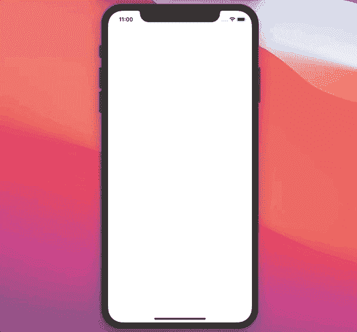

# Swift 中的操作依赖是什么？

> 原文：<https://betterprogramming.pub/what-are-operation-dependencies-in-swift-b0d4df5bcd4f>

## 隔离和模块化你的应用程序的业务逻辑

谢尔盖·佐尔金在 [Unsplash](https://unsplash.com?utm_source=medium&utm_medium=referral) 上拍摄的照片

在本文中，我们将了解`Operation`依赖关系，以及它们如何帮助我们链接几个操作，从而产生隔离的和可重用的业务逻辑组件。我们将链接两个操作:一个用于加载图像，另一个用于添加棕褐色效果。

简而言之，这就是我们要掌握的:

*   如何创建异步操作
*   使用`Operation`类下载图像
*   如何利用`CIFilter`并给`UIImage`添加棕褐色效果

这是本教程结束时我们将得到的结果:

完成的项目的源代码可以在文章的底部找到。

# 我们开始吧

我们从创建一个基类`AsynchronousOperation`开始，我们将在本文的后面继承它:

首先，我们创建一个`State`枚举，我们将方便地使用它来获取操作的每个可能状态的`String`值:`isReady`、`isExecuting`和`isFinished`:

接下来，我们添加`state`属性，当`Operation`的状态改变时，它将触发系统通知。我们还覆盖了`isExecuting`、`isFinished`和`isAsynchronous`属性，如下所示:

最后，我们覆盖了`start()`方法:

完成基本操作类后，现在让我们创建两个操作，分别用于加载图像和添加棕褐色滤镜。

# 棕褐色滤光操作

这个操作不会是异步的，所以我们不需要继承我们之前创建的`AsynchronousOperation`类。我们从添加`competlionHandler`和`inputImage`属性开始:

一旦过滤完成，将使用`completionHandler`返回最终的棕褐色过滤图像。

我们提供了`inputImage`属性，以备我们想要使用一个`SepiaFilterOperation`而不附加一个依赖项时使用(稍后会详细介绍)。

现在我们需要添加这个 helper 方法来返回一个过滤后的图像:

正如我们所看到的，我们通过用`CISepiaTone`标识符初始化一个`CIFilter`类来利用它。然后，我们执行以下操作:

*   添加首字母`UIImage`作为关键字
*   添加棕褐色效果的强度作为关键点
*   根据`CIFilter`返回过滤后的图像

在我们实现`main()`方法之前，我们需要将这个`ImageProvider`协议添加到文件中:

我们将使用它使`SepiaFilterOperation`独立于任何其他具体操作。相反，它将从一个`ImageProvider`协议中获取`image`，任何其他操作都可以遵循这个协议。

现在我们覆盖`main()`方法，如下所示:

以下是一步一步的解释:

*   搜索符合`ImageProvider`协议的相关操作。从找到的操作中获取`image`属性。
*   如果客户端直接使用`SepiaFilterOperation`(不附加任何`ImageProvider`依赖)，使用`inputImage`属性。否则，使用依赖关系中的`image`属性。
*   使用先前获得的`UIImage`获得一个`CIImage`
*   调用 helper 方法来接收一个用棕褐色效果过滤的`CIImage`
*   获取我们将在视图中使用的最终`UIImage`
*   在主线程上调用完成处理程序

太好了！我们的`SepiaFilterOperation`做好了，可以用了。现在我们需要从网上下载一张图片。

# 图像加载操作

因为这个操作是异步的，我们需要从`AsynchronousOperation`类继承。我们也符合先前定义的`ImageProvider`协议，因为我们将把这个操作作为依赖项添加到`SepiaFilterOperation`中:

正如我们所看到的，我们需要向`ImageLoadingOperation`提供一个图像`URL`来初始化它。

我们需要做的就是实现`start()`方法:

*   我们用提供的`URL`发射一个`URLSessionDataTask`
*   通过使用一个`defer`语句，我们确保操作的状态在这个代码块的末尾被改变
*   我们确保没有任何错误，并且`Data`不是`nil`
*   使用接收到的`Data`获得一个`UIImage`
*   将`UIImage`分配给图像属性

最后，我们准备使用这两种操作。

# PhotosViewController

`UIViewController`只显示一个`UICollectionView`:

如上所述，`PhotosViewController`根本不处理业务逻辑。先前定义的操作的实际使用将发生在`PhotosCollectionViewDataSource`类内部。

# PhotosCollectionViewDataSource

我们首先遵循`UICollectionViewDataSource`协议并实现所需的方法:

现在，我们需要添加一个`OperationQueue`，我们将向它添加操作:

我们现在准备用业务逻辑更新`cellForItem`方法:

以下是一步一步的解释:

*   创建一个引用图像资源的`url`属性
*   用`url`初始化`ImageLoadingOperation`
*   初始化`SepiaFilterOperation`。在其完成处理程序中，我们检查操作完成时单元格是否在屏幕上。如果是这样，我们在单元格内显示图像。
*   将`ImageLoadingOperation`作为依赖项添加到`SepiaLoadingOperation`
*   将两个操作添加到`OperationQueue`

因此，如果我们构建并运行我们的应用程序，我们将在屏幕上看到加载并显示的棕褐色图像:

# 资源

GitHub 上提供了源代码:

 [## zafarivaev/操作依赖性

### 此时您不能执行该操作。您已使用另一个标签页或窗口登录。您已在另一个选项卡中注销，或者…

github.com](https://github.com/zafarivaev/OperationDependencies) 

感谢阅读！