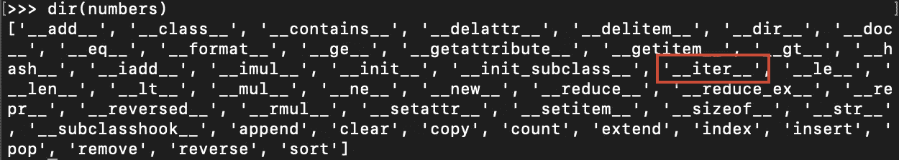
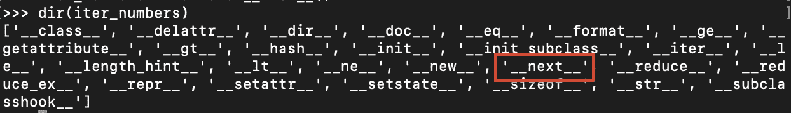

# 什么是 Python 迭代器和可迭代对象

> 原文：<https://betterprogramming.pub/what-are-python-iterators-and-iterables-c1dd67559d2f>

## 了解可迭代对象、迭代器和生成器如何使循环成为可能


[凯文泽尔](https://unsplash.com/@kai_wenzel?utm_source=medium&utm_medium=referral)在 [Unsplash](https://unsplash.com?utm_source=medium&utm_medium=referral) 上的照片

在 Python 中，**可迭代**是可以循环的东西。

例如，列表是一个可迭代的对象:

```
numbers = [1,2,3,4,5]for number in numbers:
    print(number)
```

输出:

```
1
2
3
4
5
```

列表不是唯一可以循环的对象。可以用元组、字典、字符串、文件等等来做。

但是这怎么可能呢？是什么让这些对象可迭代？为什么迭代器和可迭代对象在 Python 中有用？

# Python 中的迭代器和迭代器

为了符合 iterable 的条件，对象必须实现`__iter__()`方法。让我们使用内置的`dir()`方法检查一个数字列表，看看它是否有一个:

```
numbers = [1,2,3,4,5]print(dir(numbers))
```

输出:



你可以看到列表中有`__iter__()`方法。因此它是可迭代的。

为了让 For 循环工作，它调用 list 的`__iter__()`方法。这个方法返回一个**迭代器**。循环使用这个迭代器遍历所有的值。

迭代器是一个有状态的对象。它会记住迭代过程中的位置。迭代器也知道如何获取下一个值。他们通过使用每个迭代器都需要的`__next__()`方法来做到这一点。

让我们检索`numbers`列表的迭代器进行检查:

```
iter_numbers = iter(numbers)
```

(这与调用`numbers.__iter__()`相同)

让我们对此调用`dir()`,看看它有哪些方法:

```
print(dir(iter_numbers))
```

结果:



还有描述迭代器的`__next__()`方法。

## 概括一下

*   列表是可迭代的，因为它有`__iter__()`方法。
*   `__iter__()`方法返回一个迭代器。
*   迭代器使用`__next__()`方法获取下一个值。

让我们在`numbers`列表的迭代器上调用`__next__()`方法，看看会发生什么:

```
numbers = [1,2,3,4,5]
iter_numbers = iter(numbers)next(iter_numbers)
```

输出:

```
1
```

让我们再来一次:

```
next(iter_numbers)
```

输出:

```
2
```

调用`next(iter_numbers)`总是返回`numbers`列表中的下一个号码。这是可能的，因为迭代器是一个有状态的对象。这意味着它记得上次调用`__next__()`时停止的地方。

让我们再调用几次`__next__()`方法:

```
next(iter_numbers)
next(iter_numbers)
next(iter_numbers)
next(iter_numbers)
```

输出:

```
3
4
5
**Traceback (most recent call last):
  File "<stdin>", line 1, in <module>
StopIteration**
```

当值用完时，会出现一个`StopIteration`异常。此时，迭代器被**用尽**。

以上是一个 for 循环在引擎盖下的工作原理。它调用链表上的`__iter__()`方法来检索迭代器，然后重复调用迭代器上的`__next__()`方法，直到没有值了。抛出了一个`StopIteration`异常，但是您看不到它，因为 for 循环会为您处理它。

下面是如何在一个`while`循环中使用可迭代对象和迭代器来模拟 for 循环的行为:

输出:

```
1
2
3
4
5
```

# 如何自己实现迭代器和可迭代对象

您可以对任何类实现`__iter__()`和`__next__()`方法。换句话说，您可以自己构建定制的可迭代对象和迭代器。

## **例子**

我相信你对 Python 中内置的`range()`函数很熟悉。你可以这样使用它:

```
**for** i **in** range(4):
    print(i)
```

输出:

```
0
1
2
3
```

让我们实现一个行为类似于`range()`函数的自定义 iterable:

让我们详细了解一下发生了什么:

**第 2–4 行**

*   `__init__()`方法使得用起始值和结束值初始化`RangeValues`对象成为可能。比如:`RangeValues(0, 10)`。

**第 6–7 行**

*   `__iter__()`方法使得类是可迭代的。也就是说，有可能调用`**for** i **in** RangeValues(0,10)`。
*   `__iter__()`方法必须返回一个迭代器，也就是一个带有`__next__()`方法的对象。在这里，您可以将`__next__()`方法实现到这个类中。因此，`__iter__()`方法可以返回类本身，因为它是一个迭代器。

**第 9–14 行**

*   `__next__()`方法负责从头到尾遍历这些值。
*   当它到达范围的末尾时，它会引发一个`StopIteration`异常。
*   如果迭代器还没有到达末尾，它将继续返回当前值(并在下一轮递增)。

让我们最后测试一下`RangeValues`类:

```
**for** i **in** RangeValues(1,5):
    print(i)
```

输出:

```
1
2
3
4
```

它就像一个魔咒！

# 生成器—创建可读的迭代器

如果你看一下上面的`RangeValues`类的例子，你会发现读起来令人望而生畏。

幸运的是，Python 为您提供了生成器。

生成器是一种迭代器，它的实现更容易阅读。这是因为生成器让你省略了`__iter__()`和`__next__()`方法的实现。

因为生成器是一个迭代器，它不返回单个值。相反，它**一次产生一个**值，并跟踪当前状态。

例如，让我们把前面例子中的`RangeValues`类变成一个生成器，使它更易读:

```
**def** range_values(start, end):
    current = start
    **while** current < end:
        **yield** current
        current += 1
```

让我们测试一下这个功能:

```
**for** i **in** range_values(0,5):
    print(i)
```

输出:

```
0
1
2
3
4
```

`range_values`的工作方式和`RangeValues`完全一样，但是实现方式更加简洁。

# 无限数量的元素

迭代器只关心当前值以及如何获取下一个值。因此，创建无限的价值流是可能的，因为你不需要把它们存储在任何地方。

## 例子

让我们创建一个无限迭代器，它产生起始值之后的所有数字。让我们使用一个生成器函数来保持它的可读性:

```
**def** infinite_values(start):
    current = start
    **while** True:
        **yield** current
        current += 1
```

(如果你想看看如何用一个类做到这一点，[这里是](https://gist.github.com/artturijalli/2c80f4a538e1d438ea9627b36992dc9f)。)

这个迭代器产生从`start`到无穷大的值。

让我们运行它。(**警告:**无限循环)

```
infinite_nums = infinite_values(0)**for** num **in** infinite_nums:
    print(num)
```

输出:

```
0
1
2
3
4
5
.
.
.
```

从语法上看，`infinite_nums`似乎是`0`之后的一个无限数字列表，但它只不过是一个迭代器，只存储当前值，并知道如何获取下一个值。

# 迭代器和可迭代对象为什么有用

迭代器和可迭代对象是内存高效的，因为它们使得只存储当前值并知道如何获得下一个值成为可能。

想象一下，如果你有一个包含数百亿条信息的文件，比如密码，你需要循环遍历它们。你不可能在一个列表或者一个元组中存储这么多的条目。


由 [Khadeeja Yasser](https://unsplash.com/@k_yasser?utm_source=medium&utm_medium=referral) 在 [Unsplash](https://unsplash.com?utm_source=medium&utm_medium=referral) 上拍摄的照片

这就是迭代器派上用场的地方。你可以一个接一个地访问这些元素，而不用把它们存储在程序的内存中。更好的是，从语法上看，您似乎是在从一系列元素中读取整个列表。

# 结论

在 Python 中， **iterable** 是可以循环的东西。

在低层次上，iterable 是实现返回迭代器的`__iter__()`方法的对象。

一个**迭代器**是一个有状态的对象。它会记住迭代过程中的位置。要成为迭代器，对象必须实现`__next__()`方法来获得迭代过程中的下一个值。

记住每一个迭代器都是可迭代的，而不是反过来。

感谢阅读。编码快乐！

我很想加入你的 LinkedIn 网络。请随意连接[阿图里·贾利](https://www.linkedin.com/in/artturi-jalli-29619413a)。

# 你可能会发现见解深刻

[](/50-python-interview-questions-and-answers-5230fe2a0db6) [## 50 Python 面试问答

### Ace 您的下一次编码面试

better 编程. pub](/50-python-interview-questions-and-answers-5230fe2a0db6) [](/10-useful-python-snippets-to-code-like-a-pro-e3d9a34e6145) [## 10 个有用的 Python 片段，让你像专业人士一样编写代码

### 我每天使用的有用的提示和技巧

better 编程. pub](/10-useful-python-snippets-to-code-like-a-pro-e3d9a34e6145) [](https://python.plainenglish.io/how-to-perform-efficient-looping-in-python-811bd76d6aa) [## 如何在 Python 中执行高效的循环

### 了解如何使用 Itertools 高效地执行与迭代相关的任务

python .平原英语. io](https://python.plainenglish.io/how-to-perform-efficient-looping-in-python-811bd76d6aa)