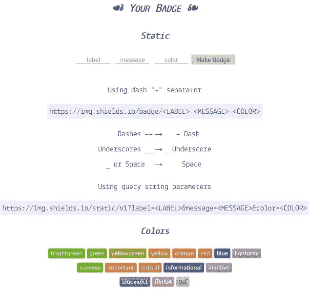

# 什么是存储库徽章？

> 原文：<https://betterprogramming.pub/what-are-repositories-badges-494cb23918e4>

## GitLab 和 GitHub 上的一些存储库在它们的 README.md 文件的顶部有一个小图片列表。你熟悉他们吗？


*照片由* [***德米特里·德米多夫***](https://www.pexels.com/@dmitry-demidov-515774?utm_content=attributionCopyText&utm_medium=referral&utm_source=pexels) *发自*[***Pexels***](https://www.pexels.com/photo/brown-and-silver-round-coins-3790637/?utm_content=attributionCopyText&utm_medium=referral&utm_source=pexels)*。*

当你在 GitHub 或 GitLab 上查看**库**时，你可能会看到一些类似下图的小图片。


这些被称为**徽章**的图像提供了一些关于项目的**信息**。随后，读者可以快速获得拥有它们的存储库的清晰视图。

这些徽章可以涵盖几个**主题**，从项目的许可到 NPM 的下载次数。维护者可以选择他们想要显示的徽章。

但是，如果您是一名维护人员，您应该在您的存储库上展示哪些徽章呢？如果您不知道您的存储库，您可以添加您希望看到的徽章。也可以看看一些专门做徽章的服务，寻找新的思路，像 *Shields.io* 。

[**Shields.io**](https://shields.io/) 是一个免费的虚拟主机工具，允许你从多个外部服务生成徽章。您会发现下面的类别列表以及一些您可能知道的服务。

*   **Build** : CircleCI，Docker，GitHub，GitLab，Travis
*   **代码覆盖率** : Codecov，GitLab，Jenkins，Sonar
*   **分析**:代码气候、依赖机器人、Snyk、声纳
*   **聊天**:不和谐
*   **依赖关系**:大卫
*   **尺码**:捆绑恐惧症，码头工人
*   **下载** : GitHub，NPM，Packagist
*   **筹资**:啤酒付款，公开集体
*   **问题跟踪** : JIRA，GitHub
*   **许可证** : GitHub，NPM，Packagist
*   **额定值**:码头工人，蒸汽
*   **社交** : GitHub，Twitter，YouTube
*   **版本** : Docker，GitHub，Nexus，NPM
*   **平台&版本支持** : Node.js，NPM，Packagist
*   **监控** : HSTS，HTTP 观察站，安全头
*   **活动** : GitHub、NPM、Steam
*   **其他**:生态

如果您找不到想要的徽章，您也可以使用 GET 参数[创建自己的](https://shields.io/category/other#your-badge):



一旦你知道你想要的徽章，你可以用一些代码将它们添加到你的`README.md`文件的顶部，或者在`HTML`中，如下所示:

```
<a href="https://bundlephobia.com/result?p=@sherby/sherby-metadata@3.0.1">
  
</a>
```

或者在`Markdown`:

```
[](https://bundlephobia.com/result?p=<a href=))">https://img.shields.io/bundlephobia/minzip/@sherby/sherby-metadata)](https://bundlephobia.com/result?p=[@sherby/sherby-metadata](http://twitter.com/sherby/sherby-metadata))
```

很简单，不是吗？我鼓励你链接一个提供更多细节的页面，就像我在上面做的那样，指向 [BundlePhobia](https://bundlephobia.com/result?p=@sherby/sherby-metadata) 。

你最喜欢存储库中的哪个徽章？

*最初发布于*[*www . Benjamin rancourt . ca*](https://www.benjaminrancourt.ca/introduction-to-badges/)*。*