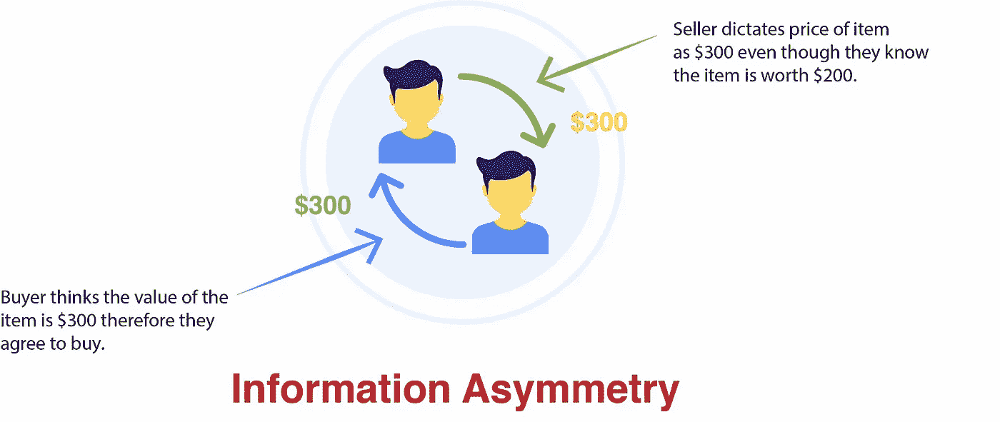
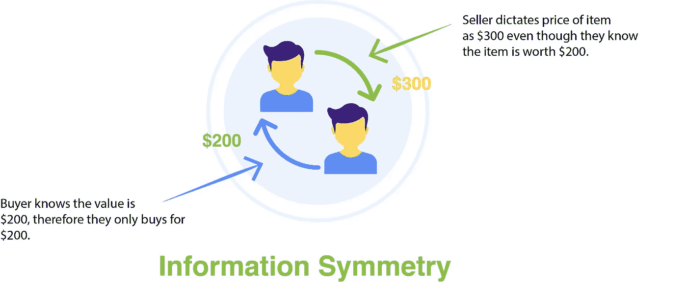
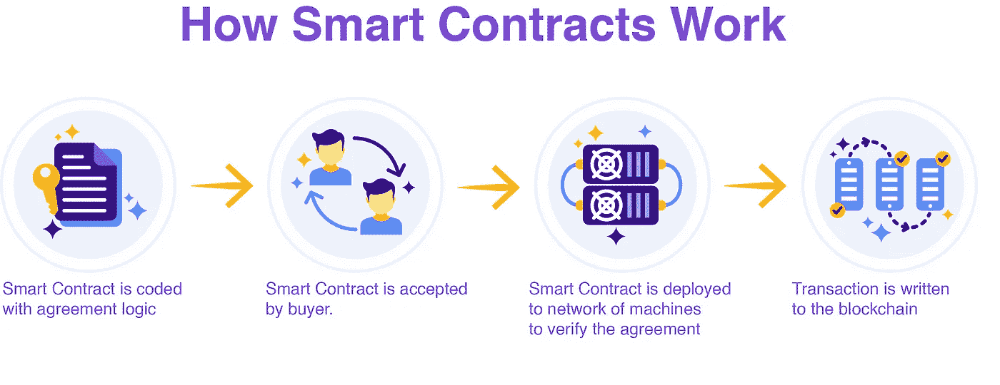
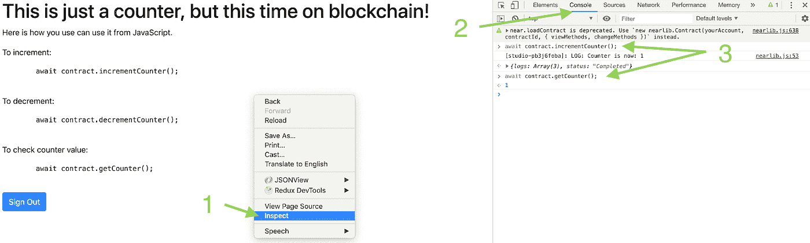

# 什么是智能合约？亲身实践的方法

> 原文：<https://betterprogramming.pub/what-are-smart-contracts-a-hands-on-approach-9fc6e02abaa2>

## 让我们澄清所有的困惑


在 [Unsplash](https://unsplash.com/s/photos/blockchain?utm_source=unsplash&utm_medium=referral&utm_content=creditCopyText) 上由 [Austin Distel](https://unsplash.com/@austindistel?utm_source=unsplash&utm_medium=referral&utm_content=creditCopyText) 拍摄的照片

信息不对称是互联网出现之前最显著的隐藏问题。我们无法对比和比较价格。人们必须去找经纪人，经纪人会给他们报价，而消费者必须假定这个价格是正确的。

旅游经纪人、房地产经纪人和汽车销售人员是人们如何利用信息不对称的完美例子。消费者必须事先了解情况，才能就价格进行谈判。



直到最近，我们才获得像 Kayak 和 Autotrader 这样的资源，让消费者掌控信息。

他们现在可以从了解商品或服务的竞争性价格中获益。最终，给消费者留出空间，让他们通过省钱来赢得胜利。



理解信息不对称有助于我们开始理解像区块链这样的分布式技术如何通过创造信任开始为消费者描绘一幅更清晰的画面。

区块链提供了一系列独立的机器，致力于记录、共享和同步交易。这些机器是信息共享系统的一部分，让越来越多的消费者向信息对称靠拢。

在区块链的这个应用中，智能合同在执行双方之间的协议中起着至关重要的作用。

交易并不是智能合约的唯一用途。我们将了解智能合约，以及如何使用它们与区块链进行交互。

# 什么是智能合约？

智能合同是分布式和分散式区块链网络上的逻辑层，它概括了至少两方之间的协议。

智能合同总是用代码编写，当买方接受交易时自动执行。



上面的智能契约流是针对我们之前探索的信息不对称用例的。

值得注意的是，智能合同并不总是协议，主要是用于编写和读取区块链的代码。

与信息不对称的情况类似，智能合同使买方了解交易条款变得透明。在旅行社的情况下，航班套餐的价格将通过合同体现出来。

智能合约执行的技术操作是允许您的应用程序写入区块链。在汽车经销商的情况下，智能合同可以用来更新您同意的汽车价值，甚至支付汽车本身。

现在，让我们看看智能合约是什么样子的，并运行一个实际的应用程序。

# 如何编写智能合同

在区块链领域有几个关键的参与者，它们使得创建智能合同和分散应用程序变得更加容易。我们将探索如何使用 Studio 附近的[创建智能合同。](https://studio.nearprotocol.com/)

在我们写任何实际的代码之前，我们需要选择在哪里写代码。对于希望尝试开发智能合约的开发人员来说，最好的选择是 Near Studio IDE，因为它从一开始就创建了一个现成的环境。

请记住，您需要了解一点 JavaScript，可能还需要一些与之配套的类型脚本。如果没有，不要担心，因为我们会将所有内容分解成简单易懂的术语。

现在，如果您前往 Near Studio，您会发现您可以从模板列表中创建一个新项目。

选择“柜台智能合约”项目。计数器模板创建一个基本的 TypeScript 应用程序，该应用程序递增、递减和提取计数器变量。

这个例子很完美，因为它向我们展示了智能合同并不总是仅仅是协议。它们保存了我们的后端逻辑，以便作为数据库与区块链一起使用。

选择模板会创建应用程序，现在，如果我们使用左边的文件资源管理器前往`assembly/main.ts`，我们可以看到智能合同的计数器代码。

点击顶部工具栏中的 *run* 命令并导航至新窗口，您可以花几分钟时间探索该模板的功能。


然后，在新窗口中，您可以通过打开控制台并输入屏幕上显示的命令来测试这些命令。



现在，让我们一行一行地看一下`assembly/main.ts`文件。

```
import { context, storage, near } from “./near”;
```

importing 语句添加了我们应用程序运行所需的所有库类。如果我们想看看导入的类做了什么，我们可以导航到“`near`”文件夹并找到正确的类。

打开`main.ts`我们应该看到的第一个函数是增量函数。

```
export function incrementCounter(): void { let newCounter = storage.get < i32 > “counter” + 1; storage.set < i32 > (“counter”, newCounter); near.log(“Counter is now: “ + newCounter.toString());}
```

该函数执行三个步骤。首先，我们用关键字“`counter`”得到一个整数值，并给它加 1。在增量函数之前,`counter`变量看起来像这样:

```
{ counter: 0}
```

一旦我们增加，值看起来像这样:

```
{ counter: 1}
```

现在合乎逻辑的问题是:“我们如何递减 1？”

```
export function decrementCounter(): void { let newCounter = storage.get < i32 > “counter” — 1; storage.set < i32 > (“counter”, newCounter); near.log(“Counter is now: “ + newCounter.toString());}
```

第一步是获取“counter”的当前值，并将其减 1。然后，我们将新值发送到区块链中的同一个`counter`变量。

这是在我们减量之前`counter`的变化:

```
{ counter: 1}
```

这是我们减量后`counter`的变化:

```
{ counter: 0}
```

最后一个函数采用前面函数的核心，获取计数器变量，并返回该值。

```
export function getCounter(): i32 { return storage.get < i32 > “counter”;}
```

`main.ts`创建并导出我们需要的功能，但是为了让我们的用户使用并看到我们的特性，我们需要导入那些功能，并用我们的新功能来构建我们的前端。

# 使用 JavaScript 和 HTML 显示来自区块链的数据

既然我们已经设置了后端，那么编写一些前端来与我们编写的“智能契约”进行交互是很有帮助的。

不要求使用任何特定的框架或库，所以我们将使用普通的 JavaScript 和 HTML，但是您可以使用您喜欢的任何框架/库。

为了访问我们正在查看的函数，我们需要通过找到`window.contract`初始化来修改我们的`src/main.js`。

```
window.contract = await near.loadContract(nearConfig.contractName, { viewMethods: [“getCounter”], changeMethods: [“incrementCounter”, “decrementCounter”], sender: window.walletAccount.getAccountId()});
```

`viewMethods`键被赋予返回值的功能。相比之下，`changeMethods`键与所有写入存储的功能相关。

现在，在同一个`src/main.js`中，我们可以创建一个函数，将当前计数器值插入到我们的`index.html`页面中。

```
async function displayCounter(){ let counter = await contract.getCounter(); document.getElementById(‘counter’).innerText = counter;  console.log(counter);}
```

然后，在`src.index.html`文件中，我们可以在`after-sign-in` div 内部添加一个按钮，显示 counter 变量的值。

```
<div> <label>Counter:</label> <p id=”counter” /> <button onClick={displayCounter()}>Get Counter</button></div>
```

现在，您可以点击 IDE 顶部菜单中的*运行*按钮，查看应用程序的外观，希望它看起来与我在 NEAR Studio 中制作的类似:

*   [我在附近工作室做的](https://app.near.ai/app/52d7s4s1w/)。

如果您想知道在哪里可以找到代码，不用再找了:

*   [代码](https://studio.nearprotocol.com/?f=52d7s4s1w)

# 编码挑战

现在，您已经了解了智能合约的基础知识以及如何读写区块链，请尝试在您的应用程序中添加加法和减法，并与社区分享它的外观。

将您的共享链接粘贴到下面，这样人们就可以看到您的成果了！