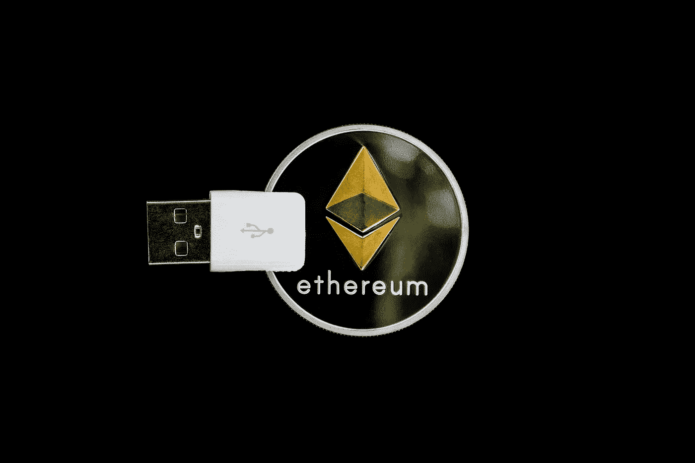

# 智能合约有什么用途？

> 原文：<https://betterprogramming.pub/what-are-smart-contracts-used-for-2583af2c62bc>

## 智能合约如何用于创建令牌

图片来自[世界光谱](https://pixabay.com/users/WorldSpectrum-7691421/?utm_source=link-attribution&utm_medium=referral&utm_campaign=image&utm_content=3424629)来自 [Pixabay](https://pixabay.com/?utm_source=link-attribution&utm_medium=referral&utm_campaign=image&utm_content=3424629)

*先决条件:通过* [*入门你的第一个智能合约*](https://medium.com/better-programming/get-started-with-your-first-smart-contract-de2b54261d65) *，解释其背后的基本概念，以及如何编写一个简单的 ETH 钱包合约。*

既然我们知道智能合约可以持有、发送和接收 ETH，它们还能做什么呢？

# 智能合约的意义是什么？

智能合约的第一个主要用例在 2017 年以令牌的形式出现。事实上，当时流通的前 100 枚硬币中有许多是以太坊区块链的代币。例如，创和币安硬币都是建立在以太坊上的代币，然后才发展出他们自己的区块链。

# 你如何制作一个代币？

令牌在智能合约中定义。部署后，令牌智能合约会跟踪拥有令牌的每个地址以及数量。它还提供了让地址将属于它们的令牌转移到其他地址的功能。

**智能合约中持有每个人拥有的代币数量，*而不是*底层区块链本身，与 ETH** 形成对比。因此，要找出一个地址有多少个令牌，我们需要查询智能契约。*这是我们需要认识到的区别*。

当我们查询一个地址有多少 ETH 时，我们会查询区块链。

当我们查询一个地址有多少个令牌时，我们查询该令牌的智能契约。

因此，要知道一个钱包有多少 ETH 和令牌，它需要知道在区块链上部署令牌智能合约的所有地址。

## 示例令牌代码

假设我们要部署一个令牌，给它一个名称、一个符号，确定它有多少个小数位，以及总供应量。我们希望持有者能够将其令牌转移到其他地址，因此我们需要一个转移函数。我们还希望能够查询任何地址有多少令牌。

这就是那份合同的样子。

*   第 12 行的构造函数获取参数并设置硬币。
*   在构造期间，第 17 行将所有令牌发送给契约的部署者(构造者的`msg.sender`)。
*   在第 20 行使用`balanceOf()`返回给定地址拥有多少令牌。
*   `transfer()`函数首先检查两个地址是否有效，然后检查函数的调用者是否有足够的令牌来传输。然后，它通过减少发送方拥有的金额并增加接收方拥有的金额，在第 29 行和第 30 行上执行转账。

## 钱包代码

在上一篇文章中，我们编写了一个智能契约，它可以持有、接收和转移 ETH。**它不能传输令牌**，因为正如我们前面提到的，必须知道令牌智能合约的地址才能这样做。

下面的代码显示了上一篇文章中的**原始** `MyWallet`契约。

MyWallet.sol

让我们添加能够转移新令牌的功能。

MyWallet.sol 版本 2

*   第 8 行显示了一个名为`tokenAddress`的新状态变量，它是我们在创建钱包时在构造函数中设置的。
*   我们还在第 3 行导入了`MyToken`契约的规范。
*   第 24 行显示了一个名为`sendToken()`的新函数，它使用导入的`MyToken`规范来加载`tokenAddress`并调用`transfer()`函数。

我们的钱包现在可以容纳、接收和发送 ETH 和我们的令牌！

# ERC20 标准

为了确保所有以太坊钱包能够容纳尽可能多的代币，代币必须遵守一个编码标准。这称为 ERC20，它概述了兼容 ERC20 的钱包必须支持的令牌的功能和变量的最低要求。

我们的令牌现在并不符合这一点，但是请浏览一下 [ERC20 规范](https://github.com/ethereum/EIPs/blob/master/EIPS/eip-20.md)，看看您是否可以扩展我们的代码以符合它。

# 类比

如果以太坊区块链是一个人的身体，以太就是血液。每笔交易都要花费 ETH(以天然气的形式，本质上是 ETH 的一小部分)。用同样的比喻，ERC20 代币就像衣服。它们从根本上依赖于身体和血的存在，但它们本身代表着不同的东西。

用于从一个地址到另一个地址传输 ETH 的机制不同于用于传输 ERC20 令牌的机制，因为令牌不是主体的固有部分。它们是在区块链运行的智能合约。

# 进一步阅读

如果你对区块链开发感兴趣，我会写一些教程、演练、提示以及如何开始和建立投资组合的技巧。