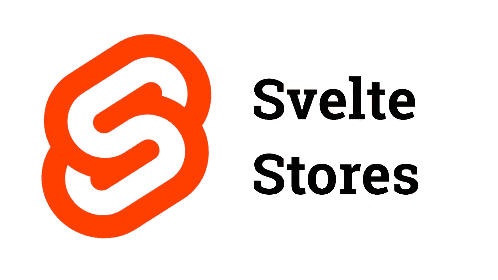
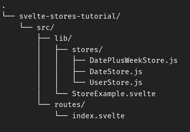
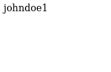
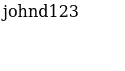
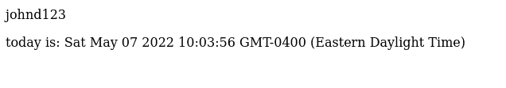

# 什么是苗条商店，如何使用它们

> 原文：<https://betterprogramming.pub/what-are-svelte-stores-and-how-to-use-them-a4963968ee89>

## 在本教程中，我们将通过一个简单的例子来了解什么是苗条商店以及如何使用它们

我最近一直在开发我的个人项目，用 Svelte 代替通常的 React，我真的很喜欢它。它有很多很棒的功能，感觉很相似，足以让我舒服地使用它，但同时感觉更轻更简单，但仍然足够强大，可以做我需要的事情。我特别喜欢 Svelte 的一个特点是它的商店系统。

# 什么是苗条商店？

一个苗条的商店允许应用程序在许多组件之间共享数据，而不需要在它之前通过其他组件传递数据。如果一个远嵌套的组件需要一些数据，但它上面的组件都不需要，这将非常有用。在这种情况下，使用存储可以避免将数据传递给一堆对数据没有用处的组件，以便这个嵌套的组件可以使用它。使用这样的存储使代码更简单，意味着我们不必在数据经过所有这些组件时跟踪这些数据。

如果您熟悉 React，这可能类似于 Redux 或 React 上下文。不过，我喜欢苗条商店的原因是，它感觉更简单、更容易使用。

存储也是反应性的，这意味着如果存储值在任何地方被更新，使用该存储的所有组件都将反映更新的值。

# 商店如何运作

我提到存储是反应式的，但这并不意味着任何组件都可以设置存储的值。在组件能够读取或写入存储之前，它必须订阅该存储。所有存储都必须有一个 subscribe 方法，当它的任何值发生变化时，该方法将从外部(在组件中)更新它的值。

下面是一个使用 subscribe 方法的商店示例。

项目目录

index.svelte

这是我们的存储被制造和初始化的地方

网页结果

# 苗条商店速记美元

虽然这是一个简单的例子，但我相信您可以看到当需要与多个组件共享大量数据时，这是多么有用，这些组件不一定彼此相关(比如用户名)。然而，手动订阅每个想要使用的组件中想要使用的每个存储可能会很烦人。

幸运的是，Svelte 为我们提供了自动订阅和退订商店的快捷方式！

继续将`StoreExample.svelte` 切换到如下:

使用$速记的 StoreExample.svelte

使用这种简写方式更简单，在产生相同结果的同时节省了我们几行代码。通过使用 Svelte store 简写$,您可以像对待任何其他 JavaScript 对象一样对待 store。

# 各种苗条的商店

有三种苗条的存储:可写的、可读的和派生的。

## 可写商店

可写存储允许其订户修改其数据。假设您使用简写，组件可以像任何其他 Javascript 对象一样修改存储值。

或者，您可以使用`[set()](https://svelte.dev/tutorial/writable-stores)`和`[update()](https://svelte.dev/tutorial/writable-stores)`方法。

StoreExample.svelte 使用 store.set()方法

结果

StoreExample.svelte —使用$速记设置商店值

结果

正如您所看到的，更新商店数据是非常容易的，这些更改不仅适用于进行更改的组件，还适用于订阅商店的任何组件。

## 可读存储

可读存储的数据不能被任何订阅者编辑。这意味着可读存储的所有数据必须在创建时初始化。这对于像当前日期这样的数据可能很有用，因为对于当前日期，不需要更改数据，但是多个组件可能仍然需要它。

可读存储— DateStore.js

使用可读存储的 StoreExample.svelte

结果

## 派生存储

顾名思义，派生存储是从另一个存储派生出来的。当从其派生的存储更新时，派生存储的值也将更新。派生存储基本上只是可读存储，但它们的值至少部分来自其他地方。

衍生商店— DatePlusWeekStore.js

使用派生存储的 StoreExample.svelte

结果

# 摘要

再看一遍，苗条商店基本上只是反应式的 Javascript 对象，可以导入到多个组件中，彼此都不相关。

这里使用的例子非常简单，很可能您将使用瘦存储来存储更复杂的数据，但是概念将保持不变。我希望这种对苗条商店的新理解能帮助你创建令人惊奇的网站/应用程序！