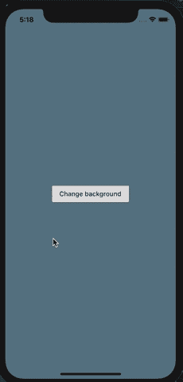
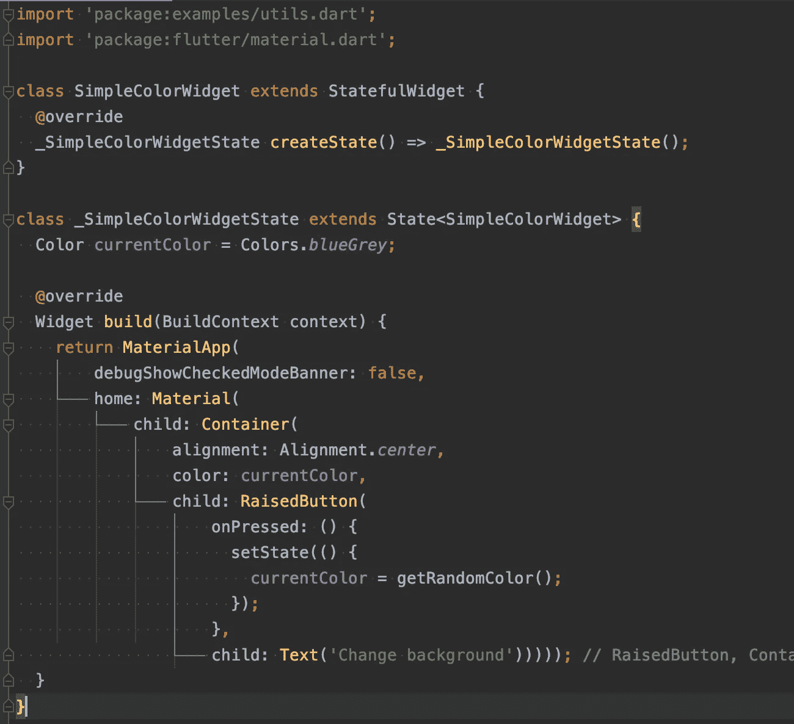
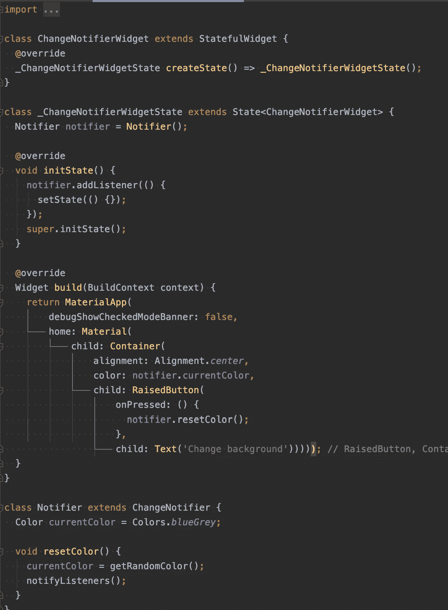
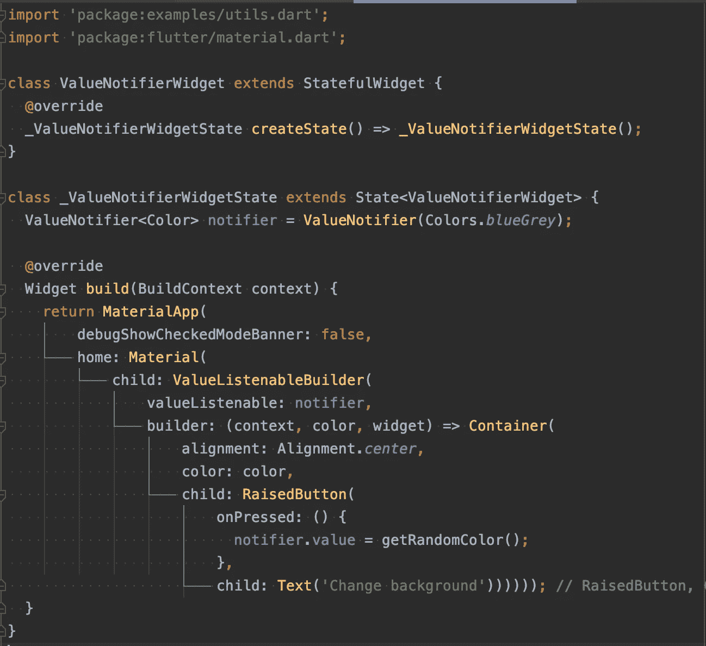
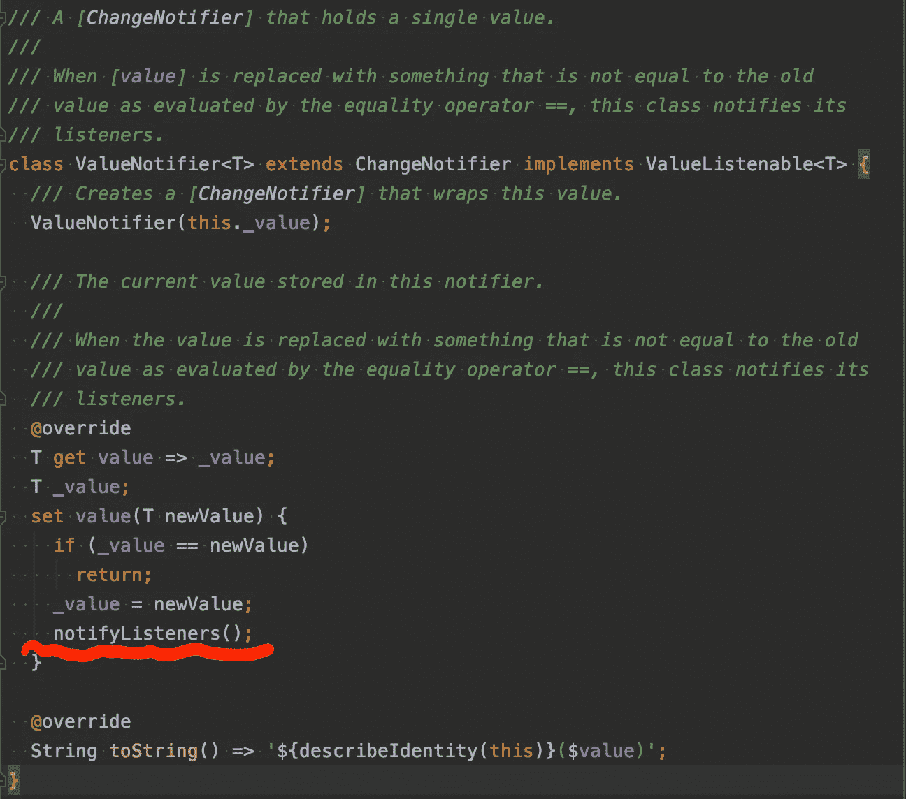
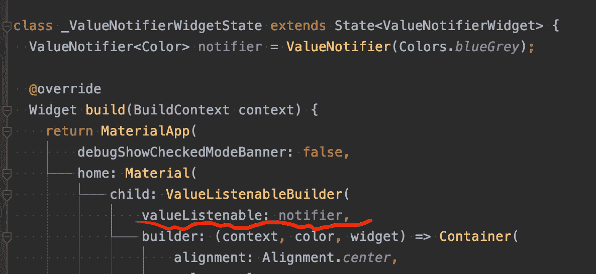
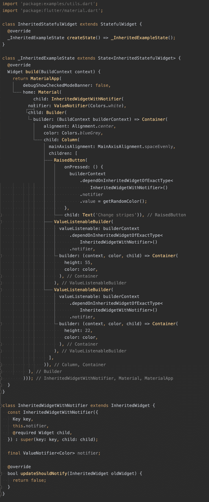
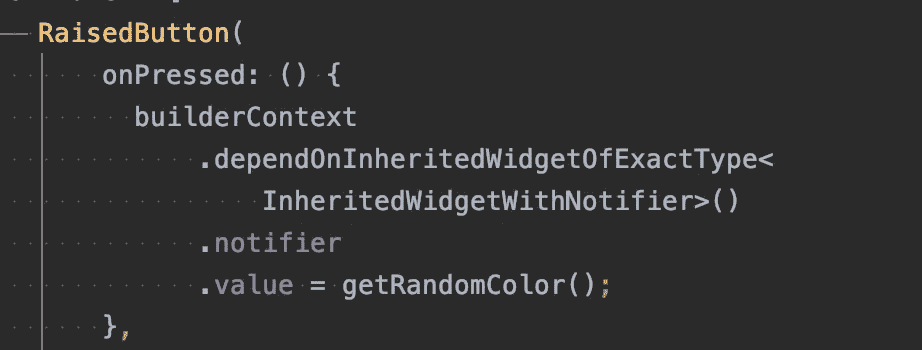
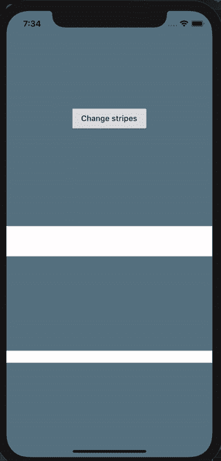

# Flutter 中最简单的状态管理解决方案有哪些？

> 原文：<https://betterprogramming.pub/what-are-the-simplest-state-management-solutions-in-flutter-56326797a28f>

## 下一次面试的超级简单对比

图片来自 inovex 博客。

本文将探索 Flutter 内置的状态管理解决方案。

在以下所有示例中，我们将通过点击按钮来更改应用背景:

出于本文的目的，假设我们的`backgroundColor`是某个复杂的应用程序状态。

当然，第一个解决方案是一个简单的`StatefulWidget`:

我们在`State`对象中引入了`currentColor`变量，在这里，每次点击按钮，都会生成一个新值。通过调用`setState()`，整个用户界面被重绘。

这个效果很好，但是想象一下这个颜色是更复杂的东西。如果我们能够将 UI 与逻辑分离开来，那就更好了(这样我们以后就可以很容易地只更改 UI 或者只更改逻辑)。对于不简单的应用程序，这些层应该分开。

现在，我们将介绍`ChangeNotifier`:

我们已经将我们的逻辑移到了`Notifier`类，该类被扩展为`ChangeNotifier`。`ChangeNotifier`有能力通知它的监听器它已经发生了一些变化。当我们检测到监听器方法中的变化时(在`initState()`方法中)，我们通过调用`setState()`来重绘整个 UI。

好吧，这样更好，但是我们是否应该在每次`Container`的颜色改变时重新绘制整个 UI？大概不会。

这一次，我们将介绍一个`ValueNotifier`:

`ValueNotifier`基本上是一个只保存一个值的`ChangeNotifier`，当它发生变化时，监听它变化的人会得到通知。

我们可以向`ValueNotifier` 对象添加监听器并重新绘制整个 UI，但是现在有一种更方便的方式来显示更改:`ValueListenableBuilder`！

`ValueListenableBuilder`是一个小部件，当它的`ValueListenable`(在我们的例子中是`notifier`)改变值时，它会被重画:

`ValueListenableBuilder`将自动注册为`notifier`变更的监听器，每次变更时将执行`builder`方法。所以现在，当我们按下按钮进行背景更改时，只有`builder`方法部分会被执行，UI 的这一部分会被重画——而不是整个屏幕。

但是，如果您需要在应用程序的多个位置显示值的变化，在不同文件的不同部件中，会发生什么情况呢？当然，您不希望在小部件构造函数中传递这些值。

这就是我们现在介绍`InheritedWidget`的原因。

我们将在其中定义一个`ValueNotifier`，然后从 UI 的不同部分访问它:

访问`InheritedWidget`字段的代码如下所示:

简单地说，它是这样说的:从`builderContext`开始，在树中向上，找到一个`InheritedWidgetWithNotifier`类型的`InheritedWidget`。

而现在，UI 是这样的:

所以现在，我们能够从不同的小部件访问`ValueNotifier`。两个“条纹”都是从`InheritedWidget`听`ValueNotifier`的变化。

# 结论

任何事情*都可以用任何一种状态管理在 Flutter 中完成，但是*应该这样做吗？**

对于简单的应用程序，即使只使用有状态/继承的小部件也完全没问题，但是如果您正在制作具有大量屏幕和需要从多个小部件或屏幕获取的复杂状态的大型/复杂应用程序，您可能应该采用更高级的方法，如 [provider](https://pub.dev/packages/provider) 或 [bloc](https://pub.dev/packages/flutter_bloc) 。

感谢阅读！