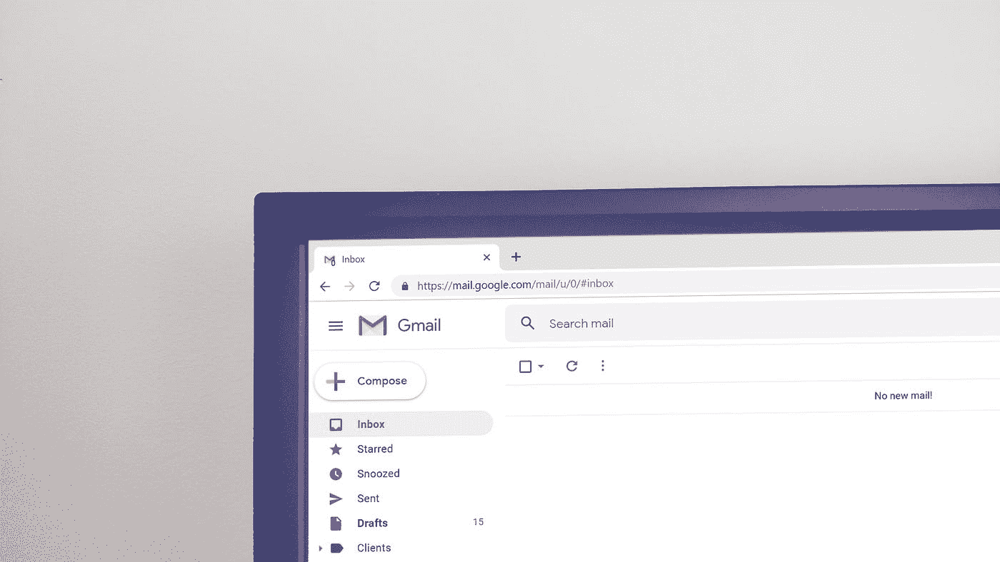
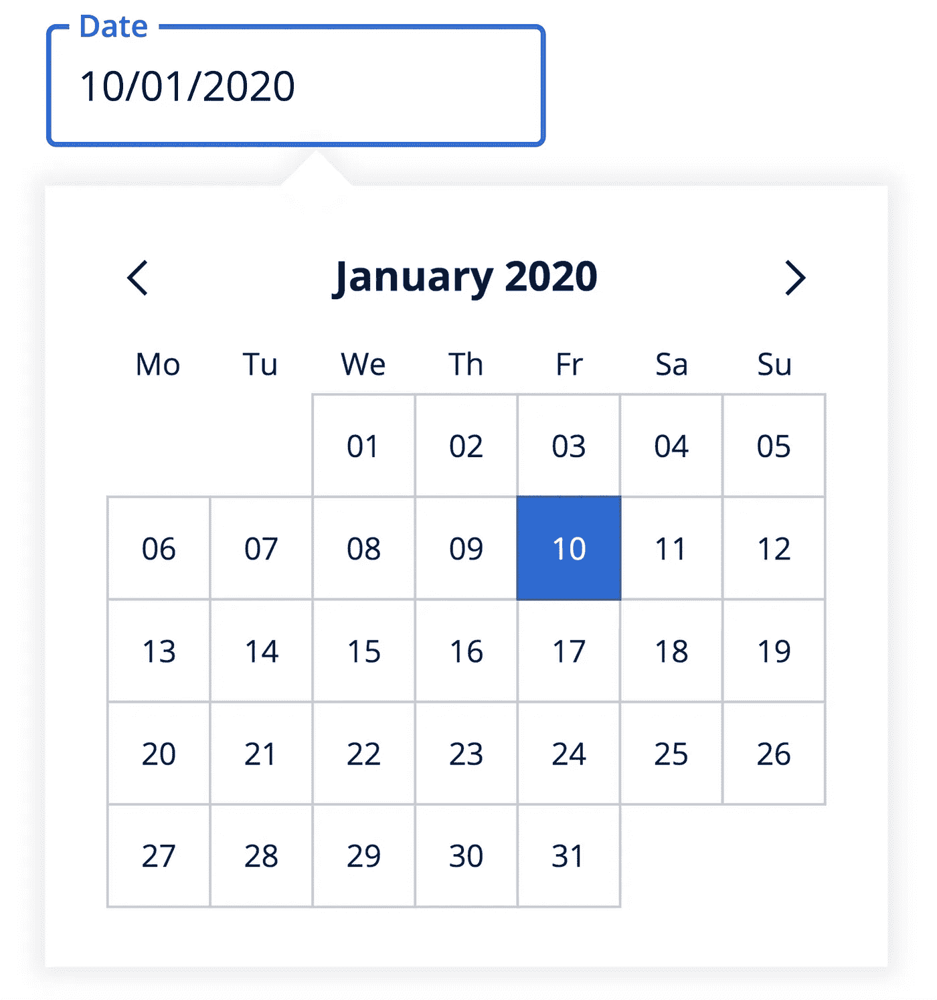
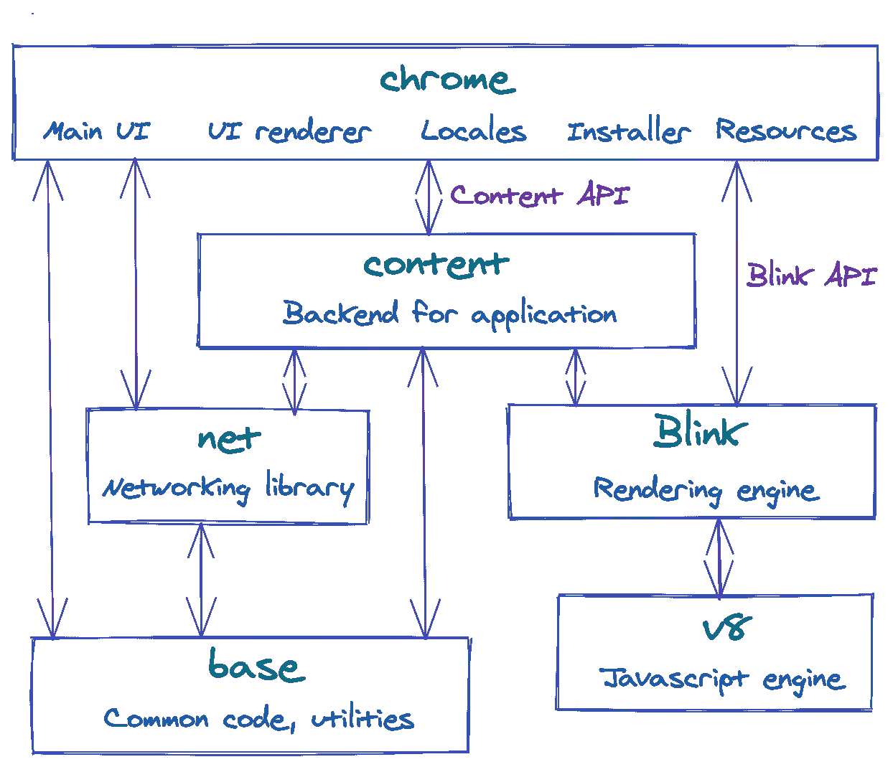
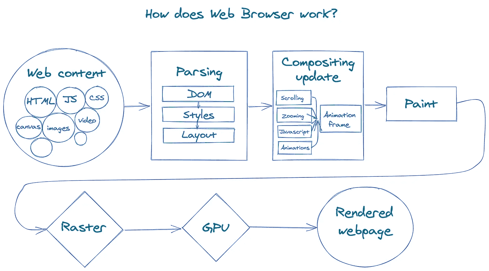
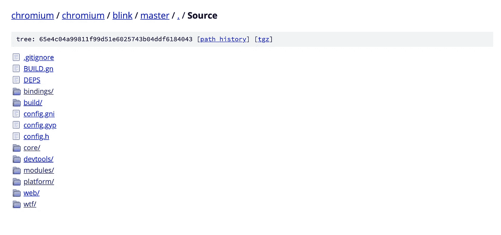

# 什么是 Web 标准，它们如何与 Web 浏览器一起工作？

> 原文：<https://betterprogramming.pub/what-are-web-standards-and-how-do-they-work-with-web-browsers-3876697920b1>

## 浏览你的浏览器



在 [Unsplash](https://unsplash.com?utm_source=medium&utm_medium=referral) 上 [Krsto Jevtic](https://unsplash.com/@krstoj?utm_source=medium&utm_medium=referral) 拍摄的照片

我给你讲个故事吧。我正在为我们的设计系统构建另一个日期选择器组件。它由文本输入和弹出日历组成。可以通过在日历外单击或选择日期来关闭日历。



日期选择器组件

单击外部逻辑的大多数实现都是由附加到 DOM 的实际单击监听器实现的。然而，我想让我们的日期选择器可以访问，这样你就可以用标签打开日历，然后用同样的方式关闭它。此外，如果在页面上放置几个日期选择器，单击侦听器可能会相互冲突。

如果你可以只依靠原生聚焦和模糊事件，而不是检测外部点击会怎么样？它们自然支持标签、触摸和点击事件，并且已经在浏览器中实现。唯一的问题是，当您单击弹出窗口但没有选择日期时，焦点会转移到日历上，触发文本输入上的模糊事件，并最终关闭弹出窗口。

在这一点上，我开始想知道是否有一种方法可以点击但不转移焦点。在快速搜索之后，我找到了一种方法:阻止弹出窗口的`mouseDown`事件的默认动作。就像这样，通过一行代码，所有的点击都工作了，但是焦点仍然在文本输入上。

这似乎是解决办法，但我觉得还没有准备好前进。我内心的某些东西在阻止我。为什么专门是`mouseDown`而不是`mouseUp`阻止聚焦却传播点击？这是生活标准的一部分吗？我们能相信吗？它能跨浏览器工作吗？我们用来做集成测试的 React 测试库也不支持它，我不得不改变模拟功能。

# 什么是 Web 标准？

堆栈溢出的答案对我来说还不够，那么还有什么更好的地方来了解浏览器的行为呢？网络标准。

你可能听说过 W3C 或万维网联盟。这是一个为网络开发开放标准的国际社区。W3C 确保每个人都遵循相同的指导方针，并且我们不必支持许多完全不同的环境。如果你访问他们的网站，你会发现他们正在制定的所有标准的列表。

让我们来看看一个可能回答我们问题的文档— [UI 事件标准](https://www.w3.org/TR/2019/WD-uievents-20190530/)。这指定了 DOM 事件流，并定义了事件列表及其执行顺序。如果您认为标准是枯燥、晦涩、难以理解的文本块，那么直接跳到 [DOM Event Architecture](https://www.w3.org/TR/2019/WD-uievents-20190530/#dom-event-architecture) 部分。它用漂亮的图片解释了事件冒泡和捕获，并且仍然设法非常具体，因为标准必须如此。你会对它的质量感到惊讶——它真的写得很好，有许多例子和建议。

它还定义了我们的`mouseDown`事件及其默认动作:

> *"许多实现使用* `*mouseDown*` *事件来开始各种上下文相关的默认动作。如果取消此事件，可以阻止这些默认操作。这些默认动作中的一些可以包括:开始与图像或链接的拖放交互、开始文本选择等。此外，一些实现提供了鼠标驱动的平移功能，当在调度* `*mouseDown*` *事件时按下鼠标中键时，该功能将被激活*

好的，我们的事件有一些默认的动作，但是没有任何关于焦点的细节，因为它确实依赖于浏览器的实现。我们去看看。

# 浏览器引擎简介

一个现代的浏览器是一个相当复杂的软件，拥有数千万行代码。所以，它通常被分成几个部分。

为了找到一个定义焦点事件的地方，我们需要了解每个部分的概况以及它的职责。让我们从 Chrome 及其设计文档开始，[绕开 Chrome 源代码](https://www.chromium.org/developers/how-tos/getting-around-the-chrome-source-code)。如您所见，有许多模块负责不同的逻辑领域。



铬的高级概述

让我们简要回顾一下它们，以了解它们是如何协同工作的。

*   chrome: 这是一个基础应用，有启动逻辑、UI 和所有窗口。它包含了`chrome.exe`和`chrome.dll`的项目。图标或光标等资源也可以在这里找到。
*   **内容:**这是应用程序的后端，处理与子进程的通信。
*   **net:** 这是一个帮助查询网站的网络库。
*   **base:** 这是所有子项目共享的公共代码的地方。这可能包括字符串操作、通用工具等。
*   这是一个渲染引擎，负责整个渲染管道，包括 DOM 树、样式、事件、V8 集成。
*   浏览器的最后一个重要部分——Javascript 引擎。它的工作是将 JavaScript 编译成本机代码。

如您所见，浏览器由几个独立的部分组成，它们通过 API 相互通信。开发者最感兴趣的部分通常是 Blink 和 V8。浏览器定义的默认动作不是 V8 的一部分，但是 Blink 应该定义并实现所有这些动作。但是在我们进入 Blink 代码库之前，让我们从用户的角度来理解 web 浏览器是如何工作的。

# 渲染管道

想象一下，你在浏览器中输入域名，然后它获取并加载一堆资源:HTML、CSS 和 JS 文件、图像、图标。接下来会发生什么？



Web 浏览器渲染管道

作为第一步，HTML 文件被解析并转换成一个 *DOM 树*。DOM 不仅是页面的内部表示，也是暴露给 JavaScript 的 API，用于通过一个称为“绑定”的系统查询或修改呈现。

在 DOM 树之后，下一步是处理 CSS 样式。为此，浏览器有一个 CSS 解析器来构建样式规则的模型。构建了样式规则模型后，我们可以将它们与浏览器提供的一组默认样式合并，并计算每个 DOM 元素的每个样式属性的最终值。这个过程称为样式解析(或重新计算)。

在下一个布局部分，我们需要确定所有元素的视觉几何。在这个阶段，每个元素都获得了它的坐标(x 和 y)、宽度和高度。布局引擎计算并保留所有溢出区域的记录—哪些部分可见，哪些部分不可见。

因为我们已经获得了所有元素的坐标，所以是时候绘制**了。**对于这个操作，我们使用上一步的坐标和样式规则中的颜色，并将它们组合成一个绘画指令列表。按照正确的顺序绘制元素很重要，这样当它们重叠时就能正确堆叠。您可以通过`z-index`样式规则修改顺序。

让我们执行我们的绘画指令列表，并将它们转换成颜色值的位图。这个阶段被称为“光栅”此时，我们也将图像解码成位图。

稍后，光栅化位图将存储在 GPU 内存中。这个阶段包括对硬件进行抽象的库，以及对 Windows 上的 OpenGL 和 DirectX 发出调用。当 GPU 收到显示位图的指令时，它会在屏幕上绘制像素。

现在我们有了渲染管道中最重要的部分。但是如果你滚动页面，或者应用了动画，会发生什么呢？其实渲染也不是一成不变的。变化通过动画帧来表示。每一帧都是特定时间点内容状态的完整呈现。这个过程中真正的挑战是它的性能。平滑动画要求每秒至少生成 60 帧。在一秒钟内完成 60 次完整的流水线几乎是不可能的，尤其是在慢速设备上。

如果我们不总是重新呈现一切，而是提供一种在特定阶段使元素无效的方法，会怎么样？例如，如果你动态地改变了按钮的颜色，浏览器会将这个节点标记为无效，并在下一个动画帧中重新呈现。如果没有改变，我们可以重新使用旧框架。

这是优化内容中微小动态变化的好方法。让我们考虑一下大范围内容的变化。例如，如果我们滚动页面，现在所有像素都必须不同。为此，页面被分解为独立光栅化的层。一个层可以相当小，只代表一个 DOM 节点。这些层将会在另一个叫做*的合成器线程上结合在一起。有了这种优化，你不需要重新光栅化所有的东西——只需要对小层进行光栅化，然后正确地将它们组合在一起。*

现在，我们已经对 Blink 的功能和渲染管道的外观有了一个大致的了解，让我们深入研究一下代码。

# 导航 Blink 代码库

我们终于到达终点了。让我们打开[闪现库](https://chromium.googlesource.com/chromium/blink/+/master/Source)四处看看。



Blink 存储库的根文件夹

我们很快意识到，尽管我们已经从最初的问题中缩小了很多范围，但仍然太大了，无法手动找到导致焦点无法聚焦的特定代码行。

让我们尝试在谷歌中搜索我们的活动名称:

```
mousedown site:[https://chromium.googlesource.com/chromium/blink/+/master/Source](https://chromium.googlesource.com/chromium/blink/+/master/Source)
```

这将我们带到了 [EventHandler](https://chromium.googlesource.com/chromium/blink/+/master/Source/core/input/EventHandler.cpp#972) 文件，在这里您可以找到许多输入事件的实现细节，包括对我们来说最重要的一行:

```
bool swallowEvent = !dispatchMouseEvent(EventTypeNames::mousedown, mev.innerNode(), m_clickCount, mouseEvent);
```

`dispatchMouseEvent`返回值表示“继续默认处理”，所以`preventDefault`使用时`swallowEvent`为`true`。

下面有一个焦点事件调用，只有当`swallowEvent == false`出现时才会触发。

```
swallowEvent = swallowEvent || handleMouseFocus(MouseEventWithHitTestResults(mouseEvent, hitTestResult), sourceCapabilities);
```

除了焦点处理，您还可以探索鼠标按下事件的所有默认操作，包括选择、拖放和滚动条情况。它还实现了鼠标释放和双击事件。都在那了。

# 壁虎和 WebKit

在这一点上，我们已经花了一些时间发现浏览器源代码，并对它们的结构有了很好的理解，所以为什么不一起检查 Firefox 和 Safari。Firefox 的浏览器引擎叫 Gecko，Safari 的叫 WebKit。

Gecko 还为开发者提供了一个[概述页面](https://wiki.mozilla.org/Gecko:Overview)，所以你可以了解它背后的主要概念。根据使用 Chrome 的经验，你可以在`[EventStateManager](https://github.com/mozilla/gecko-dev/blob/master/dom/events/EventStateManager.cpp#L3177)`文件中找到整整 6000 行代码，包括事件的默认动作和行为。我已经在链接中包含了一个特定的行，所以您不必全部浏览。

[WebKit](https://webkit.org/) 是苹果公司的浏览器引擎，用于 Safari 和其他苹果产品。Chrome 的 Blink 是从 WebKit 派生出来的，所以它们有很多共同点，在它们版本的 [EventHandler](https://github.com/WebKit/webkit/blob/1321fa346ad792f6de3ace65ca98cbe3957a96c6/Source/WebCore/page/EventHandler.cpp#L1757) 文件中找到 events 实现不成问题。

现在，既然我们确保了可以安全地阻止`mousedown`事件，我可以后退一步，用日期选择器完成 PR。

# 结论

我们一起经历了一段旅程，从一个简单的问题到 Web 标准和浏览器实现细节的介绍。

不要被现有模块隐藏的复杂性吓到，即使是浏览器或编译器。这将是一次有趣的旅行。你很有可能很容易找到需要改进的地方。更重要的是，你会对事物的实际运作有独特的见解。我在这次深潜中学到了很多东西，我鼓励每个人都这样做。浏览器提供了优秀的文档——我不确定我还需要什么！

# 进一步阅读

*   你知道 DOM 是什么吗？它在内部是如何表现的？事件的目的是什么？我向从初学者到更有经验的开发者的每一个人强烈推荐 [DOM 标准](https://dom.spec.whatwg.org/)。我最喜欢的部分:[“一个事件意味着一个事件，而不是一个行动。”](https://dom.spec.whatwg.org/#action-versus-occurance)
*   T4 W3C T5 社区的官方网站。
*   [绕开 Chromium 代码库](https://www.chromium.org/developers/how-tos/getting-around-the-chrome-source-code)。
*   Chromium 开发者发布的[设计文件](https://www.chromium.org/developers/design-documents)。
*   [一个像素的寿命](https://docs.google.com/presentation/d/1boPxbgNrTU0ddsc144rcXayGA_WF53k96imRH8Mp34Y/edit)—Chrome 渲染管道介绍。