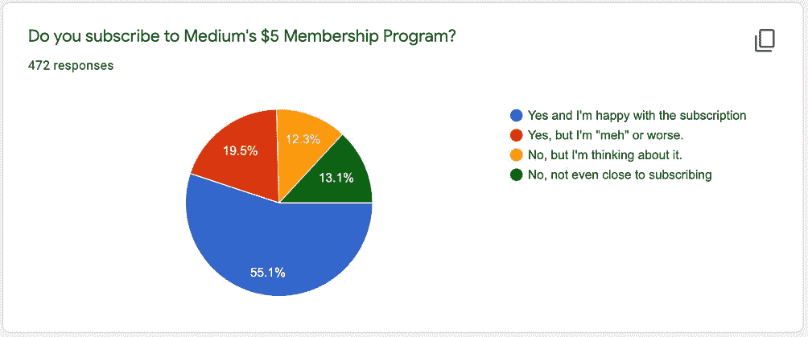
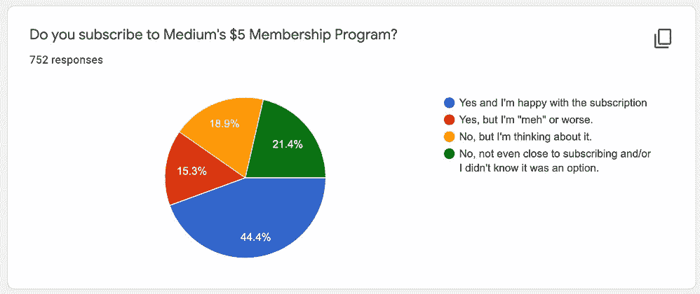
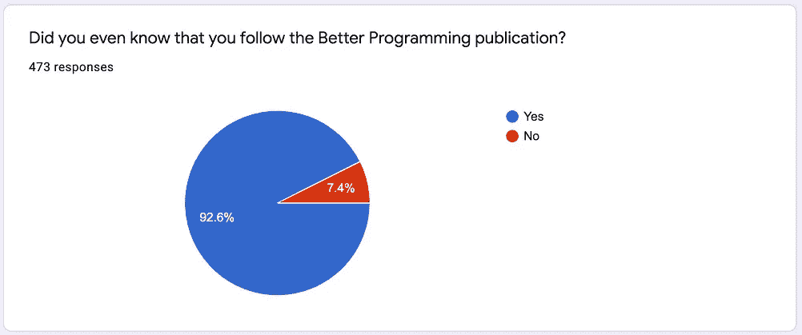
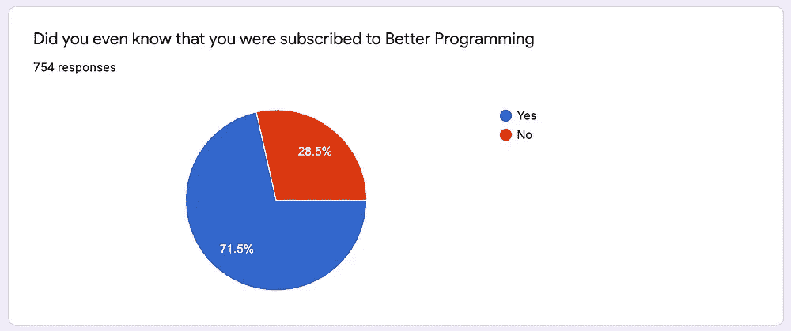
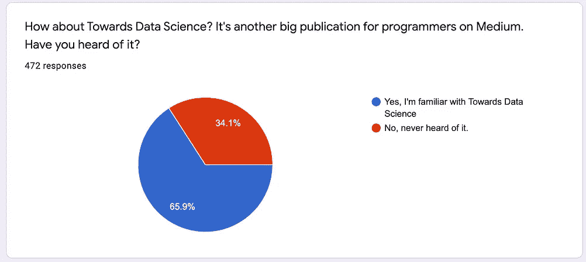

# 有什么更好的编程读者认为媒体的订阅

> 原文：<https://betterprogramming.pub/what-better-programming-readers-think-about-mediums-subscription-5bf0fecc79fd>

## 我们最近[读者调查的结果和注释](/quick-survey-how-valuable-is-mediums-5-month-subscription-if-you-are-a-programmer-85b85186e79d)

55%的优秀编程读者是快乐传媒的订户

快速故事，为什么我关心媒体的订阅成功(除了作为一个在这里赚钱的人的自然偏见)。

付费内容是节目生态系统的重要组成部分，因为钱可以用来制造质量。这就是我对 Medium 的希望。我认为他们是最可信的公司，试图将金钱转化为程序员的优质信息。

*巨大的警告:Medium 是一个涵盖数千个主题的通用平台。我只是碰巧在谈论它的一个狭窄的部分，编程。订阅的程序员也订阅了非编程文章，另一方面，大多数订阅者不是程序员，也从来没有读过编程文章。这种讨论就像《纽约时报》体育版的编辑仅仅通过热爱体育版的人的镜头谈论《纽约时报》。*

编程世界对想要免费的信息有一种下意识的反应。但是我们很多人也很乐意付钱。我们很多人支付计算机科学学位(我喜欢我的学位)，支付会议费用，支付书籍费用，支付训练营费用。我喜欢免费的东西，但是如果付费意味着我可以得到本来就不存在的东西，那么我愿意付费。

我会为方便付钱。我会为质量买单。如果我能看到投资回报，我会付钱。我从工程师到工程经理的第一次重大晋升是基于支付 40 美元购买史蒂夫·麦康奈尔的[快速开发](https://www.amazon.com/Rapid-Development-Taming-Software-Schedules/dp/1556159005)书(外加阅读它并将其应用于一个失败的项目)。这是一笔巨大的投资回报。

我最初体验制造质量信息的过程是在 2003-2005 年为 O'Reilly 工作的时候。那时，免费编程内容正开始在网络上爆炸式增长。堆栈溢出还不存在，但我们可以看出类似的事情正在发生。

在那个时代，许多软件开发人员在他们的桌子上放了一套 O'Reilly 的书，只是为了完成他们的工作。你可以信赖那些书，因为奥赖利花了很多钱让它们变得可靠。他们支付足够的费用来吸引许多顶尖的技术作者，他们支付技术编辑与作者一起研究结构和细节，他们有一个付费的文字编辑团队，他们让书通过技术审查，这通常依赖于技术审查者的酬金，代码样本通常都经过测试，然后他们建立一个系统来捕捉读者的反馈，并在未来的印刷中修复错误。每本书都充满了爱，但我们都有时间付出爱，因为我们都是有报酬的专业人士。

然而，这些书缺少两样重要的东西:可及性和及时性。这些书不在谷歌上，即使谷歌可以推荐一本书，你也不会想等待发货时间。但更糟糕的是，技术信息变化如此之快，以至于书籍到达时信息已经过时。我很幸运地写了一本关于一个永恒主题的 O'Reilly 的书，正则表达式。那本书仍然畅销，尽管它自 2006 年以来就不需要重大更新。但是想象一下一本“iOS 14 编程”的书会多快过时。

这就是为什么书需要一个互补的系统。在 2003-2005 年间，一个让我印象深刻的例子是自由编写和贡献内容补充 PHP 官方文档的方式。你可能听说过这个术语:用户生成内容。

官方 PHP 文档的问题是，它很糟糕，经常遗漏关键细节，甚至遗漏了一些基本的东西，比如什么参数可以传递给关键函数。但是文档的每一页都有一个评论部分，这是社区修改的地方。这是用户生成的内容部分。因此，如果你阅读了官方文档和评论，那么你可以拼凑出正确的答案。

这种拼凑仍然感觉像是用户生成内容的定义特征之一。当你遇到一个堆栈溢出问题时，你会看到多个答案，甚至是这些答案的评论。您可能还需要访问多个堆栈溢出问题以及互联网上的博客帖子。

答案就在那里，这真是太好了——它只是作为“需要一些组装”来交付免费内容生态系统已经足够成熟，我认为我们可以说这是我们将得到的最好的。免费给我们提供了及时、广泛的信息，并且进入了利基市场，但是它给读者留下了一些集合。这是信息的宜家。我在宜家买了很多东西，但当我能在 CB2 买得起东西时，我会更开心。

迄今为止，Medium 的订阅对编程世界的最大贡献是扩大了用户生成内容的数量。事实证明，用户生成的内容不一定是免费的——你也可以通过付费获得同等内容。这里的许多作者写作是因为 Medium 的付费使他们的时间值得，这意味着如果没有 Medium 的订阅收入，Medium 上的许多文章就不会存在。

在 Better Programming，我们主要是一个社区出版物。我们在媒体上收集最好的用户生成内容。我们的文字编辑会对每篇文章进行编辑，使其更易于阅读。但是我们没有通过技术审查来运行它们，我们没有测试代码样本，如果用户报告了一个错误，我们不会回去修改文章。这是一个轻量级的过程，制造了一个质量的肿块。这是由媒体的订阅费支付的。

把人说成好作家或坏作家是一个常见的错误，好像写作只是一种内在的天赋。但我在奥莱利学到的是，伟大的作品是制造出来的。我期待在媒体上看到更多的制造过程，因为开始有更多的订户资金。我也认为两个世界可以在这里共存。可以有一个巨大的社区贡献的开放平台。这是用户生成的内容层，也是更好的编程所在。也可以有一个更专业的层面，在那里制造伟大的作品。

随着务实的程序员加入 Medium，我们对专业层有了一点了解。他们加入时带来了 140 本书，然后只添加了他们最近出版的五本书，他们会继续添加更多。除了这些书的质量，我认为它完善了这里的生态系统。Prags 正在积极招募更好的编程人员和数据科学作者来写书。因此，这样一来，UGC 的精英们就有了一条获得专业制作流程的途径，这将带来最高质量的作品。

但是因为这个过程需要钱，我也希望更多的人订阅 Medium。我所做的调查就是以此为动机的——我很好奇我们的读者对订阅价值的反应，因为我希望订阅成功。

下面大部分是对两个更好的编程读者调查的比较，左边是本月的调查，右边是 2019 年 9 月的调查。回答数量的差异主要是因为我让一个调查运行的时间更长。

# 你是快乐传媒的订户吗？

2021 年 5 月与 2019 年 9 月

现在有更多快乐的订户，也有更多不快乐的订户。基本上，时间让更多的人有了看法。鉴于 Better Programming 只为订阅者发布文章(每篇文章都在付费墙后面)，有趣的是，参加调查的人中有 25%根本没有订阅 Medium。我不知道那是怎么回事。

# 你知道你在关注更好的编程出版物吗？

2021 年 5 月与 2019 年 9 月

这可能看起来是一个奇怪的问题，但它反映了对 Medium 过去算法本质的怀疑。我想很多人可能只是在阅读算法放在他们面前的任何东西。所以我很高兴得到一个更有力的结果，现在有 92%的人知道我们是谁，而上次我做这个调查时只有 71%。

# 你听说过《走向数据科学》吗？

2021 年 5 月与 2019 年 9 月

我认为，如果人们不知道订阅的亮点，Medium 就无法建立订阅。[走向数据科学](https://towardsdatascience.com)是这里真正的瑰宝之一，而[注意到了。也许未来会有更有针对性的出版物？我认为我们有时在更好的编程方面已经太宽泛了。](https://medium.com/u/895063a310f4#、C++和 Java。我们还需要关于软件开发的文章，从脚本一直到软件包。如果更多的文章是关于项目的，而不是理论上的语言代码，比如，如何反转数组/列表元素等等，那将会更有价值。
</blockquote>
 [技术，他们的思想体系和他们如何看待他们遇到的问题，保持势头的技巧和诀窍](https://medium.com/u/895063a310f4#、C++和 Java。我们还需要关于软件开发的文章，从脚本一直到软件包。如果更多的文章是关于项目的，而不是理论上的语言代码，比如，如何反转数组/列表元素等等，那将会更有价值。
</blockquote>
</blockquote>
 我不能说，因为 Medium 是基于我的兴趣来选择给我看什么的。它在这方面做得非常非常好！

太好了！谢谢你。

> 教程；强调新版本或新技术的文章；以及强调如何解决常见挑战的文章，例如安装和配置软件非常耗时，或者解决常见问题等。

作者们，请注意。我同意这一切。尤其是过去媒体对新闻有一些抵制。但是对于程序员来说，即使是关于新东西的标题也是有用的，因为我们会把它放在口袋里，以备将来需要时使用。知道存在什么是有价值的。

> 更少，更好的内容，实际上值得花时间去阅读

订阅[更好的编程时事通讯](https://medium.com/better-programming/newsletters/programming-bytes)，因为那是我们文章的一个更加精心策划的版本，[阅读实用程序员书籍](https://medium.com/pragmatic-programmers/directory-of-pragmatic-programmer-books-on-medium-6a5cbadbd4b4)，关注符合你标准的个人作者。

> Medium 不知何故无法重复使用我的信用卡。提交了两张票，收到了格式回复，"打电话给你的银行。"我担心一家无法处理支付的公司，但似乎并不担心。

Stripe 处理所有这些，根据统计，有一些卡就是不行。我通过 Stripe 收款，感觉付款错误真的不是我的问题。我只是没有足够的信息来解决任何问题，而你的银行却有。所以“打电话给你的银行”确实是最好的答案。Medium 明智地将此外包出去，首先专注于修复他们自己的软件。

> 初创公司以及更多来自金融和医疗行业的公司。

作者请注意(但不要用更好的编程来发表)。

> 我希望看到较少的影响者低努力内容。

我也是！我认为媒体上的“关系型”产品变化就是为了解决这个问题。如果你不喜欢低努力的影响者，那就不要追随他们。

> *我主要使用 Python、自动化和 UX 信息的媒介，所以更多！
> *产品管理、产品设计、设计思维

确保跟随 [UX 集体](https://uxdesign.cc/)。法布里西奥·特谢拉在那里创办了一家大型出版社。

> 更多关于分析不同类型或库以及它们对于不同应用程序的优缺点的文章

作者们，请注意，但如果你这样做，请继续并提出建议。“X 用 A，Y 用 B”比 6 个做 X 的库好多了。

> 加密，区块链，以及如何实际建立这些来源。我真的知道一个傻瓜指南来帮助编码，因为这里有太多的信息，我不知道该怎么做

读者朋友们，你们能帮忙吗？我不了解这些话题，也不知道应该从哪里开始。

> 更多关于科技行业的软技能和心理健康

*   跟随[更好的人类](https://betterhumans.com)。
*   遵循[管理事项](https://medium.com/management-matters)。
*   跟随[请注意，更好的编程并不真正涵盖微软堆栈中的任何东西，即 C#或 Azure。也许那是别人的机会。](https://medium.com/u/76d546ffa445# unity 3D 架构
</blockquote>
 [也许一两篇关于如何管理程序员的文章？还有一些关于 Linux sysadmin 的主题，讲述了经验较少的人可能不太了解的最佳实践(跟踪日志、分析日志、将垃圾写到/dev/null、容器等)](https://medium.com/u/76d546ffa445# unity 3D 架构
</blockquote>
</blockquote>
 [*软件团队生产力、软件团队凝聚力、软件工艺
> *成为一名优秀的工程经理](https://medium.com/u/76d546ffa445# unity 3D 架构
</blockquote>
</blockquote>
 *颤动、飞镖

对于 Flutter，请参阅这本实用的程序员书籍[编程 Flutter](https://medium.com/@pragprog/table-of-contents-76ba2e3c6e14) 并关注 [Flutter](https://medium.com/flutter) ( [迈克尔汤姆森](https://medium.com/u/a6d788faa5e5?source=post_page-----5bf0fecc79fd--------------------------------))和 [Flutter 社区](https://medium.com/flutter-community) ( [西蒙莱特富特](https://medium.com/u/91cb19edfc82?source=post_page-----5bf0fecc79fd--------------------------------) / [纳什](https://medium.com/u/92720848ff49?source=post_page-----5bf0fecc79fd--------------------------------))出版物。

> 我想看看关于如何成为一名更好的程序员的教程的经过验证的例子。有些文章是垃圾，因为给出的例子不管用或者缺少步骤。这非常令人沮丧。我读过的关于实用编程建议的最好的文章之一是“去掉你的 If-Else 和 Switch Cases”。那篇文章直接改善了我的代码。更像那些！

链接到此处的文章供其他人阅读。写得真好，尼可拉斯·米勒德！

> 我对最后一个问题选择“否”的原因是，我已经为捆绑媒体订阅付费了。我不会仅仅为了更好的编程而支付 5 美元。

题外话，但是如果不把它解释为是一个独立的产品，就很难谈论媒体订阅的部分。这个评论反映的就是这个问题。都是一大捆，但是没人读完。我说的是中型的大捆绑包对于程序员来说是否足够有价值。显然，编程主题将是该决策的重要组成部分。

> 自闭症谱系生活——社交、关系、生活窍门、职业发展。

读者们，有什么建议吗？

> 摄影

关注德里克·斯托里和他推荐的任何人。

> 印度作者也应该可以付费。可能不是从条纹，但尽早使用贝宝。

有人知道阻止 Stripe 支持印度的核心问题吗？他们既不懒惰也不愚蠢。一定有什么大事。

> 一些让我发笑的喜剧文章。还有关于小工具的评论。

我两个都+1。我也可以说，我会很高兴有更多愚蠢的幽默的东西。让我笑而不用担心让我思考。这里已经有很多让我思考的了。

> *更多编程。少一点政治。
> *关于约会和勾搭意中人的文章更少。我对感情话题不感兴趣。

改变你追随的人。

> 更多虚构=)

来人啊。

> 算法。数据结构，数学——如果 Medium 有 LaTeX 支持，我也愿意写这些主题

没错。这是一个问题。

> 你根本不应该有付费墙。我是一个初级开发人员，没有足够的钱来订阅。现在任何东西都有付费墙。

和...相对

> 当我还是一个开发新手时，5 美元的订阅对我来说是一个福音。但是两年后，我觉得大多数关于 medium 的编程文章都过于关注初学者。我们需要更多的文章来迎合中级开发人员，因为老实说，我们不需要另一个“你应该知道的十大编程语言”或“如何用 MERN 堆栈建立一个网站”的文章。简而言之，我们需要除了 web 开发和数据科学之外的其他主题的文章。如果有更多关于软件工程主题的文章，如微服务、开发运营、Linux、网络、系统设计等，我会愿意多付钱。

他们在回答中是并排的。

> *有时带代码的教程不起作用或者没有更新。请务必检查一下。
> 
> *我希望能够更容易地下载加载代码片段，并让作者仔细检查他们的代码，我已经发现了一些不起作用的代码。

我希望。

> 软件体系结构

很多人都这么说，我不想一一列举。作者们，请注意。

> *无代码/低代码
> * Golang、aws cdk
> * NodeJS、Loopback 4、Marko、Vue
> * IAM 和应用安全
> *编程前关于基础设施、应用架构师和规划的一些东西，不仅仅是模式或前 5 名 npm 包。
> *更多的嵌入式编程。像泽法·RTOS
> *更多关于不简单或肤浅的事件源，或者如何在没有实体框架的情况下正确实现 UoW 模式等。
> *更长/更深入的文章。我发现像“5 个 Python 列表操作命令”这样的东西几乎没有用处。
> * Jetpack Compose
> *更多 Dart/Flutter/Linux/Crypto 和关于 OOP 的文章，也许还有更多计算的历史
> *网络安全情报、数据虚拟化、探索性数据分析

更值得作者注意。

> 不是更多的话题，而是更少的点击诱饵废话。在过去的几个月里，情况变得更糟了，我再也不能忍受那些标题和它们平淡的内容了。不要误会我的意思，有很多有价值的，不仅仅是技术方面的文章，但是它们没有被推广。我在出版物上越来越多地看到的是一些重复出现的低级东西。这不仅仅是纠正拼写和语法，也是提高内容质量的水平。

注意到了。

> 每月 5 美元实在太多了。也许你应该考虑降低价格，以获得更好的年度定价模式。

我宁愿提高投资回报率，然后提高价格。五美元太少了。《纽约时报》每月 17 美元，我认为 Medium 在价值上可以超过这个数字。(尽管还没有接近做到这一点)。

> 主题足够多，涵盖面也足够广。我希望看到的是细分成深度类别。有些文章很好，但对我(15 年的编程经验)来说完全没有意义，而另一些对其他人来说可能太沉重了。

注意到了。

> 在 Medium 中，我希望看到关于投资和经济的高质量帖子。肯定是更高级的关于经济学的文章。我也对世界政治感兴趣。编程只是我的工作，但如果你也能满足我的爱好需求，那么我就是你的了。有声读物会震撼我的世界。离开电脑的所有时间都是好的！如果我能在锻炼/享受大自然的时候听你的文章，对程序员来说是最好的事情。

注意到了。读者朋友们，这里有什么好的经济学作者或出版物推荐吗？

> 你没有问的是那些明显是某个工具的广告，质量差或者完全错误的编码建议的文章。这些居然让我退订了。出版前的同行评审和不给刊登广告的作者报酬怎么样？我的意思是有人推销自己的产品，你付钱给他们？

我们的出版物中不应该有任何广告。如果你看到一个，让我们知道。我们已经检查过了，但是可能有误会。然而，令人困惑的是，我们确实想做更多关于有用工具的新闻。这些不是广告。

> 万物覆盆子 Pi；业余爱好者的电子学:漫游研究和一般笔记

你看了由[布雷克·赖希曼](https://medium.com/u/aca0d322024c?source=post_page-----5bf0fecc79fd--------------------------------)写的这篇[漫游研究文章](https://betterhumans.pub/take-better-notes-roam-research-b02a1908cbd5)了吗？

> 我希望看到更多能够真正应用的被动收入文章，而不仅仅是不切实际的空想。我想看到更多关于软件开发自由职业者如何发展业务、提高技能和业务的信息。谢了。

跟随[更好的营销](https://bettermarketing.pub)。

> 我爱 Medium，这是我对自己的职业、学习和生活所做的最好的投资之一。继续伟大的工作，我真的很感谢所有的作家和媒体背后的团队花时间写文章，保持这个平台的活力和良好的运作，以及使这个平台运行的看不见的人。

谢谢大家！