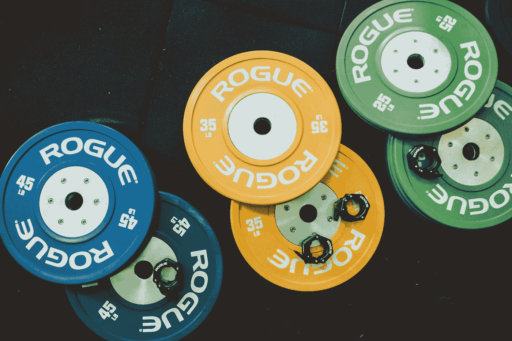

# 关于技术债务，健身教会了软件开发人员什么

> 原文：<https://betterprogramming.pub/what-bodybuilding-teaches-us-about-tech-debt-e9076f8163d0>

## 健美是激烈的。科技债也是！谈到软件开发，我们可以从健美中学到什么？



维克多·弗雷塔斯在 [Unsplash](https://unsplash.com?utm_source=medium&utm_medium=referral) 上拍摄的照片

产品经理、工程经理和个人贡献者都可以从健美运动员使用的技术中学到很多东西。在我们的团队中应用这些技术可以导致一个精简的、吝啬的软件构建机器！

# 健美训练周期的阶段是什么？

最简单的形式，健美训练可以这样定义:

```
while (physiqueNeedsImprovement) {
  bulk()
  cut()
}
```

健美运动员会经历*增肥*和*减肥*的阶段，不断重复，直到他们对自己的体格满意为止。

在*膨胀*阶段(通常是秋冬季节，我们总是穿着宽松的运动衫和夹克)，健身者会专注于增加体重。

最终，我们的目标是让新的体重主要是肌肉，但他们也会在新的肌肉上增加一些脂肪。脂肪是可以忍受的，因为主要的重点是增加新的，美丽的肌肉，唯一的方法就是吃很多，努力训练！

在*切割*阶段(通常在整个夏季——海滩季节之前)，重点转移到尽可能多地去除脂肪。这样做将暴露出健美运动员在之前的锻炼中努力获得的坚硬的横纹肌。

这个阶段包括严格的节食和大量的有氧运动。就像膨胀阶段一样，健美运动员也不指望这个阶段是完美的。他们知道除了减掉脂肪，还会减掉一些肌肉量。但是，只要结果是轮廓分明，比上次切割结束时更瘦的体格，那就可以了。

那么，关于软件开发和技术债务，这教会了我们什么呢？

# 科技债务=肥胖

干净、可维护的代码是瘦肌肉。它令人印象深刻，美丽，是我们都想要的。科技债务很高。似乎不管我们多么努力，总有一点点在我们干净的代码上徘徊，隐藏了它的美丽。

如果我们使用扩充和削减的原则来通知我们的技术决策，我们可以开发一种平衡的方法来处理我们代码库中的技术债务。

# 显得很大或很重要

我们可以将膨胀阶段与主要功能开发相比较。该产品希望尽可能快地构建和发布最新的特性。他们知道这样做意味着更多的收入，所以他们推动快速开发和测试。这不可避免地导致了一些科技债务的产生。

就像健美运动员可以在高强度训练期间增加几磅脂肪一样，开发人员应该可以在开发大型功能时增加一点技术债务。推迟每一个特性是不切实际的，这样我们就可以确保每一个代码的改变或添加都是绝对完美的。

如果一个健美运动员有这样的心态，即每块肌肉都需要绝对完美，增加一盎司脂肪都是不可接受的，他将永远被鸡腿、意大利面手臂和牙签躯干所困。

他没有看到增加肌肉质量的机会，而是非常害怕一点点脂肪，所以他从来没有获得这些收益。坚决反对一盎司技术债务的开发人员减缓了他们团队的进展，并可能阻止他们产品的收益。

通常很容易说服一个产品进入扩充阶段，因为这意味着更多的功能和更多的钱，但很难说服开发者，因为这意味着增加代码库的脂肪。团队应该在哪些功能需要改进，以及为了完成它我们愿意承担多少技术债务上达成妥协。

# 切割

削减可以比作消除技术债务的努力(或者用更产品友好的术语——“可持续发展倡议”)。这个阶段和膨胀阶段一样重要，但是许多团队发现很难说服产品和管理层这是必需的。类似地，许多业余健身者永远都在发胖，因为他们只想在健身房里减少卡路里和体重，但从来不想节食和减肥。

如果一个健美运动员从不健身，他可能会变得强壮和巨大，但他肯定不会有一个瘦，令人印象深刻的体格。我们的软件也是如此。我们可能有大量的功能，并能满足我们所有客户的需求，但隐现的技术债务最终会追上我们。

随着技术债务的积累，开发将会放缓，因为开发人员很难解决这个问题。添加新特性是一项艰巨的任务，因为解开难以理解且杂乱无章的代码要比实际构建特性花费更多的时间。的确，我们通过不断“膨胀”增加了大量的功能，但结果是我们是一个肥胖、变形的健美运动员，不好意思穿着他的泳裤站在舞台上。

通常很容易说服开发者进入切割阶段，但是很难说服产品。对于没有太多技术专业知识的人来说，清理技术债务似乎很神秘，好处是什么也不明显。

团队需要清楚地解释这些可持续发展计划的实际好处(更快的构建时间，更一致的 UI，改进的可访问性，更容易开发未来的功能请求，更快乐的开发人员，等等！).

就像一个健美运动员可能需要说服自己，严格的饮食和在跑步机上长时间无聊的工作是值得的，团队需要说服自己，这些可持续发展倡议将导致一个更精简、更吝啬的代码库，使每个人长期受益。

然而，我们不能总是处于一个切割阶段。如果你是一个经常去健身房的人，你可能会认识那些一直保持苗条身材的人——超级瘦，但几乎没有肌肉，也不太强壮。

开发人员可能会为所有的代码都是干净的和完全可维护的而感到兴奋，但是代价是什么呢？如果我们如此害怕技术债务，以至于我们从来不添加功能(或者非常缓慢地添加功能以防止增加一丁点脂肪)，我们的产品将永远不会达到我们想要的位置。

我们将把成功/收入放在桌面上，因为我们不想通过可能引入一点技术债务的膨胀阶段来推动自己的增长。

# 保持平衡

一个成功的健美运动员对如何达到他的目标有一个平衡的看法。当他需要增加肌肉时，他也可以增加一点脂肪。当他需要向外倾斜时，他不介意失去一点肌肉。只要最终结果是净阳性，他的体质得到改善，他就很高兴。我们可以对我们的团队有相同的观点。当我们改进产品和增加功能时，增加一点技术债务是可以的。有一个削减阶段是可以的，在这个阶段，我们摆脱了一些技术债务，知道我们可能不会在这段时间内快速推出新功能。只要最终结果是我们的代码库在不断改进，整个团队就可以开心了！