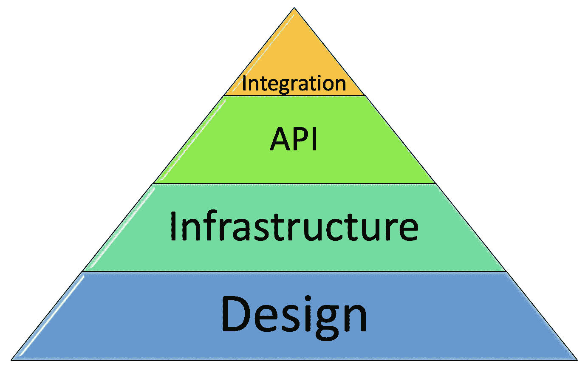

# 软件架构师真正做什么？

> 原文：<https://betterprogramming.pub/what-does-a-software-architect-really-do-192d07aeda3d>

## 看看软件架构师的职责

丹尼尔·麦卡洛在 [Unsplash](https://unsplash.com?utm_source=medium&utm_medium=referral) 上拍照。

这篇文章肯定和我以前的文章有很大不同。一段时间以来，我真的很想写一些理论文章，分享我对在初创公司做软件架构师的想法。让我们从我日常工作中实际做的事情开始吧。

# 介绍

如果你读过我写的一些东西，你就会知道它与云、容器、安全和许多其他术语有关。但这实际上意味着什么呢？我在日常工作中做什么？

对我来说，向行业外的人解释架构师职位实际上要容易得多。

*   “就像一个建筑师，但对于软件来说。”
*   "有蓝图、草图之类的东西吗？"
*   “正是！”

看到了吗？简单。

但是一旦你深入了解，就很难解释了。一旦有人真正理解了这些术语。

软件架构师的工作有很多定义。这是一种包含多种职责的职位，可以由各种不同取向的人来担任。举几个例子，有些人是 R&D 团队不可或缺的一部分，而其他人更接近顾问(有时甚至是承包商)。有些专注于一个特定的项目或产品，而另一些则从更广的角度出发。有些完全从内部角度出发，而有些则更加面向客户。

这也与建筑师工作的组织类型和他们加入的阶段有很大关系。例如，一个大公司可能会有一个架构师部门，每个架构师专注于组织中的一个特定的产品或方面。

初创公司中的架构师角色通常具有更大的灵活性，通过在初创公司的早期加入，我幸运地塑造了我认为合适的架构师角色。

有很多文章会给你一个关于架构师职位的很好的概述，把它分成类别和子类别。今天，我想谈谈我个人的观点。或者更确切地说，我在目前的职位上正在做什么。

图片由作者提供。

# 建筑师职位的支柱

当我向新同事解释我的职位时，我将其描述为我们解决方案的高级别方面的一般联系人。我的工作是对核心产品有很好的理解，但对解决方案如何工作有很好的理解——我们拥有的组件以及它们如何相互协作、数据流动的方式、我们使用的技术堆栈等。

显然，你不能指望任何一个人什么都懂，或者在每个方面都是专家。然而，我认为，处于我这种位置的人应该有必要的背景，以便很好地理解，有足够的信心给出意见(即使需要一些额外的研究)，并总是渴望学习和发展。那是必须的！

我的同事可能通过我们每天的交流理解我的立场。这些有时被认为是我们产品的核心，但通常是在更高的层次，涉及基础设施、组件间的集成、客户事务、安全事务等。

当我开始更深入地思考这个问题，试图理解我职位的确切组成部分时，我意识到我可以很容易地将我的工作分成四个不同的方面:设计、基础设施、API 和集成。

在我看来，这四个方面不仅相互关联，而且或多或少地相互依赖。我开始将它们视为分层结构，这对我来说很有意义:

图片由作者提供。

让我解释一下。

## 拿起一支(虚拟)铅笔

最主要的，至少是我个人花费大部分时间的，是设计。这是我工作的所有其他方面所依赖的基石。这也是所有蓝图和草图变得生动的部分。实际的建筑图纸。

重要的是要记住，在展示设计时，大多数人不会对复杂的系统设计感兴趣(尽管你可能仍然想要一个——至少对你自己来说)。他们很可能会更感激看到一个更简单、更优雅的图表，这肯定会帮助他们更好地理解你的思维方式。

然而，引领我们解决方案的端到端设计不仅仅是图纸的信息量或美观程度。最重要的是，这意味着我负责构建块、通信、集成点等的高层设计。确保我们清楚组件如何协同工作，涉及哪些技术，以及数据如何流动。

说到数据，我有几年的大数据经验——我在以前的职位上担任过数据工程师和数据工程团队负责人——这可能是我在进行设计时总是专注于数据的主要原因。此外，我有时发现首先将一个解决方案架构——即使是一个很小的架构——视为数据管道是很有成效的。它并不总是很合适，通常也不涉及数据湖，但我相信它使点与点之间的联系更容易，并让我清楚地了解我试图实现的目标、可能的数据流，以及我的设计如何涵盖所有这些。

最后，在考虑外部技术时，最重要的是跟上最新的发展。始终确保您计划在产品中使用的每项技术、基础设施或库不仅完全适合您的使用情形，而且是最佳的可用选择—可靠、维护良好且安全的选择。

## 钱都去哪了？

一旦我们清楚地理解了我们的解决方案图——构建模块和布线——就该理解这个图是如何实现的了。我们解决方案的端到端设置是什么样的？每个构造块位于何处？他们是如何交流的？

基础设施的主要目的是支持设计，为了做到这一点，我们必须以纯粹的开发心态做出许多决定:

*   我们将用来运行系统的机器类型。
*   我们将要使用的缓存解决方案的类型。
*   无论是云集成解决方案还是我们自己提供的解决方案。
*   如何自动扩展基础架构，以确保我们能够以最少的资源支持必要的负载。

然而，我第一次想到基础设施是在设计我们的解决方案时。我认为，即使你手头没有任何东西，只是开始考虑大局，你也应该考虑一些问题，例如数据存储在哪里，如何访问，需要什么数据库，以及可以利用哪些其他云组件。

如今，云架构通常是完整解决方案架构不可或缺的一部分。云组件可以用来替换你的架构的一部分(例如，有效地执行你的流程的某些部分或者从你的客户那里接收数据)，并且在许多情况下，它们将比你的定制解决方案更便宜和更高效。回到数据工程领域，例如，使用预定义的云解决方案可以节省数月的研究时间，并且在训练 ML 模型时仍然可以提供令人惊讶的结果。

当然，使用预定义的云组件是有限制的，但是您当然应该考虑使用它们。

## 界面理论

API 是解决产品混乱的终极方法。它们是确保每个组件——无论是您的企业级产品还是小型内部软件包——都按照设计的方式运行的最佳方式。

我认为确保尽可能使用清晰的 API 是我职责的一部分，我发现不仅要清楚地定义我们的产品如何与外界交互，还要清楚地定义我们的组件如何相互交互，这一点极其重要。

我坚信每个组件或包，即使是完全内部的，也应该有一个清晰的界面。拥有它的人应该清楚地了解它的用例，谁应该访问它，以什么方式访问(从我的架构师的角度来看，知道谁*正在访问它以及以什么方式访问它也很重要，因为保护我们的产品是我的角色的重要部分，它从保护接口开始——自然是外部的，但也包括内部的)，以及为什么，他们期望得到什么。他们不能让任何人以他们想要的任何方式导入包或与组件交互。这可能是灾难性的。*

有了对用例的清晰理解，定义一个清晰的接口应该是相对容易的——一组功能，它们是组件与外界的唯一交互，每个都有一个清晰的输入和输出定义。

一旦定义了接口，如果有人以不同的方式使用该组件，这可能意味着两件事之一:要么他们使用错误，要么接口应该更新以支持新的用例。无论哪种方式，这种方法都可以更清楚地理解组件的交互，并且会产生更好的产品。此外，具有明确的端点和定义的接口也使得测试组件变得更加容易，并且限制了系统中出现问题的可能性——或者至少使问题发生的位置更加清晰。哪一方突然不遵守商定的 API 了？

## 装出友好的面孔

在规划我们的解决方案的高级设计时，与我们的客户及其系统的集成也属于我的架构师范畴。这些是图表的边缘，我需要确保我能够回答客户如何向我们发送数据以及我们如何将结果返回给他们这样的问题。

由于集成可能会强烈影响设计、基础设施和 API 的各个部分，有些人会说它属于方面金字塔的底层(或者可能在与其他方面冲突的相邻金字塔中)。我部分同意，但是我认为一个可靠的设计、基础设施和 API 会产生一个可靠的产品——稳定、高效和有效。此外，如果两个客户有冲突的需求会发生什么？

显然，对客户来说，最好的解决方案是尽可能不费力地使集成看起来完全符合他们的期望。这让他们很开心。但是作为一名架构师，我必须问自己，我们是否真的能够支持客户要求的一切。很多时候，答案是肯定的——尤其是对于一个渴望客户的年轻小公司来说。很多时候，说不是不可能的，但是一个架构师必须至少能够举起一面红旗。

尽管如此，一旦你有了一个坚实的产品，可以进行调整，以满足客户的要求。有时候，一个请求感觉如此重要，以至于我们将它作为产品的一部分。其他时候，如果你运气好，处理它会导致代码中出现十几个“如果”(如果你运气不好，它需要一个针对特定客户的专用基础设施)，但你还是适应了。底线是你不想因为集成差距而失去一个客户。

# 摘要

在这篇文章中，我讨论了软件架构师这个职位对我意味着什么，以及我在工作中实际做了什么。

当我回顾我工作的四个方面时，我并没有真正提到另外两个重要的方面:*安全性*和*合规性*。在我工作的其他方面，这两者都是我思考和决策过程中不可或缺的一部分，我花了大量的时间在它们上面——以至于在简要讨论我工作的其他方面时扩展这些主题会使这篇文章专注于它们，这不是我的意图(尽管我肯定打算在不久的将来写一整篇关于它们的文章)。

最后，再次强调这篇文章与*分享我的*观点是很重要的。这个职位有一个广泛的定义，它真的可以因人而异。我仍然希望你觉得它有点意思，也许你甚至有了一个新的想法或者只是一些有用的想法。