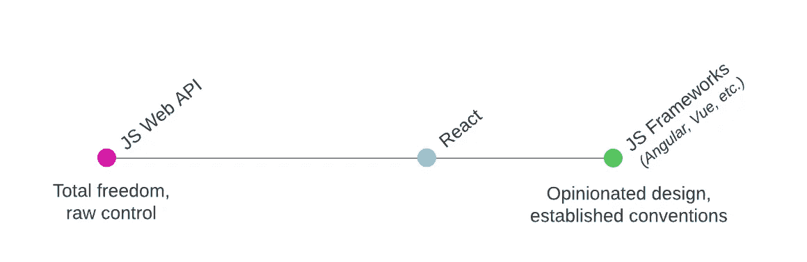
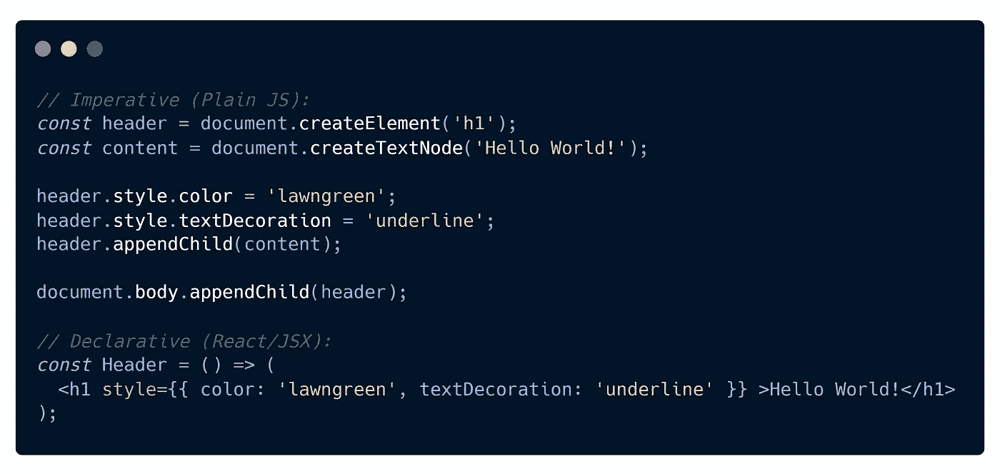
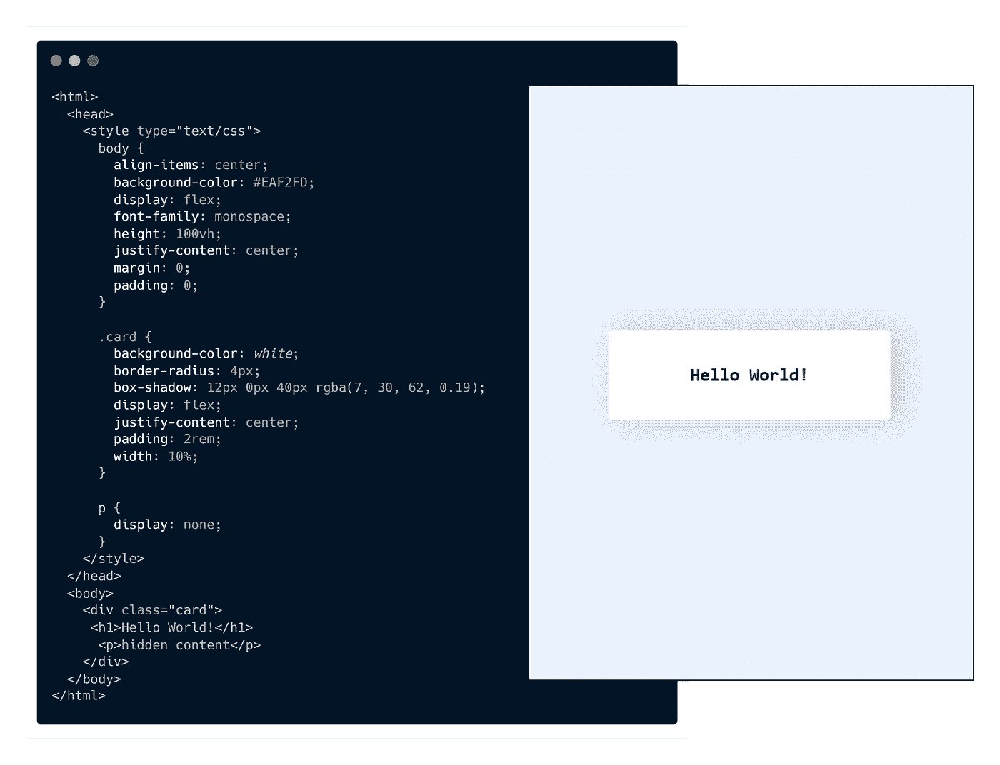
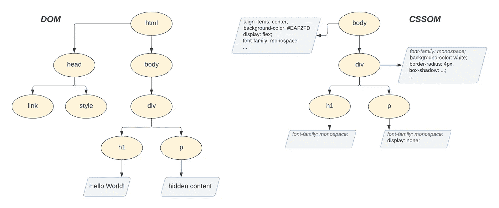
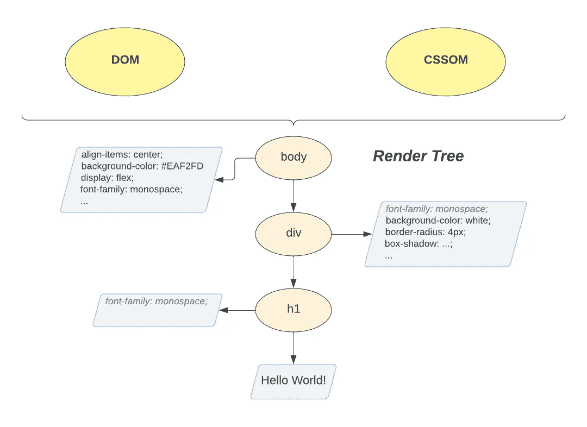
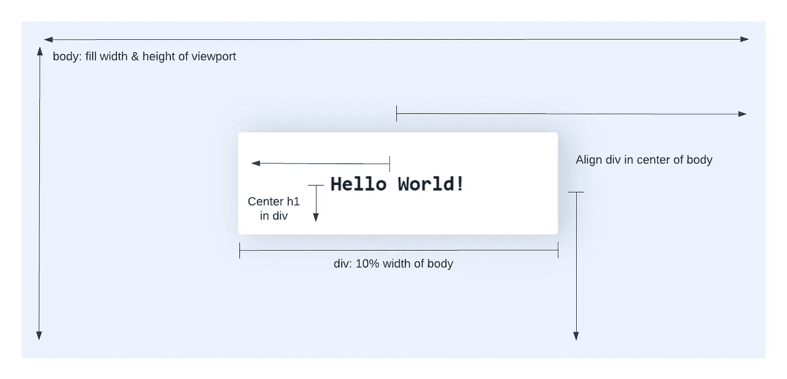
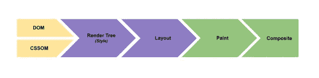
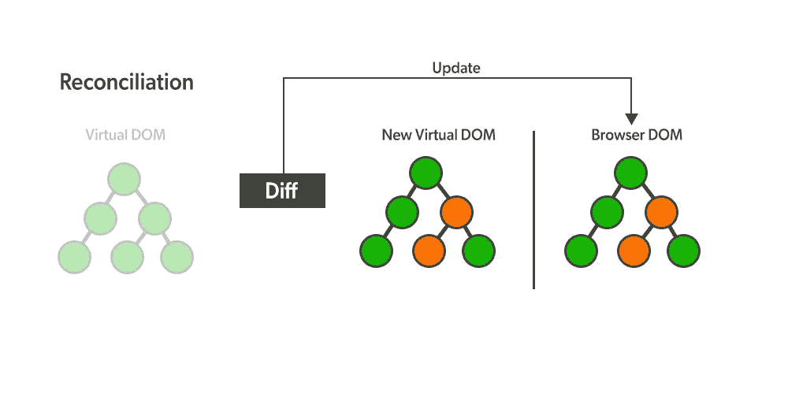

# React 实际上是做什么的？

> 原文：<https://betterprogramming.pub/what-does-react-actually-do-c9412c08bfe6>

## 在后台

丹尼尔·拉德福德在 [Unsplash](https://unsplash.com?utm_source=medium&utm_medium=referral) 上的照片

多么吸引人的标题，对吧？但是忽略这一点，你有多了解 React 实际上做了什么？当然，在高层次上，React 是“一个用于构建 ui 的 JavaScript 库”但是这个 JavaScript 到底是做什么的？它与其他框架或简单地编写普通 JS 有什么不同？

React 是我日常使用的工具。然而，直到最近，我对它在幕后所做的事情只有粗浅的了解。我觉得在 React 中做事情很熟练，并且理解它的 API 和核心概念。然而，*如何*和*为什么*会这样反应，对我来说仍然是个谜。在阅读了无数的文档、博客文章和源代码之后，React 逐渐变得不那么神奇，同时也变得更加特别。虽然许多细节不适用于日常开发，但我也对 React 的真正功能有了更清晰的了解。

在下面的文章中，我的目标是描述 React 是如何工作的，同时省略一些乏味的、不太重要的细节。希望这能激发其他人更深入地研究 React 的机制——或者至少对这个 web 非常依赖的库给予更多的赞赏。

# 为什么对 React 有更深入的理解很重要？

事实上，*和*没有关系。React 做了大量工作，使得这些实现细节对于生成令人难以置信的 web 应用程序来说是不必要的。也就是说，我们越了解我们的工具，我们就能越好地利用它们来完成我们需要的东西。React(以及整个 JS，真的)是一个非常灵活的环境，开发人员可以用许多不同的方式解决同一个问题。挑战通常是决定哪种解决方案对于给定的情况是最好的。根据我的经验，完全理解 React 的功能有助于评估可能的实现，并提高代码库的整体质量。

# React 库与框架

有大量的文章致力于 React 和其他前端框架之间的比较。然而，对于这篇文章，只需要强调 React 试图填补的角色。

当然，我们在 React 中构建的任何东西都可以用纯 JavaScript 和各种[Web API](https://developer.mozilla.org/en-US/docs/Learn/JavaScript/Client-side_web_APIs)实现。那么为什么还要费神去反应呢？很简单，更容易。与普通的 JS 相比，React 的声明式语法(JSX)和低层关注点的抽象极大地提高了开发速度和代码的可读性。

一个更有趣的问题:为什么 React 被称为*库*而不是 Vue、Ember 或 Angular 之类的框架？与这些“包含电池”的框架不同，React 的目的更加“单一”。它没有提供路由、获取数据甚至全局状态管理的工具。React 专注于一件事，并且做得非常好——高效地将数据渲染到您的显示器上。但是这有多重要呢？*继续读下去！*

> 注意:当我们讨论 React 用于 web 应用程序开发时，我们通常指的是两个独立的包:`react`和`react-dom`。`react`包只负责定义组件的功能。它通常与一个“渲染器”成对出现，比如`react-dom`，为我们提供我们通常称为 React 的特性集。但稍后会详细介绍。

# 浏览器渲染过程

我们已经说过，React 是专门为尽可能高效地在浏览器中呈现内容而构建的。为了更好地理解 React 给我们带来的功能，我们需要简单描述一下浏览器呈现和更新网页的过程。

当用户访问典型 web 应用程序的页面时，会向浏览器返回一个 HTML 文件，其中包含特定视图所需的资源。浏览器解析文件的内容，下载并执行任何链接的 JS、CSS 和图像资源。在这个过程中还构建了两个树状结构，称为 **DOM** (文档对象模型)和 **CSSOM** (CSS 对象模型)。DOM 的节点表示组成视图的元素和内容，而 CSSOM 包含每个 DOM 节点的样式信息。

图表改编自[渲染树结构、布局和油漆](https://web.dev/critical-rendering-path-render-tree-construction/)。

一旦 DOM 和 CSSOM 树构建完成，浏览器就可以开始将它们拼接成第三种结构，称为**渲染树**。渲染树不仅仅是 DOM 和 CSSOM 的合并。它只是呈现页面所需的节点的精确映射。这意味着不占用任何空间的节点，比如脚本标签或者具有`display: none`风格属性的元素，将从这个树中被忽略。

图表改编自[渲染树构造、布局和油漆](https://web.dev/critical-rendering-path-render-tree-construction/)。

既然浏览器知道什么内容需要呈现在屏幕上，它必须确定每一部分在页面上的位置。这一步称为**布局**阶段。浏览器从渲染树的根开始，并根据设备的视口计算每个节点的位置和大小。

此时，浏览器已经确定了应该显示什么内容，应该是什么样子，应该放在什么位置。但是它实际上并没有向用户呈现任何可见的东西。这就是**上色**和**合成**步骤的用武之地。绘画需要填充页面上的像素，通常在多个层中绘制内容。然后，这些层被缝合在一起，并在一个称为合成的过程中以正确的顺序应用。

图改编自[渲染性能](https://web.dev/rendering-performance/)。

总之，这个过程被称为“[关键渲染路径](https://developer.mozilla.org/en-US/docs/Web/Performance/Critical_rendering_path)”，它代表了浏览器的大量工作。高性能 UI 的关键是尽可能最低限度和高效地触发这个流程。实际上，这意味着:

*   只要有可能，批量更新 DOM 以防止浏览器不必要地频繁重新呈现。
*   优化渲染每一帧所需的 JS，使其尽可能快而短。
*   寻找机会仅触发该流程的*部分*。例如，更新元素的颜色或不透明度比添加/删除一个元素要简单得多。如果页面上元素的位置没有变化，那么可以跳过布局阶段，避免额外的工作。请看一下 [CSS 触发器](https://csstriggers.com/)以获得影响渲染路径不同阶段的属性的更全面列表。

> 注意:这是对渲染过程和关键渲染路径的高度概括。如果您想更深入地了解每个阶段的实际情况，请查看页面底部参考资料部分的链接。

# React 适合在哪里？

记住上面描述的关键呈现路径，考虑一个典型的 web 应用程序。在任何给定的页面上，它可能从各种来源获取数据，并向用户显示格式化的结果。它包含响应用户交互而定期更新或更改的动态内容。有表单域、动画、模态和弹出窗口。换句话说，应用程序需要处理大量的 DOM 更新。管理所有这些更新，同时确保页面保持高性能是一项艰巨的任务。这就是 React 介入的地方。有效地、声明性地对 DOM 应用更新是其架构的核心。接下来让我们看看 React 是如何做到这一点的。

# React 虚拟 DOM 及协调算法

React 应用程序由组件组成。这些组件包装了组成 UI 的功能块。他们可以接受`props`作为输入，并可以管理自己的`state`。然而，组件的真正本质是定义一组由它的`render()`方法返回的 [React 元素](https://reactjs.org/docs/rendering-elements.html)。元素是简单、廉价的 JS 对象，代表 React 应用程序的最小构建块。

如果您观察上面代码片段中的元素对象，您会注意到第一个元素有一个`Card`的`type`。`Card`元素还有一个道具叫`children`。`children`的值只是另一个元素，在本例中是一个`h1`。通过这种映射，React 元素以我们在 DOM 树中观察到的类似结构建立父子链接。在 React 中，这种元素树通常被描述为 [**虚拟 DOM**](https://reactjs.org/docs/faq-internals.html) 。为了更具体地了解虚拟 DOM 的作用，让我们来看一个基本的 React 应用程序。

上面的应用程序由一个按钮和一个随机生成的数字列表组成。单击该按钮会向列表中添加一个新号码。当 React 应用程序运行时，它遍历每个组件并调用其`render()`方法。`render()`方法返回组成组件的元素树。这是应用程序的外观，用元素表示:

或者，可视化为元素的组合树:

> 注意:这个**组合的**对象只是为了更好地可视化元素之间的关系。它不是 React 创建的结构的实际表示。

一旦 React 构建了这个元素树，它就开始将树与页面上当前显示的内容进行比较。React 确定一个精确的差异列表，并将更改列表交给一个“渲染器”，比如 [ReactDOM](https://github.com/facebook/react/tree/main/packages/react-dom) 。ReactDOM 负责获取这一批指令，并将更新应用到浏览器，将应用程序绑定到前面描述的渲染路径。

当应用程序首次初始化时，比较是很容易的。虚拟 DOM 中的任何内容当前都不存在于实际 DOM 中。因此发送到 ReactDOM 的指令列表必须包括从头开始创建一切的步骤。但是当你点击“添加随机数”按钮时会发生什么呢？视觉上，一个新的数字被添加到屏幕上的列表中。以编程方式，`state`变量`numList`被更新以包含新条目。然而，再深入一步，虚拟 DOM 的角色变得更加普遍。当一个组件的`state`值改变时，React 再次调用该组件的`render()`方法。和以前一样，调用`render()`将返回一个类似的元素树。不过，这一次，树将包含一个新元素，其`type`为`li`，表示附加的列表项。React now 有一个旧的树来描述页面上当前可见的内容，有一个新的树来描述我们希望更新后的页面是什么样子。现在 React 必须比较这两棵树，并向 ReactDOM 提供指令来同步所有发生变化的内容。这导致新号码被附加到屏幕上的列表中。

那么，为什么虚拟 DOM 对于构建高性能的 web 应用程序如此关键呢？虚拟 DOM 使开发人员能够专注于描述他们希望更新后的 UI 是什么样子。React 然后获取这个描述并构建一个元素树——这比创建和遍历浏览器 DOM 元素要便宜得多。有了这个专门构建的树，React 可以有效地精确协调视图需要做的更改。然后，可以对实际的 DOM 进行高度优化的批量更新。很聪明，对吧？

什么是差分算法？

让我们再翻一块重要的石头来反应 React 的效率。React cheaply 如何确定新旧元素树之间发生了什么变化？一个 web 应用程序可以很容易地由成千上万个元素组成。使用传统的试探法将花费太长的时间来识别从如此巨大的树中应该发生什么更新。为此 React 开发了**调和算法**。这种算法是一套可预测的、易于遵循的规则，使开发人员能够根据自己的意愿进行优化。

[关于对账规则的文档](https://reactjs.org/docs/reconciliation.html)阅读速度快，内容全面，这里就不赘述了。但简而言之，当一个组件的`render()`方法被调用时，通常是在一个`state`或`prop`改变之后，返回的组成组件的元素树将与它先前生成的树进行比较。从每棵树的根开始，如果两个元素之间的`type`不同，例如`div`变为`span`，那么该节点以及树中它下面的所有节点将立即被标记为“新的”,而无需进一步比较。任何嵌套的组件都将被拆除并销毁，所有生成的 DOM 节点都将从头开始重新创建。然而，如果元素共享相同的类型，则比较它们的`props`。对于 DOM 元素，如`div`，React 识别出发生变化的特定属性，并只更新现有 DOM 节点上的这些值。但是，对于具有组件`type`、`NumList`的元素，例如，组件的`render()`方法用最新的`prop`值调用，并且该过程在返回的元素树上递归重复。

# 外卖食品

简而言之，React 为开发人员提供了一种声明性的机制，用于描述网页应该是什么样子，而无需经常关注浏览器呈现过程中的许多细微差别。它通过 JS 对象树和明确表达的规则来实现这一点，以确定何时发生了变化。这些规则使开发人员能够进一步优化性能，以满足其应用程序的需求。以下是开发过程中需要牢记的一些概念:

*   React 中的“渲染”(或“重新渲染”)是比浏览器渲染更便宜的操作。尽管注意组件何时触发重新渲染很重要，但在大多数情况下，没有必要消除所有不重要的渲染。事实上，在某些情况下，这甚至会[伤害**表现**。](https://kentcdodds.com/blog/usememo-and-usecallback)
*   我们可以在代码中采用一些策略来更好地与 React 的协调算法保持一致。确保在生成组件列表时使用足够独特的`key`属性，并注意改变元素的`type`，尤其是在应用程序的根目录附近。有条件地将`div`更改为`span`或者使用三元组在两个父组件之间切换可能会有惊人的成本。
*   反应不是魔法。开发人员仍然需要知道 DOM 何时以及如何更新。是否经常在 DOM 中添加和删除组件？可以用 CSS 来限制浏览器渲染路径的哪一部分被触发吗？如果 React 组件的`state`更新很快，有什么办法可以减缓被推送到 DOM 的更改吗？也许是一个合适的去抖？
*   我们日常使用的库和框架不必是一个谜。这就是开源的美妙之处。投入进去，做出贡献，学习事情是如何运作的。您可能会带着一两个可以改进您自己的应用程序的概念离开。

# 资源

*   [React Docs](https://reactjs.org/docs/getting-started.html)
*   [React](https://github.com/facebook/react/tree/main/packages/react)/[React DOM](https://github.com/facebook/react/tree/main/packages/react-dom)源代码
*   [React 是库还是框架？](https://www.freecodecamp.org/news/is-react-a-library-or-a-framework/)
*   浏览器[渲染树构建、布局和绘制](https://web.dev/critical-rendering-path-render-tree-construction/)
*   浏览器[渲染性能](https://web.dev/rendering-performance/)
*   [浏览器如何呈现网页](https://medium.com/jspoint/how-the-browser-renders-a-web-page-dom-cssom-and-rendering-df10531c9969)
*   [反应组件、元素和实例](https://reactjs.org/blog/2015/12/18/react-components-elements-and-instances.html)
*   [作为 UI 运行时反应](https://overreacted.io/react-as-a-ui-runtime/)

# **延伸阅读**

*   [以用户为中心的绩效指标](https://web.dev/user-centric-performance-metrics/?utm_source=devtools)
*   [React 光纤架构](https://github.com/acdlite/react-fiber-architecture)(实施概述)