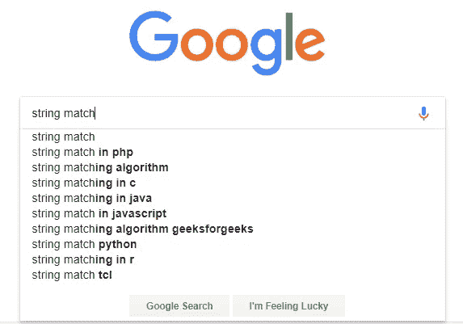

# 每个程序员都应该知道的“字符串”

> 原文：<https://betterprogramming.pub/what-every-programmer-should-know-about-string-a6611537f84e>


在 [Unsplash](https://unsplash.com/?utm_source=unsplash&utm_medium=referral&utm_content=creditCopyText) 上由[杯子先生/杨奇煜·巴拉](https://unsplash.com/photos/zFz3jThypsA?utm_source=unsplash&utm_medium=referral&utm_content=creditCopyText)拍摄的照片

“字符串”是一系列字符。

考虑到你很可能是一名程序员，你很可能已经知道这个定义。我认为假设你已经在至少一种编程语言中使用过`String`是公平的。

尽管如此，我还是要再提醒你一次——编程世界里的`String`与 [*弦理论没有任何关系*](https://www.forbes.com/sites/startswithabang/2016/11/25/what-every-layperson-should-know-about-string-theory/#27fc88395a53) [谢尔顿·库珀](http://bigbangtheory.wikia.com/wiki/Sheldon_Cooper)比其他任何物理学家都更普及。

# 介绍

在本文中，我将向您介绍一些与`String`相关的非常重要的概念和术语，您可能需要在日常编程中使用它们。

此外，熟悉这些术语也许有一天会对你的工作面试有所帮助，谁知道呢？

尽管有些术语从语言学的角度来看有着复杂的含义，但我会尽量避免使用难懂的词，并从程序员需要理解的角度来解释。

另一件需要提及的事情是，我不会展示任何代码示例，也不会展示如何用你喜欢的语言进行字符串操作。

我只谈术语和概念，你的工作是在需要的时候找出如何使用它们。

# 字符编码

一个`String`的主要组件是一个`Character`，但是你可能已经知道了。但你知道字符只是代码表示吗？

我的意思是，计算机不知道字符、字母等。，也不会将它们存储在内存中。计算机将它们存储为数字(准确地说是二进制)。

有一些约定来定义哪个数字代表哪个字符。这个字符集将一些数字或代码点映射到文本字符。

然后，在视觉表示时，计算机从内存中读取它们，并基于该映射将它们表示为字符。这种映射和字符表示被称为*字符编码*。

【http://kunststube.net/encoding/】(如果点击链接不起作用，试试这个链接:)这篇文章很好地解释了它的一切。所以，我建议你读一下，以便更好地理解字符编码。

大多数程序员新手(尤其是那些用类 C 语言开始编程的人)都认为世界上所有的字符都是单字节的，显然是 ASCII 字符。

我不怪他们，因为我也是他们中的一员。但是现在我知道这不是真的，有一个巨大的 Unicode 字符世界，作为一名程序员，你需要经常与它们打交道。

所以，你需要记住的第一件事是:

世界上所有的字符并不都是平等的，它们也不总是单字节字符。

大多数 Unicode 字符可以存储为 16 位或 2 字节数据类型。

但还是有一些不能。Unicode 中定义了超过 136000 个码位，其中两个字节可以存储多达 65536 个字符。

因此，需要多字节数据类型来存储余数。你应该记住:

*   一些编程语言(C， [C++](http://www.cplusplus.com/doc/tutorial/) 等。)提供专门用于 ASCII 字符的单字节数据类型(`char`)和用于 Unicode 的多字节数据类型(`wchar_t`)。
*   一些编程语言(Java 等。)对于字符类型只有多字节数据类型。
*   一个字节=一个字符的日子已经一去不复返了，你需要记住这一点。

当我们在做的时候，让我们给你另外一点信息。

字符编码可以是固定长度或可变长度。

你可能听说过像 UTF 8，UTF-16，UTF-32 等编码方案。虽然还有各种其他编码，但是让我们简单了解一下这三种 Unicode 字符编码。

*   UTF-16 以单个 16 位字符类型表示大多数常用的 Unicode 码位。它使用两个 16 位字符来表示余数。这意味着 UTF-16 是一种可变长度编码，使用最小 16 位(两个字节)和最大 32 位(四个字节)。
*   UTF-8 使用一到四个 8 位字符对所有 Unicode 码位进行编码。它也是另一种可变长度编码，用一个字节表示 ASCII 字符。(这很方便，因为这意味着 ASCII 文本在 UTF-8 中也是有效的)其余的代码根据需要分成两个、三个或四个字节。
*   UTF-32 对所有字符使用四个字节。这是一种固定长度的编码。

当你使用国际化和本地化时，你的字符编码知识可能会派上用场。此外，你可以从[这个单独的讨论线索](https://www.quora.com/What-is-the-file-size-of-text-that-is-200-characters)中猜到，这些知识在其他方面也非常重要，比如你的文本会消耗多少空间和内存，基于它的编码。

我要说的是，在处理`String`或`Text`时，要小心字符编码。

# 字符串不变性

大多数语言都提供`String`作为基本数据类型。关于你正在使用的语言，你需要知道的是你的语言的`String`数据类型是`Mutable` 还是`Immutable`。

例如，Java 和 [Python](https://www.python.org/) `String`类型是`Immutable`。

如果你试图把一个`Immutable` `String`当作`Mutable`来处理，它会抛出一个错误，你可能会怀疑你的字符串出了什么问题。

你可能很想知道为什么在一些语言中字符串是`Immutable`。

我们来稍微探索一下。

你看，在 C 之类的语言中，它们将字符串存储为字符数组，充当通用数组。因此，正如您可以轻松地改变数组一样，您也可以改变`String`。

另一方面，像 Java 和 Python 这样的语言将`String`视为`Object`，它们留出一个特殊的内存区域，称为*字符串常量池*。

当编译器看到一个`String`字面值时，它会在池中寻找`String`。如果找到匹配，对新文字的引用指向现有的`String`并且不创建新的`String`对象。

现有的`String`只是多了一个参考。

使字符串对象不可变的要点是:

在`String`常量池中，`String`对象可能有一个或多个引用。如果几个引用指向同一个字符串，而自己却不知道，如果其中一个引用修改了那个`String`值，那就糟了。

这就是为什么`String`对象是不可变的。

因此，在使用它们之前，请确保在您最喜欢的语言中字符串的不变性。

# 字符串术语

是时候学习一些术语了。

## 子链

字符串 *S* 的子串，是出现在 *S* 中的字符串。

让我们说得更清楚些。

字符串的任何连续部分都是它的子串。因此，“is nice”是字符串“This is nice”的子字符串。但是' nice is '不是，因为' nice is '在字符串' This is nice '中找不到。**您必须在字符串中找到子字符串。**

字符串" *apple* "的所有子字符串列表将是:
" *apple* "， *appl* "， *pple* "， *app* "， *ppl* "， *ple* "， *ap* "， *pp* "，"

## 前缀

字符串 *S* 的前缀是出现在 *S* 的*开始*处的 *S* 的子串。

举个例子可能会更清楚。

字符串" *apple* "的所有前缀列表将是:
" *apple* "， *appl* "， *app* "， *ap* "， *a"*

因此，要成为前缀，子字符串需要从该字符串的开头开始。

字符串的*固有前缀*不等于字符串本身。所以，“苹果”不会是一个合适的“苹果”前缀。

## 后缀

字符串 *S* 的后缀是出现在 *S* 的*末端*的 *S* 的子串。

字符串" *apple* "的所有后缀列表如下:
" *apple* "， *pple* "， *ple* "， *le* "， *e* "

因此，要成为后缀，子字符串需要在该字符串的末尾结束。

字符串的*正确后缀*不等于字符串本身。所以，“苹果”不会是一个合适的“苹果”后缀。

## 随后

子序列的正式定义是:

> *“一个* ***子序列*** *是一个可以通过删除一些元素或者不删除元素而不改变剩余元素顺序的序列。”—* [*维基百科*](https://en.wikipedia.org/wiki/Subsequence)

我用简单的话解释一下。

字符串是一系列字符，对吗？因此，如果我们选择一些字符，保持出现在原始`String`中的相同序列，那么得到的`String`将是原始字符串的子序列。

假设我们有一个字符串“Hello”。那么“eo”就是该字符串的子序列。

但“ol”不会是子序列，因为它没有出现在“Hello”的同一个序列中。

单词" *apple* "的所有子序列列表将是:
" *e，l，le，p，pe，pl，ple，p，pe，pl，ple，pp，ppe，ppl，pple，a，ae，al，ale，ap，ape，apl，aple，ap，ape，apl，aple，app，appe，appl，apple"* 。

你知道子串和子串的区别吗？

# 常见操作

让我们来学习一些`Strings`的常用操作。

## 串联

这意味着将两个或更多的字符串连接在一起。

假设有两个字符串:*【你好】*和*【世界】*。这两个字符串的串联结果产生另一个字符串*‘Hello World’*。

## 大写/大小写折叠

这意味着将字符串中的所有字符都转换成相同的大小写，无论是小写还是大写。

大写有各种用例。

一个用例:如果您需要以不区分大小写的方式在两个`Strings`之间进行比较，您总是需要将两个文本规范化为小写或大写。

好吧，说实话，事情不会总是那么简单。如果您的字符串包含非拉丁字符，您将面临一些奇怪的情况。

假设你的字符串是*resume*。要将字符串转换为大写，通常需要将[a-z]字符集转换为[A-Z]字符集。

那么，é的大写字母是什么？在这种情况下，您需要考虑其他因素，比如 Unicode 规范化等等。在本文中了解更多信息。

## 加入

虽然从名字上看‘join’和‘concatenation’相似，但是它们之间有一个微妙但重要的区别。

与连接不同，join 在每个字符串元素之间使用给定的“分隔符”或“粘合”来连接字符串。

因此，如果给定的字符串列表如下: *['Hello '，' world '，' again']，*以及分隔符/胶水 **'-'** ，那么得到的字符串将是: *'Hello-world-again'* 。

在某些情况下，分隔符可以是空字符串(“”)，其行为与串联完全一样。

## 分割/标记化

分割或标记字符串意味着根据一个或一组分隔符将单个字符串分解成几个部分。

假设你有一个`String`:*‘为什么这么严肃？’*

现在，如果你基于空白标记这个字符串，你将得到一个字符串或标记的列表: *['Why '，' so '，' serious？'】*。

请注意，分隔符不会包含在结果字符串中。

此外，在某些情况下，您可能需要基于模式对字符串进行标记化，而不是基于某些特定的分隔符。这可以通过[正则表达式](https://en.wikipedia.org/wiki/Regular_expression)轻松完成。

## 修剪/剥离

修剪或剥离字符串通常意味着从字符串中删除前导和尾随空白。

在这个上下文中，空白是所有的空白字符(空格、制表符、不间断空格等。)和所有的[行结束符(LF，CR 等。)](https://en.wikipedia.org/wiki/Newline)。

因此，一个给定的字符串:*‘这很简单’*在修剪/剥离后将是*‘这很简单’*。

修剪/剥离的变体包括:

*   仅修剪/去除前导(左修剪)或尾随(右修剪)空白。
*   字符串中的任何空白字符序列都被替换为一个空格，这也称为“空格规范化”。

## 词典排序

有时你需要为字符串列表定义一个顺序。

最流行的排序是 **'** 字典序'，也叫‘字母序’或‘字典序’。

你见过单词在字典里是如何排序的？这正是字典顺序。

所以，如果你按字典顺序排列单词列表 *['蚂蚁'，'斑马'，'苹果'，'苹果车']* ，它将是:

```
Zebra 
ant
apple
applecart
```

请注意，在字典顺序中，大写字母在小写字母之前，这就是为什么“斑马”在“蚂蚁”之前。

此外，较长的字符串出现在相同的前缀较小的字符串之后，这就是为什么“apple”在“applecart”之前。

## 字符串搜索/比较

您经常会执行与某种字符串搜索和/或比较直接或间接相关的任务。

先说一些常见的字符串/模式匹配的类型。

其中最常见的是检查两个字符串之间的精确匹配。你会认为你用==操作符做到了。

但是我想给你一个简单的建议，也许有一天会让你免除很多麻烦。

如果将两个字符串存储在两个变量中，并尝试用==运算符检查它们的相等性，您需要知道您的编程语言是在进行值匹配还是只是引用匹配。

如果你的编程语言将`String`视为`Object`，那么当你试图用==操作符[检查两个`String` `Object`时，它将检查两个](https://stackoverflow.com/questions/513832/how-do-i-compare-strings-in-java) `[Object](https://stackoverflow.com/questions/513832/how-do-i-compare-strings-in-java)` [的引用是否相等，而不是它们的值](https://stackoverflow.com/questions/513832/how-do-i-compare-strings-in-java)。

另一方面，其他编程语言可能只是检查这两个字符串变量的值是否相等。所以，记住这一点。

你在谷歌搜索或手机的联系人搜索中见过自动完成或自动建议功能，对吗？



如果您仔细观察，您会发现它们正在进行某种形式的前缀匹配。

你输入的字符串和他们已经存储的字符串列表。

那么，如果需要的话，你会怎么自己做呢？如果您的字符串列表不是很大，您可以采取任何方法来匹配所有的字符串。但是对于大型列表来说，这种方法效率不高。

有效的方法是使用复杂的数据结构，如 [trie](https://en.wikipedia.org/wiki/Trie) 。详细的讨论超出了本文的范围，所以您应该自己深入研究。

类似地，如果您需要进行后缀匹配，您可以通过存储字符串的逆序以及实际的字符串，将问题转化为前缀匹配问题，或者您可以使用[后缀树](https://en.wikipedia.org/wiki/Suffix_tree)的帮助。

有时，您需要进行模式匹配，例如检查一个字符串是否是给定字符串的子字符串，或者是否可以在给定字符串中找到模式。

在这些情况下，您需要从各种[字符串搜索算法](https://en.wikipedia.org/wiki/String_searching_algorithm)中获取帮助，并选择满足您需求的算法。

在某些情况下，当我们运行搜索时，我们希望找到相关的结果，不仅是我们在搜索栏中键入的精确表达式，还包括我们使用的单词的其他可能形式。

例如，如果我们在搜索栏中键入了*“run”*，我们很可能希望看到包含表单*“ran”*和*“running”*的结果。

这可以通过两种可能的方法来实现:[词干化和](https://nlp.stanford.edu/IR-book/html/htmledition/stemming-and-lemmatization-1.html)。

这两个过程的目的是一样的:将每个单词的屈折形式简化为一个共同的基础或词根。虽然这个术语在 [NLP](https://en.wikipedia.org/wiki/Natural-language_processing) 中最流行，但它也用于数据库系统中的全文搜索机制和文本搜索引擎，如 [Elasticsearch](https://www.elastic.co/guide/en/elasticsearch/guide/current/stemming.html) 。

这里我最后要提的是‘音标串匹配’。语音算法根据单词的发音对其进行索引。

所以，如果你想通过发音来匹配两个单词，你需要使用语音算法。语音算法最常见的用途是拼写检查、搜索等。

有几种语音算法可以完成这项工作，如 [Soundex](https://en.wikipedia.org/wiki/Soundex) 、 [Metaphone、](https://en.wikipedia.org/wiki/Metaphone)等。但是请注意，大多数语音算法是为英语开发的。它们可能不像您预期的那样适用于其他语言。

# 结论

在这篇文章中，我主要关注的是让您熟悉`String`和文本处理的流行词汇。我可能给了你很多信息，但没有详细解释，但如果你知道术语，你可以自己详细探索，如果有必要的话。

那么，今天就到此为止。感谢阅读！