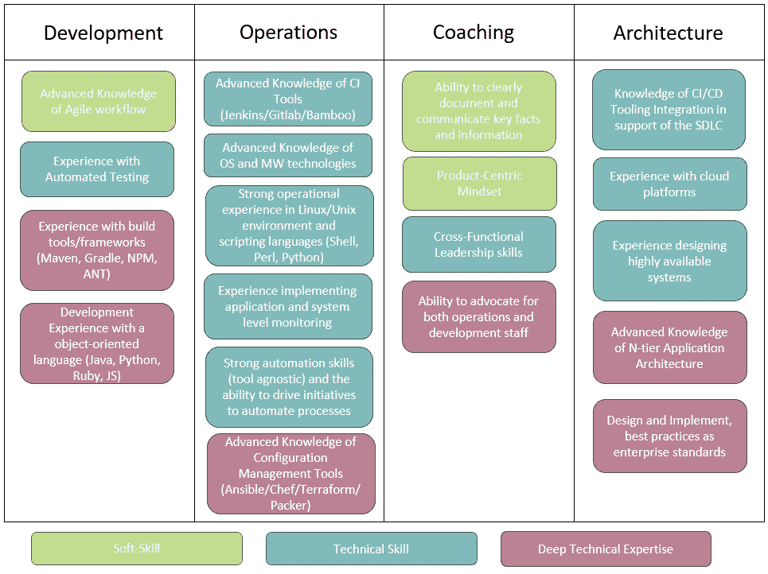
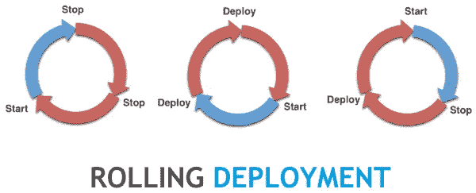
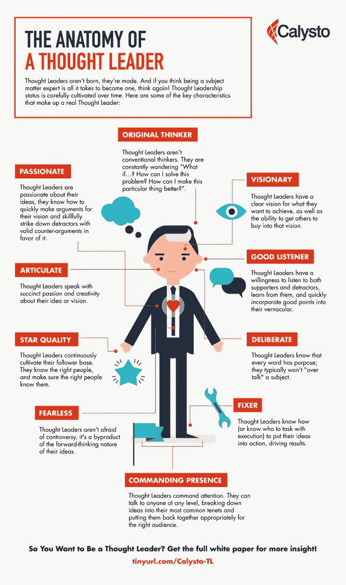

# DevOps 架构师到底是什么？

> 原文：<https://betterprogramming.pub/what-exactly-is-a-devops-architect-a27e5a5c728b>

## 自动化和授权组织之间的区别

克里斯蒂娜@ wocintechchat.com 在 [Unsplash](https://unsplash.com/s/photos/servers?utm_source=unsplash&utm_medium=referral&utm_content=creditCopyText) 上的照片

现在，世界上许多组织的 IT 部门都有一些职称为*开发工程师*的员工。

这为传统的系统管理员和工程师开辟了许多令人兴奋的新的职业道路，使他们能够继续提高技能、发展职业生涯并增加收入。

但是 DevOps 架构师到底是什么，与 DevOps 工程师有什么不同？以下是区分这两者的三个关键因素:

1.  架构师了解整个软件开发生命周期，并且知道如何将它的所有方面集成到跨多种工具、部署环境和技术的 CI/CD 管道中。应用程序代码和基础设施即代码都是如此。
2.  部署模式和站点可靠性工程技能的知识对于一个成功的 DevOps 架构师来说至关重要。每个组织都有不同的环境需要考虑，因此架构师必须能够提出一个有效的自动化部署模式，允许回滚，并且不会因为新的更改而导致停机。
3.  组织的思想领袖和远见者。DevOps 是一段旅程，不是目的地。架构师必须能够引导一个组织通过这种转换性的变化。这意味着在整个组织中建立牢固的关系，获得同事的信任，并授权开发人员、运营、安全和项目管理团队自动化他们的工作。

# **devo PS 架构师技能组合**

DevOps 架构师需要各种各样的技能

DevOps 涵盖了整个软件开发生命周期，从编写第一行代码到退役遗留应用程序。一个成功的 DevOps 架构师能够说应用程序开发人员和运营团队的语言。

## **开发经验**

**DevOps 工程师通常是具有运营背景的人**

对于那些渴望成长为架构师角色的人来说，获得一些开发经验是多么重要，我怎么强调都不为过。我从用 Ruby 开发厨师烹饪书过渡到在 Rails 上构建 Ruby web 应用程序。

**版本和依赖关系管理**

您很快就会了解到，当将基础设施或配置编写为代码时，您需要有一个版本控制系统，否则事情很快就会变得非常脆弱。

你也可以开始引入其他的包/角色/食谱/等等。体验“依赖地狱”这些是开发人员面临并必须解决的常见问题。

**建造和测试代码**

编写自动化测试并在 CI 流程中运行这些测试的需求至关重要。

不管你是在写[的角色](https://docs.ansible.com/ansible/latest/user_guide/playbooks_reuse_roles.html)还是厨师烹饪书或者其他什么。自动化测试是确保自动化部署所需的信心的唯一方法。

让我们也不要忘记在软件项目的早期引入我们的安全专家的需要。我们不想在开发结束时，做好部署准备，却不得不重构代码来修复设计中的主要安全缺陷。

# **部署模式和 SRE 技能**

来源:[https://electric-cloud . com/blog/key-take aways-continuous-discussions-c9d 9-episode-49-advanced-deployment-patterns/](https://electric-cloud.com/blog/key-takeaways-continuous-discussions-c9d9-episode-49-advanced-deployment-patterns/)

当今组织面临的最大挑战之一是如何进行连续部署。有多种不同的方法可供选择，其中包括:

*   核武器和铺路(生产部署的坏主意)
*   金丝雀
*   特征标记
*   增量/滚动部署
*   蓝色/绿色

这些都有利弊。它们都需要不同的视角来编写基础设施代码或应用程序代码。

例如，如果我要为引入新特性做特性标记，我需要编写应用程序代码来支持它。

但是，如果我要通过蓝/绿部署引入新功能，我需要更加关注确保我的基础架构代码是可靠的，并且我的网络/DNS/负载平衡可以在部署之间切换。

DevOps 架构师可以帮助应用团队浏览这些选项，并根据团队的现有技能、技术和 DevOps 成熟度推荐最佳方法。

# **思想领袖和远见者**

来源:[https://Twitter . com/vladobotsvadze/status/1186534907377524736？lang=da](https://twitter.com/vladobotsvadze/status/1186534907377524736?lang=da)

DevOps 不是单一的技术、工具、流程或个人。对于大型组织来说，这是一个艰难而漫长的旅程。它需要一个能够坚持不懈地、有说服力地在组织内促成变革的人。

这在单个团队中从小事做起，通过改进开发过程或简单地利用[吉拉](https://www.atlassian.com/software/jira)来跟踪开发进度。

一个 DevOps 架构师必须观察一个组织，找到能够成为变革推动者的关键人物，打破孤岛，并将他们聚集在一起，以实现一些新的事情。

DevOps 建筑师面临的最大挑战是在没有正式授权的情况下进行领导。这意味着让人们帮助你完成一些事情，即使这可能不是他们传统上做的或者认为他们必须做的事情。

要做到这一点，唯一的方法就是能够成为一名销售人员。你必须让个人相信，做一些新的事情会让他们和公司的生活变得更好。

这意味着从多个角度听取意见，接受解决方案，然后让自己和他人对完成任务负责。

# 结论——你准备好成为一名建筑师了吗？

来源:https://intland.com/codebeamer/devops-it-operations/

DevOps 是这个新时代软件开发的一个大术语。它包含了许多不同的技能，因为它包含了开发的每个方面。

好消息是，从 DevOps 工程师到 DevOps 架构师*你不需要成为所有方面的专家！*

如果你已经为你的团队树立了榜样，开始让其他团队的人参与到你的工作中来。在您的组织内建立一个 DevOps 社区。

让那些擅长你不太熟悉的事情的人多接触一些，比如和一个开发人员坐一天，看看他们在做什么，反之亦然。

DevOps 架构师的角色是一个巨大的责任，但也是非常值得的。在这样一个角色中工作的最大好处是回顾你在一个组织中帮助影响的所有变革。