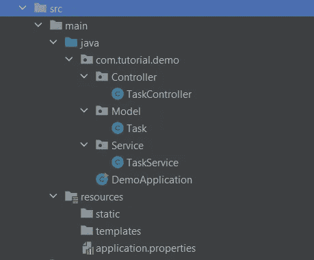
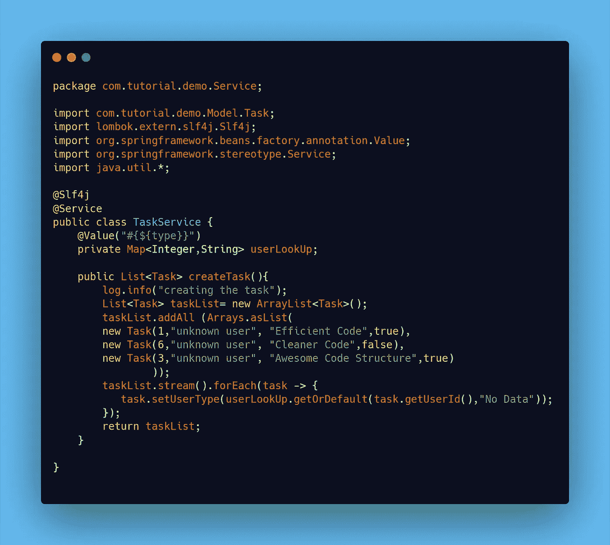
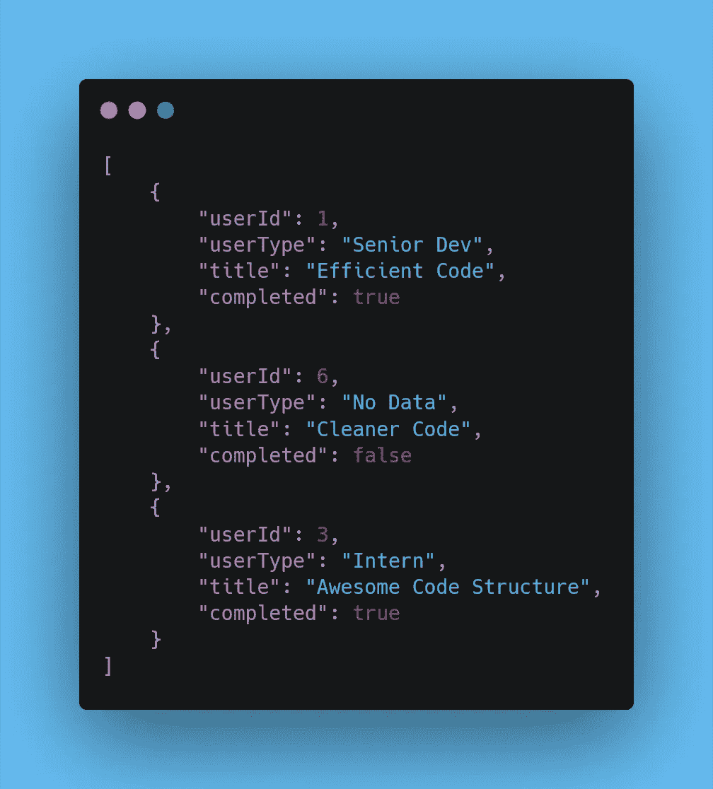
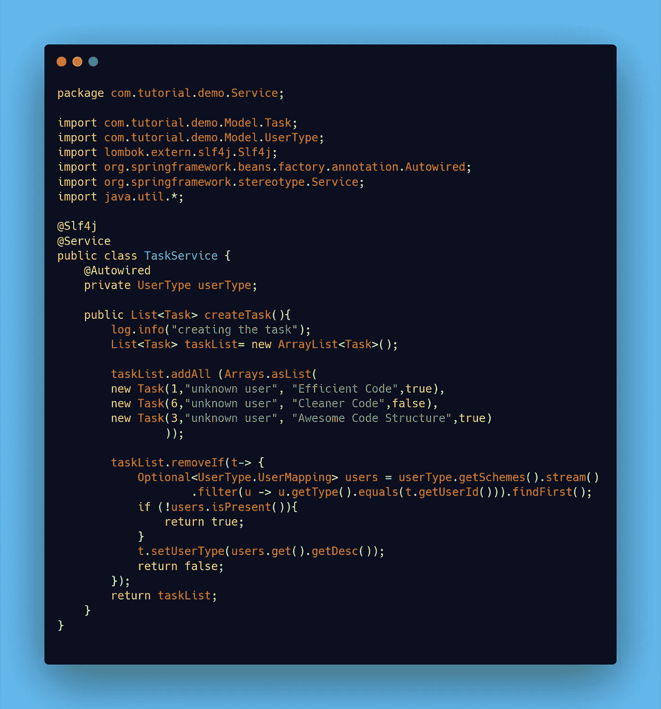

# Spring Boot 的 application.properties 到底是什么？

> 原文：<https://betterprogramming.pub/what-exactly-is-application-properties-in-spring-boot-850d47f0a719>

## **Spring Boot 应用程序属性的几个必须知道的用例**


[丹妮尔·麦金尼斯](https://unsplash.com/@dsmacinnes?utm_source=medium&utm_medium=referral)在 [Unsplash](https://unsplash.com?utm_source=medium&utm_medium=referral) 上拍摄的照片。

它是应用程序自动识别的默认属性文件(资源)。是的，一个应用程序中可以有多个属性文件。默认情况下，该文件位于项目的`main/resources`目录中。

本质上，`application.properties`是一个键值存储资源，广泛用于配置属性和运行时变量。这些是`application.properties`文件最常见的用法。然而，作为键值存储资源，它也可以像 Python 或 JavaScript 中的字典一样工作。

在本文中，我将演示两种类似于使用字典的方式。

# 准备好东西

对于本教程，我将创建一个简单的 REST API 应用程序来返回任务列表。像往常一样，我们用一个类来建模数据，用一个服务来处理业务逻辑，用一个控制器来管理与应用程序的通信。下面的屏幕截图显示了应用程序的初始结构:



作者显示初始项目结构的屏幕截图。

下面的代码片段展示了项目结构截图中显示的三个 Java 类的代码。对于本教程，我们将创建一个任务列表，并在对数据执行一些操作后在 Postman 中输出该列表。一个任务对象由一个`userId`、`userType`和`title`组成，在`Task`类中完成(如下图)。

模型类的代码段。

突出显示使用服务类中的任意值创建的任务列表的代码片段。

API 的控制器类的代码段。

# 辉煌中的应用程序.属性

[Spring Boot](https://spring.io/projects/spring-boot) 的`application.properties`不仅仅可以用于设置服务器端口号和其他常见的配置设置。它的功能也有点类似于 Python、JavaScript 等语言中的字典数据结构。—至少从读操作的角度来看是这样。

将使用两种方法来演示像数据结构一样使用`application.properties`。下面的代码片段显示了类似字典的键值数据结构。从本质上讲，一个更容易阅读，并且使用了大家熟悉的花括号，而另一个在结构上更华丽，使用了索引等。

显示两个类似字典的数据结构的代码片段

# 赏心悦目的方法

```
type = {1: "Senior Dev", 2: "Junior Dev", 3: "Intern"
```

这与其他编程语言中的传统方式非常相似。因此，在花括号中，键值对用于存储数据。变量名(数据结构的名称)——嗯，从技术上来说是关键——是`type`。

那么我们如何导入和使用数据结构呢？嗯，我们使用`@Value`注释并提供数据结构的名称。比如`@Value(“#{${type}}”)`。



上面的屏幕截图演示了一个简单的操作，即访问数据结构并使用它作为查找来检索基于关键字的值，关键字是`userId`。`userLookUp`变量包含与`application.properties`中的`type`键相关的数据。在服务类中，数据从键-值对数据结构中提取并插入到任务对象中。`get()`和`getOrDefault()` 方法用于在提供有效键时提取值。

这个操作的结果可以在下面的截图中看到，其中`userType`的初始值`“unknown user”`被替换为来自`application.properties`中定义的数据结构的值。



显示服务类结果的屏幕截图。

# 复杂的方法

正如我们所知，上面的代码片段不符合典型的类似字典的数据结构。但是，如果你仔细观察，它仍然是一个键值对的信息。这种方法确实需要更多的代码，因为数据必须被建模——本质上是映射到一个类。

观察模式。每个键都以`user`开始，包含一个索引(`schemes`),是按升序排列的，每个键都包含`type`或`desc`在索引之后。现在，我们可以有一个具有`type`和`desc`属性的模型类(POJO)，然后在另一个类中用属性名`schemes`对该类建模(见下面的代码片段)。

最重要的是，我们如何引用或访问键值对数据结构？`@ConfigurationProperties`就像`@Value`注释一样，为我们处理所有这些。它接受一个前缀，该前缀是用于在`application.properties`中定位键值对数据结构的字符串。在这种情况下，前缀只是`user`，即`application.properties`中每个键的第一部分。

下面是用上面提到的类对键值对数据结构建模的结果。现在可以像使用键值对数据结构一样，使用键来访问和检索值。

```
[UserType.UserMapping(type=1, desc=Senior Dev), UserType.UserMapping(type=2, desc=Junior Dev), UserType.UserMapping(type=3, desc=Intern)]
```

下面的服务类包含了一个我们如何有效使用数据的例子。模型类的导入是这个过程的第一步。然后使用`@Autowired`注释很容易实现类的依赖注入。

从访问和检索数据的角度来看，我们将使用 Java 的`Optional`类，因为它允许将值处理为“存在”或“不存在”。这似乎非常有用，因为如果键存在，键值对数据结构会返回值。`Optional`必须有声明的类型，很像数组列表。声明的类型是模型类。在这种情况下，它是内部类，因为我们想要检索`type`和`desc`。因此，声明了`UserType.UserMapping`的一个可选对象。



复杂方法的代码片段。

与前面的示例非常相似，目的是用数据结构中的值替换每个任务的`“unknown user”`。因此，我们必须循环通过`Optional`对象，如果存在一个键，我们必须用相应的值代替`“unknown user”`。

我们如何做到这一点？如上面服务类的截图所示，在遍历键-值对列表时，会检查键是否与`userId`匹配。如果有匹配，那么数据被过滤，我们取第一个匹配。此后，使用 setter 用从键值数据结构中获取的值替换`“unknown user”`。那么，这样的操作之后会有什么结果呢？见下面截图:


在 application.properties 中使用键值数据结构的复杂方法的结果

# 结论

Spring Boot 的`application.properties`不仅仅是配置设置和端口号的键值存储。在跨多个类共享键值对数据结构中的信息时，它可以发挥很大的作用。

如果您发现自己拥有不构成安全威胁或风险的只读静态或可手动配置的数据，并且在许多类中使用，那么`application.properties`键-值对数据结构可能非常有用。