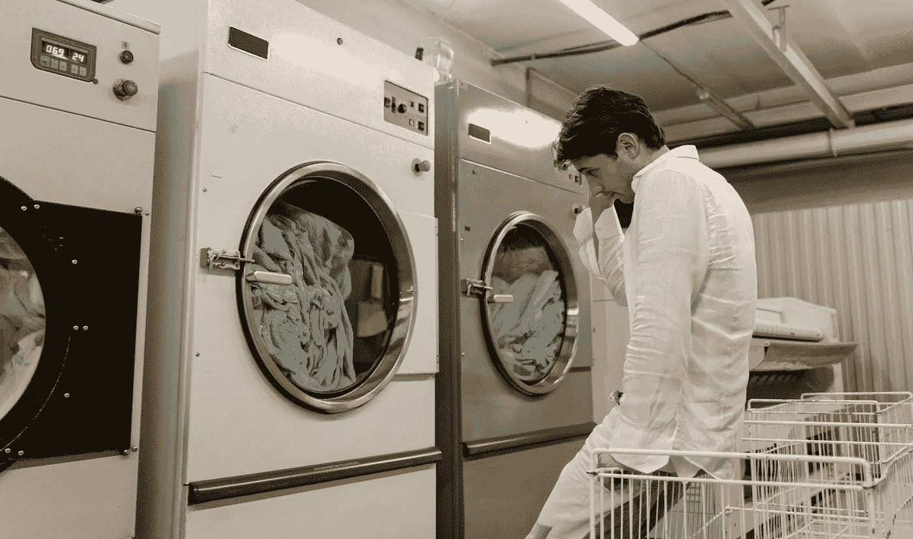
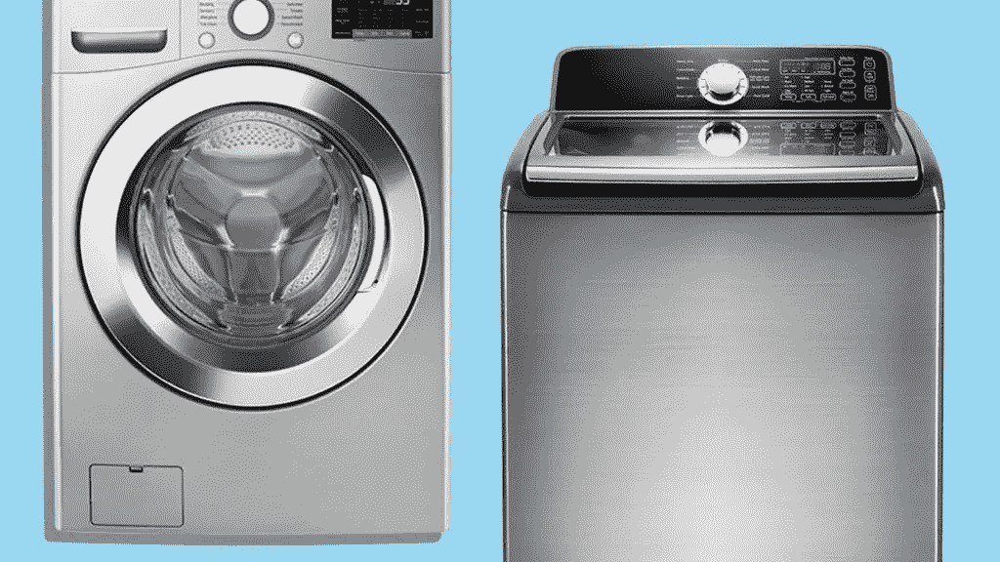

# 到底什么是面向对象编程？

> 原文：<https://betterprogramming.pub/what-exactly-is-object-oriented-programming-b5758d7e8ff5>

## 关于 OOP 你需要知道的 4 个构建模块和 4 个原则

照片由[JESHOOTS.com](https://www.pexels.com/@jeshoots-com-147458)在[像素](https://www.pexels.com/photo/floor-plan-on-table-834892/)上拍摄

面向对象编程(OOP)，这是每个开发人员经常使用的概念。

然而，当被要求用语言表达时，许多人觉得很难，如果不是模糊不清的话。

软件开发的初学者经常发现这个概念很抽象，很难理解。

因此，在这篇博文中，我将撕开行话，用最简单的形式解释 OOP。

# 概观

简单地说，OOP 可以简化为 4 个构建模块和 4 个原则。

## **4 个积木**

*   班级
*   目标
*   属性
*   方法

## **4 原则**

*   遗产
*   包装
*   抽象
*   多态性

详细理解它们中的每一个，你就会掌握 OOP 的精髓。

来说说积木吧！

# 班级

照片由[马体·米罗什尼琴科](https://www.pexels.com/@tima-miroshnichenko)在[像素](https://www.pexels.com/photo/man-in-white-robe-standing-beside-front-load-washing-machine-8774506/)上拍摄

想象一下，拥有一家洗衣服务店，并实现一个 Python 程序来管理两台洗衣机。

如果没有 OOP，你将如何存储你的机器的信息？

在 Python 中，为了便于检索，您可能会将所有内容存储在一个字典中。

这个设计非常好，除了

*   别人怎么知道一台机器的强制数据？
*   如果其他开发者用`Brand`而不是`brand`怎么办？
*   如果您决定为所有机器添加一个新的默认变量，该怎么办？例如，`spin_minutes=30`。你要把它复制粘贴到每台机器上吗？

简而言之，你如何标准化一台机器的构造？

你一定在嘀咕——我们用蓝图来代替怎么样？

*   精确说明机器所需数据的蓝图
*   存储默认变量并将其传递给每台机器的蓝图

这才是真正的课！

在上面的例子中，`WashingMachine`类表明

*   它包含`brand`、`price`和`max_weight`
*   它包含一个默认属性— `spin_minutes`，该属性的值为 30

使用这个类，我们创建了两台机器。

> *一个类是一个* ***蓝图*** *它定义了一个对象中所需要的信息集。*

# 目标

照片由 [cottonbro](https://www.pexels.com/@cottonbro) 在[像素](https://www.pexels.com/photo/industry-technology-architecture-factory-5532660/)上拍摄

有了蓝图在手，你现在可以想生产多少台洗衣机就生产多少台！

每个机器实例都是对象。

类是蓝图，而对象是使用蓝图生成的实例。

在上面的例子中，`machine1`和`machine2`是使用蓝图`WashingMachine`生成的**对象**

对于鹰眼的读者来说，你可能一直在思考这些看起来神秘的术语

*   `self`
*   `def __init__`

当我们调用`WashingMachine`类时，它创建了一个新的对象，`self`指的是对象本身。

`machine1`中的`self`是指`machine1`，同样适用于`machine2`。换句话说，`machine1`中的`self.brand`等同于`machine1.brand`。

`__init__`功能是一个初始化功能。当我们调用`WashingMachine`类时，它自动调用函数`__init__`并将所有参数传递给这个函数。

例如，当`WashingMachine`被分配给`machine1`时，它将`“Toshiba”, 2, 4`传递给`__init__`函数并分配:

*   `machine1.brand = Toshiba`
*   `machine1.price = 2`
*   `machine1.max_weight = 4`
*   `machine1.spin_minutes = 30`(默认值)

对象是一个类的实例。

# 属性

属性是包含在类中的数据。

`WashingMachine`类具有以下属性:

*   `brand`、`price`、`max_weight`、`spin_minutes`

就是这样！

> *属性是存储在类或对象中的数据。*

# 方法

方法是与类相关联的函数。

在一个没有 OOP 的世界里，你如何创建一个打开机器的函数？

这种设计没有错，但是对于新开发人员来说，

*   他们怎么知道`turn_on`是什么意思？
*   他们如何准确知道`machine`是什么？
*   他们怎么知道`brand`是否在一只`machine`里面？

如果代码库继续扩展，事情可能会失控。

这就是方法来拯救的地方。它们为这些功能提供了上下文。

在上例中，`turn_on`是在`WashingMachine`类中定义的。

一个类的功能就是方法。

只有类的对象可以调用它的方法。方法可以通过`self`使用或者改变对象的属性。不用第二次猜测，开发人员就能判断出`turn_on`是`WashingMachine`的行为

> 方法定义了一个类的行为。

总而言之，OOP 有四个组成部分:

*   **类—** 定义对象中属性和方法的蓝图。
*   **对象—** 一个类的实例。
*   **属性—** 一个类的数据。
*   **方法—** 类的函数。

继续，让我们深入 OOP 的基础——4 原则。

# 遗产

玛丽安娜·朗米尔关于[选择](https://www.choice.com.au/home-and-living/laundry-and-cleaning/washing-machines/articles/best-washing-machine-for-saving-water)的照片

就在你准备实现你的`WashingMachine`类时，你意识到你买的两台洗衣机是不同类型的。

一个是前装，一个是顶装。

虽然对每个人来说看起来都差不多，但作为洗衣机专家的你清楚地知道，它们的内部工作机制是不同的。

因为它们开门或阀门的方法可能不一致，所以您决定实现两个类。

你将如何着手实施它们？

太棒了。你现在有两个不同的班级。但是正如你所看到的，这段代码很糟糕！

您在两个课程中都重复了两次`brand`和`max_weight`。作为开发人员和完美主义者，你不希望这种情况发生。

这就是继承发挥作用的地方。

继承允许您创建从父类派生的子类。

子类重用父类的所有属性和方法，并实现其独特的部分。这使得代码更加可重用。

由于`TopLoadingMachine`是一个`WashingMachine`，你可以在一个`WashingMachine`类中定义通用的属性，并从中继承各种机器类型。

在上面的例子中，`TopLoadingMachine`继承了它的父类——`WashingMachine`。它包含公共属性(`brand`和`max_weight`)和`common_method`。

我不会详细讨论语法，但希望这能给你一个什么是继承的要点。

> *继承允许创建从父类派生的子类。子类包含其父类的所有方法和属性，同时保留添加/覆盖其唯一属性和方法的权利。*

# 包装

照片由 [Trung Nguyen](https://www.pexels.com/@ku3weddinghouse) 在 [Pexels](https://www.pexels.com/photo/anonymous-loving-couple-hugging-near-blooming-shrub-6167486/) 拍摄

当对象保持其属性/方法私有时，就实现了封装。

当属性或方法保持私有时，

*   对象之外的函数或变量将不能访问它
*   它们只能在对象中访问。

在 Python 中，当前缀为`__`时，属性和方法是私有的。

在上面的例子中，`__valve`是私有的，只能在对象内部使用。

直接在对象外部访问`machine1.__valve`会导致错误。因此，你打开`__valve`的唯一方法是通过`start_washing`。

这完全合理，因为

*   您不希望对象之外的任何人意外改变阀门的状态。
*   用户只能在`start_washing`时打开阀门。

> 封装是保持属性或方法私有的行为。

# 抽象

照片由 [Engin Akyurt](https://www.pexels.com/@enginakyurt) 在[像素](https://www.pexels.com/photo/light-art-water-dirty-6492065/)上拍摄

洗衣机在清洗衣物时会做很多事情。举个例子，

*   锁上门
*   打开阀门
*   测量水温

作为用户，这些你都不需要知道！你唯一关心的事情就是把衣服洗好。

抽象隐藏了所有复杂的实现，只向用户公开高级接口。

在上面的例子中，我们在父类中定义了一个抽象方法`start_washing`，而没有定义实现。

抽象方法是一个契约。它保证类的子类必须携带相同的方法签名，在本例中是`start_washing`。

常见的用法是定义一个基类(父类)来维护抽象方法——契约。使用这个基类，我们可以推断它的子类将总是伴随着这些方法而来。

单看`WashingMachine`，就可以确信`TopLoadingMachine`必定包含`start_washing`。因此，我们可以在不知道底层逻辑的情况下调用该方法。这就是抽象！

> *抽象隐藏了复杂的实现，只向用户公开高层接口。*

# 多态性

照片由[卡勒姆·威尔](https://unsplash.com/@callumlwale)在 [Unsplash](https://unsplash.com/photos/3pH7TxHU6gw) 上拍摄

多态性源自希腊语，意思是**有多种形式**。在面向对象的领域中，它可以概括为两个主要的概念

*   方法覆盖
*   方法重载

方法重写仅仅意味着子类实现了与其父类相同的方法，但是实现方式不同。

从上面的例子来看，当`WashingMachine` — `TopLoadingMachine`和`FrontLoadingMachine`的子代实现了与它们的父代相同的方法`inject_water`，但是实现方式不同时，就会发生方法覆盖。他们可以重写其父方法。

> 方法重写是指子类用其实现重写/替换其父类的方法。

另一方面，方法重载意味着一个类可以多次定义同一个方法，每次都有不同的参数和不同的行为。

然而，方法重载主要在 Java 中使用，在 Python 中不可用。因此，我现在将跳过细节。

> 多态允许方法有不同的形式。这是通过方法重写和方法重载实现的。

# 结论

Andrea Piacquadio 在[像素](https://www.pexels.com/photo/crop-businessman-giving-contract-to-woman-to-sign-3760067/)上拍摄的照片

这就是你需要知道的关于面向对象编程的全部内容！

这是一个几乎每个工程师在日常工作中都会用到的重要概念。

下次有人在面试中直截了当地问你

告诉我，什么是面向对象编程？

我希望你能静观其变，清清喉咙，自信地表达

> *嗯，从这 4 个组成部分和 4 个原则开始…*

下次见！再见。