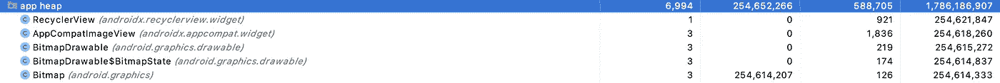
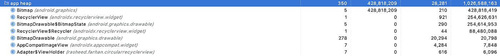
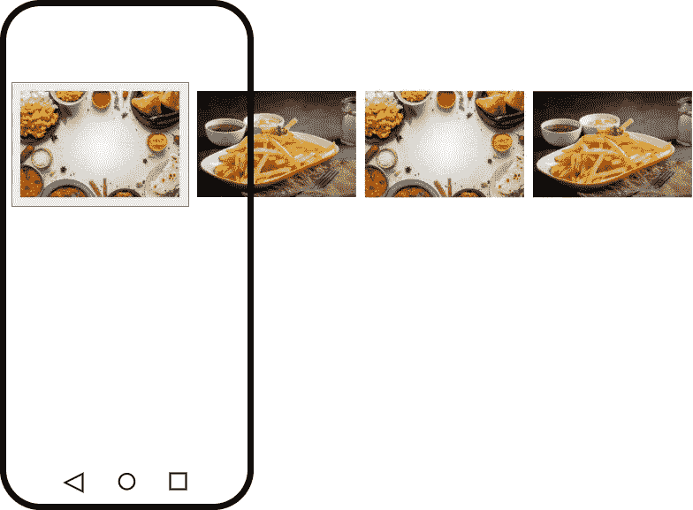
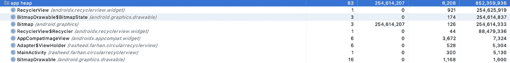

# 恶有恶报

> 原文：<https://betterprogramming.pub/what-goes-around-comes-around-1aae51da0f29>

## 在 Android 应用程序中创建循环回收视图


Reuben Mcfeeters 在 [Unsplash](https://unsplash.com/s/photos/circle?utm_source=unsplash&utm_medium=referral&utm_content=creditCopyText) 上拍摄的照片。

圆形`RecyclerView`是当滚动时到达列表的末尾时，第一个项目跟随最后一个项目的视图。这为用户在导航包含大量项目的组件时提供了一种连续性的感觉。


运行中的循环视图。

许多应用都在最显眼的页面上实现了这种行为:


我尝试使用两种策略来实现这一点:

*   无限项目
*   自定义滚动监听器

这些方法各有利弊。希望能帮助你解决这个问题，做出明智的决定，选择最适合自己情况的实现。

# 建立基线

我将首先实现一个包含三个项目的普通`RecyclerView`。每个项目都使用图像视图显示。这将有助于我们比较循环实现相对于基线的效率:


显示图像的简单水平循环视图

滚动几次并让它稳定下来后的内存分配如下:



普通 RecyclerView 实现的内存分配

这与预期相符:三个`ImageViews`和三个`Bitmaps`基本上概括了正常的实现。

# 实施 1-无限项目

`RecyclerView`被骗以为有非常多的项目要显示，但是当渲染发生时，使用了位置的模和项目的实际数量。


无限项来创建循环回收视图

这是一个非常简单的实现，从`RecycleViewAdapter`的`getItemCount()` 方法返回`Int.MAX_VALUE` :

实现无限项适配器



无限项实现的内存分配

与基线相比，除了`BitmapDrawable`之外，大部分分配似乎都翻了一番。在这种情况下，在几个卷轴之后，它已经跳到了 278 个分配。在记忆是奢侈品的情况下，这可能是一个令人担忧的原因。

这种实现的优点是非常简单。

注意:如果你希望`RecyclerView`能够从开始向两个方向滚动，那么应该设置 RecyclerView 的初始位置。这将在第一个项目前后放置相同数量的项目。

```
recycler.scrollToPosition((Int.MAX_VALUE/2)-(Int.MAX_VALUE/2)%noOfItems)
```

# 实现 2 —自定义滚动监听器

`RecyclerView`被骗以为要显示的项目数量是原来的两倍，并附加了一个定制的滚动监听器，每当到达末尾时，这个监听器就会悄悄地修改`RecyclerView`的当前滚动位置:



创建循环 RecyclerView 的专用滚动侦听器

在这个实现中，从适配器的`getItemCount()` 返回双倍数量的项目:

自定义滚动侦听器循环回收视图的适配器

除此之外，我们还需要给`RecyclerView`添加一个自定义`OnScrollListener` 。在这个滚动监听器中，每当我们意识到我们在`RecyclerView`的末尾时，我们就悄悄地将它滚动到第一个位置。使用`recyclerView.addOnScrollListener(CircularScrollListener())`将滚动监听器连接到`RecyclerView`:

RecyclerView 的自定义滚动侦听器



自定义滚动实现的内存分配

除了`ImageViews`之外，`Bitmaps`的所有其他分配都相当于非循环实现——这是以复杂性为代价获得的优势。

然而，这种实现有一些注意事项，但是它们的处理非常简单:

*   根据`RecyclerView`中的项目数量和每个项目的大小，您可能需要欺骗`RecyclerView`以为项目数量可能是实际数量的三到四倍。这是一种反复试验的方法，可以找到最适合您需要的计数。
*   对于有大量项目的`RecyclerView`,如果快速滚动，可能不会收到最后一个位置项目的回调，因此需要额外的处理，以便在滚动过度的情况下安静地向后滚动。
*   在滚动监听器中需要额外的处理来实现向后滚动。

处理所有这些情况的高级滚动侦听器如下所示:

处理警告的滚动侦听器的高级实现

# 结论

我已经尝试解释了我们所做的详细分析，以选择实施循环`RecyclerView`的最佳和最有效的方法，这样您就可以做出更明智的决定。请在评论中告诉我是否有其他方法可以实现这一点。