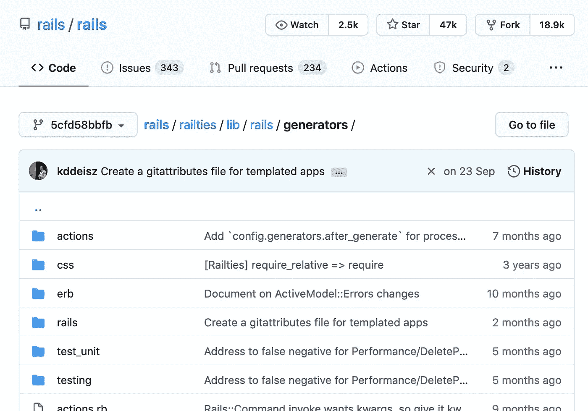
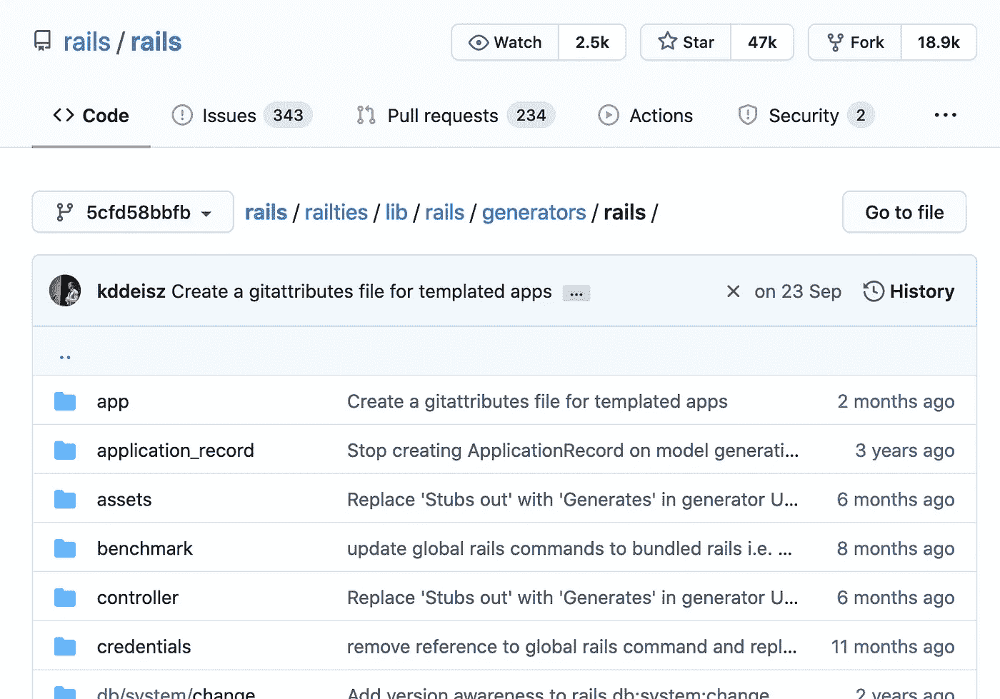
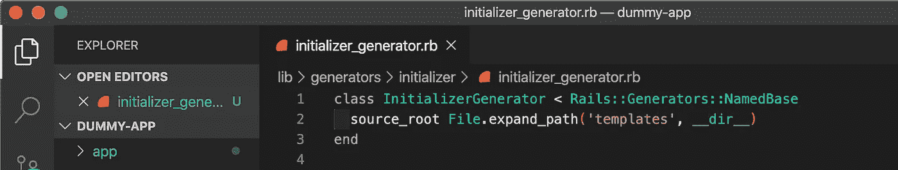
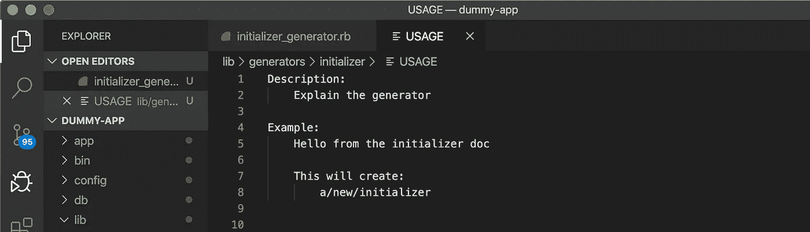

# 关于 Rails 生成命令，我所不知道的是

> 原文：<https://betterprogramming.pub/what-i-didnt-know-about-the-rails-generate-command-52935ef9a3ad>

## 理解“rails 生成”背后的一些魔力


📷杰里米·毕晓普

在学习 Ruby 和 Rails 的过程中，我一直觉得有很多小概念我并没有真正理解。我习惯于写东西来学习它们，所以这里有一系列关于我不知道的东西的短文。

# 发电机

著名的`rails generate`命令是 rails 生成器的一部分。

Rails 默认包含了很多生成器，其中最著名的是`rails new`，它允许我们创建新的 rails 应用程序。

你可以通过进入一个 rails 应用程序并输入`rails generate`来访问所有默认生成器的列表。您会看到下面的 23 个发生器分为 3 类:

```
Rails:
  application_record
  assets
  channel
  controller
  generator
  helper
  integration_test
  jbuilder
  job
  mailbox
  mailer
  migration
  model
  resource
  scaffold
  scaffold_controller
  system_test
  taskActiveRecord:
  active_record:application_recordTestUnit:
  test_unit:channel
  test_unit:generator
  test_unit:mailbox
  test_unit:plugin
```

要获得关于生成器功能的更多信息，只需输入`rails generate my_generator_name --help`。

# 它是如何工作的？

在 rails 存储库中，您可以在`[rails/generators](https://github.com/rails/rails/tree/5cfd58bbfb8425ab1931c618d98b649bab059ce6/railties/lib/rails/generators)`文件夹下找到负责 Rails 生成器的代码:



rails [库](https://github.com/rails/rails)的截图

你还记得上面几段中的生成器列表吗？有一个由 18 个生成器组成的 Rails 组，如果你打开屏幕截图上的`rails`文件，你可以检查这些生成器的代码(模型、控制器、脚手架等)。).



rails [库](https://github.com/rails/rails)的截图

我们不会解释每个发电机是如何工作的，它们都是不同的，但我们可以注意到一些事情:

*   正如 [rails 文档](https://guides.rubyonrails.org/generators.html)所说，当一个生成器被调用时，生成器中的每个公共方法按照它被定义的顺序依次执行。
*   发电机是用[或](https://github.com/erikhuda/thor)建造的。如果你看一下`[base.rb](https://github.com/rails/rails/blob/master/railties/lib/rails/generators/base.rb)`类，你会看到这个类继承自 Thor。rails [文档](https://guides.rubyonrails.org/generators.html)注意到 Thor 提供了强大的解析选项和操作文件的 API。
*   我们可以创建自己的定制生成器——我们将在下一部分看到如何实现。
*   您可以通过进入`config/application.rb`并在`config.generators`块中添加选项来禁用任何生成器的默认行为。例如:

```
# This will disable the generation of the stylesheets files
config.generators do |g|
  g.scaffold_stylesheet false
end
```

*   如您所知，`rails g scaffold`命令使用了 scaffold generator，但是这里需要注意的一点是，scaffold generator 只使用其他生成器来工作和创建您需要的文件。

# 您可以创建自定发生器

如果默认的 rails 生成器对您来说还不够，您可以创建自己的生成器。例如，创建新的服务`rails g service`或者创建新的初始化器`rails g initializer`等等。

## 轨道发电发电机

还记得我们在文章开头看到的这个生成器列表吗？查看 Rails 组内部，您会看到`generator`。

是的，Rails 有一个默认的生成器，允许您创建自己的生成器！

## 生成初始化式生成器？

```
rails generate generator initializer
  create  lib/generators/initializer
  create  lib/generators/initializer/initializer_generator.rb
  create  lib/generators/initializer/USAGE
  create  lib/generators/initializer/templates
  invoke  test_unit
  create    test/lib/generators/initializer_generator_test.rb
```

*   创建`lib/generators/initializer`文件夹。
*   创建继承自`Rails::Generators::NamedBase`的`initializer_generator.rb`文件。正如 Rails [文档](https://guides.rubyonrails.org/generators.html)所说，这意味着我们的生成器至少需要一个参数，这个参数将是初始化器的名称，并且可以在我们的代码变量`name`中找到。



`source_root`方法指向我们的生成器模板将被放置的位置。

创建一个`USAGE`文件，它实际上是您的定制生成器文档:



我已经为这个例子编辑了这个文件。当我在终端中输入`rails generate initializer --help`时，我现在看到以下内容:

```
Usage:
  rails generate initializer NAME [options]Options:
  [--skip-namespace], [--no-skip-namespace]  # Skip namespace (affects only isolated applications)Runtime options:
  -f, [--force]                    # Overwrite files that already exist
  -p, [--pretend], [--no-pretend]  # Run but do not make any changes
  -q, [--quiet], [--no-quiet]      # Suppress status output
  -s, [--skip], [--no-skip]        # Skip files that already existDescription:
    Explain the generatorExample:
    Hello from the initializer docThis will create:
        a/new/initializer
```

创建`lib/generators/initializer/templates`文件夹。这个文件夹将包含你的自定义初始化生成器的基本模板。

最后，为我们的测试生成`initializer_generator_test.rb`文件。

# 最后一句话

如果你想知道更多关于如何创建你的定制生成器，你可以浏览一下[本教程](https://arsfutura.com/magazine/diy-create-your-own-rails-generator/)和官方 Rails [文档](https://guides.rubyonrails.org/generators.html)。

我希望你学到了一些东西。请随时向我发送您的反馈，我很乐意提高这篇文章的质量！