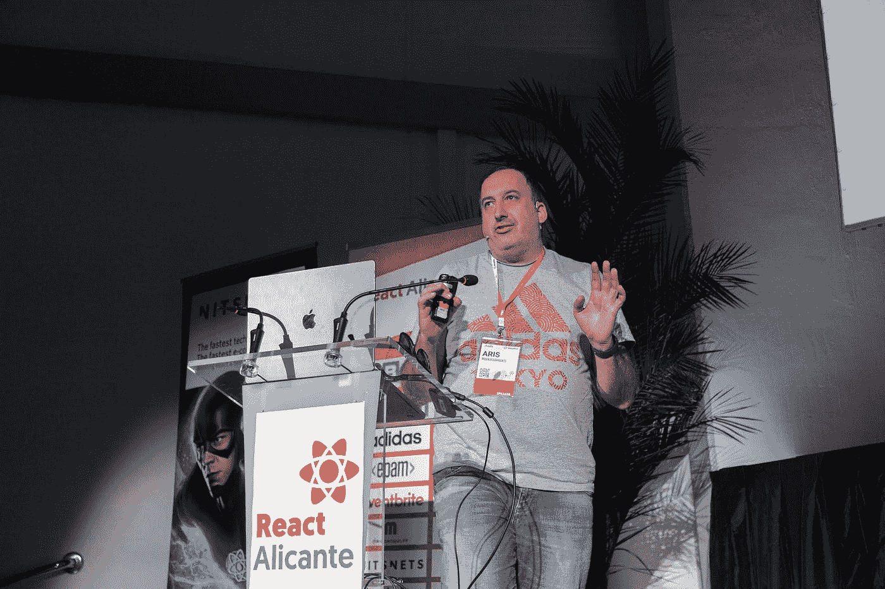

# 关于微前端，我在 React Alicante 上没有说的是

> 原文：<https://betterprogramming.pub/what-i-didnt-say-at-react-alicante-about-micro-frontends-623bd5d332f5>

## 对我所知道的关于 Prisma 的一切的深入探究

React Alicante 的作者图像

大多数人认识我是因为我组织了 [CityJS 会议](http://cityjsconf.org)或者是因为我是一名开发者或者是伦敦城市大学的讲师。一段时间以来，我一直对 Prisma 和它能为前端开发人员提供的东西充满热情。

我从一些伟大的人那里听说过很多关于微前端的事情，比如 Luca Mezzalira、Alex Lobera、Ruben Casas 以及其他许多人。([一些很棒的视频在 CityJS Youtube 频道](https://www.youtube.com/channel/UCSL9UjbOlc2BZ4lBg3EYrfA))

在去年夏天的假期和会议间隙，我一直在读卢卡的书《构建微前端》，在网上做了很多研究，并与我认识的从事这方面工作的人交谈。

很长一段时间以来，我一直认为前端和后端之间的这种分离并没有真正发挥作用。微前端试图做的是减少团队之间的依赖。依赖关系可以存在于不同的部分和级别。我在演示中提到的例子是关于 web 部件或组件，如果您采用水平拆分，它们存在于同一页面上；如果您采用垂直拆分解决方案，它们存在于不同的路径上。

仍然有很多依赖，比如前端和后端之间的依赖，以及我们如何使用数据。我讨厌每次我不得不建立一个项目，并要求一个 API，需要很多时间来建立。如果我们作为前端开发人员获得了这些工具，我们应该使用它们并成为全栈开发人员。

GraphQL、Prisma ORM 或 pure NodeJS 等工具可以帮助我们做到这一点。问题是这些技术是否能在服务器上工作，以及我们是否需要一个也能运行服务器端功能的框架。

有了模块联合 SSR，我可以通过一些小技巧来实现。

我将在下面列出一些细节:

# Prisma 客户端

我在演讲中使用了 Prisma，因为我相信它非常容易使用，并为前端开发人员提供了后端可以做的一切。

要获得 Prisma，只需要使用`npm i prisma`安装 Prisma 即可。

一旦你这样做了，你可以在你的本地环境中初始化 Prisma，然后通过运行`npx prisma init`来完成。

这将创建一个带有 Prisma 模式文件的 Prisma 文件夹。这是一个漂亮的文件。一旦你定义了数据库结构，Prisma 可以为你做所有的事情。它将根据您的指示创建数据库、关系、键和所有其他后端服务。

在我的[演讲](https://lnug.org/talks/how-to-develop-an-emergency-website-using-prisma2-orm-nodejs-nextjs-and-deploy-it-in-heroku-and-zeit-uyAtKbDuyR0)中，我没有过多谈论 Prisma 可以做的过滤和 CRUD 功能。大约两年前，当我发现 Prisma 的新版本(版本 2)时，我就这样做了。这里可以看这个[。](https://lnug.org/talks/how-to-develop-an-emergency-website-using-prisma2-orm-nodejs-nextjs-and-deploy-it-in-heroku-and-zeit-uyAtKbDuyR0)

一旦创建了模式，就可以运行`npx prisma generate`。这将生成 Prisma 客户端。您可以在 Prisma 模式中指定创建客户端的位置。我认为这有助于开发人员使用 mono-repos。我不得不使用它，因为我想在演示中实现它。我将在关于模块联合的下一节中解释原因。

# 模块联盟

对我来说，模块联合感觉就像把一个组件从一个应用程序传送到另一个应用程序。

我需要非常感谢 Zach Jackson，因为他花了很多时间解释所有的核心概念，以及 webpack 如何以及为什么仍然是最强大的捆绑器。

我在演示中使用的解决方案是利用 NextJS。在每个项目中，都有一个 nextjs 配置文件。

本例中的 nextJS 配置定义了运行在不同端口上的三个微前端。例如，这个公开了来自`itemcatalogue`的一个组件和另一个名为`exposedTitle.js`的组件。

我选择在指定的文件夹中输出生成的客户机，因为我需要对容器做同样的事情。

`ItemCatalogue`组件从我们在前面文件的模式中定义的文件夹中导入生成的 Prisma 客户端。`getStaticProps`可以运行运行 Prisma 客户机的服务器端代码，并从数据库中检索商店。

在 home 应用程序，也就是容器应用程序，我们可以导入暴露的`itemcatalogue`组件和`getStaticProps`方法。

然而，有一个问题是 Prisma 客户机是在实际的微前端上生成的，而不是在容器上。因此，要做到这一点，我们需要在容器应用程序中生成客户端(在本例中，是家庭容器应用程序)。

关于模块联合很酷的一点是，如果你想为所有的 mfe 共享一个 Prisma 客户端，那么你需要做的是在配置文件中启用共享属性。在这种情况下，我们将 react 作为一个库共享，它可以作为一个单体运行。

如果我们这样做，我们就有了一个 Prisma 客户机和一个跨所有 mfe 共享的模式。

此解决方案的回购如下:

 [## GitHub—aris Marko/React-Alicante-mfe:React Alicante 演示

### Next.js 中的模块联合依赖于@module-federation/nextjs-ssr，除非您可以访问它，否则它不会工作…

github.com](https://github.com/arismarko/react-alicante-mfe) 

# 莱恩斯

我尝试的第一个解决方案是 LeanJS。它比模块联合更容易，因为设置更容易，但是它只运行基于客户端的微前端。这是一个很棒的框架，你可以把它转换成微前端。你也可以从一个整体开始，用一个标志，以后你可以转换成微前端。

更多信息:[https://leanjs.com/getting-started](https://leanjs.com/getting-started)

以我为例的回购是这样的:【https://github.com/arismarko/reactalicante 

点击此处观看完整演讲: