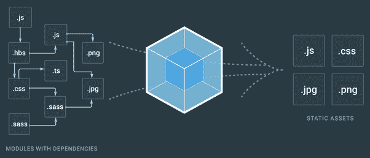

# 我喜欢(和不喜欢)Deno 的什么

> 原文：<https://betterprogramming.pub/what-i-love-about-deno-af35d1f46d>

## 好的，不太好的，和未决定的


德诺吉祥物太可爱了。[来源](https://byteofdev.com/posts/deno/)

2018 年，JavaScript 的 Node runtime environment 创始人 Ryan Dahl 在 JSConf 上发表了一篇演讲— [关于 Node.js 我后悔的 10 件事](https://www.youtube.com/watch?v=M3BM9TB-8yA)。你很少听到一个技术转向范式的创始人对他自己发明的一些主要特征感到后悔。如果你没看过这个演讲，我强烈推荐。他强调了 Node 中存在的缺陷，其中一些是我们作为开发人员考虑的特性。

在演讲中，他还介绍了 Deno，这是一个新的运行时环境，使用 V8，但内置于 Rust 中。当时，他称之为他的副业，因为 Ryan Dahl 的爱好是修补全新的运行时环境。尽管如此，Deno 的引入几乎立即引发了一千篇科技文章，提出这样的问题:Deno 会取代 Node 吗？

简短的回答是……也许吧。

# 我喜欢的 Deno 的五个特点

我花了很长时间在 Deno 生态系统中，同时与一个小型工程师团队开发了一个开源工具。我们为社区做贡献，部分是因为我们发现它令人兴奋。我们的工具帮助开发人员识别生产级应用程序中的内存泄漏。这些是 Node 在这一点上已经拥有多年的工具。在第一个版本结束时，这些是 Deno 提供给我的突出特性。

## 没有 package.json 和 node_modules

告别 npm，`package.json`，和笨重的 node_modules 文件夹。如果你是一名 Node 开发者，你可能会想——但是这些东西不就是 Node 的*特性*吗？不，实际上 npm 和`package.json`是与 Node 分开创建的，以轻松处理共享应用程序依赖关系。现实中，`node_modules`引发了很多问题。

例如，如果您用全栈 JavaScript 或 TypeScript 编写，比如用 React 和 Node，您可能会在计算机的文件系统中安装`node_modules`文件夹，其中许多包含完全相同的模块。


node_modules 现在可能已经安装在你的计算机上了。[来源](https://imgflip.com/tag/node_modules)

Deno 采取了不同的方法。它旨在模仿网络。它通过*将*指向模块在网络上的地址来导入模块。下面是一个在 Deno 中导入 Oak 框架(一个用于构建像 Express.js 这样的 RESTful APIs 的工具)的例子。

```
import { Application, Router } from "https://deno.land/x/oak@v11.1.0/mod.ts";
```

现在，您不需要 package.json 文件，也不需要在项目的存储库中 npm 安装一个`node_modules`文件夹。相反，您可以将模块直接从 web 导入到您的项目中，就像这样的分散代码片段。

您可能会问自己——如果包含这些模块的站点宕机了怎么办？不用担心，Deno 会在您第一次运行代码时在您的计算机中缓存这些模块。或者，在运行之前，您可以直接在您的终端中`deno install`这些模块。好处是这些文件只在 ce 上*缓存。这消除了所有讨厌的 node_modules 膨胀。*

## 现成的打字稿

就个人而言，作为一名从 Java 和 C++起步的开发人员，我是 TypeScript 的忠实粉丝。瑞安·达尔也是。TypeScript 帮助您对文件进行类型检查，并消除讨厌的错误，这些错误通常来自编写得很差的代码。在你运行任何东西之前，它会这样做。这是你的检查，以确保你创造的产品在进入生产时有最少的可避免的问题。


TypeScript—JavaScript 负责任的大哥。[来源](https://mobile.twitter.com/typescript)

Deno 提供了开箱即用的类型脚本集成。另一方面，Node 要求您导入另一个包来处理 TypeScript 集成。它还迫使您为该类型脚本配置 transpiler 工具。你不需要在德诺搞乱这个。这意味着在 Deno 中构建 TypeScript 项目比在 Node 中更快。

如果你绝对厌恶 TypeScript(我*正在*评判你)，那么你也可以用 Deno 编写纯 JavaScript。Deno 也可以处理 JavaScript，因为 TypeScript 只是这种语言的超集(但是说真的，改变你的想法)。

## 标准图书馆

甚至不要让我从 Deno 提供的标准库开始。在创建这个项目时，拥有一个标准库对我们的团队来说是一个巨大的好处。作为主要的节点开发人员，我们最初使用第三方 WebSocket 库与 GUI 前端进行通信，该 GUI 前端从开发人员的应用程序绘制内存统计数据。


我就是看不够这个吉祥物。[来源](https://deno.land/std@0.110.0/node/net.ts)

就像节点开发人员经常发现的那样，开源模块有很多错误，文档很少。在对这个坏工具大惊小怪之后，我们转向了 Deno 的标准 WebSocket 库，我们的问题立即得到了解决。

Node 的目标是成为一个极简主义的环境，它在这一点上做得非常成功。它有一个极其简单的标准库。开发人员每天使用的许多框架都是开源的，没有更新或维护。或者，对于他们中的一些人来说，这些更新花费了难以置信的长时间(看看你，Express v5.0)。维护一个小的标准工具集对于开发人员来说是非常重要的，他们需要模块能够工作，文档记录良好，并根据需要进行更新。

## 没有构建工具

如果你正在使用 Node，有 99%的可能你也在使用或者曾经使用过 Webpack。我只想说:Webpack 很棒…直到它不再棒。现在，这仅仅是从开发的角度来看——web pack 在幕后做了很多重要的事情，比如创建文件的依赖图，传输你的 JSX/TSX，以及缩小和丑化你的代码。



网络包——如此重要，如此痛苦。[来源](https://www.quora.com/What-is-the-difference-between-gulp-and-webpack)

与此同时，我在试图解决一个 Webpack 错误时撞了头(结果是我需要调换我的两个加载程序的顺序)，这不是唯一一次。Webpack 一直是新手和有经验的开发人员感到沮丧的原因。只是[看](https://devrant.com/rants/2287721/i-fucking-hate-webpack-and-frontend-development-so-fucking-much-why-do-i-have-to) [看](https://www.reddit.com/r/webdev/comments/6i2yow/i_passionately_hate_webpack/) [有些](https://steveolensky.medium.com/why-i-hate-webpack-babel-and-the-like-and-why-you-should-create-vue-apps-in-plain-javascript-cbb0e3c7a9e2) [的](https://www.reddit.com/r/learnjavascript/comments/5ag5q5/i_hate_webpack/) [这些](https://devrant.com/rants/1825787/you-know-what-fuck-webpack-and-babel-too-theyre-way-too-complicated-and-finicky) [愤怒的](https://news.ycombinator.com/item?id=16183863) [帖子](https://laracasts.com/discuss/channels/general-discussion/i-hate-webpack)，(看官酌情奉劝)。或者浏览关于堆栈溢出的 webpack 的 40k+问题。

当我们开始与 Deno 合作时，我们兴奋地得知不需要额外的构建工具。没有 Webpack，没有 Vite，没有 Babel，没有 Rollup，没有 Gulp——除了 deno compile 什么都没有。事实上，对于我们的 GUI，我们使用了 [Deno Fresh](https://fresh.deno.dev/) 框架，这是一个面向前端的零配置、零构建步骤框架，这将我们带到了 Deno Deploy。

## Deno 部署

Deno Deploy 可能是我最喜欢的与 Deno 相关的特性，但不是环境的直接组成部分。Deno Deploy 是一种将您的应用程序部署到 web 上的方式，几乎不费吹灰之力。


Denos 努力部署应用程序。[来源](https://deno.com/deploy)

我不是在开玩笑——试试看。您可以创建一个新的 Github repo，用一个终端命令添加 Deno Fresh 样板文件，并在不到十分钟的时间内部署到 deno.dev 的边缘。然后，您的 Github repo 的所有更新将在几秒钟内显示到[您的应用程序名称].deno.dev。

Deno Deploy 还有很多其他的优点，但即使从开发人员体验的角度来看，它也是一个非常棒的工具，可以减少部署中不必要的复杂性。

# 德诺不太好的部分

虽然我真的很喜欢 Deno 环境，但还是有一些值得注意的问题和烦恼，即使是我上面强调的那些特性。

## 虫子，虫子，虫子

我们不能给他们太多的抨击——Deno 是一个新工具，它的开发者已经警告社区，一些功能是不稳定的。然而，Deno 中有一些非常草率的问题，这似乎不是快速发展的代码库的错误。


这么多虫子藏在众目睽睽之下。[来源](https://121clicks.com/inspirations/cute-rare-bugs-insects-photos)

对我们团队来说，最大的问题是标准的 Deno 函数之一`Deno.memoryUsage`返回了一个标签错误的变量。他们报告了驻留集大小的值，该值实际上是从测量提交堆大小的 V8 函数中得到的数字。这些是*非常不同的值*，我们的团队在紧张的日程安排下花了几天时间试图找出为什么这些数字没有意义。我们以为是我们，结果是德诺。我们提交了尚未解决的问题[票](https://github.com/denoland/deno/issues/16581)。

## 安全功能很烦人

我理解并尊重 Ryan Dahl 在创建 Deno 时所做的安全决策。然而，我发现在开发过程中非常烦人的是，如果我忘记了一个'— allow-read '或'— allow-net '标志，Deno 会在一系列永无止境的命令提示符中向我请求 50 种不同的读或写权限。您*可以*将这些标志构建到脚本中，我们最终做到了。然而，在开发的早期阶段，我发现这是一个特别多余的选择。

## 文档的可读性不如 Node 的文档

我真的不知道你如何使文档比 Node 的更糟糕，但 Deno 做到了。所以忘了我说的关于 Deno 的标准库如此重要的那些好听的多愁善感的东西吧，因为尽管如此，他们*仍然没有很好地记录这些东西*。我要表扬 Deno 团队:对于这个环境来说，这还为时过早。但是我也恳求他们改进他们的文档。在遇到任何真正的技术挑战之前，开发人员不应该纠结于标准库的基本语法。

# 向后 npm 兼容性

这个不包括好的或坏的——对我来说，它还没有决定。对 Deno 最大的批评之一是，许多 npm 库在 Deno 环境中是完全不可访问的。对于从节点到节点的现有项目过渡，这是一个*巨大的*问题。

你如何处理所有的依赖关系？几乎所有指向 Deno 采用率低的文章都把这个问题放在了最前面。


那辆车在倒车吗？[来源](https://deno.com/blog/v1.28)

然而，在本文顶部链接的 Ryan Dahl 的视频中，他声称他永远不会让 Deno 向后兼容旧的节点模块。他认为这只是一个节点的翻拍。除了一个问题:*他刚刚做了*。Deno 在过去的几个月里稳定了 npm 的兼容性，当时我们正在创建我们的开源工具。

我不确定如何看待这种转变。Deno 涌现出了许多创新的框架，部分原因是现有的更老、更熟悉的框架的可用性有限。我个人热爱创新，我同意 Ryan Dahl 在他的演讲中的评论——通过建立向后兼容性，他使 Deno 成为了 Node 的另一个版本。

说实话，我觉得更有可能是 Deno 的压力迫使 Node 改进。事实上，Node 已经在今年早些时候引入了 HTTPS 导入，所以 node_modules 的这些问题可能不会持续太久。因为我主要是一个节点工程师，这就是我所希望的。

我鼓励你自己尝试一下 Deno，看看你有多喜欢它！

如果你想看看我们的开源工具，你可以在 Github 上找到我们的 [CLI](https://github.com/oslabs-beta/denosoar) 工具和我们的 [GUI](https://github.com/Denosoar-GUI/Denosoar-GUI) ，或者你可以在这里下载工具[。](https://deno.land/x/denosoar@v1.0.0)

感谢阅读。