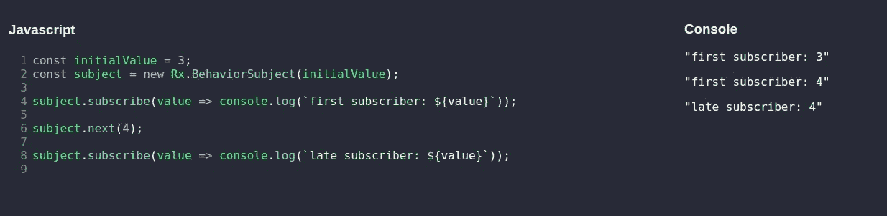

# RxJS 中的行为主体是什么？

> 原文：<https://betterprogramming.pub/what-is-a-behaviorsubject-in-rxjs-f580e934a5b2>

## 行为主体基础知识以及如何在角度


图片来自 [RxJS](https://rxjs-dev.firebaseapp.com/) 。

在这篇文章中，我们将讨论你需要知道的关于`BehaviorSubject`的一切。我们将从基础开始。在文章的后面，我们将讨论如何在 Angular 中使用它。在文章的最后，你不仅会理解它，而且你还会掌握这门学科。

所有这些只需要你几分钟的时间。

# 基础知识

让我们从文档中的定义开始:

> “[behavior subject]需要一个初始值，并将当前值发送给新的订阅者。”— [学习 RxJs](https://www.learnrxjs.io/learn-rxjs/subjects/behaviorsubject)

所以，`BehaviorSubject`是一个我们可以订阅的主题。像任何其他主题一样，它将向订阅该主题的任何人广播添加到该主题的新值。

因为当前值总是发送给新的/迟交的订阅者，所以您有机会在任何人订阅之前提供一个初始值。这一部分在我们后面的角度部分讨论时会变得更清楚。



自己带着 RxJS[在这个操场上玩](https://rxjs-playground.github.io/)。

在我的第一个例子中，我们来玩一个行为主体。

让我们创建一个。如果我们直接订阅它，它将打印当前值(在本例中，`3`)。

如果我们调用我们主题的下一个函数，第一个订阅者将会注意到并打印出下一个值(`4`)。

后期订阅者在调用下一个函数后订阅，并且不知道之前的值。它看到的是行为主体的当前价值。很酷，不是吗？

*注意:如果你想让后来的订阅者知道之前发出的值，使用* `*ReplaySubject*` *。*

请继续玩它。我一直推荐的一个典型练习是玩普通的`Subject`、`BehaviorSubject`和`ReplaySubject`，因为这些是最常用的。

# 用例:角度

在 Angular 中使用`BehaviorSubject`非常方便，因为它是一种特殊的`Observable`。有时，我们喜欢对输入变量做一些事情(例如，检索文章的后端调用)。或者我们想在不改变输入变量本身的情况下对输入变量执行一些操作。通过使用 RxJS，我们建立了一个非常有效的——当然，这取决于你如何实现它——数据流。

我们不想在输入属性的所有操作完成之前呈现 HTML 模板。为此，我们可以使用异步管道订阅这些结果。因为这个异步管道是后期订阅，所以我们也想访问初始值。这就是`BehaviorSubject`发挥作用的地方。

我给你看基本的。

因为输入属性的值是在`OnInit`中初始化的，而不是在构造函数中，所以这是——大多数时候——创建行为主体的唯一正确的地方。

*注意:过去，我也曾在* `*ngOnInit*` *之外创建过* `*BehaviorSubject*` *，方法是传递一个* `*null*` *，然后过滤掉那个* `*null*` *。但事实证明，这只会让事情变得更复杂。*

```
ngOnInit(): void { mySubject$ = new BehaviorSubject(myInputVariable);

}
```

稍后在`ngOnChanges`中，我们可以对主题调用`next`来提供一个新的值。需要注意的是，只有在发生变化时才发出值。

*注意:只有当该属性发生变化时，当它不是第一次变化时，以及当该值不同于先前的输入值时(不仅仅是参考变化)，才会发生变化。*

```
ngOnChanges(changes: SimpleChanges): void {
  if (*hasChangesForProperty*(changes, 'myInputVariable')) {
    this.mySubject$.next(this.myInputVariable);
  }
}
```

最后一部分是异步管道。这是我们后期订阅主题的位置。因为我们使用管道在模板内部订阅，所以我们不需要自己取消订阅。太棒了。

```
<ng-container *ngIf="mySubject$ | async as ***mySubject***"> <!-- something you like here --></ng-container>
```

仔细想想，我们可以在模板中直接使用输入变量。这确实会有同样的结果。但是请记住，这第一个例子只是让你开始！

因为我喜欢让事情变得简单，这是一个最简单的关于`BehaviorSubject`的有角度的例子。为了真正理解它的威力，我们需要深入更高级的例子，所以坚持住。

让我给你看三个。

## **例 1**

您可以对值执行操作。请注意，在这个简单的例子中，您也可以使用纯管道，这在效率方面是相同的。通过使用`tap`也可以很容易地添加像日志这样的副作用。一旦你有了这个想法，建立一个数据流就变得非常简单。

```
this.newSubject$ = this.mySubject$.pipe(
    tap(value => console.log(value)),
    map(value => mapToDifferentRepresentation(value))
);
```

## **例二**

你可以把两个可观测量结合起来，当其中任何一个发生变化时，进行一些运算。这已经表明，这种工作方式变得非常强大，非常快。RxJs 有很多不同的函数，所以一定要检查一下[文档](https://www.learnrxjs.io/learn-rxjs/operators/combination/combinelatest)！

```
this.subject$ = combineLatest(
   [this.mySubject1$, this.mySubject2$]
).pipe(
    map(([value1, value2]) => value2 - value1)
);
```

## **例 3**

您可以使用`switchMap`函数将一个可观察对象映射到一个不同的可观察对象。在这个具体的例子中，我们通过使用文章服务的 UUID 从文章服务中检索文章。让那件事过去一段时间…

你明白了吗？

注意，我们只检索我们真正需要的文章。我们只在值改变的时候做一个运算。这是令人难以置信的效率。文章格式不对吗？好吧，继续使用`map`功能来改变它。

> 开关映射是最常用的一种，但也有其他映射操作符来处理内部观察。

```
this.article$ = this.uuid$.pipe(
    switchMap(uuid => this.articleService.getArticle(uuid))
);
```

# 结论

RxJS 允许我们处理流中的数据。这是一种非常方便的工作方式。这使得异步代码更容易理解。如果使用正确，`BehaviorSubject`是一个简单且非常强大的概念。您可以在 Angular、Vue、React 和其他流行的框架中使用它。因此，将它作为工具之一对于任何前端开发人员来说都是有益的。

如本文所示，它确实与 Angular 中的事件周期结合得很好。如果你喜欢这篇文章或者对这个主题有任何疑问(双关语)，请在下面留下评论。感谢阅读！