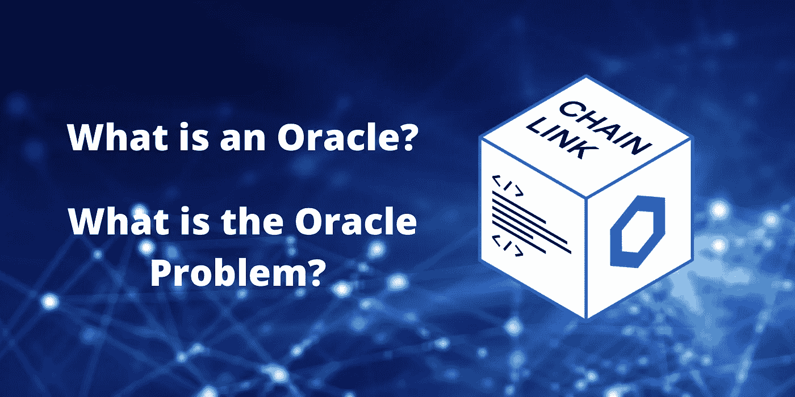
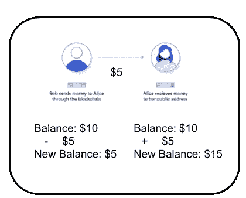
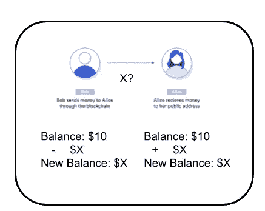
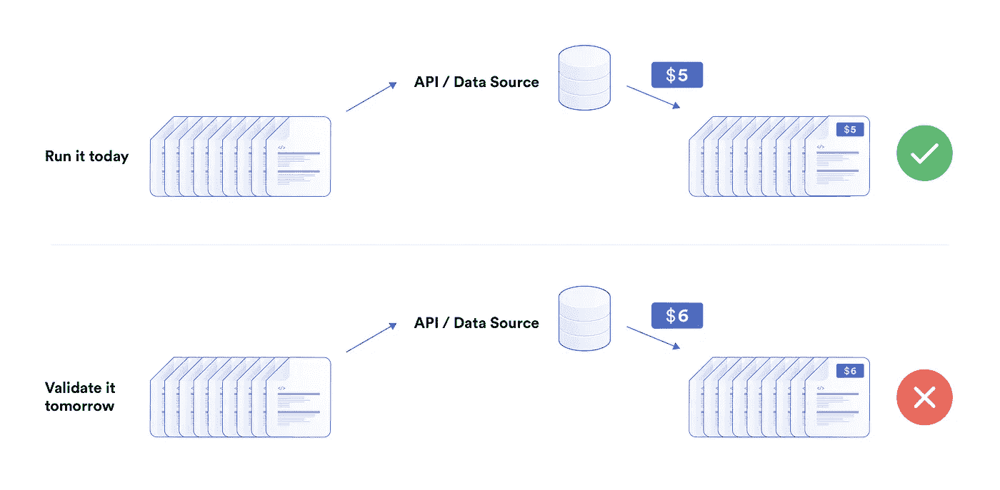
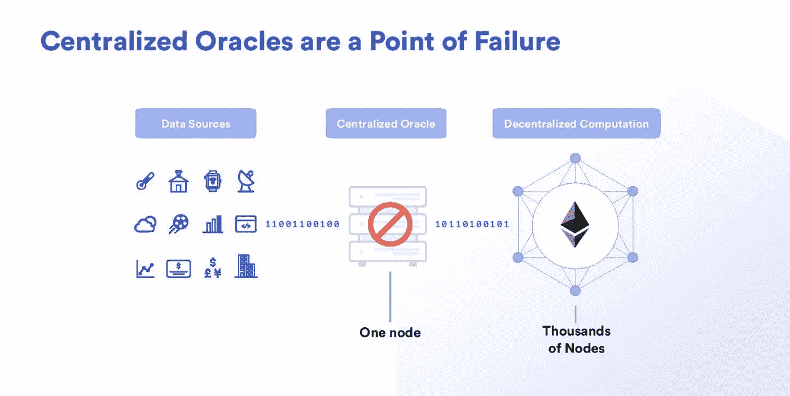
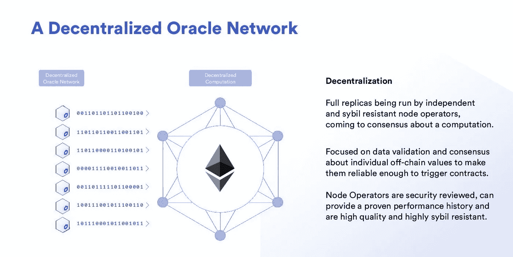

# 什么是区块链甲骨文？

> 原文：<https://betterprogramming.pub/what-is-a-blockchain-oracle-f5ccab8dbd72>

## 甲骨文的问题是什么？为什么区块链自己不能进行 API 调用？

通过[Canva.com](http://canva.com/)从佩什科夫获得的原始背景图像

# 1.神谕是什么？

一个[区块链 oracle](https://blog.chain.link/oracles-the-key-to-unlocking-smart-contracts/) 是连接一个确定性区块链和链外数据的任何设备或实体。

这一句话里有很多东西要解释。

为了理解区块链神谕是什么以及我们为什么需要它们，让我们回到区块链的核心特征之一——去中心化。

## 区块链的问题

由于区块链具有分布式分类帐的性质，网络中的每个节点必须能够在给定相同输入的情况下找到相同的最终结果。否则，当一个节点试图验证另一个节点进行的事务时，最终会得到不同的结果。这种架构是有意的，它被设计成有意确定性的。

新百伦易得(图片来源:作者)

我们可以看到，当我们从鲍勃向爱丽丝发送 5 美元时，我们可以很容易地在爱丽丝的余额中增加 5 美元，并从鲍勃的余额中减去 5 美元。网络上的每个节点都可以很容易地重现这种情况，得到相同的结果，并以相同的状态结束。

但是如果不是这样呢？让我们想象一个假想的区块链，在那里他们使用 API 来验证彼此的交易。假设我们想从 Bob 的账户向 Alice 发送一笔基于 ETH 价格的可变金额。我们将让我们的合同调用一个 API 来获取 ETH 的价格，然后将该金额发送给 Bob。当每个其他节点去验证这一点时，它们也必须调用这个 API。

验证变量要难得多。(图片来源:作者)

但是现在会发生什么呢？如果他们稍后调用 API，API 可能已经改变——被贬值、被攻击或出于许多其他原因——并且所有节点将得到不同的结果。这意味着没有一个节点能够就区块链的实际状态达成一致。

正是因为这个原因，以太坊区块链和大多数区块链被设计成完全确定性的。这意味着如果我们重放每一个事务，我们将会以正确的状态结束。如果您在区块链的基础设施中包含 API 调用或其他不确定的来源，那么这些来源很有可能会被贬值、被黑客攻击，甚至被破坏，我们将无法验证交易。

如果区块链是不确定的，共识是不可能的(图片来源:[链环](https://chain.link)

在区块链，对数据值达成一致的机制被称为[共识](https://blockgeeks.com/guides/blockchain-consensus/)，确定性很重要，这样节点才能达成共识。你可能听说过其中的一些，像中本聪的[工作证明](https://cointelegraph.com/explained/proof-of-work-explained) (PoW)或者拜占庭共识的[股份证明](https://www.investopedia.com/terms/p/proof-stake-pos.asp) (PoS)。共识是区块链成功的关键因素之一。

但是我们需要区块链世界与现实世界联系起来。我们需要将 ETH 和其他加密货币的价格纳入合同，这样我们就可以进行 DeFi。我们需要得到天气数据，这样我们就可以有分散的无信用保险。我们需要数据来将区块链用于其最重要的目的之一，智能合约。那么，我们如何用这种约束来连接世界呢？

## 神谕如何解决这个问题

区块链 oracle 是将确定性区块链与链外数据连接起来的任何设备或实体。这些神谕通过外部事务输入每一个数据。这样，我们可以确保区块链本身包含验证自身所需的所有信息。这就是 oracles 被称为区块链中间件的原因:它们是两个世界之间的桥梁。

原来如此，太棒了！但是我一直听到的“oracle 问题”是什么？

# 2.甲骨文问题是什么？

让我们后退一步，并记住我们为什么要在第一时间构建链上。我们在链上做任何事情的一个重要原因是为了分散化。然而，数据必须来自某个地方。

如果我们从单个 API、节点或数据源导入数据，那么我们现在基本上已经完全放弃了使用区块链的初衷。一个集中的 oracle 意味着一个实体对您的智能合约拥有权力，而您的智能合约现在并不比常规合约好。即使集中式 oracle 有最好的意图，我们已经看到了攻击，其中集中式 oracle 被黑客攻击、过时或没有维护，灾难随之而来。

集中的神谕是巨大的失败点(图片来源:Chainlink)

## oracle 问题定义

[甲骨文问题](https://ethereum.stackexchange.com/a/84645/57451)是这两块的结合:

1.  只有区块链无法获取外部数据。
2.  使用集中式 oracles 会抵消智能合约的优势，并且是主要的安全风险。

## 解决方案

[Chainlink](https://chain.link/) 解决了这两个问题，是去中心化 oracles 的标准。

## 什么是分散式 oracle？

一个[分散式 oracle](https://docs.chain.link/docs/architecture-decentralized-model) 或分散式 oracle 网络是一组独立的区块链 oracle，它们向区块链提供数据。分散式 oracle 网络中的每个独立节点或 oracle 独立地从链外源检索数据，并将其带到链上。然后汇总数据，以便系统可以得出该数据点的确定值。分散式 oracle 解决了 Oracle 问题。

Chainlink 是一个框架，用于选择独立的节点网络，将现实世界的数据连接到区块链，以使智能合约发挥其真正的潜力。凭借这一点，我们利用了与区块链相同的可靠的分散式基础设施概念，但针对的是区块链神谕。如果节点/源被黑客攻击、损坏或删除，Chainlink 的网络将利用分散网络并继续运行。

去中心化的神谕是解决方案。(图片来源:Chainlink)

有大量的市场利用 Chainlink 技术来帮助你挑选你的独立节点网络，从中提取数据。这样，您的智能合约就不会出现单点故障。

该技术是区块链不可知的，并不断努力与更多的区块链整合，使所有区块链可以访问可靠安全的离线数据。最棒的是，[文档](https://docs.chain.link/docs)对初学者和有经验的人来说都很棒。

如需视频解释，您可以观看此视频:

[以太坊甲骨文](https://docs.ethhub.io/built-on-ethereum/oracles/chainlink/) — Chainlink

使用一个区块链 oracle 是一个巨大的风险，chainlink 提供了一个围绕数据的奇妙的新生态系统。区块链先知是开启智能合约未来的关键。神谕也为区块链提供了一种互相了解的方式。这被称为[互操作性](https://cointelegraph.com/explained/blockchain-interoperability-explained)，也是重要的下一步。

归根结底，为了让智能合同成为更好的协议形式，我们需要访问各种可靠的数据。

这就是为什么我们需要神谕。