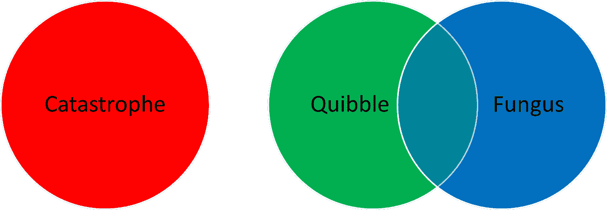

# “Bug”到底是什么？

> 原文：<https://betterprogramming.pub/what-is-a-bug-anyways-dd5700e89589>

## 理解代码中的缺陷

在 [Unsplash](https://unsplash.com?utm_source=medium&utm_medium=referral) 上由[张志勇](https://unsplash.com/@danielkcheung?utm_source=medium&utm_medium=referral)拍摄的照片

在软件中，我们谈论了很多关于 bug 的问题。

它们来自哪里，如何避免它们，如何处理它们等等。但是到底什么是 bug 呢？

我见过有超过一百个 bug 的项目，每个都被很好地记录和跟踪，但是代码库仍然运行。我昨天写了一个 bug，它阻止了一整类设备与服务器的通信。这两种场景中的实体是如何获得相同的标签的？

他们真的有多相似？如果你说后门有一只爬行动物，你可能指的是一只正在晒日光浴的鬣蜥或一只摆弄门把的迅猛龙，你真的说过什么有用的话吗？

我是说，当然，也许从分类学上来说，这些生物是相似的。这并没有告诉我们应该如何应对。软件工程是关于表演的。我们正在努力制造产品。我们使用的任何定义都应该有助于我们实现这个目标。

我在 Fivvr 上看到了由
[甘达尔硬核](https://www.fiverr.com/freelancers/gandalfhardcore?source=order_page_summary_seller_link)制作的这张图片。我相信我拥有它，所以版权马库斯哈伯林 2022。

当然，没有人真正谈论过爬行动物。生物学提供了更具体的分类层次。女士们，先生们，我们已经达成了论文声明:我们需要一个更具体的软件错误分类来恰当地处理它们。

你认为这篇文章不是一篇文章。傻瓜！我会列出所有的事情！

下面是一个将 bug 分成三类以及如何处理它们的建议。

如果你认为我错了，请在评论中告诉我。如果没有，还是留下评论吧，对订婚有好处。(这应该很重要)

# **大灾难**

灾难是谈论和识别的最简单的错误。它们是这样定义的:“阻止你发布下一个软件版本的错误。”

如果您发现这个 bug 部署在产品中，通常意味着发布一个特殊的版本来修复它。这仍然是一个宽泛的范畴，并且高度依赖于您正在创建的系统类型。

这可能是一个安全漏洞，一个损坏的核心功能，新 iPhone 上半个屏幕的按钮，一个让你的客户自杀的 UI 问题等等，等等。

灾难必须立即处理。如果只需要几个小时就能修好，而且不修好就不能发货，那么当它还历历在目的时候，没有理由不去处理它。

如果你不知道需要多长时间来修复，你必须现在就去做。如果你不能说一个 bug 需要多长时间来修复，并且它必须在发布前被修复，那么你甚至不能估计你什么时候能发布下一个版本。

你已经死在水里了。死者不会创造新的功能，他们必须先爬回生者的土地。

# **诡辩**

诡辩可以被定义为“你的软件中的小瑕疵，你可以很容易地使用它们。”

也许 web 前端的一个按钮在支持的最小屏幕尺寸上排列不正确，也许您可以在一个应该进行范围检查的字段中输入一个负数(假设它无害)，一个数字显示有两个小数位，而第二个小数位只能是零，也许动画在奇怪和罕见的情况下延迟播放，等等。

吹毛求疵会损害你产品的整体外观和感觉。如果太多，诡辩甚至会阻止你发货。人们对“感觉”坏了的软件没有信心。但这类 bug 只能阻止总体交付。

你应该尽量减少诡辩的次数。如果它们很容易修复，那么当您出于其他原因在该代码区域工作时，就修复它们。如果处理一个问题而不创建一个独特的分支违反了你公司的政策，那就打破这个政策，直到有人告诉你停止为止。他们可能永远不会。

如果你的公司有一个 QA 团队，你的待办事项可能充满了诡辩。QA 团队认为发现 bug 是他们的工作。那不是他们的工作。他们的工作和你的一样，销售产品。

你可以原谅他们的困惑，因为他们知道你的工作是编码。但是 QA 发现诡辩不是一个实际的问题。你想了解它们，在方便的时候，你应该去修理它们。问题是信噪比。

如果 QA 用大量的诡辩和一些灾难性的错误来填充你的问题跟踪软件，很快这两类都会被忽略。诡辩应该与 bug 分开识别，否则它们会阻碍开发而不是支持开发。

# **木耳**

当我们进入第三类时，你可能有理由指责我重新发明了技术债务。当然，T4 在技术债务和真菌之间有很多重叠。

我正试图创建一种新的软件错误分类法。一些翻新是必要的。另外，我不想重复使用技术债务这个术语。它的包袱太多，音节太多。诡辩和真菌这两个词的音节必须少于灾难。

真菌是代码中任何会随着时间增长的缺陷。你可能听说过，“我们等待的时间越长，就越难解决。”你可能已经说过了。请注意，真菌不会成为灾难。真菌可能是也可能不是诡辩。这给我们留下了下面的图表:

渴望地凝视 MS Excel“智能艺术”的辉煌，并为它的荣耀而谦卑。

真菌不会是一场灾难，因为灾难必须现在就处理。他们将没有机会成长为问题。当然，诡辩可能是真菌，因为它们现在可能比以后更容易解决。在某些情况下，真菌不会指出代码中任何可见的缺陷。

如果一个代码模块很难改变，并且你期望它需要通过你的软件的迭代来改变:它的真菌。最糟糕的真菌之一是建筑违规。

每当您可以在十分钟内不正确地交付一个特性，但是可以在一周内正确地交付它时，架构违规就会出现。经常走捷径，你会遇到很多奇怪的情况和交流，以至于你的代码库的某些部分无法工作。

随着时间的推移，架构违规是公司陷入困境的真正原因之一。以后我会多写一些关于他们的内容。一般来说，真菌应该比诡辩更重要。

除非吹毛求疵太多以至于你无法解决，否则解决不断增长的问题比解决静态问题更经济。像诡辩一样，你可以允许你的代码库中有一点真菌。

如果这意味着在截止日期前完成销售，这在短期内是有意义的。但是真菌总是有风险的，即使你认为你的软件已经到了生命的尽头。这个世界充斥着人们认为二十年前就该退休的代码。

# **在回顾中**

在我的重新分类中，我已经将“bug”分解成三个更有用的类别。本文标题问:什么是 Bug？我的回答:不值得谈。以下是值得讨论的新类别的总结。

1.  灾难会阻止你交付软件。必须立即处理这些问题。
2.  真菌是随着时间的推移而增长的任何问题。真菌应该尽快处理，它对你的代码库是一个中长期的风险。
3.  诡辩是影响软件质量的小瑕疵。你应该试着减少他们的数量，并抓住机会对付他们。如果你发现你或你的团队留出了一个特定的冲刺或开发周期来处理诡辩，你对它们太被动了。

本文分为两个部分:重新分类和新类别的规定。如果你对任何一个都有异议，请告诉我。我之前的一篇文章是关于[遗产代码](https://medium.com/codex/legacy-code-2cb94a33dcd0)，如果你有兴趣的话可以看看。

# **脚注**

1.  如果你对此的反应是说“实际上科学家认为迅猛龙比爬行动物更像鸟类。”你要知道我鄙视你。
2.  是的，是罗宾汉。《福布斯》对此做了相当不错的报道。
3.  不，我不打算解释这个说法。