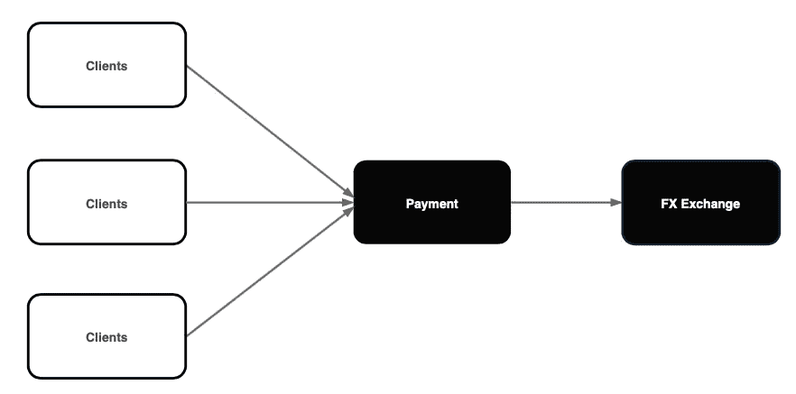
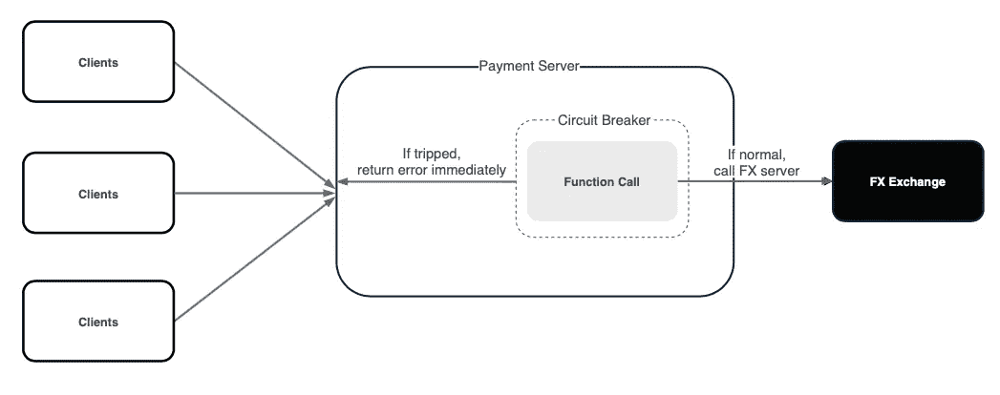
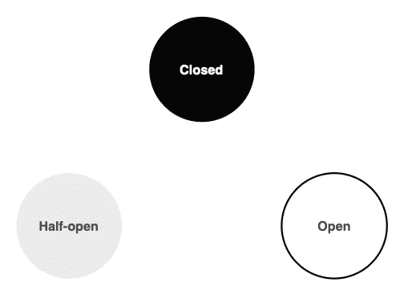
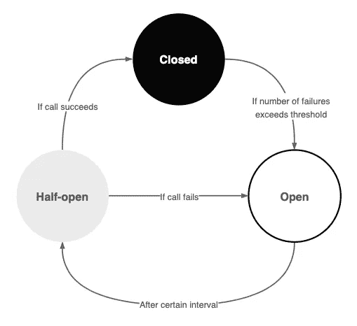

# 什么是断路器，为什么要使用它

> 原文：<https://betterprogramming.pub/what-is-a-circuit-breaker-and-why-should-you-use-it-9248f805306d>

## 处理服务失误的便捷工具

照片由[温德林·雅各布](https://www.pexels.com/@wendelinjacober/)在[像素](https://www.pexels.com/photo/red-and-white-stop-road-signage-1411397/)上拍摄

在微服务架构中，服务几乎总是会不时地失败。

虽然没有放之四海而皆准的解决方案，但在应对不同情况时，工具箱中放上合适的工具可能会很方便。

在本文中，我们来谈谈处理服务故障的一种常见方法——断路器模式。

# 为什么是断路器？

支付服务器向外汇服务器查询最新汇率|作者图片

想象一下，有一组提供支付服务的微服务。

支付服务器在每笔交易中查询外汇交易服务器，以检索最新的汇率。

## 如果 FX 服务器崩溃了怎么办？

一个简单的解决方法是包含一个重试机制。支付服务器在返回错误之前重试调用 FX 服务器 N 次。

虽然这看起来可行，但它会导致以下结果:

*   即使请求注定要失败，它也会让客户端挂起。
*   它在支付服务器上囤积资源。其他不查询 FX 服务器的请求将会变慢。
*   如果 FX 服务器过载，重试机制会使情况恶化。

简而言之，如果我们知道一个请求注定要失败，我们如何快速失败并防止级联效应？

这就是断路器的用武之地。

# 什么是断路器？

断路器包装一个函数调用

断路器包装受保护的函数调用并监控故障。

*   如果故障超过阈值，断路器跳闸。
*   进一步调用断路器会返回错误，而不会调用受保护的函数。

当断路器跳闸时，我们可以实施几种回退逻辑:

*   立即向客户端返回一个错误。
*   返回上一次成功调用的缓存响应。(例如，以前的汇率)
*   将呼叫转到备用服务器。(例如，另一个开源 exchange 服务器)

这个简单的机制可以防止客户端不必要的等待，并避免为可能失败的操作囤积服务器资源。

# 它是如何工作的？

关闭、打开和半开状态

断路器循环通过三种状态—闭合、打开和半开。

关闭。像闭合电路一样，断路器的行为正常，并允许进行受保护的呼叫。

打开。断路器立即失效，并且不会进行受保护的功能调用。

半开。断路器允许对受保护功能的有限调用。如果呼叫接通，它返回到关闭状态。否则，它将保持打开状态。

断路器通过三种状态循环

断路器包装一个函数，并跟踪给定时间段内失败呼叫与成功呼叫的比率。

*   如果比率超过阈值，它就会跳闸并进入断开状态。
*   它在每个固定的时间间隔进入半开状态，允许有限的呼叫。
*   如果调用失败，它将保持开放状态。否则，它返回到关闭状态。

# 如何实施？

关于实现，有大量的开源库为您服务。

虽然每个库的细节有所不同，但让我们大致了解一下一般的实现:

断路器将通常的 HTTP 调用包装在包装函数中。

断路器记录所有的请求、成功和失败。`mutexLock`避免了并发写入之间的竞争情况。

每次调用时，断路器检查请求是否被允许通过。如果没有，它会立即返回一个错误。否则，它调用受保护的函数调用。

每次请求后，断路器都会更新计数和比率。

# 关闭

文章文本的视觉形式的摘要

断路器模式虽然微不足道，但却是增强服务稳定性和弹性的便捷工具。

毕竟，如果你知道某件事很可能会失败，为什么还要费心重试呢？

我希望这能对你有所帮助，下次再见！