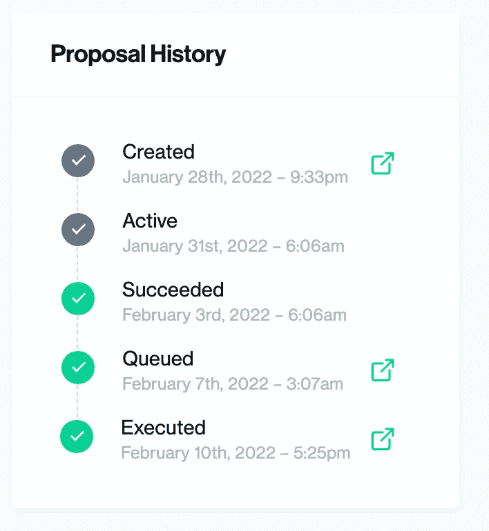
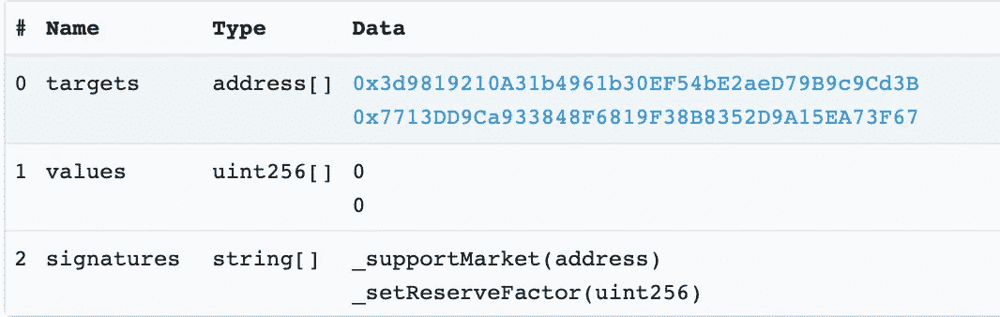
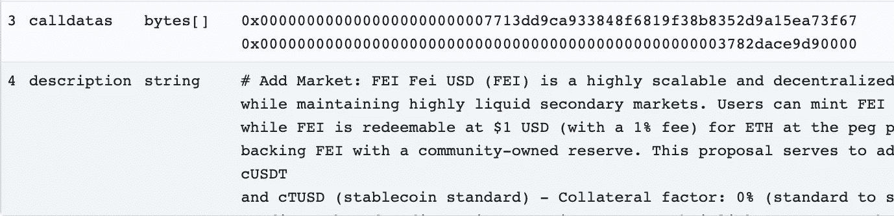
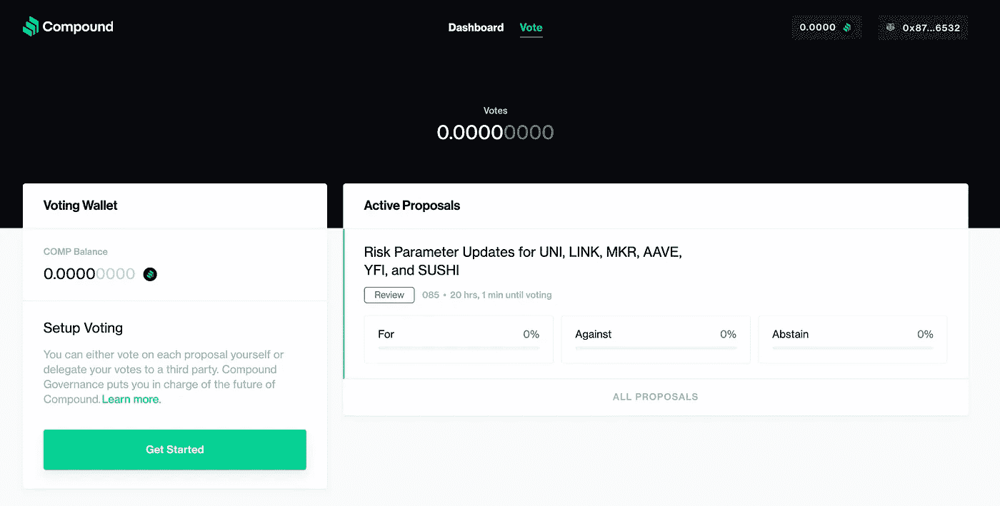
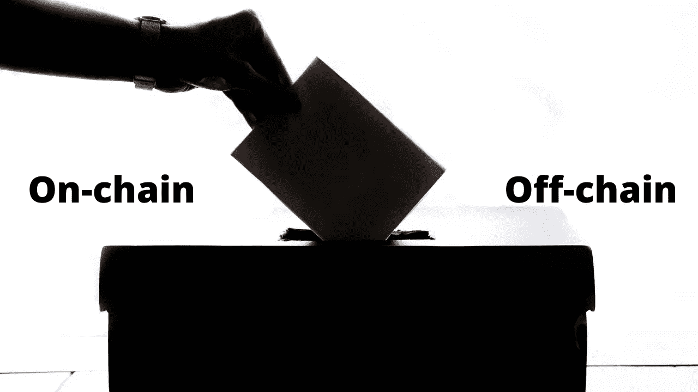

# 什么是刀？刀的架构是怎样的？(如何建造刀—高级)

> 原文：<https://betterprogramming.pub/what-is-a-dao-what-is-the-architecture-of-a-dao-how-to-build-a-dao-high-level-d096a97162cc>

## 我们探索以太坊、Polygon 和任何基于 EVM 的区块链上的 Dao，有哪些工具可供我们构建它们，并一步一步地了解治理流程是什么样子的。

原始图片来自 Pexels 的 Nikita Belokhonov

# 介绍

DAOs 或“去中心化自治组织”是一个有点过重的术语，用来描述任何由一组透明规则管理的组织，通常在区块链或 smart 合同中可以找到。

我说“超载”是因为:

*   一些人可能会说，既然比特币矿工可以选择不升级他们的软件，那就是为他们喜欢的补丁“投票”的一种形式。
*   一些人认为 Dao 必须使用智能合约，因为它们有透明的分散规则。
*   有些人只是在他们的项目上加上“道”这个名字，因为他们认为这是一种趋势。

它也不要与“[刀](https://en.wikipedia.org/wiki/The_DAO_(organization))混淆，后者是 2016 年创下当时最大黑客记录的一种刀的实现。

想象一下，如果[谷歌](https://www.google.com/)的所有用户都有权投票决定谷歌下一步应该做什么，所有的规则都是不可改变的、分散的、透明的，所有人都可以看到。这解决了信任和中心性这个古老的问题。

所以 Dao 确实围绕着“去中心化治理”的思想，可以用“公司通过代码专门运营”来概括。

为了真正理解这一点，我们要看看:

1.  该协议为所有 Dao 设置了先例，[复合](https://compound.finance/)。
2.  不同分权治理架构的权衡。
3.  用来建造其中一个的工具

在我的下一个视频中，我们将为想了解更多的开发者提供完整的代码教程。[您可以在这里先睹为快](https://www.youtube.com/watch?v=rD8AxZ_wBA4)，并在这里观看本文的视频:

从工程角度看 DAOs

# 复合的刀设置

复合遵循“正常的”治理过程。您可以通过选择“治理”选项卡，使用 [Openzeppelin 的合同向导](https://docs.openzeppelin.com/contracts/4.x/wizard)创建一个简化的 solidity 版本。它是基于你将在这里看到的。它遵循以下步骤:

[复合治理步骤](https://compound.finance/governance/proposals/83)

## 创建建议(已创建)

建议由用户创建。任何人都可以创建提议事务，这里有一个示例[提议事务](https://etherscan.io/tx/0x46fb3ad1837ca8fbbd88e6654424752faa20430fab0517c2d965b26759292d4b)。建议交易只是一个契约函数，它采用以下参数:

*   `targets`:你想要调用函数的地址
*   `values`:您要发送给每个目标的 ETH(或第 1 层令牌)的数量
*   `signatures`:您希望在各个目标上调用的函数的函数签名
*   `calldatas`:要传递给各个函数的参数的字节表示
*   `description`:描述你做这个交易的内容和原因

[提案交易样本](https://etherscan.io/tx/0x46fb3ad1837ca8fbbd88e6654424752faa20430fab0517c2d965b26759292d4b)

[提案交易样本](https://etherscan.io/tx/0x46fb3ad1837ca8fbbd88e6654424752faa20430fab0517c2d965b26759292d4b)

这种设置意味着治理下的任何契约都能够调用任何函数。因此，大多数时候，建立治理的最简单的方法是让契约的[所有者成为治理契约(或者，更准确地说是](https://docs.openzeppelin.com/contracts/4.x/)[时间锁](https://github.com/OpenZeppelin/openzeppelin-contracts/blob/master/contracts/governance/TimelockController.sol))。我们将在我的下一个视频中解释)

## 活跃期

一旦提案被激活，人们可以开始投票，大多数投票仍然是通过 ERC20 令牌完成的，这就是 [COMP 令牌](https://compound.finance/governance/comp)的用途。通常，投票期限是在智能合约本身内部设定的。最简单的投票有“是”、“否”、“弃权”选项，可以直接对合同进行投票，也可以使用他们的[投票 app](https://app.compound.finance/#vote) 。

[复合投票 App](https://app.compound.finance/#vote)

## 投票通过(成功)

为了通过投票，必须达到法定人数。法定人数可以是通过的一定数量的 ERC20 票，或一定的百分比。

一旦投票通过，它实际上不会马上生效，在通过和执行之间有一个延迟。这样做的原因是，如果你不喜欢已经通过的投票，它会给你时间“摆脱”投票将你置于的任何处境。

## 排队并执行(排队并执行)

投票通过后，任何人都可以调用“queue”函数，将提案 Id 作为输入参数传递。您可以在这里看到一个[样本交易](https://etherscan.io/tx/0xd9f1195a31a36467c8d224c9f9f894352d51157c683701f7c2bb78e25cc68924)。

然后，任何人都可以调用`execute`函数，并传递建议 Id。如果投票没有通过，队列和执行将会失败。

整个过程就是这样！

# 道的建筑

现在我们知道了 DAO 是什么样子，让我们来讨论使用智能契约构建 DAO 的架构和工具，以及它们的权衡。在构建 DAO 时，有许多架构可供选择，其中一些最重要的是:

*   投票地点
*   投票机制
*   特定政府机构

因为在一天结束的时候，这些选择将会产生最大的影响。

## 投票地点

> 用户应该在哪里投票？

来自 Pexels 的 Element5 Digital 的原始图像

我认为人们可以在两个主要地点投票，**线上**或**线下。你将 100%需要知道取舍。**

链上治理的优势在于，它是以安全的分散方式进行的最简单的设置，但是是以您的社区为代价的。如果每次投票花费 10 美元，而你的社区中有 10，000 人，那么每次你想投票时，你作为一个社区将会损失 100，000 美元！这显然是不可持续的。这就是 Compound 所使用的，并且可以在智能合同中 100%配置和部署。

我真正感到兴奋的一个链上系统是一个叫做 [Governor C](https://chainlink-fall-hackathon-2021.devpost.com/submissions/286500-governor-c-sybil-resistant-quadratic-voting-system) 的系统:它通过进行二次随机抽样投票来改善 sybil 阻力和天然气费用，类似于[二次资助](https://wtfisqf.com/?grant=&grant=&grant=&grant=&match=1000)。

链外治理有节省成本的优势，但是目前还没有(或者我还没有看到)一个解决方案像原始的链上治理那样安全。这个解决方案需要用户[签署他们的交易](https://ethereum.org/en/developers/docs/transactions/)而不发送它们，将它们交付给某种分散的数据库(像 [IPFS](https://ipfs.io/) )，然后让[分散的甲骨文](/what-is-a-blockchain-oracle-f5ccab8dbd72)将投票结果交付给智能合同。最好的解决方案是使用 [Gnosis SafeSnap](https://blog.gnosis.pm/introducing-safesnap-the-first-in-a-decentralized-governance-tool-suite-for-the-gnosis-safe-ea67eb95c34f) 的 [Snapshot](https://snapshot.org/#/) 。但理想情况下，我们会看到快照与 oracle 网络的集成来交付数据。通过这种方式，我们可以利用 oracle 网络的分散和安全特性，同时不必支付连锁交易的汽油费用，节省高达 99%的汽油费用！如果你是一名工程师，你可能会申请[链环补助金](https://chain.link/community/grants)如果你想建造这个！

## 投票机制

> 参与者如何参与和投票？

原始图片来自 DAPA 图片

有许多方法可以设置投票人应该如何参与。 [Vitalk 对各种方法的利弊进行了惊人的分析](https://vitalik.ca/general/2021/08/16/voting3.html),并对其进行了更深入的探讨。

## 1.基于令牌的投票

一种简单的方法是使用 ERC20 令牌或 NFT 作为投票权，这就是我们在 Compound 中看到的。1 个代币= 1 票。这对于某些 Dao 来说可能是好的，但在需要包容和公平的 Dao 中，你会冒“购买力”的风险。谁的钱最多，谁就可以选择改变。这也有向富人拉选票的风险。如果只有富人有权投票，那么所有的改变都将基于富人的想法——他们不会因为做了只对他们有利的事情而受到惩罚。

NFT 更有趣一点，因为它们本质上是不可替换的，但是这遇到了和上面一样的问题，你会遇到这样的问题“那么什么是公平的分配 NFT 的方法呢？”。

## 2.基于投票的游戏皮肤

这是一个很难实现的方法，这个方法使得如果您在 DAO 中投票支持一个错误的选择，那么您用来投票支持更改的令牌就会被销毁。这将具有以下优点:

1.  你们每个人都要对自己的投票负责。如果你投错了票，你就有赔钱的风险。
2.  如果有人买了权力，他们做了坏事，他们会因此受到惩罚。

现在棘手的部分是，“我们如何决定事情是否有坏的结果？有多糟糕的结果？”。

这个问题的答案是…我不知道

## 3.人格或参与的证明

这种方法可能是最公平的，但也是目前最难实现的。想象一下，所有的 Compound 用户仅仅因为使用了该协议而投了一票。这将是令人惊奇的，并且是一个潜在的更加公平的实现，因为选票是不能被收买的。然而，问题在于一种被称为“西比尔耐药性”的东西。

我们如何确定 1 票只是一个人或参与者？我们需要一种方法来证明每一个投票者不是某个跑来跑去创造数百个钱包的人，这样他们就可以有更多的投票权。

这是一种尚未完全解决的方法，但这是另一种依靠神谕来验证人类离线的方法。

# 🛠工具

我有一个视频即将推出，它将向您展示如何从头开始编写这些 Dao 中的一个，但是让我们看看一些最流行的工具。

## 无代码解决方案

有许多无代码解决方案，这些提供者提供为您运行 DAO 的操作。如果你不想编码，它们可以是一个很好的解决方案。

*   [刀栈](https://alchemy.daostack.io/daos/create)
*   [阿拉贡](https://aragon.org/)
*   [菌落](https://colony.io/)
*   [道豪斯](https://app.daohaus.club/summon)
*   [xDAO](https://www.xdao.app/)

如果您想要帮助设置您的 DAO，或者如果您想要通过它们的 UI 使用它们，这些都是很棒的工具。

[快照](https://snapshot.org/#/)值得拥有自己的插槽，因为它可以用于无编码解决方案，也可以用于编码解决方案。Snapshot 是一个 UI，既可以获取 DAO 的情绪，也可以执行治理。一些协议只是用它来表达情感，而另一些协议则用它与一个神谕相切来执行链外投票。

## 编码解决方案

*   [Zodiac](https://github.com/gnosis/zodiac) :一套基于 DAO 的工具，供工程师用来构建他们的应用程序。
*   [Tally](https://www.withtally.com/) :另一个帮助智能合约“看到”投票情况的 UI。
*   [灵知安全](https://gnosis-safe.io/):通常，大多数 DAO 都是以多重签名开始，而不是象征性投票。这样做的原因是，当你不必等待成千上万的人投票时，更容易“快”。使用多 sig 并且只有几个关键成员对初创公司有好处，有时对紧急情况也有好处。请记住，如果你增加其中一个，你就增加了一个透明的中心水平。
*   [Openzeppelin](https://docs.openzeppelin.com/contracts/4.x/api/governance) :这是我们将要在我们的道构建编码教程(即将推出)中使用的。

## 特定政府机构

现在，许多人认为许多治理问题对 DAOs 来说是新的，但是人们已经研究了几千年来实现民主和共和的“最佳”方法。这是你需要戴上你的哲学和政治帽子，并从过去中学习的地方。

现在不同的是，我们有了一个工具，使得建立一个最小化腐败和集中点的分散版本最终成为可能。

# 合法性

DAOs 的未来很有趣，尤其是在法律方面。让 DAOs 和其他公司遵守同样的规则有意义吗？很难确定谁会为 DAO 做的事情负责，或者你如何关闭它。

至少在美国，你实际上可以在怀俄明州形成一把刀，并得到该州的法律认可，所以我们必须看看那里会发生什么。

# 下一步是什么？

现在你已经有了所有的基本信息，是时候建造了！请务必在 YouTube[上订阅我的视频，看我即将发布的视频，它将一步步向你展示如何做到这一切！下次见。](https://www.youtube.com/channel/UCn-3f8tw_E1jZvhuHatROwA?sub_confirmation=1)