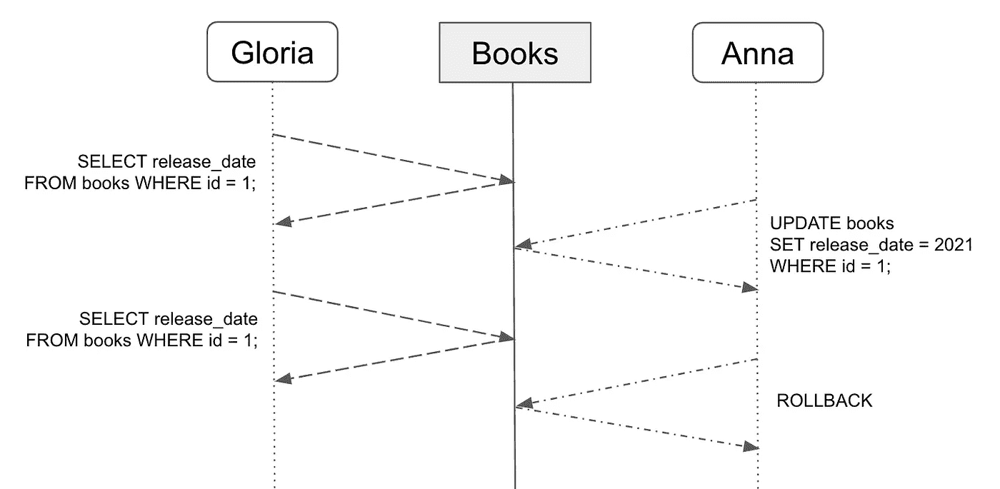

# 什么是数据库事务？

> 原文：<https://betterprogramming.pub/what-is-a-database-transaction-df16de9d9bc1>

## 了解高负载系统如何管理数据

简·安东宁·科拉尔在 [Unsplash](https://unsplash.com/s/photos/database?utm_source=unsplash&utm_medium=referral&utm_content=creditCopyText) 上拍摄的照片。

数据库提供有组织的数据存储。数据库最常见的操作是检索和写入。应用程序将一些数据放在那里，然后访问它们。读取和写入操作之间的比率可以变化。然而，目的是一样的。

随着越来越多的请求访问数据库，数据一致性的问题就出现了。但是如果你的解决方案遵循了 ACID 原则(原子性、一致性、隔离性、持久性)，这就不是问题了。

让我们探索一下数据一致性及其最佳实践。

# 有什么问题？

在深入探讨事务如何工作的话题之前，我们首先要理解*为什么*。我们想用数据库事务解决什么问题？

让我们来看看数据库系统中的一个经典问题，叫做*脏读*。两个用户 Gloria 和 Anna 正在对数据库执行关于书籍的查询。Gloria 执行两个查询来获取某本书的发行日期。同时，安娜更新了那本书的发行日期。但是她的更新失败了，更改被回滚。

脏读问题的示例

格洛丽亚得到了什么结果？她的第一个查询将返回更新之前的发布日期(例如 2020 年)。第二个查询将返回 2021，因为它是在 Anna 的更新查询之后执行的。

事实上，Anna 所做的更改没有在数据库中显示出来，因为它们被回滚了。然而，Gloria 没有把握好时机，在回滚之前读取了信息。这就是脏读的情况。

脏读取也有类似的问题，例如*不可重复读取*和*幻像读取*。我们不会关注每一个细节，但常见的情况是它们打破了隔离原则。根据这个原则，新的变化应该是完全可见的，或者根本不可见。我们必须保证请求相同数据的不同用户总是得到相同的结果。

# 解决方案

事务是避免数据一致性问题的一种方式。这是对数据库的原子操作。事务的目的是满足所有的 ACID 原则，而隔离属性是对其做出有价值贡献的属性。

事务隔离的整个概念是锁定对数据库的访问，直到事务完成。这意味着几个事务将按顺序执行，而不是并行执行。监控数据库操作有不同的隔离级别。默认情况下，每个数据库管理系统不使用相同的隔离级别。

最简单和最流行的隔离级别是*读提交*。它保证脏读和*脏写*是不可能的。只有提交的数据对其他人可见。这是通过行级锁和对旧值的引用来实现的。

对于行级锁，只有单个事务可以写入，而修改同一行的任何其他事务都必须等待。虽然这种方法效果很好，但也有缺点。只读事务的性能可能会受到影响。通常，只读事务的平均数量远远高于写事务。

为了改善只读事务的响应时间，系统必须保留该行的前一个值，并将其返回给每个查询。所有正在进行的写事务都不会阻止只读事务。只有当行被更新并且锁被释放时，读查询才会返回一个新值。

在这种情况下，性能保持在合理的水平，脏读问题得到解决。读操作不会阻止写操作，写操作也不会阻止读操作。

复杂的系统可能会有更多的问题，比如*读偏斜*、*写偏斜*，以及*幻影读偏斜*。它们出现在边缘案例中，但是那些不是你想要的边缘案例。幸运的是，所有这些都被高级隔离级别所覆盖。

*快照隔离*和*可串行化*属于高级隔离级别。它们看起来与 *Read Committed* 相似，但有一些小的区别。

快照隔离跟踪每个事务的行的多个版本，而不是只记住以前的值。可序列化是最强的隔离级别。它是通过严格地一个接一个地按顺序运行所有事务来实现的。

# 结论

数据库事务是一个强大的概念，它使数据保持一致。它有助于防止许多错误，尤其是在高负载分布式系统中。如果您了解如何应用数据库事务，您的解决方案将始终以最佳性能运行。