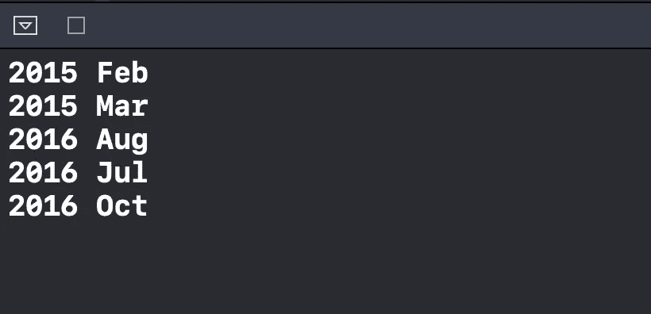

# Swift 中有标签的语句是什么？

> 原文：<https://betterprogramming.pub/what-is-a-labeled-statement-in-swift-2d245ac7b4e7>

## 如何从嵌套循环中的外部循环断开

[Temo Morales](https://unsplash.com/@moralesct?utm_source=medium&utm_medium=referral) 在 [Unsplash](https://unsplash.com?utm_source=medium&utm_medium=referral) 上拍照。

今天，我们将了解 Swift 中一个鲜为人知的功能:带标签的语句。

标记语句允许我们控制程序执行的流程。概念类似于其他编程语言中的`goto`。例如，我们可以使用它来从嵌套循环中的外部循环中断开，这正是我们现在要做的。

# 我们开始吧

假设我们有下面的`[Int: [String]]`类型的`Dictionary`:

我们想要循环迭代它，一旦我们在过程中发现`Jan`就中断循环。

让我们添加以下内容:

我们可以看到，我们首先按照年份对`periods`房产进行升序排序。然后我们访问每个月并检查它是否等于`Jan`。一旦我们找到`Jan`，我们调用`break outerLoop`并且`outerLoop`的执行停止:

代码在 Xcode 操场上运行。

现在完整的源代码如下所示:

# 包扎

请注意，这个功能不应该使用太多，只有在某些情况下，当你觉得你没有其他选择。

对 Swift 的其他功能感兴趣吗？请随意查看我的其他相关作品:

*   [什么是 OptionSet，什么时候应该使用？](https://medium.com/better-programming/what-is-optionset-in-swift-and-when-you-should-use-it-419777f3c39)
*   [Swift 中的 CustomStringConvertible 协议是什么？](https://medium.com/better-programming/what-is-the-customstringconvertible-protocol-in-swift-4b7ddbc5785b)
*   [Swift 中的 vDSP 框架是什么？](https://medium.com/better-programming/what-is-the-vdsp-framework-in-swift-fe2539693e9a)
*   [Swift 中的等价协议是什么？](https://medium.com/better-programming/what-is-the-equatable-protocol-in-swift-f3238f6821d6)
*   [何时在 Swift 中使用可比协议](https://medium.com/better-programming/when-to-use-the-comparable-protocol-in-swift-b9f137b07413)

感谢阅读！