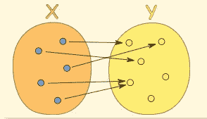

# 什么是纯函数？

> 原文：<https://betterprogramming.pub/what-is-a-pure-function-3b4af9352f6f>

## 编程中的纯函数及其好处

由 [Safar Safarov](https://unsplash.com/@codestorm?utm_source=medium&utm_medium=referral) 在 [Unsplash](https://unsplash.com/?utm_source=medium&utm_medium=referral) 上拍摄的照片

# 定义

在编程中，*纯函数*是具有以下特性的函数:

1.  对于相同的输入，函数总是返回相同的值。
2.  函数的求值没有副作用。副作用是指改变函数中不包含的程序的其他属性，例如改变全局变量值或使用 I/O 流。

实际上，一个纯函数的返回值只基于它的输入，对整个程序没有其他依赖或影响。

[https://www.mathsisfun.com/sets/function.html](https://www.mathsisfun.com/sets/function.html)

纯函数在概念上类似于数学函数。对于任何给定的输入，一个纯函数必须恰好返回一个可能的值。

但是，像数学函数一样，它也可以为其他输入返回相同的值。此外，像数学函数一样，它的输出仅由其输入决定，而不是存储在其他全局状态中的任何值。

# 例子

1.  下面的功能是*纯*。它没有副作用，并且总是为相同的输入返回相同的输出。

2.下面的功能是*不是纯粹的*。对于相同的输入，它并不总是返回相同的值，因为输出取决于输入的`x`值以及内部计算的随机值。

3.下面的函数也不纯。尽管它总是为相同的输入返回相同的值，但是它会有副作用，因为它修改了全局变量`y`的值。

# 利益

使用纯函数有几个好处，在性能和可用性方面都是如此。

## 1.可读性

纯函数更容易阅读和推理。所有相关的输入和依赖项都作为参数提供，因此没有观察到改变输入集之外的变量的影响。

这意味着我们可以很快理解一个函数和它的依赖关系，只需要阅读函数的声明。因此，如果一个函数被声明为`f(a, b, c)`，那么我们知道只有`a`、`b`和`c`是`f`的依赖项。

## 2.轻便

因为所有的依赖项都是作为输入参数提供的，并且不是通过全局上下文访问的，所以这些依赖项可以根据调用函数的上下文进行交换。

例如，这意味着相同的函数可以作用于相同资源的不同实现。

这使得代码更具可移植性和可重用性，因为相同的函数可以在不同的上下文中使用，而不是为了使用相同类的不同实现而必须编写不同的函数。

例如，不必编写两个不同的非纯函数来使用两个全局存储的不同记录器，纯函数只需将所需的记录器作为输入。

## 3.测试

没有副作用使得纯函数非常容易测试，因为我们只需要测试输入产生了期望的输出。我们不需要在特定函数的测试中检查任何全局程序状态的有效性。

此外，由于所有依赖项都是作为输入提供的，所以我们可以很容易地模仿依赖项。在一个不纯的环境中，我们必须在所有的测试中跟踪一些全局依赖的状态。

然而，在纯设置中，我们将简单地提供所有依赖项作为输入。我们不再需要担心在整个测试中维护全局状态，我们现在可以为不同的测试提供不同版本的依赖关系。

这允许我们测试功能，同时在每个测试中明确地控制所提供的依赖性。

## 4.对透明性有关的

引用透明指的是能够在不改变程序行为的情况下，用相应的输出值替换函数调用。

为了实现引用透明，函数必须是纯的。这在可读性和速度方面都有好处。编译器通常能够优化表现出引用透明性的代码。

## 5.贮藏

由于纯函数对于相同的输入总是返回相同的输出，所以我们可以缓存纯函数调用的结果。

缓存是指使用一种技术，比如记忆，来存储函数的结果，这样我们只需要计算一次。

通常，对于函数`f: Input -> Output` ，这是通过来自`Input -> Output`的映射(比如 hash-map)来完成的。

当执行一个函数时，我们首先检查 map 是否包含作为键的输入。如果是，我们返回地图的输出值，否则，我们计算`f(input)`，然后在返回之前将输出存储在地图中。