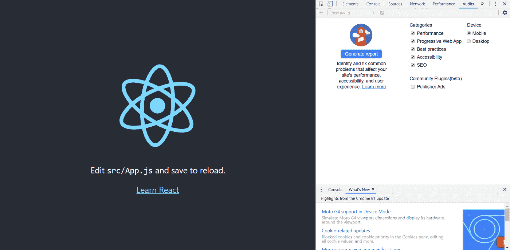
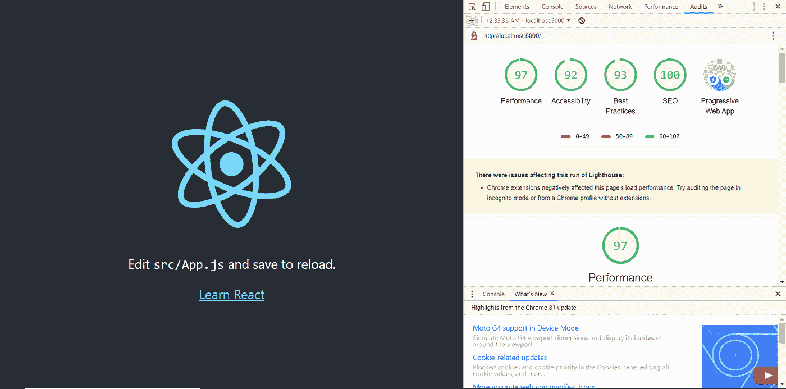

# 什么是 PWA，我如何构建 PWA？

> 原文：<https://betterprogramming.pub/what-is-a-pwa-and-how-do-i-build-it-e843c247efb5>


# 那么什么是 PWA 呢？

当我第一次听说 PWAs 并决定尝试建造一个时，我在互联网上搜索答案，但毫无结果。

许多文章详细描述了 PWA 是什么。但是，最终，我真的相信没有简单的定义。在不知道它们是什么的情况下，你怎么能建造一个呢？

好吧，幸运的是，在不知道确切定义的情况下仍然有可能做出一个。PWA 代表 *progressive web app* ，本质上，web app 必须满足某些要求才能被视为 PWA。

这些需求可能会在未来发生变化，但是现在，让我们先探讨其中的一些需求，然后着手构建一个需求:

*   独立于平台
*   应答的
*   离线工作(在服务人员的帮助下完成)
*   更安全(因为它要求应用程序在 HTTPS 提供服务)
*   可靠且更快
*   可安装
*   可链接

# 履行

我将快速浏览一下如何使用通过使用`create-react-app`命令创建的默认应用程序来创建 PWA 的步骤。

因此，如果你是 React 的新手，你需要在这个快速教程之后弄清楚如何自己创建应用程序的功能，因为我不会讨论 React。然而，如果你有使用`create-react-app`命令创建 React 应用程序的经验，这将是轻而易举的事情。

# 安装节点

首先，您必须安装节点。如果您还没有安装，请继续安装[。](http://nodejs.org/en/download)

# 创建新的 React 应用程序

在`create-react-app`命令的帮助下，创建一个新的 React 应用就像一行代码一样简单。只需打开你的终端，cd 进入你想要的位置。执行以下命令:

```
npx create-react-app app_name
```

随便把`app_name`换成什么都行。

一旦它完成制作应用程序，cd 进入`app_name`，你应该会看到一个目录结构，看起来像:

```
app_name
├── node_modules
├── public
└── src
    ├── App.css
    ├── App.js
    ├── index.css
    ├── index.js
    ├── logo.svg
    ├── serviceWorker.js
    └── setupTests.js
```

打开`index.js`，简单的把`serviceWorker.unregister( )`改成`serviceWorker.register( )`。

```
import React from 'react';
import ReactDOM from 'react-dom';
import './index.css';
import App from './App';
import * as serviceWorker from './serviceWorker';ReactDOM.render(
  <React.StrictMode>
    <App />
  </React.StrictMode>,
  document.getElementById('root')
);serviceWorker.register(); /* change from unregister to register */
```

现在，运行应用程序。

```
npm start
```

然后，打开开发人员工具并导航到审计。点击“生成报告”



你会发现，很不幸，你的应用不是 PWA。但是为什么呢？这是因为使用`npm start`运行应用程序只是应用程序的一个开发版本。起初，我确实对此感到困惑。要在生产版本上运行您的应用，只需执行以下操作，并在浏览器上导航至`localhost:5000`。

```
npm run build
serve -s build
```

现在，再次生成报告。现在，你会看到它是一个完全成熟的 PWA。



如果你使用的是 Chrome，你甚至可以在浏览器的右上角看到一个可爱的加号形状的安装按钮——在书签图标旁边。

现在你知道了！您已经创建了第一个渐进式 web 应用程序。那不是很容易吗？