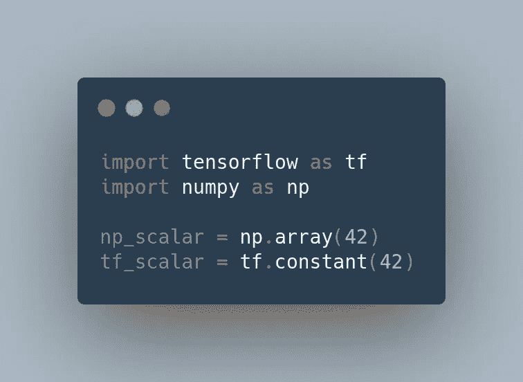
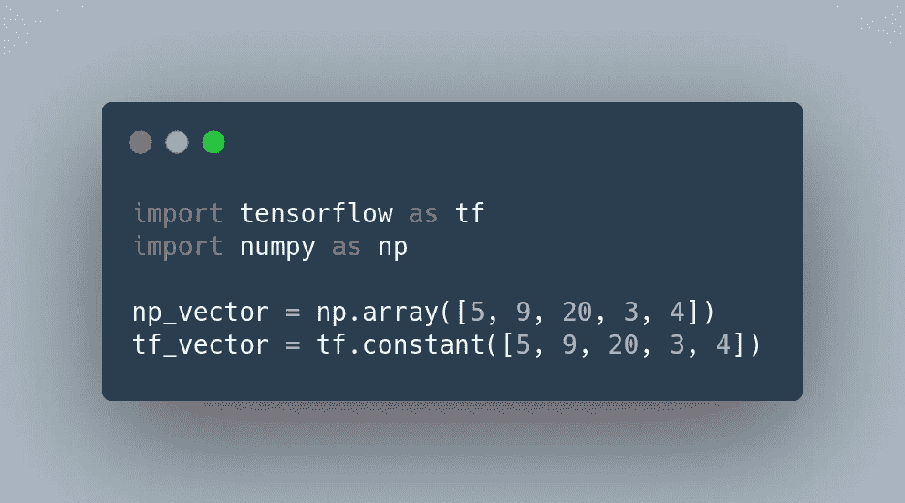
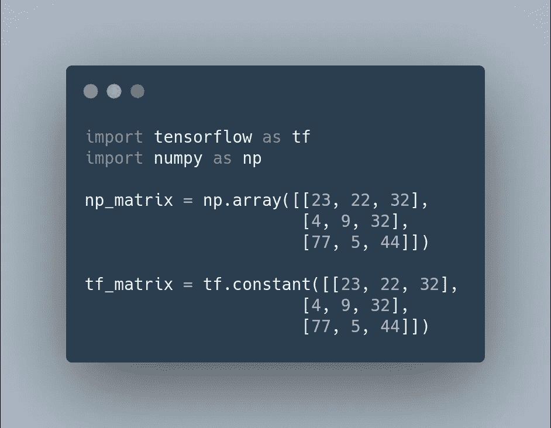
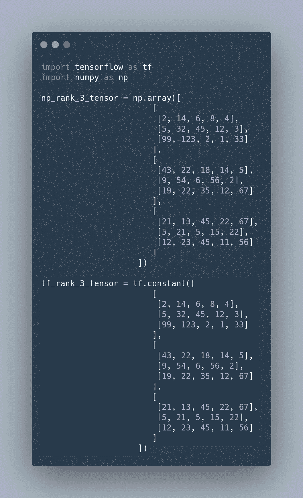

# 什么是张量？

> 原文：<https://betterprogramming.pub/what-is-a-tensor-9df05c178a39>

## 你不需要成为数学专家来开始机器学习

照片由 [Zbynek Burival](https://unsplash.com/@zburival?utm_source=medium&utm_medium=referral) 在 [Unsplash](https://unsplash.com?utm_source=medium&utm_medium=referral) 上拍摄。

今天，我们将要发现什么是张量。这是最基本的数据结构之一。事实上，它是如此的基本，以至于 [TensorFlow](https://www.tensorflow.org/) 以它命名！如果你想知道它代表什么，请耐心听我说。

在本文中，您将获得以下问题的答案:

*   什么是张量？
*   TensorFlow 的`Tensor`和 [NumPy](https://numpy.org/) 的`ndarray`有什么区别？
*   张量的主要属性是什么？

# 什么是张量？

一般来说，张量是数字的容器。大多数正在阅读这篇文章的人已经熟悉矩阵了，它们是秩 2 的张量。张量实际上是任意维数的推广。不要担心，举几个例子会更清楚:

*   标量是只包含一个数的张量(秩 0 或零维张量)。

NumPy 和 TensorFlow 中的示例:

数字/张量流中的标量

*   向量是一组数字(秩 1 或一维张量)。

NumPy 和 TensorFlow 中的示例:

数字/张量流中的向量

*   矩阵是向量的数组(秩 2 或二维张量)。它是二维的，因为你可以用两个轴(行和列)来表示它。

NumPy 和 TensorFlow 中的示例:

数字/张量流中的矩阵

*   张量可以是更高的秩(秩 N 或 N 维张量)。但它也可以是标量(秩-0)、向量(秩-1)或矩阵(秩-2)，就像我们在上面看到的那样。为了了解秩为 3 的张量是什么样子，可以把它想象成一个数字的立方体。

较高等级张量的例子是图像数据(`height, width, colour depth`)和视频数据(`samples, frames, height, width, color_depth`)。那些分别是`rank-3`和`rank-5`张量。

NumPy 和 TensorFlow 中的示例:

秩 3 张量数/张量流

# TensorFlow 的张量与 NumPy 的 ndarray

NumPy 的`ndarray`和 TensorFlow 的`tf.Tensor`有两个[重要区别(都代表数学张量):](https://www.tensorflow.org/tutorials/customization/basics#tensors)

*   张量由 GPU 或 TPU 等加速器内存支持。
*   张量是不可变的。

[Joseph Greve](https://unsplash.com/@lime517?utm_source=medium&utm_medium=referral) 在 [Unsplash](https://unsplash.com?utm_source=medium&utm_medium=referral) 上的照片。

# 张量的主要属性是什么？

张量通常有三个属性:

*   `Rank`:轴的数量或尺寸的数量。秩为 4 的张量有四个轴，而向量只有一个轴。两个 Python 库 NumPy 和 TensorFlow 都调用张量的秩`ndim`。
*   `Data Type`:这是一种数据类型，或`dtype`，可以在张量内部找到。大多数时候，张量包含浮点和类似整数的数据类型(例如，`float64`、`int32`)。

也可以在 NumPy 和 TensorFlow 中的张量中存储字符串。大多数时候，我们看到的是严格的数字数据。但是在 TensorFlow 里碰到`string`张量也不要惊讶。

*   `Shape`:这是一个整数元组，描述了张量沿每个轴的维数。

在第一部分中看到的秩为 3 的张量示例具有以下形状: *(3，3，5)* 。这意味着它是一个包含三个其他向量的向量，每个向量包含三个其他向量，每个向量内部有五个数值。

# 结论

在这篇文章中，我们已经看到了什么是张量，它们代表什么。为了对它们有所了解，我们已经看到了标量、向量、矩阵和更高级的张量。这将使您在开始对它们执行操作之前，对它们有一个基本的了解。

我们也看到了 NumPy 和 TensorFlow 张量之间的区别。您可以轻松地将它们从一个转换到另一个，所以现在您知道您不必担心这一点，除非您担心计算能力。

最后，我们已经看到了张量的不同属性:`rank`、`data type`和`shape`。

就是这样！你已经学会了和张量一起工作所需要的一切。感谢阅读。