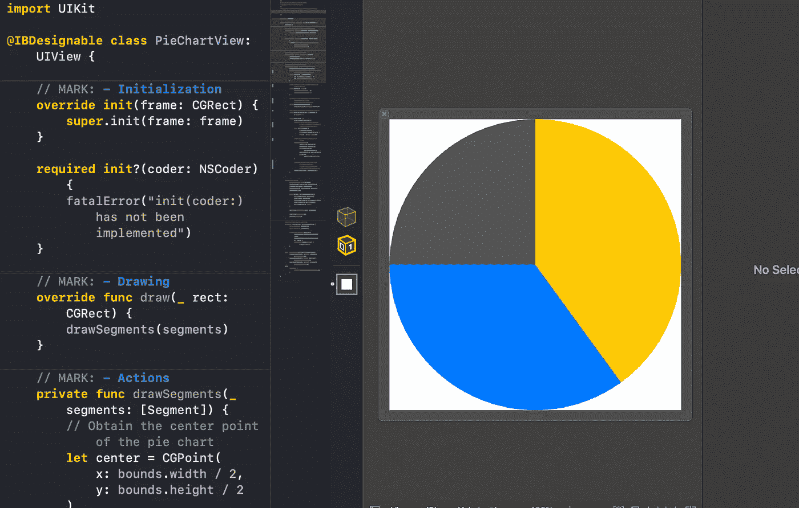

# Swift 中的 UIBezierPath 是什么？

> 原文：<https://betterprogramming.pub/what-is-a-uibezierpath-in-swift-3e024af92e3d>

## 以及如何创建自己的饼图

图片由 [StockSnap](https://pixabay.com/users/StockSnap-894430/?utm_source=link-attribution&utm_medium=referral&utm_campaign=image&utm_content=925900) 从 [Pixabay](https://pixabay.com/?utm_source=link-attribution&utm_medium=referral&utm_campaign=image&utm_content=925900) 获取

在本文中，我们将使用`UIBezierPath`类创建一个饼图，帮助我们创建定制的几何图形。

在短短 100 行代码中，我们将创建我们自己的 UI 元素，您可以在未来的应用程序中重用它。

该项目的源代码可以在文章的底部找到。

# 我们开始吧

首先，让我们创建一个名为`PieChartView`的`UIView`子类:

我们将它标记为`@IBDesignable`,以便能够轻松地调试它，而不需要构建和运行项目。如果您不熟悉该声明，可以在我的文章“[中快速熟悉，Swift 中的@IBDesignable 和@ IBInspectable 是什么？](https://medium.com/better-programming/what-are-ibdesignable-and-ibinspectable-in-swift-1e3440797d9)

我们的饼图将会有彩色段，所以我们需要创建一个属性来管理它们:

这里我们有符合`Comparable`的`Segment`结构。(我们稍后会想弄清楚哪个段占用了更高百分比的可用空间。)我们还将`segments`属性定义为具有一个`didSet`属性观察器，以便在属性发生变化时触发更新。

现在让我们直接进入本教程的核心:绘制饼图的几何图形:

我们在这里做两件事:

*   创建`drawSegments(_ segments:)`方法，计算所有线段的开始和结束角度，并按顺序绘制每个线段
*   覆盖`draw(_ rect:)`方法并调用`drawSegments(_ segments:)`方法

让我们仔细看看`drawSegments(_ segments:)`方法的实现:

要画一个线段，我们需要以下东西:

*   饼图的中心
*   饼图的半径
*   线段的起始角度(以弧度为单位)
*   线段的结束角度(以弧度为单位)

我们可以看到，我们如何容易地获得中心和半径。然而，开始和结束的角度更加棘手。

这是我们寻找每段角度的逻辑:

1.  从 3 *开始。π/2 角。这将是第一部分的开始。
2.  迭代线段。
3.  考虑线段的比率，计算每条线段的结束角度。
4.  使用获得的属性绘制当前线段。
5.  将`startAngle`属性设置为最后绘制的线段的`endAngle`。
6.  从步骤 3 开始重复，直到绘制完所有线段。

是时候创建一个方法来创建一个`UIBezierPath`并绘制一个特定的线段了:

*   为我们的部分创建一条路径。
*   用一条线结束线段。
*   准备好提供的`color`来填充我们的部分。
*   用`color`填充线段。

完成步骤是将该方法包含在`drawSegments(_ segments:)`方法中。现在，最终的实现如下所示:

饼状图做好了！我们现在可以使用一个`.xib`文件轻松调试它:

# 资源

在 GitHub 上下载[完成的项目。](https://github.com/zafarivaev/PieChart-UIBezierPath)

感谢阅读！