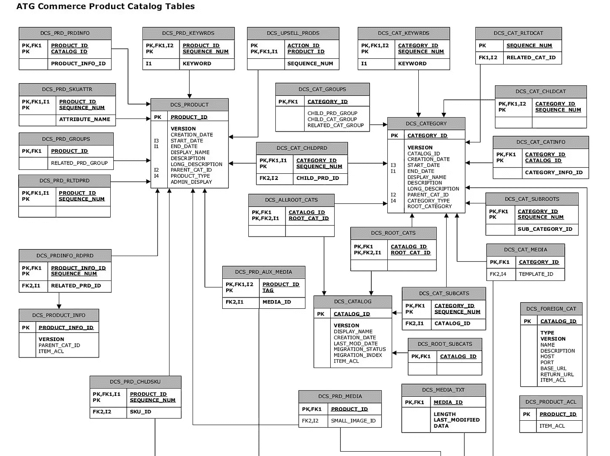
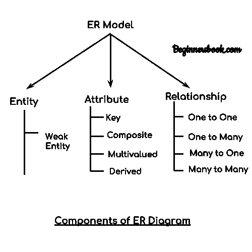
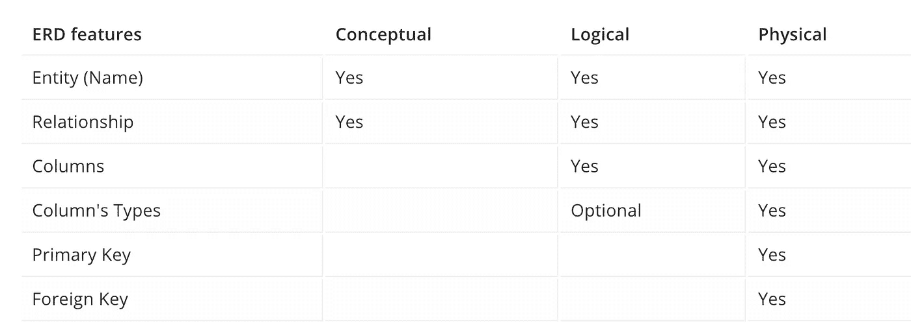
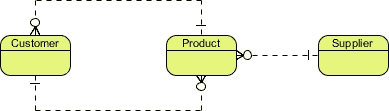
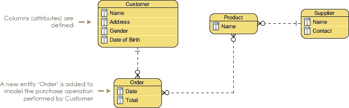
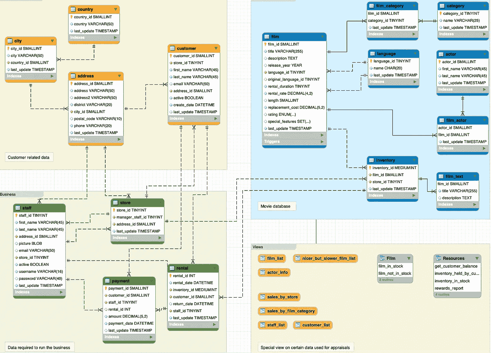
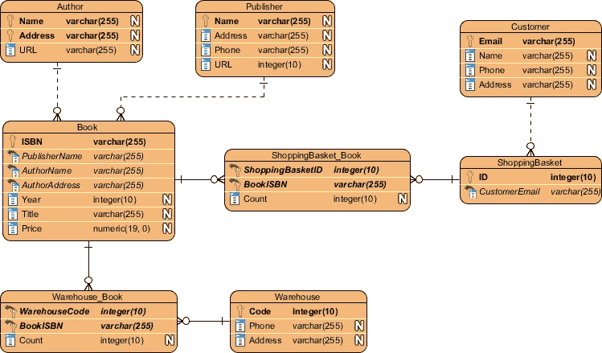

# 什么是实体关系图？

> 原文：<https://betterprogramming.pub/what-is-an-entity-relationship-diagram-d5db69a87971>

## 可视化应用程序中的模型和数据库中的表之间的关系

里卡多·戈麦斯·安吉尔在 [Unsplash](https://unsplash.com/s/photos/patterns?utm_source=unsplash&utm_medium=referral&utm_content=creditCopyText) 上的照片

程序员经常要和大型数据库打交道。不管我们使用哪种编码语言，总会有我们需要存储在应用程序后端的信息。保持你的数据库有组织是很重要的，这样你就可以在编码时访问你需要的信息。有多种方法可以让与您一起工作的其他程序员理解数据库。我非常喜欢使用的一个是实体-关系(ER)图:

# 什么被认为是好的数据库？

数据库可以被认为是一组逻辑上相关的记录。基于计算机的数据库通常被组织成一个或多个表。

表格由一系列行和列组成。以下是设计有效数据库时的一些重要事项:

*   将实体标识为与数据库相关的项目的逻辑集合。属性是实体的特征。
*   实体的物理副本是数据库表，属性的物理副本是列。
*   主键被标识为唯一标识实体的每个实例的属性。
*   两个实体之间的逻辑链接是关系。
*   当父实体的主键存在于子实体中时，它被称为外键。

# 什么是 ER 图？

实体关系模型是一种结构图模型。ER 图包含连接器和符号。它被称为实体关系图，因为我们指的是系统范围内的实体及其关系。

实体被称为对象。比如:学生、产品、公司、关系都在这些对象之中。当我们说关系时，我们指的是这些对象如何相互关联。

## 为什么是抽象层次？

ER 图分为三个抽象层次:概念模型、逻辑模型和物理模型。所有三个抽象层次都包含关于实体和关系的信息——它们在每个层次上的创建方式不同。

业务分析师更经常使用概念数据库模型。在这个抽象层次上，我们只显示我们需要处理的模型以及它们之间的关系。我们只是展示了数据库的概貌，以及它们之间的“一对多”、“多对多”和“一对一”关系。

逻辑数据模型是包含更多信息的概念数据模型。在这个模型中，我们还定义了称为属性的列，并进一步扩展了我们的关系，因此我们试图在数据库上设置的信息不会经常重复。

视觉范式

物理数据模型代表数据库的实际设计，也称为逻辑数据模型的复杂版本。最终确定物理模型后，每一列都显示其数据类型、特定数据类型的长度、私钥、外键等等。在这个抽象层次上，我们设置了数据库的所有限制和要求。

# 如何生成 ER 图

1.  确认 ERD 模型的目的。试着分离抽象的层次，这样在每个抽象上你就知道每个层次缺少什么。
2.  创建您的实体以及它们之间的关系。从三个表开始，如果你得到重复的数据，试着把它们分开。
3.  如果你从三张桌子开始，你可以很容易地结束五张或更多的桌子。这意味着将它们分开后，您可以更容易地访问信息。相信我，用主键和外键过滤信息比用 100 列保存相同的信息更容易。
4.  给你的实体列命名你需要的属性。
5.  最后设置你的属性，赋予它们特定的数据类型，并设置你的主键和外键。另外，不要忘记为每种数据类型设置它们的限制和要求。

视觉范式

您可以使用各种工具来创建 ER 图:

我真正喜欢使用的是 MYSQL Workbench 和 SQL Serve。特别是如果您是数据库的新手，它们将帮助您编码并同时创建图表。