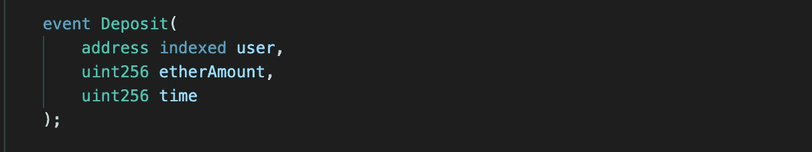
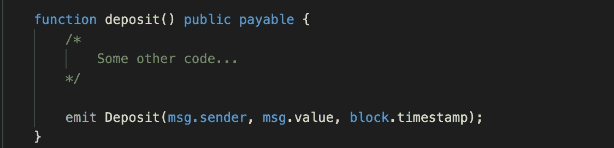

# 什么是固体中的事件？

> 原文：<https://betterprogramming.pub/what-is-an-event-in-solidity-420caeb38859>

## 事件概念简明指南


作者图片

简而言之，**事件**是与客户端应用程序或前端网站通信的方式，表明区块链上发生了一些事情。

就我个人而言，当我能够理解一个真实世界的用例时，我对概念理解得最好。下面是创建和发出事件的示例:

要声明新事件:



然后发出事件:



在本例中，当用户使用`deposit`函数向智能合约发送 Ether 时，会发出`Deposit`事件。

该事件包含三个值:存放的地址、存放的乙醚量以及用户进行存放的时间。

`msg.sender`和`msg.value`是全局变量，指定发送的以太网的发件人地址和数量。`block.timestamp`是一种使用当前块的生成时间来近似当前时间的方法。

# 为什么使用事件？

以上面的例子为例，假设您想要在客户端应用程序上显示一个确认存款的警告。这可以通过读取存款事件发出的数据轻松完成。

这是对 Solidity 中**事件**的一个非常基本的总结。如果你想看上面例子中事件和日志的用例，请继续阅读！

```
async function deposit(amount) {// Web3 connection and contract initialization code... const ethIn = ethers.utils.parseEther(amount)
  const tx = await contract.deposit({value: ethIn})
  const receipt = await tx.wait()
  const data = receipt.logs[0].data

  const [depositAmount, time] = ethers.utils.defaultAbiCoder.decode(
    ['uint256', 'uint256'], data
  ) alert(`Successful deposit of ${depositAmount.toString()} at time ${time}`)}
```

上面的函数接收一定量的乙醚，并调用智能合约上的存款函数。`receipt`保存交易回单的数据。`receipt.logs[0].data`分解`receipt`并允许用户访问由我们的存款事件发出的数据。

这些数据以编码的散列形式返回，在当前形式下用处不大。幸运的是， **ethers** 库有一个内置的编码。

`defaultAbiCoder.decode()`接受两个参数。第一个是发出数据的值类型。对于我们来说`etherAmount`和*时间*都是 uint256 类型。**编入索引的事件值不会出现在记录的数据中，更多信息请另找时间* *。第二个参数是我们想要解码的数据散列。

最后，我们显示一个带有解码数据的警报。