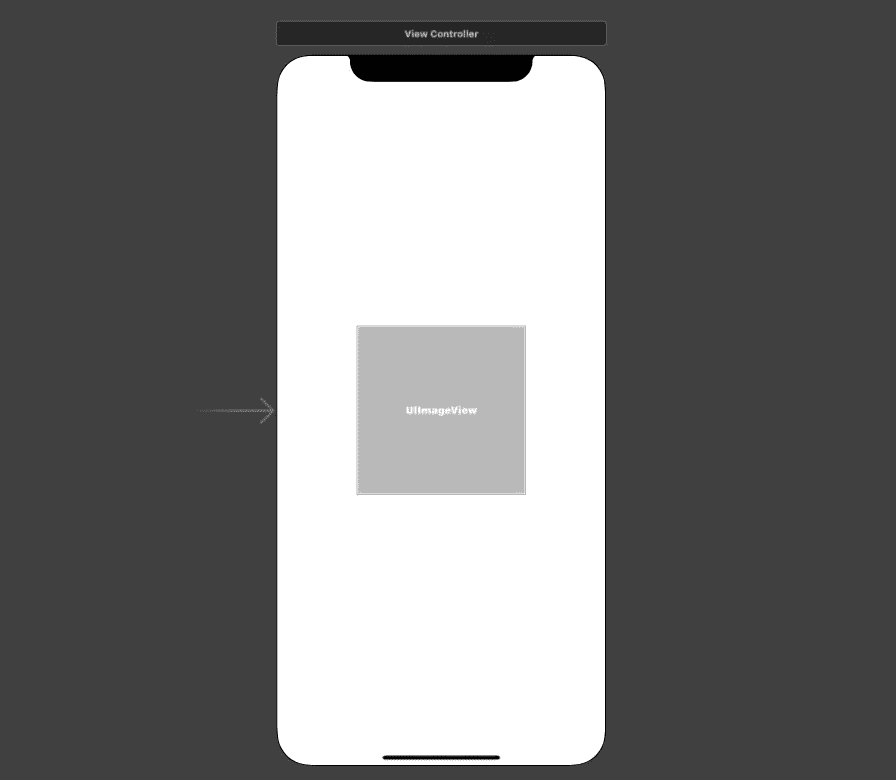
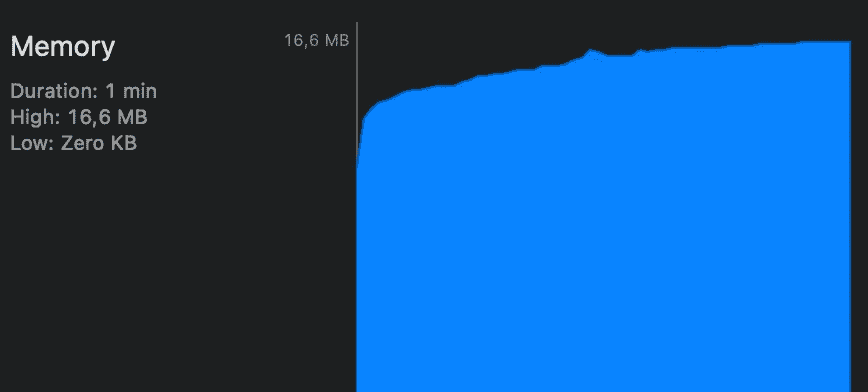

# Swift 中的自动释放池是什么

> 原文：<https://betterprogramming.pub/what-is-autorelease-pool-in-swift-c652784f329e>

## 以及如何优化循环中的内存使用

托马斯·巴吉在 [Unsplash](https://unsplash.com?utm_source=medium&utm_medium=referral) 上拍摄的照片

在本文中，我们将了解 Swift 中的`autoreleasepool`，以及它如何帮助我们优化循环中的内存使用。您将在本教程的末尾找到该项目的源代码。这是你将学到的东西:

*   什么是自动释放池
*   它是如何在引擎盖下工作的
*   何时以及如何在 Swift 代码库中使用它
*   如何在 Objective-C 中使用它(了解这个问题很有用，因为这个问题有时会在技术面试中被问到)

事不宜迟，我们开始吧。

# 我们开始吧

在我们定义自动释放池之前，我们需要知道引用计数是如何工作的。当创建一个引用时，执行`retain`命令，使对象保持活动状态。为了减少引用计数，并且当计数等于 0 时，潜在地从内存中删除对象，运行`release`命令。自动引用计数(ARC)为我们解决了这个问题。

`NSAutoreleasePool`是当池被清空时发送给`release`命令的对象的存储器。该池保留那些对象，直到调用`drain`方法，这发生在我们从创建该池的上下文返回时。例如，当我们在一个`for in`循环中有一个自动释放池时，这个池将在每次迭代后被清空。

现在我们已经知道了`NSAutoreleasePool`的基础知识，让我们在一个示例项目中使用它。

# 使用自动释放池

我们有一个简单的应用程序，在屏幕中央显示一个`UIImageView`:

我们的任务是加载 500 张图片，并在图片加载后在`UIImageView`中显示每张图片。所以我们在`ViewController`里面写了下面的代码:

1.  我们创建一个[串行 DispatchQueue](https://developer.apple.com/documentation/dispatch/dispatchqueue) ,用于图像加载任务。
2.  我们在`viewDidLoad()`内部调用`loadImages()`方法。
3.  获取每次调用检索随机图像数据的 url。
4.  运行图像加载任务 500 次
5.  图像检索后，在`UIImageView`中显示。

目前看来还不错，图像如预期所示:

然而，让我们观察它如何随着时间的推移影响记忆:

从上图我们可以看到，当我们的应用程序运行 60 秒时，我们使用了大约 55 MB 的内存。结果是，当循环运行时，每个图像都保存在内存中。我们可以通过在加载新图像后丢弃以前的图像来优化这个过程。这正是我们要通过使用`autoreleasepool`来实现的。

让我们按如下方式更新代码:

正如我们所看到的，我们将图像加载任务包装在一个`autoreleasepool`中。让我们再次检查内存占用:

这里我们看到，在使用自动释放池后，我们减少了大约 70%的内存使用。请注意，这种优化不仅适用于图像，我们还可以在从磁盘读取文件时利用自动释放池。

我们已经看到了在 Swift 中使用自动释放池是多么有用。然而，由于 Swift 中的 ARC，我们不再需要经常使用它。以前，在 Objective-C 中，自动释放池的使用会非常频繁，尤其是当我们想要返回一些以后会用到的对象时:

在上面的代码中，分配给`Obj`实例的内存在方法返回并且外部上下文结束使用后不会被释放，这导致了内存泄漏。

现在，我们在为`Obj`实例分配内存之后添加了 release 命令。但是，现在对象将在方法返回之前被释放，如果处理不当，可能会导致崩溃。

理想情况下，我们希望在外部上下文保存对对象的引用时保持对象的活动状态，并在对象不再被使用时销毁它。这就是自动释放技巧的用处:

# 资源

源代码可以在 [GitHub](https://github.com/zafarivaev/autoreleasepool-swift) 上找到。要了解有关自动释放池的更多信息，请访问官方文档。感谢阅读！