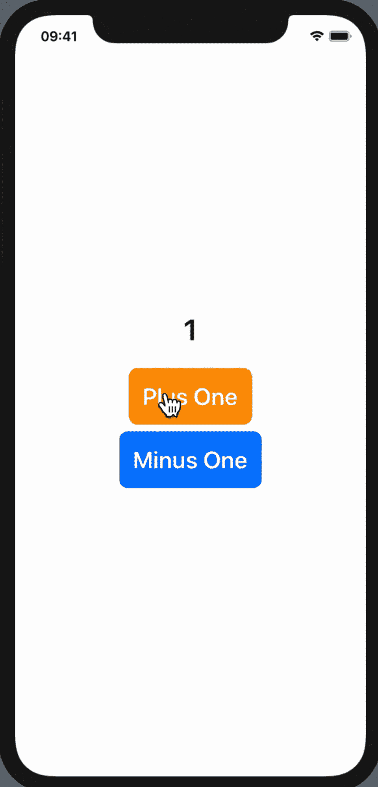
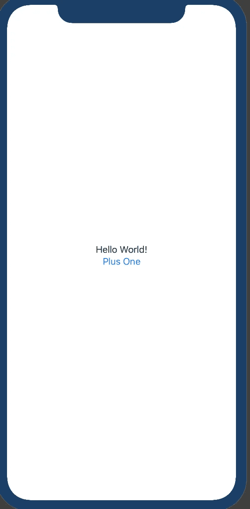
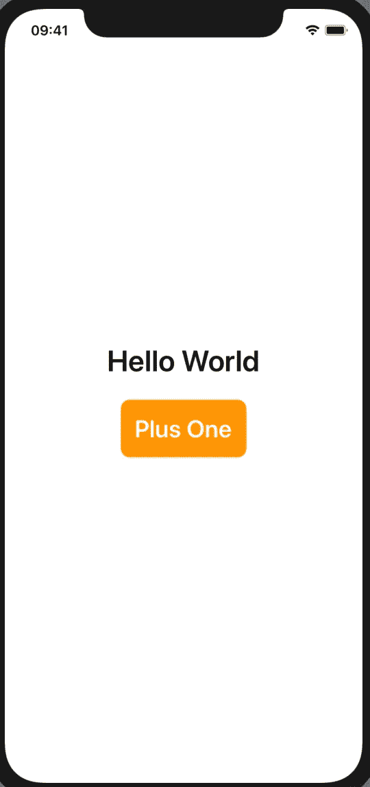
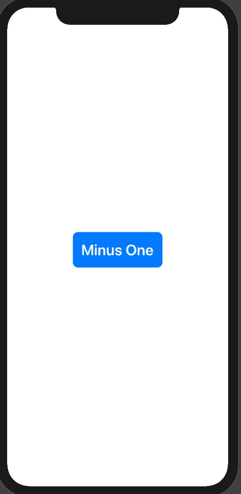

# SwiftUI 中的@Binding 是什么？

> 原文：<https://betterprogramming.pub/what-is-binding-in-swiftui-how-to-use-it-206d22affd9a>

## 你如何使用它？


Pierre Bamin 在 [Unsplash](https://unsplash.com/s/photos/binding?utm_source=unsplash&utm_medium=referral&utm_content=creditCopyText) 上拍摄的照片

苹果发布了 [SwiftUI](https://developer.apple.com/xcode/swiftui/) ，利用 [Swift](https://swift.org/) 的力量在所有苹果平台上构建用户界面。在我向您展示我们将在本文中构建什么之前，让我解释一下 SwiftUI 开发中最重要的概念之一:`@Binding`。

**注:**在进行`@Binding`之前，我强烈建议你通读一下我的`[@State](https://medium.com/better-programming/what-is-state-in-swiftui-and-how-to-use-it-cc672de85188)` [文章](https://medium.com/better-programming/what-is-state-in-swiftui-and-how-to-use-it-cc672de85188)，因为使用`@Binding`需要具备`@State`的知识。

# 什么是@绑定？

SwiftUI 中的视图可能包含多个子视图。您可能希望与这些子视图进行通信，或者希望子视图更改其父视图的值。使用`@Binding`，您可以将`@State` 变量值从父视图传递到子视图，如果子视图改变、变异或更改了`@State`的值，父视图将自动获得更新的值并重新呈现视图。这意味着您可以通过使用`@Binding`改变子视图中父视图的`@State`变量的值来从子视图中更新父视图。

让我们看看如何在 XCode 中使用`@Binding`变量。



# 设置

要创建项目，请在 XCode 中选择:“文件”>“新建”>“项目”>“单视图应用程序”>“下一步”>“选择用户界面”>“SwiftUI”>“下一步”>选择要保存该项目的位置>“完成”

## 内容视图. swift

默认`SwiftUI(ContentView)` 出现以下代码:

```
import SwiftUIstruct ContentView: View {
var body: some View {
    Text(”Hello World!”)
  }
}struct ContentView_Previews: PreviewProvider {static var previews: some View {
     ContentView()
   }
}
```

在右边，您可以看到 UI 的预览。如果你看不到预览，去右上角的“调整编辑器选项”，选择“画布”或者按“Option+Command+Enter ***”*** 然后确保 Canvas 正在显示 UI 预览。


# 创建用户界面

定义`ContentView`体内的垂直堆栈。这将包含`Text`和`Plus One`按钮。



代码:

```
VStack {
   Text("Hello World!")
   Button("Plus One"){
      //Action Goes Here
   }
}
```

对于最终的输出，我们希望定制文本字体大小，按钮字体大小，背景颜色，文本颜色，并使按钮的边缘呈圆形。

首先，我们修改按钮代码，这样我们就可以访问按钮的`Text`属性。修改后，代码将如下所示:

```
VStack{
   Text(”Hello World!”)
   Button(action: {
   //Button action goes here
   }){
      Text(“Plus One”)
     }
}
```

现在让我们来看看我们将用来实现我们想要的输出的属性。

我们可以使用属性`.font()`来改变字体大小:

```
Text("Hello World")
   .font(.largeTitle) // Font type
```

我们可以使用属性`.background(Color.COLOR_NAME)`改变背景颜色:

```
Text(“Hello World”) // Button Text
   .background(Color.orange) // Button Background Color
```

要改变文本颜色，我们可以使用属性`.foregroundColor(Color.COLOR_NAME)`:

```
Text(“Hello World”) // Button Text
   .foregroundColor(Color.white) // Button text color
```

为了使边缘呈圆形，我们可以使用属性`.cornerRadius(CORNER_RADIUS_VALUE)`:

```
Text(“Hello World”) // Button Text
   .cornerRadius(10.0) // Button corner radius property
```

如果我们将上述所有属性应用于文本和按钮，我们的代码将如下所示:

```
//Vertical StackVStack {
   //Text containing current value
   Text("Hello World")
      .font(.largeTitle)  // Font type or size
      .fontWeight(.bold)  // Font style

   Button(action: {
         //Button on click action goes here
      }){

      //Button Text a& its properties
      Text("Plus One")
         .font(.title)   // Font type or size
         .fontWeight(.bold)  // Font style
         .foregroundColor(Color.white) // Text Color
         .padding(16)    // Padding to the button
         .background(Color.orange) // Background color of the button
         .cornerRadius(10)   // Corner radius to make edges circular
      }
}
```

输出是这样的:



现在我们的 UI 已经准备好了，让我们看看如何实现`@Binding`。

# 声明@State 变量

现在我们声明`@State`变量。要声明一个`@State`变量，我们必须在声明变量之前使用`@State`关键字。查看下面一行，更好地理解如何声明`@State`变量。

```
@State var currentValue = 0
```

现在我们将在`Text`中设置`@State`变量的值。`Text`代码现在看起来像这样:

```
Text(“\(currentValue)”)
   .font(.largeTitle) // Font type or size
   .fontWeight(.bold) // Font style
```

每当用户点击按钮时，我们想要改变`@State`变量值。为此，我们需要改变`Button ACTION` 块中变量的值。要访问`button ACTION`方法中的`@State`变量，我们需要定义`self.STATE_VARIABLE_NAME` ，如下所示:

```
self.currentValue += 1
```

当用户点击按钮时，它会改变`@State`变量值。当`@State`变量值改变时，它再次渲染视图并改变显示的文本值。

整个代码如下所示:

```
//
//  ContentView.swift
//  State-Demo
//
//  Created by Mayur on 14/10/19.
//  Copyright © 2019 Mayur Rathod. All rights reserved.
//import SwiftUIstruct ContentView: View {

   @State **var** currentValue = 0

   **var** body: **some** View {
   //Vertical Stack
   VStack {
      //Text containing current value
      Text("\(currentValue)")
         .font(.largeTitle)  // Font type or size
         .fontWeight(.bold)  // Font styleButton(action: {
       //Button on click action goes here
       self.currentValue += 1
   }){
      //Button Text a& its properties
      Text("Plus One")
         .font(.title)   // Font type or size
         .fontWeight(.bold)  // Font style
         .foregroundColor(Color.white) // Text Color
         .padding(16)    // Padding to the button
         .background(Color.orange) // Background color of the button
         .cornerRadius(10)   // Corner radius to make edges circular
   }
  }
}struct ContentView_Previews: PreviewProvider {
    static var previews: some View {
        ContentView()
    }
}
```

# 创建子视图界面

现在让我们创建另一个 SwiftUI 文件，它将是`ContentView`的子视图。我们将这个文件命名为`BindingView.swift`。代码应该是这样的:

```
import SwiftUIstruct BindingView: View {
var body: some View {
    Text(”Hello World!”)
  }
}struct BindingView_Previews: PreviewProvider {static var previews: some View {
     BindingView()
   }
}
```

`BindingView`所需的用户界面如下所示。我们必须创建一个带有文本“减去一个**、**的按钮，它与我们在父视图中创建的按钮`ContentView.swift`相同。



代码:

```
var body: some View {
   VStack {
      Button(action: {
         //Button action goes here
      }){
         Text(“Minus One”)
            .font(.title)
            .fontWeight(.bold)
            .foregroundColor(Color.white) 
            .padding(16)
            .background(Color.blue)
            .cornerRadius(10)
        }
    }
}
```

# 声明@Binding 变量

现在我们将创建一个`@Binding`变量。要做到这一点，我们必须在声明变量之前使用`@Binding`关键字。

`@Binding`变量必须在视图主体之外声明:

```
@Binding var valueFromParent : Int
```

每当用户点击按钮时，我们想要改变`@Binding`变量的值。为此，我们现在需要更改`Button ACTION` 块中变量的值。定义`self.BINDING_VARIABLE_NAME` 是这样的:

```
self.valueFromParent -= 1
```

因此，当用户点击子视图中的“减一”按钮时，我们会将该值减一。一旦我们这样做，它将再次呈现父视图，显示递减后的最新值。

代码:

```
import SwiftUIstruct BindingView: View {
   @Binding var valueFromParent : Int

   var body: some View {
      VStack {
         Button(action: {
            self.valueFromParent -= 1
      }){
          Text(“Minus One”)
             .font(.title)
             .fontWeight(.bold)
             .foregroundColor(Color.white)
             .padding(16)
             .background(Color.blue)
             .cornerRadius(10)
         }
      }
   }
}struct BindingView_Previews: PreviewProvider {
   static var previews: some View {
       BindingView(valueFromParent: .constant(0))
   }
}
```

如果我们改变子视图中的值，父视图将再次呈现。

因为我们将把`@State`变量作为参数从父视图传递给子视图，子视图将改变`@Binding`变量的值。这相当于改变父视图中的`@State`变量值，根据`@State`变量定义，每当我们改变`@State`变量值时，视图将被再次渲染。

# 最终产品

完整的代码如下所示:

父视图，即`ContentView.swift`:

```
import SwiftUIstruct ContentView: View {
   @State var currentValue = 0

   var body: some View {
   //Vertical Stack
   VStack {
      //Text containing current value
      Text(“\(currentValue)”)
         .font(.largeTitle) // Font type or size
         .fontWeight(.bold) // Font style
      Button(action: {
         //Button on click action goes here
         self.currentValue += 1
      }){
       //Button Text a& its properties
       Text(“Plus One”)
         .font(.title) // Font type or size
         .fontWeight(.bold) // Font style
         .foregroundColor(Color.white) // Text Color
         .padding(16) // Padding to the button
         .background(Color.orange) // Background color of the button
         .cornerRadius(10) // Corner radius to make edges circular
      }

       //Child View
       BindingView(valueFromParent: $currentValue)
    }
   }
}struct ContentView_Previews: PreviewProvider {
   static var previews: some View {
     ContentView()
   }
}
```

子视图，或`BindingView.swift`:

```
import SwiftUIstruct BindingView: View {
   @Binding var valueFromParent : Int
      var body: some View {
      VStack {
         Button(action: {
            self.valueFromParent -= 1
         }){
         Text(“Minus One”)
          .font(.title)
          .fontWeight(.bold)
          .foregroundColor(Color.white)
          .padding(16)
          .background(Color.blue)
          .cornerRadius(10)
         }
      }
   }
}struct BindingView_Previews: PreviewProvider {
   static var previews: some View {
      BindingView(valueFromParent: .constant(0))
   }
}
```