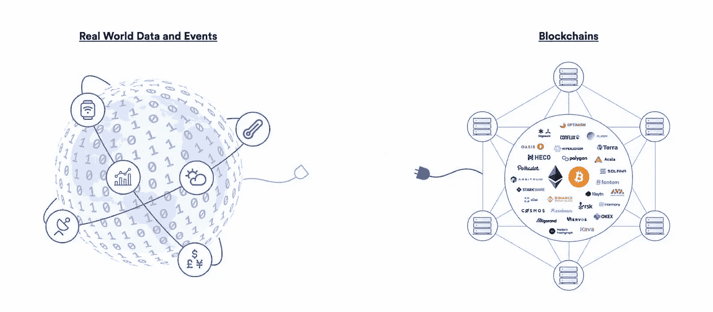

# 什么是区块链甲骨文？

> 原文：<https://betterprogramming.pub/what-is-blockchain-oracle-ce2ad4a46c08>

## 了解甲骨文的类型及其实际使用案例

图片由[https://chain.link/](https://chain.link/)提供。作者编辑

理想情况下，Oracles 提供了一种简单的方式来获取外部(即，“真实世界”或链外)信息，如货币对的价格、黄金价格或真正的随机数，并将其放到以太坊平台上，供智能合约使用。

区块链和智能合约无法访问链外数据(网络之外的数据)。然而，对于一些合同协议来说，拥有来自外部世界的相关信息以执行协议是至关重要的。

这就是区块链 oracles 的用武之地，因为它们提供了链外和链内数据之间的链接。甲骨文在区块链生态系统中至关重要，因为它们拓宽了智能合约的运作范围。如果没有它，智能合同的用途将非常有限，因为它们只能从其网络内部访问数据。

重要的是要知道，区块链 oracle 不是数据源本身，而是查询、验证和认证外部数据源，然后传递这些信息的层。oracles 提供的数据有多种形式——价格信息、支付的成功完成或传感器测得的温度。例如，让我们进行一个 API 调用:

## 分散神谕

分散的神谕与公开的区块链有着完全相同的目标——避免交易对手风险。

它们增加了提供给智能合约的信息的可靠性，而不依赖于单一的真实来源。智能契约查询多个 Oracle 来确定数据的有效性和准确性，这就是为什么分散式 Oracle 也可以称为一致 Oracle。

[ChainLink](https://chainlinklabs.com/) 提出了一个去中心化的 oracle 网络，该网络由三个关键的智能合同组成——一个信誉合同、一个订单匹配合同和一个聚合合同——以及一个数据提供商的链外注册中心。

分散 oracle

## 集中神谕

集中式 oracle 由一个实体控制，并且是智能合同的唯一信息提供者。使用一个信息源可能有风险——契约的有效性完全取决于控制甲骨文的实体。来自不良参与者的任何恶意干扰将直接影响智能合约。集中式 oracles 的主要问题是存在一个故障点，这使得契约对漏洞和攻击的弹性较低。如果你愿意信任一个集中但可审计的服务，你可以去 [Provable](https://provable.xyz/) 。

## 神谕的类型

*   **软件 Oracle:**它处理来自在线来源的信息数据，如温度、商品和货物价格、航班或火车延误等。oracle 软件获取所需的信息，并将其推入智能合同。
*   **硬件神谕:**一些智能合约需要直接来自物理世界的信息，例如，运动传感器必须检测运动，并将数据发送到智能合约或供应链行业中的 RFID 传感器。
*   **Inbound Oracle:**它提供来自外部世界的数据。
*   **出站 Oracle:**它为智能合约提供了向外部世界发送数据的能力。例如，一个智能锁接收区块链地址的付款，需要自动解锁。
*   **基于共识的神谕:**他们从人类共识和预测市场获取数据，如[占卜](https://augur.net/)。只使用一个信息来源可能会有风险。为了避免市场中的操纵，预测市场实施了一个神谕评级系统。为了进一步的安全，可以使用几个预言的组合，例如，五个预言中的三个可以确定事件的结果。

## 实际使用案例

**可靠性:**要使用价格数据，您的智能合约应该引用`[AggregatorV3Interface](https://github.com/smartcontractkit/chainlink/blob/master/contracts/src/v0.8/interfaces/AggregatorV3Interface.sol)`，它定义了数据馈送实现的外部函数。

`latestRoundData`函数返回代表最新价格数据的五个值。

**JavaScript:** 从以太坊网络上的 [ETH / USD 提要](https://kovan.etherscan.io/address/0x9326BFA02ADD2366b30bacB125260Af641031331)中检索提要数据。

 [## 了解以太坊加密技术

### 密码术是如何工作的？本文介绍了什么是公钥和私钥，以及如何使用它们

better 编程. pub](/understanding-ethereum-cryptography-3ef7429eddce)