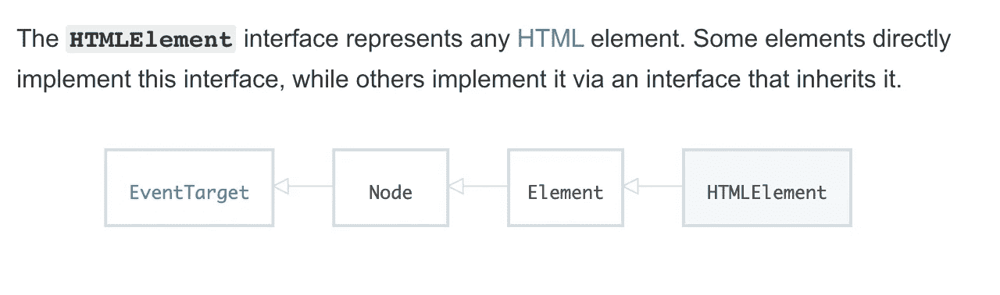
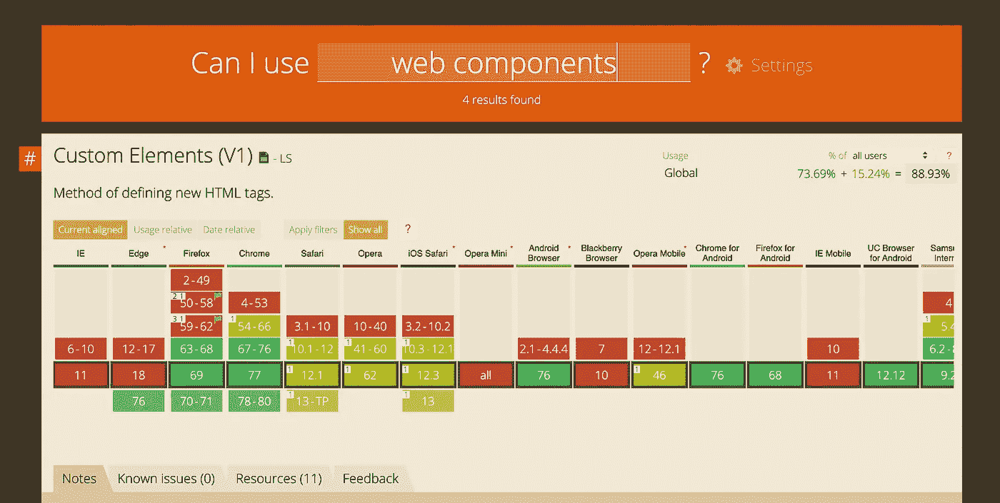

# 什么是面向组件编程(COP)？

> 原文：<https://betterprogramming.pub/what-is-component-oriented-programming-cop-10b32ae1fa1c>

## 面向组件编程是新的面向对象编程


照片由[丹尼尔·科尔派](https://unsplash.com/@danielkorpai?utm_source=medium&utm_medium=referral)在 [Unsplash](https://unsplash.com?utm_source=medium&utm_medium=referral)

有了所有最新的前端框架——比如 React、Angular 和 Vue——我们看到一个很酷的新范式正在崛起。它被称为面向组件的编程，它就是像乐高积木一样将可重用的组件拼接在一起。

在其核心，面向组件的架构信奉不要重复你自己(干)的教条。重复代码是浪费时间和效率。我们花在重复自己身上的时间越少，我们构建应用程序的速度就越快。作为软件工程师，我们有时会设定最后期限，利用任何优势在满足我们的上司方面都是至关重要的。

# 面向组件的编程是什么样子的

如果你知道任何现代前端框架，比如 React、Angular 或 Vue，你可能已经知道基于组件的架构是什么样子了。下面是一个`Header`组件的基本例子:

```
import React from 'react';
import { Logo, ProfileImage, BurgerMenu, HeaderWrapper } from 'components';

const Header = () => (
  <HeaderWrapper>
    <Logo></Logo>
    <ProfileImage></ProfileImage>
    <BurgerMenu></BurgerMenu>
  </HeaderWrapper>
)

export default Header;
```

如您所见，我们正在导入组件、合成并像砌砖一样铺设它们，以修改应用程序的一部分——在本例中为标题。

# 面向组件编程解决的问题

COP 是一个强大的概念，因为它让我们隔离和封装逻辑。我们的文件越小，就越容易维护——就这么简单。脸书有一个很好的理由去创新和修复他们著名的通知错误。

回到大约 2014 年至 2015 年，通知会不断指示您有新通知，但当您点击红色通知铃时，它不会显示任何新通知。这在互联网上引发了愤怒。错误的原因是不可维护的，大量的文件和杂乱的 PHP 代码。我不是想抨击 PHP。我认为这很实用，也是让事情起步的好方法。用任何语言都有可能写出意大利面条式的代码——在这种情况下，可怜的罪魁祸首恰好是 PHP。

发明 React 是为了解决这个特殊的通知问题，这个库的诞生标志着一个新时代的开始。那个时代被称为面向组件编程(COP)。

我对未来的预测是完全的本地 web 组件。到目前为止，每个框架都有自己的工具、组件、库等生态系统。虽然重用开源代码很方便，但不酷的是每个生态系统都把自己锁在了一个泡泡里。如果你知道 React，你只能使用 React 版本的代码。你不能用有棱角的工具来搭配 Vue 或 Svelte。原生 Web 组件 API 将改变这一切。

想想如果我们能在所有图书馆之间共享的可能性。

证据 A:有人写了一个很棒的动画库，它可以作为库与所有框架兼容，只要它是用 JavaScript 写的，或者被编译成 JavaScript。这正是原生 Web 组件 API 的目标:所有库共享代码的统一方式。如果你想了解更多关于 Web 组件 API 的知识，请阅读这篇文章。

[](https://medium.com/better-programming/web-components-api-in-a-nutshell-c409127d563a) [## 简而言之，Web 组件 API

### 本机 Web 组件 API 的内容和原因

medium.com](https://medium.com/better-programming/web-components-api-in-a-nutshell-c409127d563a) 

# Web 组件 API

很快，我们将为所有 JavaScript 库和框架提供一个统一的 API 来共享代码。您只需编写一次代码，就可以在任何地方重复使用。Web 组件 API 让我们完成所有这些工作。这是一个使用 Web 组件 API 的简单按钮的外观:

```
class WebComponentButton extends HTMLElement {

  constructor() {
    super()
    this.addEventListener('click', () => {
      console.log('click')
    })
  }

}
```

web 组件是一段简单的基于类的继承代码。注意我们是如何扩展按钮来继承`HTMLElement`类的。



html element—[https://developer . Mozilla . org/en-US/docs/Web/API/html element](https://developer.mozilla.org/en-US/docs/Web/API/HTMLElement)

如果你很好奇，想了解更多关于 web 组件的知识，请查阅 Mozilla 文档。Mozilla 在 web 组件方面写得很好。

[](https://developer.mozilla.org/en-US/docs/Web/Web_Components) [## Web 组件

### 作为开发人员，我们都知道尽可能多地重用代码是一个好主意。传统上不是这样的…

developer.mozilla.org](https://developer.mozilla.org/en-US/docs/Web/Web_Components) 

下次当您考虑解决一个问题时，尝试用基于组件的架构思维和解决方案来处理它。随着复杂性的增加，基于组件的架构确实大放异彩。挑战越大，你就越应该把它分成小块。

# 对 Web 组件 API 的浏览器支持

API 正在获得关注和支持。请记住，这是一项相对实验性的技术，没有人知道它将在何时以及如何被标准化，但是了解最新、最酷的编程相关技术总是好的。



[https://caniuse.com/#search=web%20components](https://caniuse.com/#search=web%20components)

不要担心，你还不需要学习另一种 API 或技术。JavaScript 人口统计的情况变化很快，但是用更方便的工具来扩展您的工具箱并没有坏处。

如果你是 JavaScript 新手，想学习这门语言，我建议你从阅读书籍和构建东西开始。从《 [*一个更聪明的学习 JavaScript 的方法*](https://amzn.to/2LOkzjj) 》和[这本书开始吧，这里有一个要构建的有趣应用的列表](https://medium.com/better-programming/the-secret-to-being-a-top-developer-is-building-things-heres-a-list-of-fun-apps-to-build-aac61ac0736c)。

感谢阅读，保持敬畏。编码快乐！