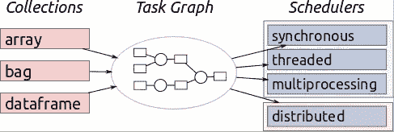

# Dask 是什么，作为一名数据科学家，它能为您提供什么帮助？

> 原文：<https://betterprogramming.pub/what-is-dask-and-how-can-it-help-you-as-a-data-scientist-72adec7cec57>

## 管理大数据不再意味着仅仅购买更大更快的服务器

内森·约翰在 [Unsplash](https://unsplash.com/s/photos/big?utm_source=unsplash&utm_medium=referral&utm_content=creditCopyText) 上拍摄的照片

这也意味着需要理解并行计算的概念。

有助于管理这一特定概念的工具和数据系统每年都在增加。无论是使用 AWS 和查询[红移](https://aws.amazon.com/redshift/)还是自定义库，学习如何并行处理数据的需求都是非常有价值的。

python——由于其易用性而成为最受欢迎的语言——提供了许多库，使程序员能够开发更强大的软件来并行运行模型和数据转换。

如果一个神奇的解决方案出现了，它提供了并行计算、加速的算法，甚至允许你将 [NumPy](https://numpy.org/) 和 [pandas](https://pandas.pydata.org/) 与 [XGBoost](https://xgboost.readthedocs.io/) 库集成在一起，会怎么样？

嗯，我们确实有那种神奇的药水，它的名字叫做“ [Dask](https://dask.org/) ”。

在本文中，我们将讨论 Dask 是什么以及为什么您可能会考虑使用它。

# Dask 是什么？

Dask 是一个开源项目，允许开发者与 scikit-learn、pandas 和 NumPy 合作开发他们的软件。这是一个非常通用的工具，可以处理各种工作负载。

该工具包括两个重要部分:动态任务调度和大数据收集。前一部分与 [Luigi](https://github.com/spotify/luigi) 、 [Celery](https://github.com/celery) 和 [Airflow](https://airflow.apache.org/) 非常相似，只是它专门针对交互式计算工作负载进行了优化。

后一部分包括数据帧、并行数组和扩展到 pandas 和 NumPy 等流行接口的列表。

事实上，Dask 的创始人 Matthew Rocklin 先生证实 Dask 最初是为了使 pandas 和 NumPy 并行化而创建的，尽管它现在提供了比一般并行系统更多的好处。

Dask 的数据框是扩展 pandas 工作流和启用时间序列应用程序的理想选择。此外，Dask 阵列为生物医学应用以及机器学习算法提供多维[数据分析](https://www.theseattledataguy.com/intro-data-analysis-everyone-part-1/)。

# 可扩展分析向导

Dask 如此受欢迎是因为它使得 Python 中的分析具有可扩展性。

神奇的是，这个工具只需要最少的代码修改。该工具在拥有超过 1000 个内核的集群上弹性运行！此外，您可以在处理数据的同时并行运行这些代码，这可以减少执行时间和等待时间！

Dask 数据帧包括较小的 pandas 数据帧，这就是为什么它允许 pandas 查询语法的子集。

来源:https://docs.dask.org/en/latest/

这个工具完全能够调度、构建、甚至优化复杂的计算计算到图形中。这就是运营 100 TB 数据的公司可以选择该工具作为首选的原因。

Dask 还允许您为数据数组构建管道，这些数据数组稍后可以被传送到相关的计算资源。总而言之，这个工具远不止是一个平行版的熊猫。

# Dask 如何工作

现在我们已经理解了 Dask 的基本概念，让我们看一个示例代码来进一步理解:

对于那些熟悉数据框和数组的人来说，这几乎就是您放置这些数据的地方。

在这种情况下，您已经将数据放入 Dask 版本中，您可以利用 Dask 提供的分布特性来运行与 pandas 相似的功能。

当您在正确的设置上运行 Dask 时，这就是 Dask 的伟大之处。

# scikit-learn 怎么样？

scikit-learn 是[数据科学家](https://www.theseattledataguy.com/4-skills-data-scientist-must-have/)日常使用的一个流行库。有时，您处理的数据量太大，无法在一台服务器上运行。

达斯克也能帮上忙。

Dask 有几个选项，例如，您可以采用几乎任何模型，并使用增量包装器对其进行包装。这个包装器允许最终用户利用这样一个事实，即一些估计器可以在不查看整个数据集的情况下进行增量训练。

> 例如，`[dask_ml.wrappers.Incremental](https://dask-ml.readthedocs.io/en/latest/modules/generated/dask_ml.wrappers.Incremental.html#dask_ml.wrappers.Incremental)`提供了 Dask 和 scikit-learn 估算器之间的桥梁，支持`partial_fit` API。你用`Incremental`包装了潜在的估计量。
> 
> [Dask-ML](https://dask-ml.readthedocs.io/en/latest/) 将按顺序将 Dask 数组的每个块传递给底层估计器的`partial_fit`方法。”- [来源](https://dask-ml.readthedocs.io/en/latest/incremental.html)

您可以看到下面的例子，在这个例子中，您可以非常容易地在您的模型上使用增量包装器。

从现在开始，这将取决于您决定如何运行您的特定模型，以及您的公司在基础架构方面有什么设置。

# 为什么 Dask 这么受欢迎？

作为一个由 [PyData](https://pydata.org/) 生成的现代框架，Dask 由于其并行处理能力得到了很多关注。

在处理大量数据时——尤其是大于 RAM 的数据块——这是非常棒的，以便获得有用的见解。公司从 Dask 提供的强大分析中受益，因为它在单台机器上进行高效的并行计算。

这就是为什么跨国公司如 Gitential、Oxlabs、DataSwot 和 Red Hat BIDS 已经在日常工作系统中使用 Dask 的主要原因。总的来说，Dask 被认为是超级受欢迎的，因为:

1.  集成:Dask 提供了与许多流行工具的集成，包括 [PySpark](https://spark.apache.org/docs/latest/api/python/index.html) 、pandas、 [OpenRefine](https://openrefine.org/) 和 NumPy。
2.  动态任务调度:它提供动态任务调度并支持许多工作负载。
3.  熟悉的 API:这个工具不仅允许开发人员以最少的代码重写更自然地扩展工作流，而且它还可以与工具甚至它们的 API 很好地集成。
4.  向外扩展集群:Dask 想出了如何分解大型计算，并有效地将它们路由到分布式硬件上。
5.  安全性:Dask 支持加密，并通过使用 TLS/SSL 认证进行认证。

# Dask 的利与弊

现在，我们确实有一些 Dask 的替代品，比如阿帕奇 Spark T1 和 T2 Anaconda T3，那么为什么选择 Dask 呢？让我们权衡一下这方面的利弊。

## **使用 Dask 的利弊**

1.  它提供与熊猫的并行计算。
2.  Dask 提供了与 pandas API 相似的语法，所以不太难熟悉。

## **使用 Dask 的缺点**

1.  在 Dask 的情况下，与 Spark 不同，如果您希望在创建集群之前尝试该工具，您不会发现独立模式。
2.  它不能与 [Scala](https://www.scala-lang.org/) 和 [R](https://www.r-project.org/) 一起扩展。

# 是时候调查 Dask 了吗？

作为一个支持并行计算的灵活的 Python 库，Dask 有很多优点。Dask 不仅可以在分布式集群上运行，还允许用户根据自己的利益用单机调度程序来替换它。

另一方面，开发人员发现这个工具非常方便，因为它的语法非常简单，非常类似于 Python 库。

总而言之，这个工具对所有人来说都是双赢的。因此，如果您的组织正在运营大数据，这就是您需要的工具。如果您是一名开发人员，那么您必须尽快熟悉 Dask，因为“未来就在这里”