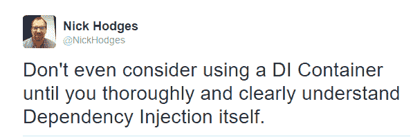

# 什么是依赖注入？

> 原文：<https://betterprogramming.pub/what-is-dependency-injection-b2671b1ea90a>

## 这比你想象的要简单

安妮·斯普拉特在 [Unsplash](https://unsplash.com?utm_source=medium&utm_medium=referral) 上的照片

# 介绍

我有三个孩子。他们现在年纪大了，但他们年轻的时候，和他们一起烤东西很有趣。我们会烤一个蛋糕或者饼干或者其他一些他们喜欢吃的糖果。但是有一个问题——我们烘烤的时候弄得一团糟。到处都是面粉、糖和各种各样的东西，在我们身上到处都是。烘焙的过程给我们留下了大量的清理工作。这需要大量的工作。当然，我们玩得很开心，但是一团糟。

怎么避免乱七八糟？我想，我们应该更小心些，但孩子终归是孩子。通常，我们会烤生日蛋糕。当然，除了烘焙蛋糕的麻烦和混乱之外，另一个选择是去商店买一个预制的蛋糕。一个更好的解决方案是找到一个面包店，它会把生日蛋糕送到你的家门口，正好是你想要的生日蛋糕。

现在还有一些其他的事情要考虑。假设送货员出现了，他一直在泥泞中行走，他的靴子很脏，他咳嗽得很厉害。你会让他进你的房子吗？没有——当然没有。你可能会透过门缝看他一眼，告诉他把蛋糕盒放在门廊上，然后滚出你的草坪。我想，你也会小心蛋糕，但为了便于讨论，我们假设它包装得很好，不会被送货员喷出的痰弄脏。换句话说，你希望你和送货员的互动尽可能的少，但是你仍然想要蛋糕。如果你的孩子不能吹灭生日蛋糕上的蜡烛，他/她会很不高兴。你希望蛋糕没有脏乱，与送货员的互动最少。

有人甚至会说，你对生日蛋糕有依赖，而面包店通过给你送蛋糕来注入这种依赖。嗯。

或者让我们假设你在超市，你有一个装满杂货的购物车。你把它们拿给收银员，他把它们都收好。他说，“一共是 123.45 美元。”那你是做什么的？你会把你的钱包交给他，让他到处找现金或信用卡吗？当然不是——你想尽可能减少与钱包的互动——你不想让他在里面翻来翻去。谁知道会发生什么。相反，你给他现金，或者掏出你的信用卡递给他。或者更好的是，你自己刷卡，这样收银员甚至不会碰你的卡。同样，你希望这种互动越少越好。你可能会说，你想把你和店员之间的交流减到最少。

再来一杯。说你在看买房。你找遍了全镇，终于找到了一个自己喜欢的地方:地段好，学区优，邻里好。只有一个问题:所有的电气设备都是硬连线到房子里的。所有的灯，烤面包机，吹风机，一切都是硬连线的。房子里没有插头。所有东西都直接连接到电气系统，所以你不能轻易更换任何东西。

电气设备和电气系统之间的标准接口、电气插座不存在。你不可能不叫电工就换掉你的烤面包机。有人可能会说，缺乏接口使得事情很难处理，因此你决定不买房子。

你看到这里的模式了吗？

好了，故事讲够了。我会说的。在你的代码中，对象之间的交互应该尽可能的简洁。你应该确切地要求你所需要的，不要更多。如果你需要什么，你应该去要求——让它“送”给你，而不是自己去创造。这样，就像蛋糕、收银台和房子一样，一切都保持整洁和灵活。我认为简洁、干净、灵活的代码听起来很不错。

这就是依赖注入的本质。仅此而已。依赖注入是一个 10 美分概念的 25 美元术语:如果你需要什么，就去要。不要自己创造东西——把它推给别人。任何种类的物质都可能需要其他种类的帮助。如果你的班级需要帮助，请求帮助；不要试图“自己动手”。记住，每当你试图“自己做”时，你就创建了一个硬编码的依赖。同样，这些应该像全局变量一样避免。

正如我们将会看到的，事情真的就这么简单。

需要注意的一点是，我还没有使用单词*容器*。事实上，这是我的一条推文:

这听起来可能有点奇怪，但它指出了重要的一点:进行依赖注入和使用依赖注入容器是两回事。它们是相关的——后者使前者更容易扩展——但它们不是一回事。在这篇文章中，我甚至不打算谈论阿迪容器。

# 那么依赖注入到底是什么？

到目前为止，您可能想知道 DI 到底是什么。根据马克·西曼,《依赖注入》一书的作者。Net，“依赖注入”是“一套软件设计原则和模式，使我们能够开发松散耦合的代码。”这是一个很好的定义，但有点保守。让我们更深入地探讨一下。

如果你要注入一个依赖，你需要知道什么是依赖。依赖是给定类完成其工作所需的任何东西，如字段、其他类等。如果`ClassA`需要`ClassB`到场编译，那么`ClassA`就依赖于`ClassB`。或者换句话说，`ClassB`是`ClassA`的附属物。当你创建一个依赖关系时，它就被创建了。这里有一个例子:

在上面的代码中，我们在`ClassA`中创建了对`ClassB`的硬编码依赖。这就像之前讨论的吹风机或烤面包机一样，它是与班级紧密相连的。`ClassA`完全依赖`ClassB`。`ClassB`耦合到`ClassA`。紧密耦合。你能得到的最紧密的耦合。紧耦合是不好的。

## 关于耦合的一句话

耦合是一个事物依赖于另一个事物的概念。紧耦合是指事物真正相互依赖，并且被严格地联系在一起。如果没有 B 类的完整定义，就不能编译 A 类。紧密耦合是不好的——它会产生不灵活的代码。想想看，如果你和另一个人被铐在一起，走动会有多困难。当您创建硬编码的依赖项时，这就是类的感觉。

您想要的是保持您的类和模块之间的耦合尽可能“松散”。也就是说，您希望您的依赖项尽可能的薄。如果您有一个需要客户名称的类，只需传入客户名称。不要放过整个客户。正如我们将看到的，如果你的类需要另一个类，传入一个抽象——一个接口，通常是那个类的接口。界面就像一缕烟——有些东西在那里，但你真的抓不住它。

# 怎么办？

嗯，首先要做的是不要在`ClassA`里面创建`ClassB`。相反，通过构造函数注入依赖关系:

所以在这一点上，我们有两种类型的耦合:一种是第一个类创建第二个类的实例，另一种是第一个类需要第二个类(也就是它被注入的地方)。后者优于前者，因为它涉及更少(更松散)的耦合。

# 结论

朋友们，这就是 DI 的精髓。注入依赖项，而不是创建依赖项。就是这样。这就是依赖注入。如果您理解了应该针对抽象进行编码以及应该要求您需要的功能的概念，那么您就已经很好地理解了依赖注入并编写了更好的代码。

依赖注入是达到目的的一种手段，而这个目的就是松散耦合的代码。