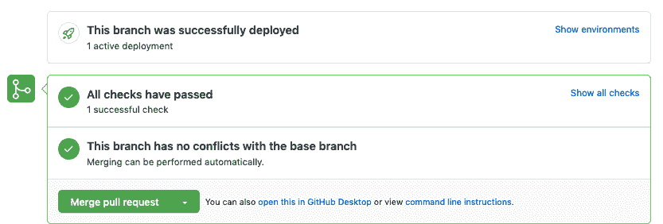
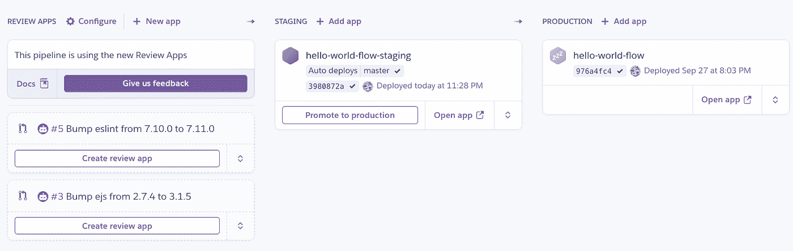
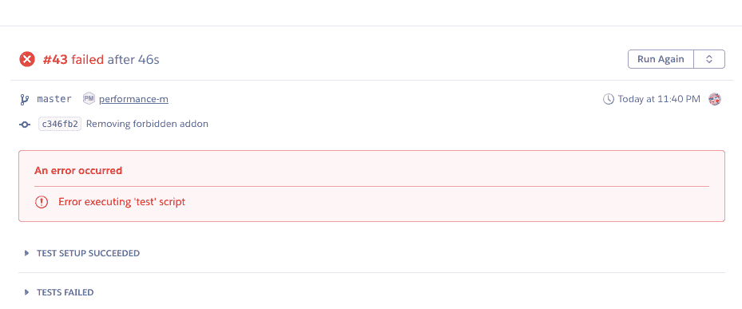

# 什么是 DevSecOps？

> 原文：<https://betterprogramming.pub/what-is-devsecops-44447d6727e8>

## DevSecOps 概述以及如何使其自动化

萨曼莎·甘乃迪在 [Unsplash](https://unsplash.com?utm_source=medium&utm_medium=referral) 上的照片

随着敏捷产品开发模型的扩散，各个层次的行业专家都开始意识到增量发布的价值。然而，也有一种期望，即每个发布周期都将维护和提高所交付产品的可靠性和安全性。

作为开发人员或工程师，您面临的挑战是在不减慢开发速度或推迟发布日期的情况下实现安全性最佳实践。本文将说明在开发生命周期中包含安全实践的几种方法，以防止以后出现严重问题，并且不会降低您的速度。

我将使用 [Heroku 流程](https://www.heroku.com/flow)作为一个示例流程来展示如何将这些安全实践(或 DevSecOps)集成到您的 CI/CD 实践中，尽管这些实践可以用于几乎任何常见的场景。

# 什么是 DevSecOps？

DevSecOps 是在产品开发过程的早期集成安全最佳实践的理念。使用 DevSecOps，安全性不会被视为一个孤立的过程或单独的特性，而是开发生命周期中不可或缺的一部分。自动化有助于您尽早发现并修复安全问题，最好是在将应用程序代码合并到代码存储库的主要分支之前。

DevSecOps 实践的一些例子包括扫描安全漏洞的存储库、早期威胁建模、安全设计评审、静态代码分析和代码评审。

# 进入 Heroku 流程

Heroku Flow 为基于 Heroku 的应用提供全面的 CI/CD 解决方案。它在一个视图中无缝地将多个服务(Heroku pipelines、review apps、 [Heroku CI](https://www.heroku.com/continuous-integration) 和 GitHub 集成)联系在一起，使工程师能够更好地了解每个代码发布，从拉取请求到生产下线。

为了直观起见，请查看从最初提交到生产 *的这个 [Heroku 流程工作流。](https://www.heroku.com/html/continuous-delivery/cd-animation.html)*

如上图所示，当创建拉请求时，自动化测试将在 [Heroku CI](https://www.heroku.com/continuous-integration) 中运行。Heroku CI 是 Heroku 的云持续集成工具；它可以自动检测语言并运行默认命令(如`npm test`)，也可以通过`app.json`文件进行配置。CI 结果可以在 GitHub 和 Heroku 界面中的 pull 请求细节中找到。

对于一个成功的 CI 构建，使用[评审应用](https://devcenter.heroku.com/articles/github-integration-review-apps)创建一个新的应用评审，并将其部署到一个新的临时 Heroku 环境中。GitHub pull request 视图中提供了新的环境链接，允许工程师轻松地检查 CI 结果或立即运行任何手动测试。

在合并拉取请求后，应用程序的新审查在使用 [Heroku 管道](https://devcenter.heroku.com/articles/pipelines)的预生产环境中可用。然后评审就可以提升到生产了。

请注意，虽然 Heroku Flow 的一些部分包含在免费帐户中(即 pipelines 和 review apps)，但一些功能需要付费(Heroku CI)。

# 如何用 Heroku 流自动化 DevSecOps

作为一个与 GitHub 集成的全面的 CI/CD 解决方案，Heroku Flow 提供了几种方法来自动化您的 DevSecOps 实践。下面我们来探讨三个常见的例子:

*   安全升级具有安全漏洞的依赖项
*   尽早发现安全漏洞
*   防止未经授权的组件或库

# 安全升级具有安全漏洞的依赖项

您可能已经知道应该升级具有已知漏洞的依赖项。识别和更新这些依赖关系可能非常耗时。幸运的是，您可以自动完成大部分工作。

GitHub 提供了一个依赖漏洞扫描器，也称为[dependent bot](https://docs.github.com/en/free-pro-team@latest/github/administering-a-repository/configuration-options-for-dependency-updates)，可以在 GitHub 的安全设置中针对每个存储库启用[。默认情况下，当识别出存在已知漏洞的依赖项时，它会向 GitHub 接口添加警告。](https://github.com/features/security)

虽然这是一个有用的特性，但它仍然需要您检查警告并手动创建拉请求来升级受影响的依赖项并创建一个修复版本。幸运的是，Dependabot 中有一个测试功能，可以自动创建 pull 请求来修复已知的漏洞。

要启用此功能，只需将一个`.github/dependabot.yml` 文件添加到您的存储库中:

Dependabot 将使用建议的修复创建 pull 请求，将 GitHub [代码所有者](https://docs.github.com/en/free-pro-team@latest/github/creating-cloning-and-archiving-repositories/about-code-owners#codeowners-syntax)添加为默认审查者。[dependent bot 文档](https://docs.github.com/en/free-pro-team@latest/github/administering-a-repository/configuration-options-for-dependency-updates)涵盖了所有可用选项。

Dependabot 创建的用于解决已知漏洞的请求

虽然 pull 请求会升级受影响的库版本，但是验证应用程序在升级后是否会像预期的那样工作仍然很重要。

Dependabot 发出的 pull 请求将运行 CI 测试，并将被部署到一个新的 Heroku 环境中。这两个版本都可以从 GitHub 界面访问。

*从 GitHub 中的拉请求视图进行检查*

合并拉请求后，管道将运行 CI 测试，并将其部署到预生产环境中。然后才能推广生产。

*Heroku 管道视图*

设置 Dependabot 和 Heroku Flow 将使解决库和依赖关系中的安全漏洞所需的大部分手工工作自动化。

# 尽早发现安全漏洞

自然，捕捉安全漏洞的理想时间是在部署到生产环境之前。许多不同的工具可以运行静态代码分析，并在将代码合并到主分支之前识别出有问题的代码。

例如，让我们考虑一个简单的 Node.js 应用程序。开发人员通常使用 [ESlint](https://eslint.org/) 来实施一致的编码风格并捕捉常见问题。启用 [ESlint-plugin-security](https://github.com/nodesecurity/eslint-plugin-security#readme) 还将识别常见的安全漏洞:

## 。eslintrc

为了确保 ESlint 在 CI 期间执行，`app.json`文件是可编辑的，并指向存储库中的一个文件。

## app.json

在这个自定义脚本文件中，您可以运行任何需要的命令。

## ci.sh

如果 lint 失败，构建将被标记为不成功，部署将不会继续。

虽然 ESlint-plugin-security 是特定于 JavaScript 的，但大多数成熟的语言都有静态代码分析工具，比如针对 Ruby 的流行的 [Brakeman](https://brakemanscanner.org/) 或针对 Java 的 [Find-Sec-Bugs](https://find-sec-bugs.github.io/) 。

虽然本文中的 CI 片段是在 bash 脚本中显示的，但是 Heroku CI 支持多种语言。

# 防止未经授权的组件或库

一些组织非常重视控制应用程序部署的复杂性，并对所有应用程序实施集中控制。例如，这些控件可能会阻止使用 Redis 附加组件或特定的 JavaScript 库。

应用程序的所有 Heroku 组件都在`[app.json](https://devcenter.heroku.com/articles/app-json-schema)`文件中定义为代码。这为部署前检查提供了可能性。基础架构工程师可以创建一个集中的脚本来防止部署特定组件，并确保所有应用程序都通过相同的检查。

例如，让我们考虑下面显示的集中式脚本`infrastructure-checks.sh`。它目前可以在一个公共的 git 存储库 mygithubaccount/infra structure-scripts 中获得。对于本教程，假设您的目标是阻止所有 Heroku 附加组件部署。

## 基础设施-scripts.sh

在基础结构脚本中，您可以添加任意数量的检查来排除特定的附加组件，检查环境变量，防止创建某些实例类型，甚至检查不应该使用的特定库。简而言之，您可以做任何必要的事情来维护所有环境的一致性。

对于每个 Heroku 应用程序，CI 可以配置为从中央存储库 *:* 下载并执行`infrastructure-scripts.sh`

## app.json

## ci.sh

中央基础设施存储库也可以是私有的，但是在下载脚本文件时需要进行身份验证。

# 结论

希望您现在已经看到了一些使用 Heroku Flow 实现安全控制作为 CI/CD 管道的一部分的实际例子。您应该也能够在其他 CI/CD 解决方案中实现类似的控件，但是这些可能没有与 GitHub 和 Heroku 紧密集成。

越来越多的组织意识到，安全不应该是事后的想法，而是持续改进过程的一部分。以最小干扰的方式将安全控制和修复实现为代码将帮助您可靠和安全地交付代码，而不会降低交付速度。它还可以确保客户或最终用户在很大程度上免受潜在安全漏洞的影响。

作为 DevSecOps 的一部分，自动化还意味着捕获安全漏洞不是一个被动的过程，扫描器和审计过程可以在实时系统中找到安全漏洞，而是一种主动的方法。