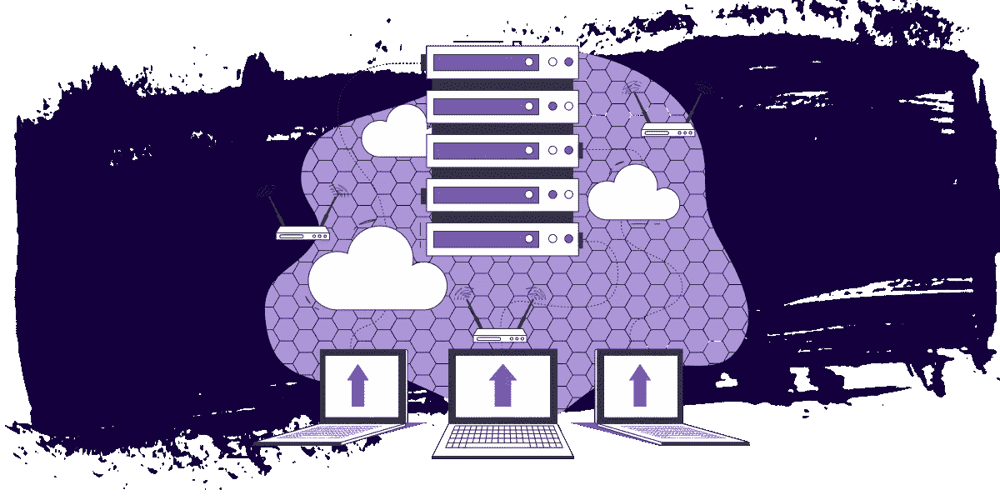

# 什么是边缘计算？这有点像织狗帽子

> 原文：<https://betterprogramming.pub/what-is-edge-compute-its-kind-of-like-knitting-dog-hats-feebe84d0189>

## 与狗一起探索计算的新领域！



作者图片

为什么要织狗帽子？因为他们很搞笑！


他们做了一个很好的类比。但在此之前，让我们先定义一下“边缘计算”的各个部分

我们先从后者说起。

(请注意，“边缘计算”有时也被称为“边缘功能”或“边缘工作者”)

# 什么是“计算”？

计算是指任何时候你让机器为你做什么事情都会发生的事情。例如，当你问计算器 5 x 7 的乘积是多少时(当你问这么多年的数学课有什么用处时)，计算器会发出哔哔声和哔哔声，并给出 35 的回答。

那个计算器是一台计算机，那些哔哔声和哔哔声是它计算结果所需的时间和处理能量；也称为“计算”

在 [web 开发](https://austingil.com/category/development/)的背景下，compute 可以用来生成几种不同类型的产品:HTML、JSON、机器学习数据模型、你和你朋友的自拍照，用滤镜让你看起来像可爱的动漫角色等等。

为了简单起见，我将主要关注生成 [HTML](https://austingil.com/category/html/) 。

为了便于类比，我们可以把“计算”想象成给一只狗织一顶帽子所花费的时间和精力。

因此有了狗帽子。

# “计算”发生在哪里？

这就是事情变得有点复杂的地方。有些人可能会告诉你有两个地方可以进行计算:在服务器上或在浏览器中(在用户的计算机上)。

虽然这没有错，但现在有点过于简单了，因为这两种选择都可以分成具有明显不同特征的更小的类别。

为了处理这种细微差别，我想分四个部分来讨论:

*   传统服务器
*   客户端(浏览器)
*   静态站点生成器
*   云函数

如果你已经很熟悉了，请随意跳过这些部分，但是你会错过我的整个类比。

# 传统服务器

在传统的服务器中，计算机运行你选择的软件来执行你写的代码，每当有请求进来就返回 HTML。使用服务器生成 HTML 通常被称为[服务器端渲染](https://en.wikipedia.org/wiki/Server-side) (SSR)。

计算机可能是您拥有的本地(或“内部”)计算机，位于您的大楼内，也可能位于“云”中，也就是租用别人拥有的位于其大楼内的计算机。

这些服务器全天候运行(理想情况下),随时准备接收流量。您还可以用一个 [cron](https://en.wikipedia.org/wiki/Cron) 作业设置单独的长期运行任务或调度任务。

这很方便，但也有一些缺点:

*   即使服务器就在那里，你也要为它付费。
*   高流量可能会耗尽资源(内存/CPU)并导致其崩溃。
*   扩大/缩小规模需要规划和计算性能与成本
*   远离服务器的用户有较长的延迟时间(较慢)。

我想特别强调的最后一点是，当您使用传统服务器时，您要对业务逻辑代码、服务器软件和计算机的状态负责。这可能是一件好事，因为您拥有所有的灵活性和控制权，可以随心所欲地使用它，但这需要维护成本。安全性、升级和维护都由您负责。


## 服务器就像商业工作空间

对于我们的类比，我们可以把服务器想象成我们制作狗帽子的大楼。我们可能会租用空间，或干脆购买，但我们有一个实体的地方，人们可以来为他们的狗要求一顶帽子。

这是一间漂亮的办公室，有裸露的砖块和充足的自然光。我们可以把它画成我们想要的样子，并根据需要进行修改。但是也有一些缺点。

有些人必须走很远的路才能到达我们的大楼。不管我们卖了多少顶狗帽子，我们也必须支付账单(房租、电费、网络费)(我知道我们会卖出去，比如说，几百万顶，但还是要卖)。当有人带着他们的狗来拿新帽子时，狗在出去的路上在草地上拉屎。猜猜谁将不得不清理它。

# 客户

当我们说到“客户”这个词时，大多数人会想到顾客。例如，“当这个狗帽子生意起飞时，我将有十亿客户。”在 web 开发中，“客户端”是用户的浏览器。

在用户请求我们的网站后，我们可以指示浏览器下载一些 [JavaScript](https://developer.mozilla.org/en-US/docs/Web/javascript) ，当这个 JavaScript 执行时，它可以在页面上注入一些 HTML。事实上，我们甚至可以使用 JavaScript 来创建整个应用程序。

这通常被称为[客户端渲染](https://en.wikipedia.org/wiki/Client-side) (CSR)。

在客户端生成 HTML 很棒，因为它可以创建更动态的交互，感觉更快，因为你不需要等待页面重新加载。

我们甚至可以利用像[服务人员](https://developer.mozilla.org/en-US/docs/Web/API/Service_Worker_API)或 [WebAssembly](https://webassembly.org/) 这样的工具来降低电脑的冲击力。

将计算转移到客户端还意味着我们可以在自己的服务器上做更少的工作，这最终可以为我们节省一些钱，但计算仍然必须发生，成本由用户承担。

以下是我对缺点的看法:

*   用户必须下载更多的数据(JavaScript)。
*   我们不能有 API 密匙之类的秘密，因为源代码是可以访问的。
*   性能受用户设备的影响很大。
*   我们能做的依赖于用户的设备和浏览器。

出于这些原因以及搜索引擎优化、可访问性和其他原因，我认为我们看到更多的行业正在远离客户端渲染。


## 客户端渲染就像 DIY 针线包

为了让客户明白这个想法，客户端渲染很像给客户一个 DIY 针线包。我们可以为他们提供所有的说明和材料来制作他们自己的狗帽子，但工作需要由他们来完成。虽然这可以节省我们的时间和精力，但这是以客户的成本为代价的。

它可能很适合某些人，但并不适合所有人。

# 静态站点生成器

静态站点生成器(SSG)很有趣，因为它们不是在请求到来时按需构建网页，而是提前预构建网站的所有页面。结果是代表网站的静态文件夹和文件(HTML、CSS、JavaScript)的集合。

一旦您有了网站的所有静态文件，您就可以将它们部署到您喜欢的任何主机上。

这种方法在技术上属于 SSR 范畴，因为您不使用浏览器来进行计算。您使用某种编程语言在您控制的计算机(您的笔记本电脑、构建管道等)上提前构建页面。

从技术上来说，最终结果与手工编写所有这些 HTML 页面没有太大区别，但是使用 SSG 最终可能会更快、更容易。

使用 SSG 有几个好处。通过提前生成 HTML，您从用户的请求中删除了计算时间。这可以加快响应时间，因为它们只需要等待服务器用静态 HTML 文件进行响应。没有花费时间来构建它，这一点非常重要。

因为你只是在处理这些不会随着每个请求而改变的静态文件，所以 SSG 也与内容传递网络进行了很好的配对。稍后我将详细介绍这些内容，但结果是更快的响应，因为您可以消除大部分延迟。

静态网站也非常非常容易托管。因为它们只提供静态文件，不需要计算，所以你可以用非常有限的资源托管你自己的服务器，处理大量的流量没有问题。这也使得他们的主机非常便宜。事实上，有很多服务可以让你免费托管一个静态网站。

我要指出的最后一个好处是，在处理静态站点时，不需要处理运行时脚本语言或数据库。这使得它们非常安全。你不可能真的黑掉一个静态网页，所以除非你真的公开分享私人信息，否则你不应该有太多担心。

现在这一切听起来可能很棒，但它也有一些明显的缺点。首先，静态 HTML 不能有动态内容(除非您使用客户端计算)。对于一些内容不经常变化的网站来说，这没问题；博客、小册子网站、文档。这种动态数据的缺乏也意味着不能为每个用户提供个性化的体验。

虽然您可以使用 JavaScript 向静态站点添加动态内容，但是它会增加复杂性和固有的缺点(参见上面的 CSR)。

SSG 的另一个缺点是建立每个页面需要时间。如果你有几万或几十万个页面要生成，这可能需要很长时间。当您发布新内容或更改现有内容时，您可能需要预先构建所有内容。这可能不会成功。


## 静态站点生成器就像预制的狗帽子

如果我把它比作出售编织的狗帽子，SSG 就像出售预制的帽子，而不是根据需求编织。当顾客找到他们想要的商品时，他们可以直接从货架上拿下来结账。不要等着别人来织。

但是，如果他们想要个性化的东西，比如合身的衣服或他们最喜欢的颜色，该怎么办呢？我可能没有。一些精明的商人可能会说，忘记他们，只做预编织的帽子，因为利润和劳动力(我不知道我在说什么)。其他顾问可能认为增加更多的员工(复杂性)来支持按需编织以及制作和储存预编织帽子是值得的。

最终还是要看你的用例。预织帽子(SSG)可能很棒，按需编织(SSR)可能更好，或者你两者都支持。

# 云函数

除了传统的服务器，一些云计算提供商也提供云功能。这些功能允许您上传包含处理网络请求的功能的文件。该平台负责部署您的功能并将流量路由到这些功能，因此，它们为您提供了运行该功能的 URL。

请注意，在这个系统中，您不需要供应、部署、维护或升级任何服务器。这就是为什么这些函数也被称为“无服务器函数”或简称为“无服务器函数”(它们有时也被称为“lambda 函数”)。

尽管“无服务器”的性质，仍然有一个服务器参与。只是别人的服务器。这使它进入了 SSR 的领域。

为了让这些功能发挥作用，您通常必须遵循约定，以便平台能够部署您的代码。它可能是文件名、文件夹结构、导出的函数、参数以及要返回的内容。

要做到这一点，有一点是你的函数必须是无状态的。这意味着它们不会跨调用共享上下文。您不能依赖持久内存或文件系统，因为相同的功能可能在完全不同的机器上运行。

虽然这可能不常见，但这种方法有一些好处:

*   它们非常容易配置，这对于动态团队或迁移功能来说很好。
*   它们可以根据流量自动放大或缩小。
*   你通常只为他们运行的时间付费，这样可以省钱。
*   不再需要管理硬件或服务器。你只需要写你的函数。

这些是考虑云功能的一些令人信服的理由，但也值得注意其局限性。首先，因为您自己不维护服务器，所以由服务提供商来决定支持哪些语言。

除了语言限制之外，您可能会注意到可用计算资源(CPU、内存)的限制，并且大多数提供商的超时时间相对较短。这些服务旨在用于短期操作。

同样，平台可能会问你希望你的函数在哪个区域运行。如果用户从远处访问函数 URL，这种延迟会影响他们体验的整体速度。


## 云功能就像训练来织狗帽子的机器人

考虑到所有这些因素，我喜欢把云功能想象成可以训练你织狗帽子的机器人。当没有人在旁边时，机器人会被关闭，不会让你付出任何代价，但当客户开始提出要求时，机器人可以启动来处理这些问题。

与对预编织狗帽子的需求不同，这些顾客想要带有他们最喜欢的体育吉祥物的定制帽子。因此，无论你喜欢丹佛腊肠狗、匹兹堡狗、纽约狗、金门猎犬还是芝加哥花花狗，按需定制请求对机器编织者来说都不是问题(云功能)。

# 什么是“边缘”？

在描述“边缘”的含义之前，让我们看看它试图解决的问题。有时用户离我们的计算机(服务器)很远，因此，当他们的请求往返于服务器时，他们不得不等待更长的时间。

为了解决这个延迟问题，非常聪明的人想出了部署一个程序的多个副本并在全世界分发的主意。当用户提出请求时，它可以由最近的副本来处理，从而减少了传输距离和时间。

这就是事情变得有点模糊的地方。“边缘”必须由网络服务器组成吗，或者你的智能手机可以算作网络中的一个节点吗？ [IoT](https://en.wikipedia.org/wiki/Internet_of_things) 设备不也是“边缘”吗？在你称一个网络为“边缘”之前，你需要的最小节点数是多少？两个？一个网络是否必须覆盖特定区域才能符合“边缘”状态？

我无法回答那些问题。抱歉。但我不认为我们需要这样做，只要我们明白目标是通过减少用户和端点之间的距离来减少延迟。因此，设备的分布数量越多越好。

让我们看一个不那么模糊的例子来说明什么是“边缘”。

# 内容交付网络

内容交付网络(CDN)是全球分布式服务器的网络，旨在交付静态资产，如 CSS、JavaScript、图像、字体等。可能有数千台服务器，每台都有自己的资产副本。

当请求一项资产时，比如我的狗块的照片，CDN 会计算出最近的服务器在哪里，并发送请求到那里处理。图像被发送回用户 licity-split。这适用于他们请求的任何静态资产，这是提高性能的一个极好的方法。

cdn 已经存在很长时间了，它们和上面的 SSG 是一对很好的搭档。你可以预先生成你的网站，从一个 CDN 提供所有的服务，而且速度会非常快。


## cdn 就像便利店

还记得上面的类比吗？我们讨论了预编织狗帽子，这样无论何时有人来到我们的商店，都可以随时买到。现在想象一下，我们做同样的事情，但是我们也把这些帽子分发给各地的几家商店。

cdn 以同样的方式工作。人们不必开车穿过城镇去买一顶狗帽子，他们可以步行几个街区到最近的便利店，我们已经在那里为需求备货了。

对他们来说非常快捷方便。

# 用户体验 3D 生活

我到底要带着这个去哪里？跟着我一会儿。

整个讨论中反复出现的主题是性能，谈到速度，有三个主要因素:

*   请求和响应必须经过的距离(也称为延迟)。
*   要解析和执行的响应的下载大小。
*   基于硬件、软件和其他可用资源的设备功能。

这就引出了我的下一个技巧。阐述观点时，头韵比连贯更好。

但是说真的，这三个因素确实影响了我们应用程序的速度。作为开发人员，我们的工作是找出在哪里权衡成本和收益，并找到进行计算的最佳位置。

当今一个非常现实的困境是，尽管客户端渲染延迟低，但实际渲染速度很慢。尽管服务器端渲染速度很快，但它可能会经历很长的延迟。

为了获得完美的 3d 体验，我们将:

*   让东西离用户更近(比如 CDN)
*   在服务器上工作(如云服务器/功能)
*   发送较小的资产(🥺)

最后一点是基于你的应用的高度主观的，所以我不能为你具体地谈论它，但是我们可以谈论前两个。

这终于让我们回答了主要问题。

# 什么是“边缘计算”？

边缘计算是一个可编程的运行时(像云功能一样)，它是全球分布的(像 CDN 一样)。这太棒了，因为它可以为我们提供尽可能靠近用户执行的动态服务器端功能。

作为一个额外的好处，许多边缘计算平台可以提供关于在哪里处理请求的信息。对于传统的服务器或云功能，您已经知道服务器在哪里，因为您选择了部署它的区域。它永远不会改变，也不是很有趣的信息。

但它在边缘计算的环境中很有用，因为我们知道这些服务器尽可能靠近用户，通常在同一个城市。有了这些信息，我们就可以根据用户位置在应用程序中应用逻辑。

当然，浏览器有能力通过[地理定位 API](https://developer.mozilla.org/en-US/docs/Web/API/Geolocation_API) 提供用户信息，但它需要用户交互，用户可以随时拒绝访问。拥有一个靠近用户的位置选项既方便又隐私友好。此外，甚至不需要询问更多的细节就足够了。

# 利益

我将边缘计算的优势分为三类。

对于用户:

*   与服务器/云功能相比，延迟更短。
*   与客户端渲染相比，下载量更少。
*   让工作远离设备，提高其他应用程序或电池寿命。

对于开发人员:

*   创建概念证明的低门槛。
*   一致的执行环境(不同于浏览器)。
*   团队拥有各自的职责。
*   基于位置的逻辑。
*   无需管理服务器/基础架构。
*   秘密保持秘密(与客户端相比)。

对于利益相关者:

*   降低源服务器的负载，提高源服务器的性能、可靠性和成本。
*   自动扩展提高了整体性能和可靠性。
*   只为你使用的东西付费。

# 限制

因此，我们已经确定，边缘计算非常棒，但它也不是没有自己的粗糙边缘。

现在，大多数平台都支持定制运行时形式的 JavaScript([V8 隔离](https://v8.dev/docs/embed))。因此，尽管支持语言特性，但您可能只能访问非常有限的一组平台特性。它可能不支持浏览器或 Node.js 中的所有功能。

除了有限的平台功能，您可能会发现，与云功能等相比，边缘计算在计算资源量或可用于计算的时间方面也更加有限。所以你工作的时间会更少，动力也会更少。

当你深入了解实际情况时，这些限制是有意义的。如果您要将服务器部署到世界各地成千上万的位置，它们需要尽可能轻便和快速，而且由于计算需要资金，平台提供商不得不对资源和时间进行一些限制。

# 我应该何时使用边缘计算？

决定在哪里进行计算已经很困难了。您必须考虑延迟、下载大小、设备能力等。在做决定之前。正如我们上面所概述的，每种产品都有自己的优点和缺点。

因此，您可能会问自己边缘计算适合在哪里。

首先，我们应该将边缘计算视为武器库的一个补充，而不是任何一个产品的替代品。

过去我们有:

客户端 JS ->客户端服务人员->云功能->传统服务器

我们现在有:

客户端 JS ->客户端服务工作者->边缘计算->云功能->传统服务器

看看我能不能帮你决定。

## 表明您拥有优秀的边缘计算使用案例:

*   无状态(不需要持久内存或文件)。
*   不会花很长时间。
*   对延迟敏感
*   超本地

## **边缘计算使用情形不佳的迹象:**

*   有状态(需要持久内存或文件系统)。
*   需要大量的计算资源。
*   长时间运行的操作—顺序/瀑布式请求(可能会增加延迟)

(注意，上面的无状态/有状态点不适用于像数据库这样的外部来源。)

## **一些常见的用例**:

*   地理定位
*   快速自动建议/提前输入
*   修改请求/响应
*   [重定向管理](https://austingil.com/optimizing-content-migrations-with-edge-compute/)
*   基于令牌的个性化(A/B 测试、功能标志)
*   无状态身份验证(JSON Web 令牌)
*   API 代理/编排

# 我为什么要在乎？

现在我们来到了节目的“如果它没坏，就不要修理它”部分。如果你在没有 edge compute 的情况下也能很好地构建网站，为什么还要担心呢？

答案又回到了性能上。

我在上面概述了一些影响性能的事情，相关的事情是，无论我们作为一个社会如何改进网站(更快的网络，更好的设备，更小的应用程序)，总有一个问题我们无法解决:

# 光速问题

随着时间的推移，技术会不断进步。计算机变得更快，存储变得更大，网络可以处理更多的数据。

如果我写一个程序来计算我有多爱我的狗，今天的计算机可能需要 10 年才能计算出来。10 年后，计算机可能只需要 10 毫秒。然而，在这两种情况下，告诉我的狗我爱他的时间取决于他离我有多远。

因此，在我们能够找出如何通过虫洞发送“我如此爱你”之前，我们永远无法以超过光速的速度发送信息。这是一个普遍的常数。

那么我们能做什么呢？简单。将计算机移近我的狗(或用户)。这缩短了距离，减少了延迟，减少了等待时间。因此，边缘计算的原因。这是关于减少延迟。

下面是我的文章“[用边缘计算优化内容迁移](https://austingil.com/optimizing-content-migrations-with-edge-compute/)中的一个例子它展示了边缘计算如何减少重定向的查找时间。

无边缘计算:

使用边缘计算:

你注意到我是如何用箭头的长度来表示物理距离的吗？聪明！我希望这有助于理解这一点，但是除了图片上的箭头之外，在最坏的情况下，我们能在环球旅行中实际节省多少时间呢？

大约 300 毫秒。

这让我想到了我的生存危机:

*   所有这些真的只是关于速度吗？
*   300 毫秒有多重要？
*   值得这么复杂吗？
*   狗喜欢戴帽子吗？

简短的回答是:是的，视情况而定，有时，可能不是，但他们看起来太可爱了。

# 强制统计块

每当有人开始谈论性能时，总是会有一堆数据来支持他们的信息，这些数据来自…一些研究。

这篇文章没有什么不同(也许是另一个宇宙常数？).人们喜欢数字，所以这里说:

2017 年，Akamai 发布了他们的[在线零售业绩报告](https://www.akamai.com/newsroom/press-release/akamai-releases-spring-2017-state-of-online-retail-performance-report)，其中发现了以下内容:

*   100 毫秒的延迟会导致销售额下降 7%
*   两秒钟的延迟增加了 103%的反弹率
*   如果加载时间超过三秒，53%的智能手机用户不会转换
*   大多数销售的最佳加载时间为 1.8-2.7 秒
*   28%的用户不会返回慢速网站
*   销售额最高的网页加载速度比竞争对手快 26%

想要更多数据吗？你猜对了。

沃尔玛发现，每增加一秒钟的装载时间，他们的销售额就会增加 2% ( [来源](https://www.globaldots.com/resources/blog/content-delivery-network-explained/))。想想沃尔玛在 2021 年赚了 5000 亿美元。其中的百分之二是 100 亿美元，这意味着他们可以雇佣 133，000 名开发人员来增加一秒钟的加载时间，他们仍然可以盈利(基于 2020 年 75，000 美元的平均工资)。

绩效影响收入、认知、品牌忠诚度和参与度。对于一些公司来说，它会比其他公司更重要。

# 这不仅仅是钱的问题

当我说人们应该因为钱而做某事时，我总是觉得有点恶心。钱对于数据来说很棒，因为它很容易量化:人们理解价值，更多的人在乎，但还有其他原因需要在乎吗？

我做了一些思考，虽然很模糊，以下是我的想法。

边缘计算关乎速度和可靠性。这让我思考获取信息的重要性。在危机时期，信息变得越来越重要，今天我们有很多这样的例子。

我很幸运能够在我的办公室里写一篇轻松的博文，但是在世界的其他地方，人们为自己的生命担忧，他们需要快速可靠的信息来源。

可能是预约疫苗接种、了解战争的最新情况，或者让他们所爱的人知道他们没事。速度和可靠性很关键，跟钱完全没关系。

# 结束语

希望这有助于更多地解释什么是边缘计算，以及它为什么重要。如果你需要最后一个类比，你可以这样想。


**就像在便利店训练织狗帽子的机器人**

很清楚，对吧？

我真的认为边缘计算是 web 开发的下一个阶段。是的，有局限性；是的，它们增加了复杂性；是的，好处大多归结为减少数百毫秒，但这只是今天的图片。

我相信技术会继续进步，平台会减少限制。我相信框架作者将会增加对边缘计算的更多支持。从而消除了一些复杂性。我们今天已经看到了这种情况:

太刺激了！

每个人的狗帽子！！！

值得吗？

看情况。

但我认为这很酷，希望你能尝试一下。

有几个可用的平台，但是我鼓励你去看看 [Akamai EdgeWorkers](https://www.akamai.com/products/serverless-computing-edgeworkers) 。这不是一个完全没有偏见的建议，因为我在 Akamai 工作，但我的偏见来自于对平台质量及其背后的人才的了解。我没有那种其他平台的内部知识，所以很难不带偏见的比较。

边缘计算关键在于速度和可靠性。Akamai 拥有超过 250，000 个位置，是世界上最大的边缘网络，这可能是世界上最大的公司选择 Akamai 的原因。边缘计算可能并不适合所有人。但是对于那些真正重视 300 毫秒的人来说，绝对要去看看 Akamai。

您可以通过以下链接找到有关 Akamai EdgeWorkers 的更多信息:

非常感谢您的阅读。

```
**Want to  connect?**[Sign up for my newsletter](https://austingil.com/newsletter/) if you want to know when new articles are published.
```