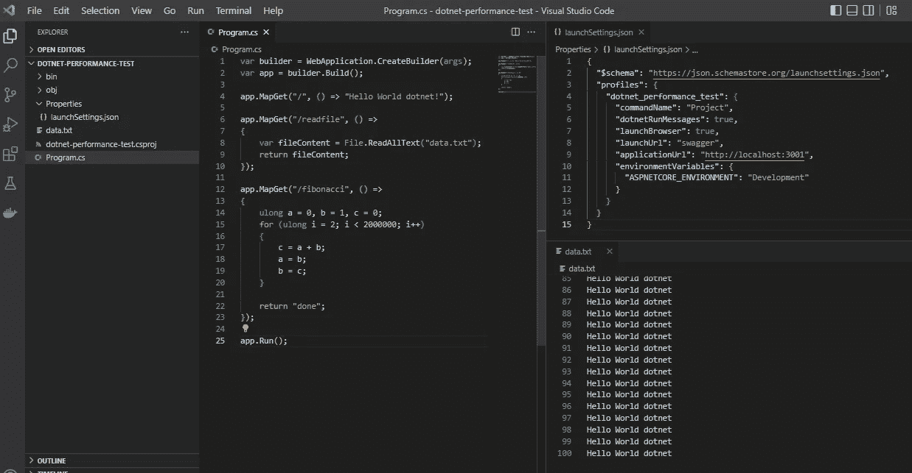
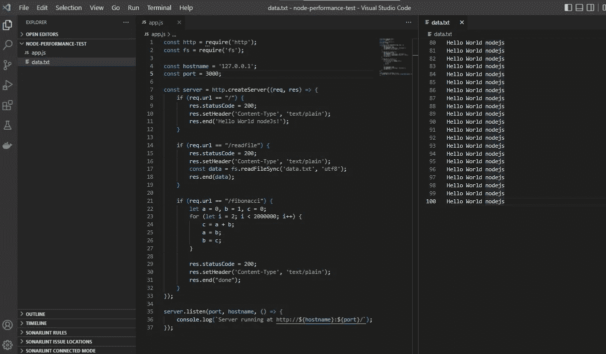
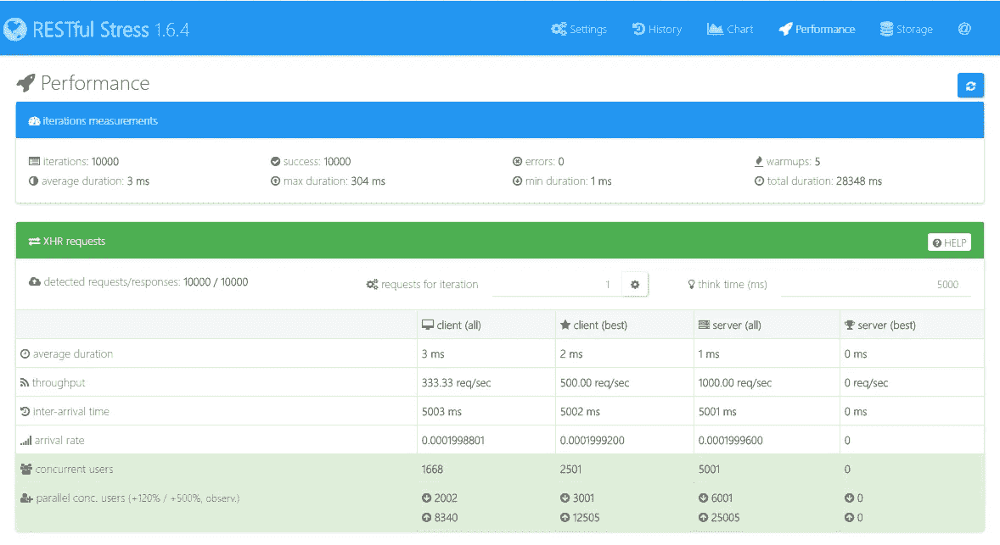
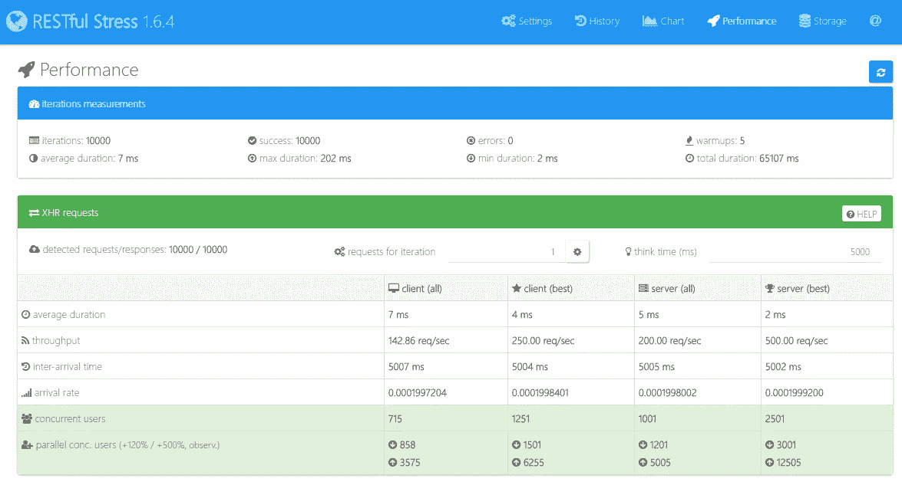
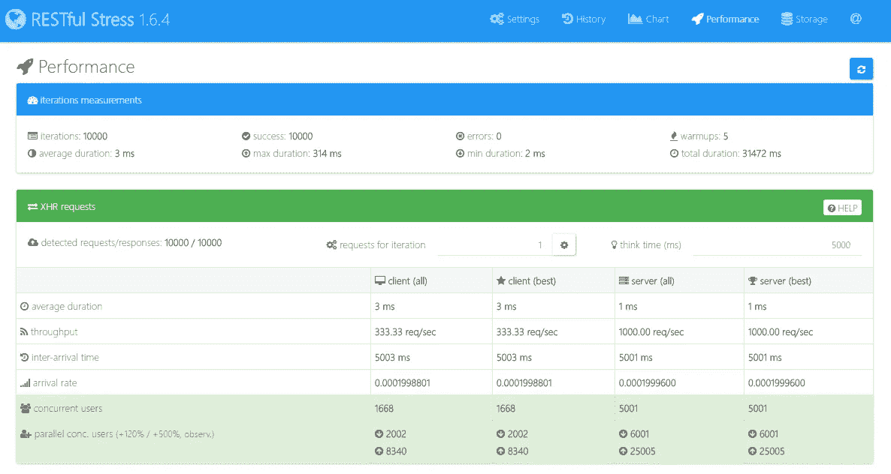
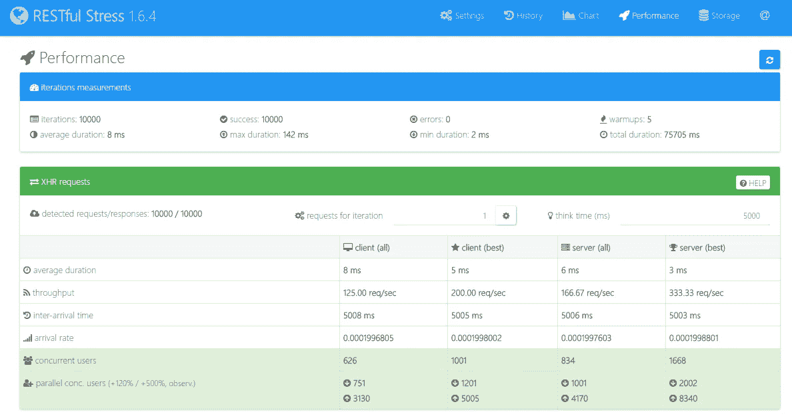
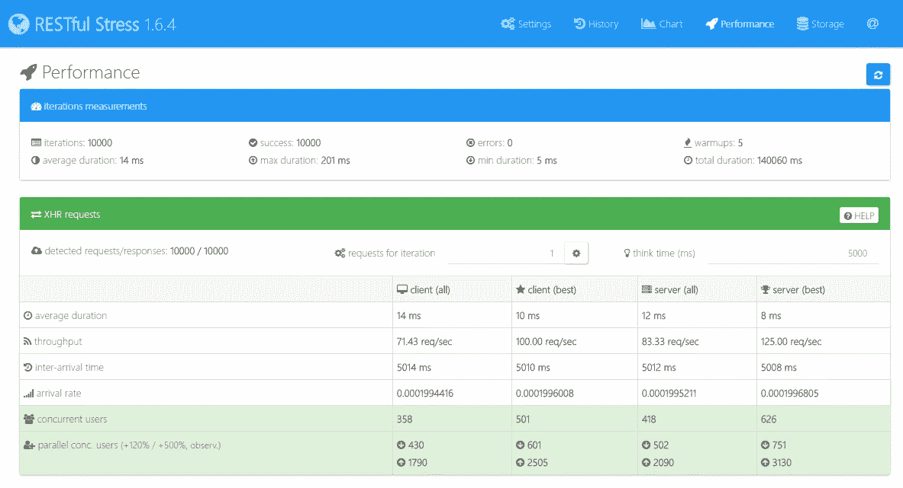

# 。Net 6 和 node . js 16——哪个更快？

> 原文：<https://betterprogramming.pub/what-is-faster-net-or-node-js-449a3c315407>

## 让我们测试并找到答案

比尔·斯蒂芬在 [Unsplash](https://unsplash.com/@billstephan?utm_source=unsplash&utm_medium=referral&utm_content=creditCopyText) 上的照片

几天前我想知道是否使用。网络或节点。Js 对于一个新的微服务，我将从头开始构建，在互联网上搜索并找到大量有用和重要的信息后，我忽略了一切(抱歉，我有时会这样做)，我开始在我的本地机器上构建一些非常简单的性能测试，只是为了看看它们和剧透 alert 之间的一些最初的明显差异，我发现 Node.js 比. net 快。

是的，就是这样，在我所有的测试中，我的 Node.js 应用程序比我的要快得多。Net 应用程序，我将在接下来的部分展示它是如何工作的。

> 免责声明:这绝对不是任何形式的官方测试，我不会使用最佳性能测试指南，我希望你不要太认真，不要决定使用它，因为它是更快的真理。
> 
> 最重要的是，我这样做只是为了好玩。

我观察到的他们之间的第一个明显区别是。Net 是多线程和节点的。Js 是带有事件循环的单线程，这至少在理论上意味着。Net 更擅长处理消耗 CPU 的任务，而 Node。Js 更擅长处理阻塞任务，比如读取文件或获取 HTTP 数据。

无论如何，我决定创建以下三个测试场景:

> 1.只返回一个“hello world”文本。
> 
> 2.读取 100 行文本文件并返回其内容
> 
> 3.计算一个大数字(如 2000000)的斐波那契数列，并返回成功

# 准备测试环境

为了收集结果，我可以使用一个非常酷的工具，如 [K6](https://k6.io/) 或 [JMeter](https://jmeter.apache.org/) ，但相反，我选择了一个更简单的可视化免费工具，名为 [Restful Stress](https://github.com/maurobussini/restful-stress) ，

关于版本，我使用的是。net 6 . 0 . 203 和 Node.js 16.17.0

对于代码，我将设置最少的语句来运行一个应用程序，没有任何优化，也没有框架或库。

执行这些测试的最佳方式可能是在 docker 容器上，这样我就可以测量 CPU 和内存消耗，但是你猜怎么着，我不会这样做，相反，我将在我的本地简陋的 windows 机器上执行它，同时运行 10000 次，这意味着并行

让我们看看进展如何。

# 的。网络应用

由于我使用的是 ASP.NET 6.0，我决定使用[最小 API](https://docs.microsoft.com/en-us/aspnet/core/fundamentals/minimal-apis?view=aspnetcore-6.0) ，为了执行代码，我只在 VSCode 终端中运行`dotnet run --configuration Release`

Program.cs 文件

。Net 测试应用程序

## Node.js 应用程序

Node.js 应用使用了一种[类似的方法](https://nodejs.dev/en/learn/build-an-http-server/)，只有一个非常简单的文件，来执行我刚刚在 VSCode 终端上运行的应用`node app.js`:

app.js 文件

节点。Js 测试应用程序

# 结果

## 第一个测试:hello world

节点的 Restful Stress 结果。Js 应用程序

Restful 强调。Net app

当将结果移植到表中时，我们可以看到 Node.js 在几乎所有方面都更好，因为这个测试是一个简单的“Hello world”，我预计结果应该非常相似，但事实并非如此。

即使 Node。Js 的最大持续时间最大(304ms vs 202ms)，总持续时间比。净(28 秒 vs 65 秒)

平均持续时间的差异超过了 100%，这就是 Node.js 应用程序比。Net app

## 第二个测试:读取文件

节点的 Restful Stress 结果。Js 应用程序

Restful 强调。Net app

在读取文件文本时可以获得相同的结果，同样，最长持续时间在 Node.js 应用程序中更高(314ms vs 142ms)，但所有其他情况都表明 Node。Js 应用程序的执行速度比。净额

## 第三个测试:斐波那契 2000000

节点的 Restful Stress 结果。Js 应用程序

Restful 强调。Net app

在最后这个测试中，这是一个惊喜，因为斐波那契函数需要更多的 CPU 处理，我认为在这个测试中。Net 应用程序会比 Node 更好。Js 应用程序，而且显然，它不是。

至少这里的平均持续时间不超过 100%(8 毫秒和 14 毫秒)

# 最后考虑

我认为我们有一个明显的赢家。

考虑到我在这两个应用程序中只使用了最小的方法，我认为结果是有效的，但我必须考虑到，在实际应用程序中，在比较应用程序性能时还有很多东西需要考虑。

网络、容器、数据库、库以及代码编写方式都会影响应用程序的运行速度。

不要忘记开发人员对特定框架、语言或技术的熟悉程度，甚至是对 IDEs、合作伙伴关系和支持的许可。

我的测试很有可能是错误的，但我看不到任何明显的东西我现在可以改变，让我知道如果你有任何提示。

感谢大家一直读到这里，下次见。