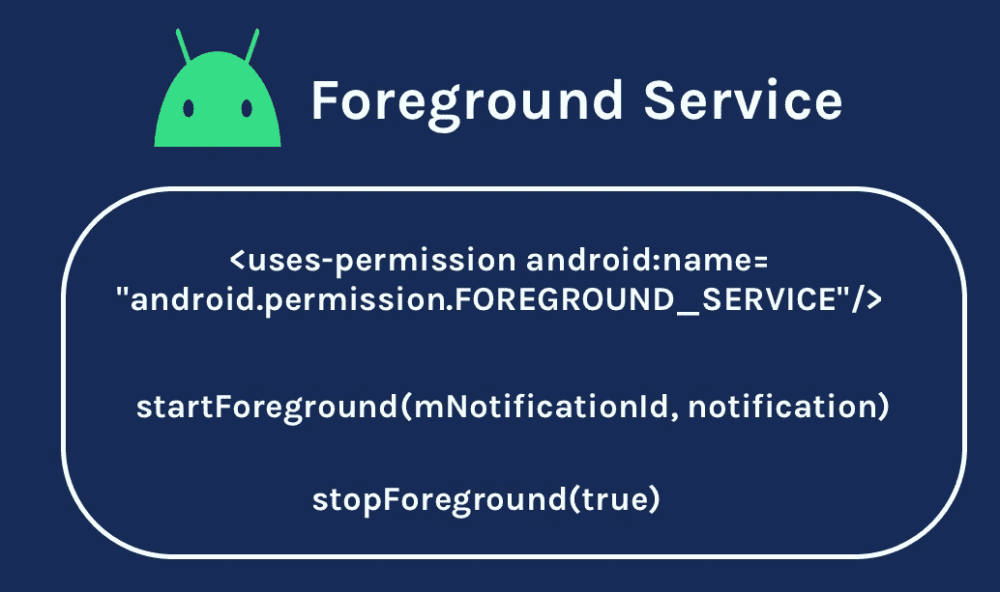
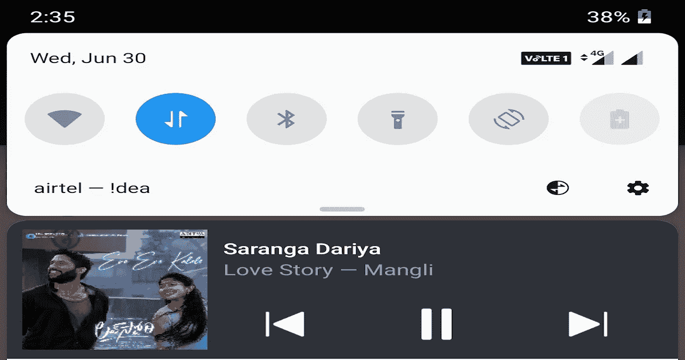
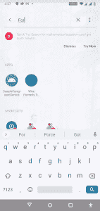
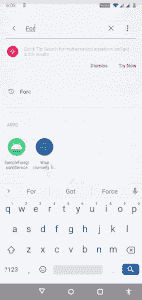

# 如何在 Android 中实现前台服务

> 原文：<https://betterprogramming.pub/what-is-foreground-service-in-android-3487d9719ab6>

## 了解什么是前台服务，并将其集成到您的 Android 应用程序中



图片由作者提供。

在 Android 世界中，服务的典型定义是在后台执行长期运行任务的应用程序组件。它不提供用户界面。一个服务主要运行在主线程上，除非另有说明。我们应该确保在服务中运行非阻塞操作。服务从一开始就是 Android 组件的一部分，但现在正在对它们进行增强，以提供最佳的用户体验。

# 问题

服务在后台运行，可以消耗位置、摄像机等资源。从背景本身来说。由于它没有任何用户界面，用户不会知道应用程序中正在运行什么类型的服务以及正在消耗的资源。这对安全性和性能都有影响。

这就是前台服务的用武之地。

在本文中，我们将发现什么是前台服务，为什么我们需要前台服务，以及如何实现前台服务。

如果想直接跳转到代码库，请查看 [GitHub repo](https://github.com/pavan5208/android_sample_foreground_service) 。

# 什么是前台服务？

前台服务只不过是执行用户可察觉的任务的服务。为了通知用户，我们需要在状态栏中显示通知。这些通知的优先级应该为`PRIORITY_LOW`或更高。除非任务完成，并且服务由于各种因素被自身或系统停止或移除，否则通知不能被移除。

这样，用户将会意识到一些工作正在后台执行，这些工作可能会消耗系统资源。

前台服务的一个简单例子是任何音频播放器应用程序。让我们以一个音乐播放器应用程序为例，即使该应用程序没有运行，它也会在播放歌曲时显示通知。这里，我们有一些控件可以与服务交互，显示与正在播放的当前歌曲相关的信息，等等。在通知中。但是，只有当服务终止时，通知才会被删除。



类似地，我们也看到送货应用程序在状态栏中显示订单的跟踪情况，并带有通知，像优步这样的出租车乘车应用程序在通知中显示乘车的轨迹，如果乘车正在进行，等等。

# **我们为什么需要前台服务？**

如果针对 Android 的应用程序在应用程序未运行时试图使用一个正常的服务来进行后台操作，那么系统会杀死这个服务，我们无法完成我们的任务。为了在后台顺利处理事情，我们需要使用前台服务通知用户。

我们将在下面的示例中看到这一点，以便更好地理解它。

# 如何实现前台服务

实现部分与服务的实现部分非常相似，但略有不同。让我们检查一下执行此操作的逐步过程。

让我们创建一个示例应用程序，其中有一个带有两个按钮(开始和停止)的活动和一个显示服务状态(运行或不运行)的文本视图。在这里，我们也创建一个普通服务，测试它以了解问题，然后通过添加通知将服务迁移到前台服务。

## 第一步

我们需要为针对 Android 9 (API 级别 28) 或更高版本的应用程序请求前台服务权限。我们需要在清单文件中指定以下权限:

```
**<**uses-permission android:name**="**android.permission**.FOREGROUND_SERVICE"/>**
```

由于这是系统授予的权限，因此不需要额外的处理。当在清单中指定时，系统自动授予它。

*注意:如果在清单文件中没有这个权限就启动前台服务，系统会在运行时抛出一个*`*SecurityException*`**导致 app 崩溃:**

```
*java.lang.SecurityException: Permission Denial: startForeground from pid=xxx, uid=xxxx requires android.permission.FOREGROUND_SERVICE*
```

## *第二步*

*让我们创建一个带有两个按钮和一个文本视图的布局文件。*

## *第三步*

*让我们创建一个简单的`Service`类。当我们收到`ACTION_STOP`*动作时，我们停止服务。**

**`ACTION_STOP` 不过是一个被赋予任意值的常数。我给出了以下值:**

```
**const val  ACTION_STOP =  "${BuildConfig.*APPLICATION_ID*}.stop"**
```

## **第四步**

**现在让我们根据这些要求创建一个`Activity`:**

*   **单击 start 按钮，我们启动服务并在文本视图中更新状态。**
*   **单击 stop 按钮，我们停止服务并在文本视图中更新状态。**
*   **在`onCreate`中，我们在文本视图中更新服务状态。**

## **检查服务是否正在运行**

**`isMyServiceRunning` 是一种功法。当我们给一个类名时，我们可以通过使用`ActivityManager`来检查一个服务是否正在运行。**

**现在运行应用程序，并通过启动应用程序来检查输出。单击 start 按钮，注意文本视图得到了更新。现在杀死 app，重新打开，查看文本视图中的服务状态是否处于停止状态。默认情况下，Android 系统在以 Android 9 (API 级别 28)或更高版本为目标的设备上执行此操作。你可以测试各种情况。**

## ****输出****

****

## ****第五步****

**让我们通过添加通知、调用`startForeground` **、**并返回`START_STICKY`来将我们的普通服务类迁移到前台服务。**

**`START_STICKY` 无非是从`onStartCommand` **返回的常量。**如果返回，系统基本上会在服务被杀死后尝试重新创建服务。**

**当您在这种情况下检查输出时，即使应用程序被终止并重新启动，服务(一旦启动)也不会停止。我们可以通过查看文本视图中显示的状态来检查这一点。我们应该手动停止它，当我们经过`stopForeground`内的`true`时，它会自动取消通知。传递`boolean`是可选的，如果我们设置`true`，它将删除通知。**

## ****输出****

****

**在这里，由于我们的服务是实时的而不是停止的，所以我们可以执行长期运行的任务。此外，它还显示通知，通知用户我们正在消耗系统资源。**

**如果您在执行代码片段时发现任何困难，请查看 [GitHub repo](https://github.com/pavan5208/android_sample_foreground_service) 。**

# **摘要**

**服务可以以多种方式使用，但是对服务进行前台限制可以提高安全性和性能。根据您的需求使用前台服务。不要忘记在清单中添加`FOREGROUND_SERVICE` 权限。要启动前台服务，调用`startForeground()`。要停止它，调用`stopForeground()`。**

**感谢您的阅读。**

# ****资源****

*   **[前台服务](https://developer.android.com/guide/components/foreground-services)**
*   **[Android _ sample _ foreground _ service](https://github.com/pavan5208/android_sample_foreground_service)**

# **更多 Android 文章**

*   **[了解视图在 Android 中的呈现方式](https://medium.com/@pavan.careers5208)**
*   **[Android 中一个视图的生命周期](https://proandroiddev.com/the-life-cycle-of-a-view-in-android-6a2c4665b95e)**
*   **[科特林系列](https://medium.com/android-dev-hacks/kotlin-advanced-programming-89aef9b2ecb8)**
*   **[如何在您的 Android 应用中实现应用内购买](/how-to-implement-in-app-purchases-in-your-android-app-7cc1f80148a4)**
*   **[多更](https://medium.com/@pavan.careers5208)**