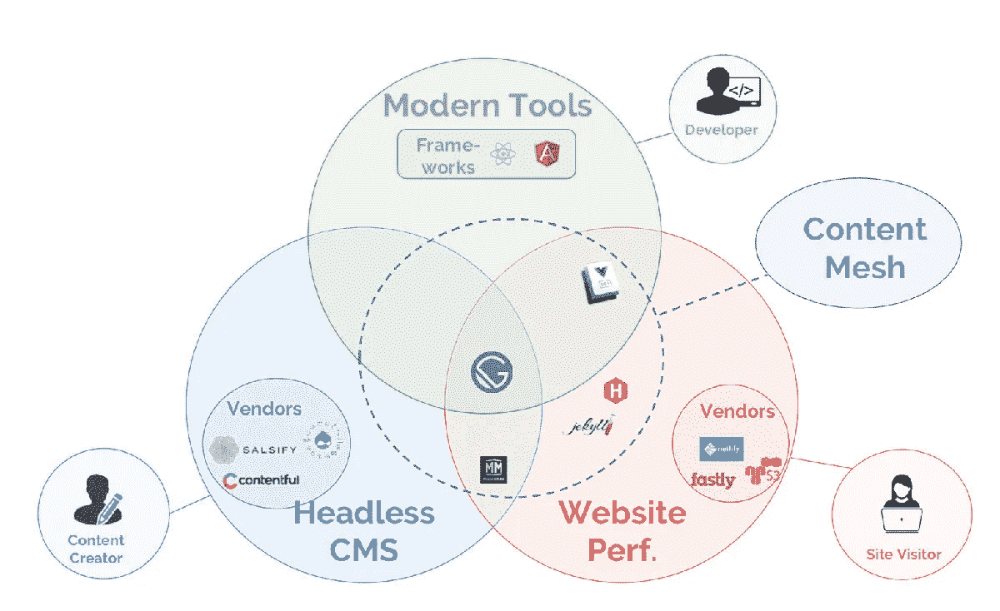

# 盖茨比是什么，为什么是时候登上炒作列车了

> 原文：<https://betterprogramming.pub/what-is-gatsby-and-why-its-time-to-get-on-the-hype-train-c5ab1697afc9>

## 加入性能和生产力的行列


杰克·安斯蒂在 [Unsplash](https://unsplash.com/s/photos/train?utm_source=unsplash&utm_medium=referral&utm_content=creditCopyText) 上的照片

框架来来去去，虽然 [Gatsby](https://www.gatsbyjs.org/) 可能最终会像科技一样飘忽不定，但性能和生产力的提升是立即投身其中的有力论据。

# 等等，盖茨比是什么？

“Gatsby 是一个基于 React 的免费开源框架，可以帮助开发者快速构建网站和应用。**——[Gatsbyjs.org](https://www.gatsbyjs.org/)**(他们的侧重点——我后面会解释)。****

****我喜欢把它描述为类固醇上的 [Create React App](https://facebook.github.io/create-react-app/) ，这是一种引导 React 应用程序并专注于提高应用程序真正不同部分的效率的简单方法。在其核心，它是一个美化了的 webpack 应用程序，所有的东西都建立在同一个 webpack 管道上，你一直在努力编写并完全理解这个管道(或者可能只有我这样)。****

****然而，美妙之处在于，它输出的是一个静态网站(简单的 HTML 文件),您的应用程序已经过预渲染，以实现最佳交付。这意味着它基本上可以在任何地方运行，就像简单地把它放在 [S3](https://aws.amazon.com/s3/) 和[作为一个静态网页](https://docs.aws.amazon.com/AmazonS3/latest/dev/website-hosting-custom-domain-walkthrough.html)或者更简单，让[Netlify](https://www.netlify.com/)为你构建和服务。****

# ****这些都在剧本里****

****Gatsby 是支持 JAMstack 架构的众多可用工具之一。对于不熟悉的人来说，JAM 代表 JavaScript APIs 和标记，或者相当于一个静态的 HTML 网站，它利用 JavaScript 来创造奇迹。****

****JAMstack 应用有很多现成的优势，包括:****

*   ****易于托管****
*   ****主办费用低廉****
*   ****加载速度超快(大部分时间)****

****这意味着通常情况下，你会有一个快速的网站，不需要花费你太多的钱来管理和维护。****

# ****听起来有点熟悉？****

****正如我经常从团队中的其他人那里听到的那样，很容易将它与 [Rails](https://rubyonrails.org) 相提并论。《盖茨比》的幕后有很多魔法！****

****但是，除非您纯粹依赖插件和主题(这很好)，否则在一天结束时，您仍然会像在其他任何地方一样构建 React 应用程序。您的应用程序几乎可以移植到任何其他框架(除了数据源和页面生成部分)。组件是组件，样式是样式。****

```
**const Nav = () => {
  return (
    <nav>A normal nav component in a normal Gatsby app.</nav>
  )
}**
```

****Gatsby 在许多方面都有自己的观点，但这些观点大多不符合你仍然在构建 webpack 应用程序的想法，这些约定是 webpack 及其背后的配置，而不一定是 Gatsby。****

# ****那么，到底是什么让它如此伟大呢？****

## ****不到一分钟的时间****

****说真的。创建一个新的盖茨比网站是所有那些 clickbait 文章的字面定义，这些文章说你可以在五分钟内做一些事情。[安装 CLI](https://www.gatsbyjs.org/tutorial/part-zero/#using-the-gatsby-cli) ，你就离本地安装或静态构建的应用程序只差三个命令了。****

****例如，如果你想用[萨斯](https://sass-lang.com/)打造一个新的基本项目:****

```
**$ gatsby new my-cool-gatsby-project https://github.com/colbyfayock/gatsby-starter-sass
$ cd my-cool-gatsby-project
$ yarn develop**
```

********

****启动盖茨比应用程序****

****新手社区为你的新应用提供了一个简单的入口(或者整个应用，如果你愿意的话)。****

****注意:整个“不到一分钟”取决于你的连接类型，因为你需要等待依赖项下载和安装。****

## ****将所有这些整合到内容网格中****

****盖茨比背后的一个概念是“[内容网](https://www.gatsbyjs.org/blog/2018-10-04-journey-to-the-content-mesh/)”的想法，盖茨比是将这一切整合在一起的解决方案。许多应用程序，以及越来越多的应用程序，都是用 JAMstack 架构构建的，这有助于我们的想法，即我们可以从我们想要的任何地方获取尽可能多的内容，并以一种高性能的方式将其引入一个应用程序。****

********

****[https://www . gatsbyjs . org/blog/2018-10-04-journey-to-the-content-mesh/](https://www.gatsbyjs.org/blog/2018-10-04-journey-to-the-content-mesh/)****

****当一切都结束后，您可以将来自许多来源的数据放入一个静态编译的应用程序中。这确实非常快。****

## ****免费性能提升！****

****开箱即用，你得到了你的超级 webpack 配置，包括[代码分割](https://developers.google.com/web/fundamentals/performance/optimizing-javascript/code-splitting/)、[预取](https://developers.google.com/web/fundamentals/performance/resource-prioritization)、内联样式、缩小资产和[吨其他伟大的](https://www.gatsbyjs.org/docs/gatsby-internals/)。使用大量易于配置的插件轻松升级，例如将您的应用程序设置为 [PWA](https://www.gatsbyjs.org/docs/progressive-web-app/) ( [渐进式 web 应用程序](https://developers.google.com/web/progressive-web-apps/))并提供离线模式的能力。****

****这里面有很多时髦的词语，但最终，这意味着你的网站应该是敏捷的，基于大多数最佳实践，优化你网站的所有资产以提高速度和交付，同时通过为旧浏览器[传输使其尽可能容易访问，并确保缓慢的连接不会浪费宝贵的资源。很难确定这是一个确切的数据，但是 Kyle Mathews (Gatsby 创始人)声称 Gatsby 网站比同类网站快两到三倍。](https://www.gatsbyjs.org/docs/babel/)****

## ****提高生产力！****

****你再也不用担心通过重写和调整你的 webpack 配置来确保你的应用程序性能的复杂性，以适应你引导的每个新应用程序的最佳实践。盖茨比为你做了这一切。它让你专注于让你的应用程序与众不同的重要部分，而不是脚手架。****

****随着盖茨比的[插件](https://www.gatsbyjs.org/plugins/)和[主题](https://www.gatsbyjs.org/docs/themes/)的加入，这又进了一步。主题不是你在传统意义上所期望的，或者你从 WordPress 中所期望的，但是它们提供了一种方法来抽象你的 Gatsby 应用程序的任何部分，这样你就可以在应用程序之间重用它。****

****有一个你每次都用的核心组件库？让它成为一个主题。有没有[不想每次都重写的特定数据源配置](https://www.gatsbyjs.org/packages/gatsby-source-wordpress/)？让它成为一个插件。能够将这些关键部分抽象到您的应用程序中，可以节省您在每个新项目上的时间和压力，更不用说在一个地方维护这些部分的能力，通过简单的软件包更新修复错误和改进。****

## ****大型社区****

****盖茨比本身已经有一个相当大的社区，但除此之外，你还有已经存在一段时间的 webpack 和 React。React 是目前[最流行的 UI 框架](https://2018.stateofjs.com/front-end-frameworks/overview/)，它使得通过简单的谷歌搜索进行调试变得更加容易。很难找到一个你是第一个也是唯一一个偶然发现的问题。****

****如果你有一个 Gatsby 问题，特别是他们的 GitHub 问题，会有很多人愿意帮助你调试或解决下一个 bug。他们所要求的只是你礼貌地给他们提供一种繁殖的方式，这只是让他们更容易在第一时间帮助你！****

## ****哈克曼的朋友****

****喜欢卷起袖子自己动手调整管道吗？Gatsby 提供了修补处理的简单方法，无论是[挂钩到构建的生命周期](https://www.gatsbyjs.org/docs/node-apis/)还是调整 [webpack 配置](https://www.gatsbyjs.org/docs/add-custom-webpack-config/)。这允许你的应用程序的核心如你所愿的简单或先进，尽管如果你是如此先进，也许[可以帮助编写一个或两个插件](https://www.gatsbyjs.org/docs/creating-plugins/)！****

# ****也许不太好…****

## ****快速构建会产生更多的错误****

****你应该预料到你会在这里或那里碰到一些障碍，停留在最新的和最好的。毕竟，它是开源软件，不仅仅是为你的个人网站开发的。****

****盖茨比团队一直在非常快速地构建，这是令人敬畏的，但是快速移动使他们在构建时容易忽略一些东西。幸运的是，他们开始全面推行自动化测试，以帮助强化代码，并且他们有意避免匆忙解决这类问题。****

****只要确保彻底测试你的软件包升级，如果你遇到问题，不要害怕降级和锁定你的软件包版本。****

## ****静态网站是一流的，而不是网络应用****

****Gatsby 将自己标榜为适用于静态和非静态应用程序的全包式解决方案，但真的是这样吗？对客户端专用路线的支持需要一个[插件](https://www.gatsbyjs.org/packages/gatsby-plugin-create-client-paths/)或[页面创建调整](https://www.gatsbyjs.org/docs/client-only-routes-and-user-authentication/)，这很好，但他们在[问题](https://github.com/gatsbyjs/gatsby/issues/16097)上的[语气](https://github.com/gatsbyjs/gatsby/issues/15398)倾向于暗示他们并不总是同等关注这两者。****

****真的，这里唯一的争论是为什么你会使用 Gatsby 而不是 Create React App 来实现这个用例？虽然它可能不是一流的，但它仍然非常实用，具有标准的 Gatsby 潜在好处，但显然不会优先考虑 bug 和功能。****

# ****试一试吧！****

****在你尝试之前，我的意见或任何其他人的意见都不重要。最坏的情况是，在安装依赖项和删除包含项目的文件夹之间，您实际上浪费了五分钟，从积极的方面来说，这是一次学习经历。最好的情况是，你刚刚发现了一个很棒的工具，它将帮助你做伟大的事情。****

****去建造，去实验，分享你创造的伟大的东西！****

*****编辑:将“放慢速度”改为“避免匆忙”,以澄清陈述意图，因为他们没有放慢实际工作量，而是试图更加小心。*****

# ****资源****

*   ****[https://www.gatsbyjs.org/](https://www.gatsbyjs.org/)****
*   ****[https://jamstack.org/](https://jamstack.org/)****
*   ****[https://docs . AWS . Amazon . com/Amazon S3/latest/dev/website-hosting-custom-domain-walk through . html](https://docs.aws.amazon.com/AmazonS3/latest/dev/website-hosting-custom-domain-walkthrough.html)****
*   ****[https://www . netlify . com/blog/2016/02/24/a-step-by-step-guide-Gatsby-on-netlify/](https://www.netlify.com/blog/2016/02/24/a-step-by-step-guide-gatsby-on-netlify/)****