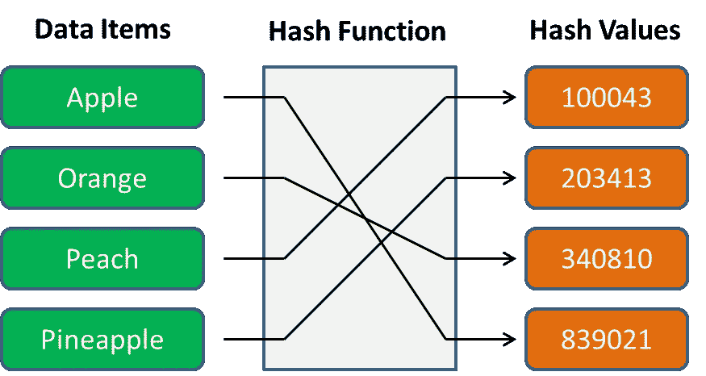
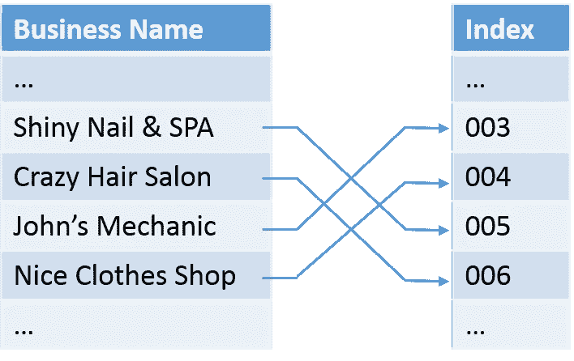
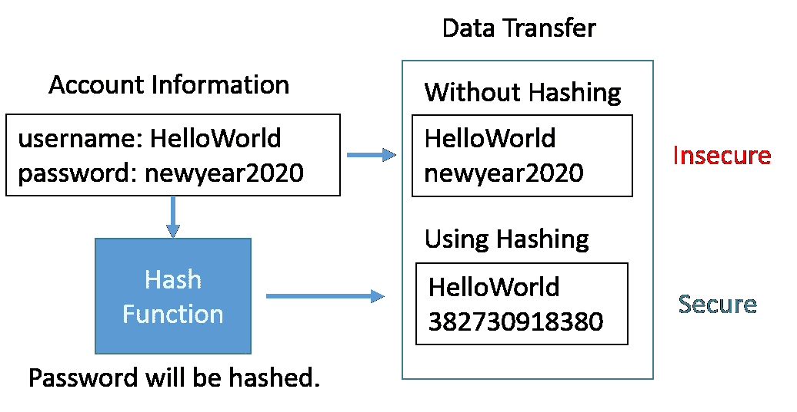

# Swift 中有什么可散列的？

> 原文：<https://betterprogramming.pub/what-is-hashable-in-swift-6a51627f904>

## 深入探讨可散列协议及其更广泛的背景


图片来自 [Pixabay](https://pixabay.com/?utm_source=link-attribution&amp;utm_medium=referral&amp;utm_campaign=image&amp;utm_content=704252) 的[卡洛斯·阿尔贝托·特谢拉](https://pixabay.com/users/carlosalbertoteixeira-637237/?utm_source=link-attribution&amp;utm_medium=referral&amp;utm_campaign=image&amp;utm_content=704252)

当我们学习 Swift 中的基本数据类型时，官方文档多次提到`Hashable`协议。

例如，`[Dictionary](https://developer.apple.com/documentation/swift/dictionary)`数据类型中的一个键需要是`Hashable`。再举一个例子，`[Set](https://developer.apple.com/documentation/swift/set)`数据类型中的元素也需要是`Hashable`。如下所示，Dictionary 和 Set 的声明明确指定了这样的要求:

```
@frozen struct Dictionary<Key, Value> where Key : [Hashable](https://developer.apple.com/documentation/swift/hashable)@frozen struct Set<Element> where Element : [Hashable](https://developer.apple.com/documentation/swift/hashable)
```

文档列出了几种`Hashable`数据类型，包括布尔值、整数和字符串，因此它们可以用作字典的键和集合的元素。

然而，我们不清楚是什么造就了这些数据类型`Hashable`，以及我们如何才能创造我们自己的数据类型`Hashable`。

如果我们退后一步，我们可能还会想，为什么我们一开始就要费心去创建某些数据类型`Hashable`。他们有特别的优势吗？关于这个话题，我们可以问更多的问题。

在本文中，我试图深入概述 Swift 中的`Hashable`协议及其常见用例。具体来说，我们将解决以下问题/主题。

1.  哈希的一般讨论。
2.  Swift 中的`Hashable`协议是什么？
3.  如何让我们的自定义类型符合`Hashable`协议？

# 哈希:什么和为什么

当我们谈论哈希时，许多术语在各种设置中频繁使用，包括哈希、哈希、哈希器、哈希代码、哈希值、哈希表和哈希函数。

即使我们并不熟悉所有这些术语，但在各种编程语言以及日常生活中，我们确实会大量使用它们(例如，密码加密)，至少是间接使用。

## 基本概念

一般来说，哈希是应用算法将数据项转换为值的过程。数据项可以简单到整数、字符串，也可以复杂到具有多个属性的对象。

该算法被称为哈希函数或哈希函数。转换后的值称为哈希值、哈希代码或简称为哈希。



哈希过程图

上图显示了散列过程的一个简化示例。本质上，我们从左侧的四种水果(即数据项)开始。

算法(即 hash 函数)可以将这四个名字作为输入转换成四个整数(即 hash 值)作为右侧的输出，看起来像随机数，与它们的原始输入没有明显的联系。

有几个方面需要注意。

1.  散列过程应该是可重复的。如果提供相同的数据，散列函数应该总是产生相同的散列值。每次我们请求苹果的 hash 值，hash 函数都会可靠地返回 839021 给我们。
2.  哈希值需要是唯一的。苹果、橘子、桃子和菠萝都被映射到不同的哈希值。当我们要求哈希函数计算一个新的水果，比如草莓，该函数可能会产生一个类似 542381 的值，该值预计会与现有的值不同。
3.  哈希值看起来应该是随机的。用更专业的术语来说，哈希值不应该很容易被反转以找出原始数据项是什么。因此，哈希值需要看起来是随机的，以最小化反转的可能性。
4.  哈希值不必是正整数。出于演示目的，该图使用整数作为哈希值。哈希函数确定输出(即哈希值)，因此，根据哈希函数本身，哈希值可以是负整数，也可以包含数字、字母甚至符号。

## 用例

哈希已经广泛应用于我们日常生活的各个方面。

在这一节中，我将使用下面的例子向您展示数据库操作中的散列、加密和编程中的数据结构的三个常见用例。

**数据库操作:搜索**

几乎所有的网站和手机应用程序都有搜索功能。搜索功能的实现涉及到哈希的使用。

让我们看看下面的例子。假设您在数据库表中有一个本地小企业的列表。有一天，你想把你的车送去维修，你记得你的一个朋友推荐了一家叫约翰机械师的商店。


*   不使用散列法:

当您使用商店名称在这个表中搜索时，数据库需要将这个 15 个字符的字符串与每个记录的企业名称字段进行比较。

想象一下，记录的数量可能有几十万条，这样这个过程可能会非常冗长并且缺乏效率。用计算行话来说，这个搜索函数的时间复杂度是 O( *n* )，也就是说需要的时间与数据大小成线性正比。

*   使用散列法:

不知何故，数据库所有者学会了散列的技巧，并使用散列函数为每个企业创建唯一的散列值，并将它们用作所有这些企业的索引。

现在，当您使用商店名称 John's Mechanic 发出搜索请求时，数据库将首先使用散列函数来计算这个搜索项的散列值。

如前所述，散列函数预计会为同一存储产生相同的散列值，因此我们只需查找索引并找出数据记录所在的位置。

平均而言，使用哈希的搜索函数的时间复杂度为 O(1)，这是一个与数据大小无关的恒定时间量。



**密码术:密码**

为了提供个性化的体验，许多网站和应用程序要求用户创建自己的帐户是有道理的。

在注册过程中，我们通常会在网站上提供我们的电子邮件地址和新帐户的密码。这两段文本将在到达目的服务器之前通过互联网发送。

*   不使用散列法:

不知何故，网站开发者对哈希一无所知，他们认为网络安全与他们无关。

因此，注册请求被设计为通过纯文本发送。它有很大的数据安全风险。如果请求被拦截，密码很容易被窃取，因为它只是纯文本！

*   使用散列法:

当它被使用时，密码将被散列成一个看似随机的文本。如果注册请求被拦截，只有这个散列密码会被暴露。

如前所述，我们通常设计哈希函数，使得几乎不可能将哈希值反转为其原始数据项。因此，这是一种更安全的方法。网站的数据库只能存储这个散列密码。

当我们尝试登录时，网站会将提供的密码(再次哈希)与保存的哈希密码进行比较，因为它们应该与输入的密码相同(即，纯文本的正确密码)。



**编程中的数据结构:字典**

几乎所有现代编程语言都有 Dictionary 数据类型，尽管它们可能使用不同的名称，如关联数组、映射、哈希表、哈希或对象。

然而，一个共同点是，它是一个无序的键值对集合。用简单的语言来说，字典成对地存储数据，每一对都有一个键和值。

有几个函数与 Dictionary 数据类型的使用有关，包括数据检索、插入和删除。看在 Swift 当前教程的份上，我就用 Swift 语言给大家演示一下这些功能吧。

其他语言涉及到差别语法，但是概念应该是非常相似的。

在后台，字典是一种哈希表，提供对它包含的条目的快速访问。对于每个键，hash 函数都会计算一个 hash 值作为索引来存储那个数据项，有些人把它称为 bucket(即存储数据的地方)。

因此，当我们检索一个数据项时，程序将为所提供的键计算哈希值，如果存在具有相同哈希值的键，则查找索引。

如果是，则返回相应的数据项。如果没有，将返回`nil`。这就是为什么从字典返回的数据类型是可选的，因为不保证可用性。

当我们插入一个新的键-值对时，哈希函数将只计算键的哈希值作为数据项的索引，而当我们删除一个键-值对时，我们将只删除根据哈希值计算的索引。

# 哈希协议

在对散列法有了大致的了解之后，我们现在可以通过关注 Swift 标准库中的`Hashable`协议来缩小我们的范围。

当我们查阅`[Hashable](https://developer.apple.com/documentation/swift/hashable)`协议文档页面时，我们发现`Hashable`的定义是:

> "一种类型，可以被散列到散列函数中以产生整数散列值."

定义非常清晰，在这个定义中我们可以识别出三个关键词: *type* 、 *Hasher* 和 *integer* 。我将在下面详细解释它们。

## 类型

以一套为例。如前所述，集合中的所有元素都必须是可哈希的。从表面上看，这仅仅意味着每个单独的元素都是可散列的。

但是，它实际上意味着这个通用集合数据类型的*具体类型*需要符合`Hashable`协议。换句话说，就像其他协议一样，`Hashable`协议是在类型(例如，类、结构)级别实现的*，因此它的所有实例都是可散列的。*

此外，类型不仅包括标准数据类型，如整数、字符串，还包括自定义类型，我将在本文后面的`Hashable`协议实现中展示一个例子。

## 厨师

Hasher 根据[官方文档](https://developer.apple.com/documentation/swift/hasher)定义为集合和字典使用的*通用哈希函数*。在后台，`Hasher`实际上是作为 struct 实现的，所以我们可以通过调用`var hasher = Hasher()`方便地实例化一个空状态的 hasher。

标准的通用散列函数使用每次执行随机的 128 位种子值，使得散列值不太容易预测。

更具体地说，Swift 标准库中使用的通用哈希函数是 [SipHash](https://github.com/attaswift/SipHash) ，最初是由 Jean-Philippe Aumasson 和 Daniel J. Bernstein 在 2012 年设计的。

截至目前，具有 320 位状态的 SipHash-1-3 在当前库中实现。需要注意的是，苹果确实警告说，通用哈希函数及其实现可能会在任何新版本中发生变化。

有了这个`Hasher`实例，我们可以根据需要使用变异的`combine(bytes:)`或`combine(_:)`方法多次向它提供数据(例如，整数、字符串)。

对于`combine(bytes:)`方法，我们向`Hasher`提供新字节的数据，因为它们在内存中的单个连续区域中可用，将其位与`Hasher`状态混合。

`combine(_:)`方法只是一个方便的操作，它接受一个`Hashable`值，比如一个整数或字符串。在幕后，这个`combine(_:)`方法调用`hash(into:)`方法将其值混合到`Hasher`状态中。

在您使用这些`combine`方法更新`Hasher`状态之后，我们将调用`finalize`方法，它将完成`Hasher`状态并返回哈希值。

值得注意的是，调用这个方法将消耗`Hasher`，因此建议您不要终结一个您不拥有的`Hasher`或者在一个已终结的`Hasher`上执行操作。

`finalize`方法的另一个重要方面是终结过程的计算开销很大。在 sipash-1-3 中，它的开销是单个 64 位`combine`运算的三倍。

因此，我们需要记住，当我们在自定义类型中实现`Hashable`协议时，如果可能的话，我们希望减少`finalize`的使用，以使我们的代码更有效。

## 整数

这再简单不过了。上面提到的`Hasher`会计算给定实例的哈希值，更具体的说，哈希值是一个整数。

但是，应该注意的是，由于整数溢出，哈希值不一定总是正的，整数溢出有时会产生负的哈希值。

由于哈希函数的种子值不同，每次执行 Swift 程序时生成的哈希值也不同，因此您不希望保存哈希值以备将来参考，这将导致您的程序出现不可预测的行为。

另外要提到的是，`Hashable`协议继承了`[Equatable](https://developer.apple.com/documentation/swift/equatable)` [](https://developer.apple.com/documentation/swift/equatable)协议，所以如果一个数据类型符合`Hashable`，那么它也必须符合`Equatable`。

如果两个实例有相同的`hashValue`会怎么样？这种现象叫做*碰撞*。有几种方法可以解决冲突。

一种常见的方法叫做*链接*。哈希表可以将多个项目链接在一起，而不是在每个桶中存储一个项目，这样每个哈希键都有一个对链表的引用。

另一种常见的方法叫做*线性探测*或*开放寻址*，这种方法也是由 Swift 的`Dictionary`类型在内部实现的，用于冲突处理。

基本上，这种方法通过使用下一个可用的槽(或桶)来解决冲突。如果它到达终点，它将回到起点，直到它找到该项目的桶。

# 符合可散列协议

在我们的开发中，我们不可避免地需要不时地创建一些自定义数据类型。有时，我们更进一步，希望将这些类型用作字典键或集合中的元素。

正如本文开头所提到的，要实现这一点，您的定制数据类型应该符合`Hashable`协议。在本节中，我将向您展示如何做到这一点。

## 简单数据结构

首先，我们创建一个名为`Student`的定制结构，它有两个`String`属性，`firstName`和`lastName`。假设我们想使用字典来跟踪学生的期末考试成绩。

所以，我们实例化一个字典`var scores = [Student: Int]()`。但是 Xcode 给了我们一个错误:`Type ‘Student’ does not conform to protocol ‘Hashable’`。

请注意，当我写这篇文章时，我使用的是 Xcode 11.3 和 Swift 5.1。

```
struct Student {
    var firstName: String
    var lastName: String
}
```

为了消除这个错误，我们需要实现`Hashable`协议所需的`hash(into:)`方法，如下所示。通用散列函数`hasher`使用`combine`方法散列学生的名和姓的字符串值。

```
extension Student : Hashable {
    func hash(into hasher: inout Hasher) {
        hasher.combine(firstName)
        hasher.combine(lastName)
    }
}
```

需要注意的是，我们没有在`hash(into:)`方法中调用`finalize`方法，因为当需要哈希值时，编译器会通过使用下面的代码调用`finalize`方法来自动完成计算。

```
var hashValue: Int {
    var hasher = Hasher()
    self.hash(into: &hasher)
    return hasher.finalize()
}
```

在使我们的自定义类型`Student`符合`Hashable`协议后，上面提到的错误就没有了，和预期的一样。从现在开始，`Student`实例可以是一个`Dictionary`键或者一个`Set`元素。

## 复合数据结构

在学校，老师决定将学生分成两人一组，这样他们就可以完成他们的小组项目。为了帮助教师管理组分配和跟踪，我们可以创建一个名为`Dyad`的新结构，如下所示。

```
struct Dyad {
    var leader: Student
    var teammate: Student
}
```

类似地，我们可以创建一个字典`var dyadScores = [Dyad: Int]()`来帮助老师追踪两人一组的分数。

同样，Xcode 会告诉我们`Dyad`类型不符合`Hashable`协议。一些以前有实施`Hashable`协议经验的开发人员可能会这样做:

```
extension Dyad: Hashable {
    func hash(into hasher: inout Hasher) {
        hasher.combine(leader.hashValue)
        hasher.combine(teammate.hashValue)
    }
}
```

这当然没有错，但是如前所述，终结过程的计算量很大。因此，我们可以估计为一个`Dyad`实例计算`hashValue`需要多少时间。

假设运行一个`combine`方法所需的时间是单位时间`t`，那么运行一个`finalize`方法所需的时间就是`3t`。为了计算一个`Student`实例的`hashValue`，需要`5t`(即两次调用`combine`和一次调用`finalize`)。

所以，使用上面的代码，计算`Dyad`的`hashValue`所需的时间总共是`15t`(领导者的`5t`、队友的`5t`和`Dyad`本身的`5t`)。我们能提高效率吗？

答案是*是的*。下面的代码最大限度地减少了`finalize`方法的使用，这大大减少了计算`Dyad`的`hashValue`的时间。

有了这个改进版本，需要的时间只有`7t`，甚至不到使用原版本时所需计算时间的一半。

因此，其中一个要带回家的信息是，当你使你的定制类型符合`Hashable`协议时，用调用`finalize`方法的最少使用来编写`hash(into:)`函数。

```
extension Dyad: Hashable {
    func hash(into hasher: inout Hasher) {
        hasher.combine(leader.firstName)
        hasher.combine(leader.lastName)
        hasher.combine(teammate.firstName)
        hasher.combine(teammate.lastName)
    }
}
```

## 自动合成

但实际上从 Swift 4.1 开始，编译器已经支持某些类型的`Hashable`一致性自动合成，包括 struct。

因此，如果我们简单地声明`Student`符合`Hashable`协议而不使用扩展。因为它的两个存储属性(即`firstName`和`lastName`)都是可散列的，所以该结构本身自动变成了`Hashable`。

您不需要编写自己的`hash(into:)`或`hashValue`实现。尤其是对于后者，Swift 5 已经弃用了`hashValue`而支持`hash(into:)`方法，尽管它仍然可以编译您的早期代码，在您的自定义类型中实现`hashValue`以符合`Hashable`协议。

```
struct Student : Hashable {
    var firstName: String
    var lastName: String
}
```

此外，自动合成功能非常强大。按照下面的代码，只要它存储的属性是`Hashable`，编译器就可以自动让你自定义类型`Hashable`，即使有些属性是自定义类型。

```
struct Dyad : Hashable {
    var leader: Student
    var teammate: Student
}
```

# 外卖食品

阅读本文后，我希望您对 Swift 中的`Hashable`协议及其更广泛的背景有更好的了解。

随着 Swift 当前版本中通用哈希函数和自动合成功能的实施，实施`Hashable`协议变得非常方便。