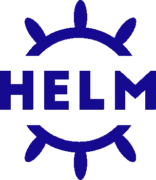
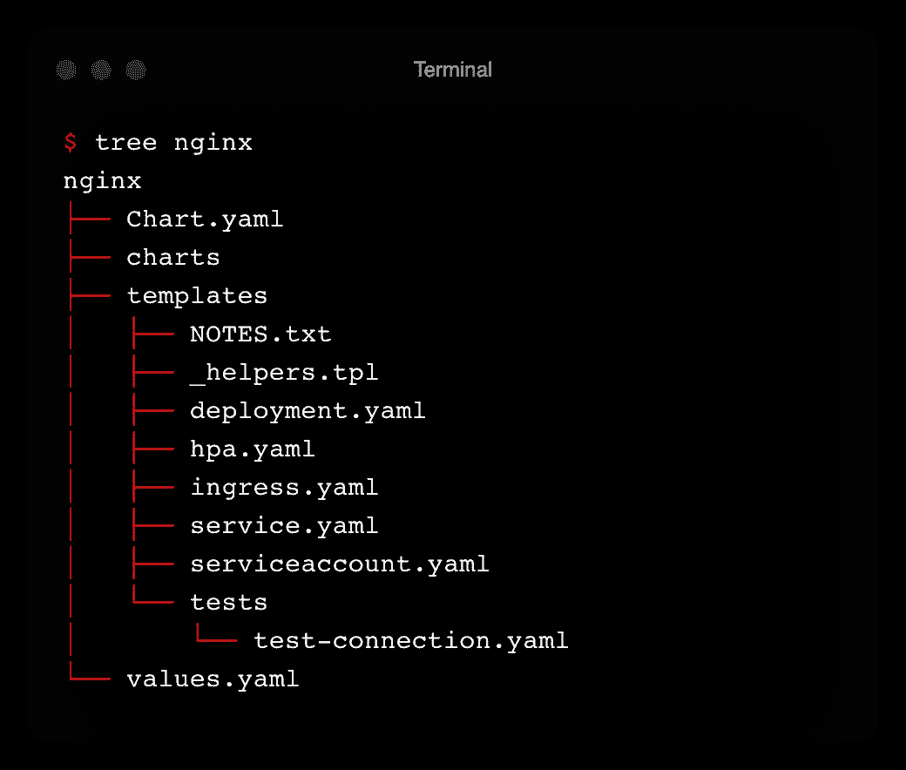

# 什么是头盔？Kubernetes 初学者快速入门教程

> 原文：<https://betterprogramming.pub/what-is-helm-a-quickstart-tutorial-for-kubernetes-beginners-24fecce1b0eb>

## 教你如何处理应用程序包，升级和回滚


凯尔·辛克森在 [Unsplash](https://unsplash.com/?utm_source=unsplash&utm_medium=referral&utm_content=creditCopyText) 上的照片

今天，Kubernetes 成为 DevOps 从业者编排容器的必备工具。一旦有了应用程序的 Docker 映像，就必须编写 YAML 清单来定义 Kubernetes 的工作负载。接下来，用 [kubectl](https://kubernetes.io/docs/reference/kubectl/) 命令部署它们。

这种部署方式适用于只有一个应用程序的情况。当您开始拥有许多应用程序和多个环境时，它会变得不堪重负。通常，90%的情况下，您都会定义相同的 YAML 文件。

在这里，我们将重点讨论如何使用 Helm 智能地管理应用程序。

# 什么是头盔？



来自[https://helm.sh/](https://helm.sh/)的掌舵标志

Helm 是 Kubernetes 的软件包经理。Helm 是一个开源项目，最初由[dei blasts](https://deislabs.io/)创建，并捐赠给[云原生基金会](https://www.cncf.io/) ( *CNCF* )。CNCF 现在维持并完成了该项目。这意味着它是成熟的，而不仅仅是一种时尚。

包管理在软件行业中并不是一个新概念。在 Linux 发行版上，你可以用包管理器来管理软件的安装和卸载，比如 [YUM/RPM](https://www.redhat.com/sysadmin/how-manage-packages) 或者 [APT](https://ubuntu.com/server/docs/package-management) 。在 Windows 上，你可以在 Mac 上使用 [Chocolatey](https://chocolatey.org/) 或 [Homebrew](https://brew.sh/) 。

Helm 允许您在 Kubernetes 中打包和部署完整的应用程序。一个包被称为一个“*图表”* Helm 使用一个基于 [Go 模板](https://pkg.go.dev/html/template)的模板系统从图表中呈现 Kubernetes 清单。图表是分离模板和值的一致结构。

作为一个包，图表还可以管理与其他图表的依赖关系。例如，如果您的应用程序需要一个 MySQL 数据库来工作，您可以将图表作为一个依赖项包含进来。当 Helm 在图表目录的顶层运行时，它会安装整个依赖项。您只需要一个命令就可以将您的应用程序呈现并发布到 Kubernetes。

Helm charts 使用版本来跟踪清单中的变化，因此您可以为特定的基础架构配置安装特定的图表版本。Helm 将所有已部署图表的发布历史记录保存在一个专用的工作区中。如果发生错误，这使得应用程序更新和回滚变得更加容易。

Helm 允许你压缩图表。其结果是一个可与 Docker 图像相媲美的伪像。然后，您可以将它发送到远处的存储库，以便重用和共享。

# 使用 Helm 有什么好处？

*   Helm 为您提供了用一个命令安装应用程序的能力。一个图表可以包含其他图表作为依赖关系。因此，您可以使用 Helm 部署整个堆栈。你可以像使用 [docker-compose](https://docs.docker.com/compose/) 一样使用 Helm，但是对于 Kubernetes。
*   图表包括各种 Kubernetes 资源的模板，以形成一个完整的应用程序。这降低了微服务的复杂性，并简化了它们在 Kubernetes 中的管理。
*   图表可以被压缩并发送到远处的存储库。这为 Kubernetes 创建了一个应用程序构件。您还可以从存储库中获取和部署现有的舵图。这是可重用性和共享性的一个优点。
*   Helm 在 Helm 工作区中维护已部署发布版本的历史记录。当出现问题时，回滚到以前的版本很简单——canary release 通过 Helm 实现了零停机部署。
*   Helm 使得部署高度可配置。在部署期间，可以动态定制应用程序。通过更改参数，您可以将同一个图表用于多个环境，如开发、试运行和生产环境。
*   简化 CI/CD 渠道—推进 GitOps 最佳实践。

# 快速查看 Helm 解决的问题

Kubernetes 的基本做法是手工编写 YAML 清单。我们将创建最少的 YAML 文件来在 Kubernetes 中部署 NGINX。

以下是将创建 pod 的部署:

```
apiVersion: apps/v1
kind: Deployment
metadata:
  name: nginx
spec:
  selector:
    matchLabels:
      app: nginx
  replicas: 1
  template:
    metadata:
      labels:
        app: nginx
    spec:
      containers:
      - name: nginx
        image: nginx:1.21.6
        ports:
        - containerPort: 80
```

该服务向外部公开 NGINX。通过选择器完成与 pod 的链接:

```
apiVersion: v1
kind: Service
metadata:
  name: nginx
spec:
  selector:
    app: nginx
  ports:
    - protocol: TCP
      port: 80
      targetPort: 8080
```

现在我们必须用下面的 kubectl 命令创建前面的资源:

```
$ kubectl create -f deployment.yaml 
$ kubectl create -f service.yaml
```

我们检查所有资源是否启动并运行:

```
$ kubectl get deployment -l app=nginx
NAME    READY   UP-TO-DATE   AVAILABLE   AGE
nginx   1/1     1            1           8m29s
$ kubectl get pods -l app=nginx                                                                                      
NAME                     READY   STATUS    RESTARTS   AGE
nginx-65b89996ff-dcfs9   1/1     Running   0          2m26s
$ kubectl get svc -l app=nginx 
NAME    TYPE        CLUSTER-IP      EXTERNAL-IP   PORT(S)   AGE
nginx   ClusterIP   10.106.79.171   <none>        80/TCP    4m58s
```

*   YAML 清单中的特定值是硬编码的，不可重用。
*   要指定的冗余信息(如标签和选择器)会导致潜在的错误。
*   Kubectl 不处理执行后的潜在错误。您必须一个接一个地部署每个文件。
*   没有变更可追溯性。

# 从头开始创建舵图

Helm 可以在一个命令行中创建图表结构:

```
$ helm create nginx
```

## 理解舵图的结构



舵图的树形结构

*   `Chart.yaml`:包含图表信息的 YAML 文件。
*   `charts`:包含该图表所依赖的任何图表的目录。
*   `templates`:Helm 在这里为您的服务、部署和其他 Kubernetes 对象找到 YAML 定义。您可以为自己添加或替换生成的 YAML 文件。
*   `templates/NOTES.txt`:这是一个模板化的纯文本文件，在图表成功部署后打印出来。这是简要描述使用图表的后续步骤的有用位置。
*   `templates/_helpers.tpl`:该文件是模板片段的默认位置。文件名以下划线开头的文件被认为是*而不是*包含清单。这些文件不会呈现到 Kubernetes 对象定义中，但在其他图表模板中随处可见。
*   `templates/tests`:测试验证您的图表在安装后是否按预期工作
*   `values.yaml`:该图表的默认配置值

## 自定义模板

默认情况下，部署图表时会自动加载`values.yaml`。这里我们将图像标签设置为`1.21.5`:

> 您可以指定一个特定的`values.yaml`文件来为特定于环境的设置定制部署

# 安装舵图

如果你做了更新，在部署舵图之前运行 linter 是一个好建议:

```
$ helm lint nginx
==> Linting nginx
[INFO] Chart.yaml: icon is recommended

1 chart(s) linted, 0 chart(s) failed
```

运行 Helm，在模拟和调试模式下安装图表，以确保一切正常:

```
$ helm install --debug --dry-run nginx nginx
```

> 使用 helm linter 和带调试模式的预演安装将节省您开发过程中的宝贵时间。

要安装图表，请移除`--dry-run`标志:

您可以看到`NOTES.txt`的模板化内容，解释如何连接到应用程序。

现在，您可以在 Helm 工作区中检索版本:

```
$ helm list               
NAME    NAMESPACE       REVISION        UPDATED                                 STATUS          CHART           APP VERSION
nginx   default         1               2022-03-14 12:01:46.926038 +0100 CET    deployed        nginx-0.1.0     1.0.0
```

# 升级舵释放

假设出于测试目的，您想要将容器映像升级到`1.21.6`。

我们将从命令行更改设置，而不是创建一个新的`values.yaml`。

```
$ helm upgrade nginx nginx --set image.tag=1.21.6
Release "nginx" has been upgraded. Happy Helming!
NAME: nginx
LAST DEPLOYED: Mon Mar 14 12:04:40 2022
NAMESPACE: default
STATUS: deployed
REVISION: 2
NOTES:
1\. Get the application URL by running these commands:
  export POD_NAME=$(kubectl get pods --namespace default -l "app.kubernetes.io/name=nginx,app.kubernetes.io/instance=nginx" -o jsonpath="{.items[0].metadata.name}")
  export CONTAINER_PORT=$(kubectl get pod --namespace default $POD_NAME -o jsonpath="{.spec.containers[0].ports[0].containerPort}")
  echo "Visit [http://127.0.0.1:8080](http://127.0.0.1:8080) to use your application"
  kubectl --namespace default port-forward $POD_NAME 8080:$CONTAINER_PORT
```

pod 也使用新的容器图像:

```
$ kubectl get pod -l app.kubernetes.io/name=nginx -o jsonpath='{.items[0].spec.containers[0].image}'
nginx:1.21.6
```

升级在图表历史中可见:

```
$ helm history nginx                                                   
REVISION        UPDATED                         STATUS          CHART           APP VERSION     DESCRIPTION     
1               Mon Mar 14 12:07:33 2022        superseded      nginx-0.1.0     1.0.0           Install complete
2               Mon Mar 14 12:08:25 2022        deployed        nginx-0.1.0     1.0.0           Upgrade complete
```

使用`helm diff`可以检查变化:

```
$ helm diff revision nginx 1 2
default, nginx, Deployment (apps) has changed:
  # Source: nginx/templates/deployment.yaml
  apiVersion: apps/v1
  kind: Deployment
  metadata:
    name: nginx
    labels:
      helm.sh/chart: nginx-0.1.0
      app.kubernetes.io/name: nginx
      app.kubernetes.io/instance: nginx
      app.kubernetes.io/version: "1.0.0"
      app.kubernetes.io/managed-by: Helm
  spec:
    replicas: 1
    selector:
      matchLabels:
        app.kubernetes.io/name: nginx
        app.kubernetes.io/instance: nginx
    template:
      metadata:
        labels:
          app.kubernetes.io/name: nginx
          app.kubernetes.io/instance: nginx
      spec:
        serviceAccountName: nginx
        securityContext:
          {}
        containers:
          - name: nginx
            securityContext:
              {}
-           image: "nginx:1.21.5"
+           image: "nginx:1.21.6"
            imagePullPolicy: IfNotPresent
            ports:
              - name: http
                containerPort: 80
                protocol: TCP
            livenessProbe:
              httpGet:
                path: /
                port: http
            readinessProbe:
              httpGet:
                path: /
                port: http
            resources:
              {}
```

# 回滚舵释放

升级不确定，您想返回。由于 Helm 保留所有更改，回滚非常简单:

```
$ helm rollback nginx 1
Rollback was a success! Happy Helming!
```

pod 现在回到`1.21.5`容器图像:

```
$ kubectl get pod -l app.kubernetes.io/name=nginx -o jsonpath='{.items[0].spec.containers[0].image}'
nginx:1.21.5
```

# 卸载舵图

卸载舵图和安装一样简单:

```
$ helm uninstall nginx
```

# 重用现有的舵图

许多著名的项目提供了舵图，使集成更加用户友好。他们通过存储库提供图表。你只要把它加在你这边:

```
$ helm repo add bitnami [https://charts.bitnami.com/bitnami](https://charts.bitnami.com/bitnami)
```

添加后，更新您的本地缓存以与远程存储库同步信息:

```
$ helm repo update
```

现在可以在 Kubernetes 集群上安装图表了:

```
$ helm install nginx bitnami/nginx
```

图表使用默认值进行部署。您可以启发并指定一个定制`values.yaml`来满足您的需求！

```
$ helm install my-release bitnami/nginx -f values.yaml
```

感谢阅读！🙏我希望这篇文章是有帮助的。想了解更多关于 DevOps 的知识？看看下面更多类似的文章吧！⬇️

[](https://getbetterdevops.io) [## Getbetterdevops

### Getbetterdevops 是一个 devops 博客，帮助学习现代基础设施和云技术，如 Kubernetes…

getbetterdevops.io](https://getbetterdevops.io)