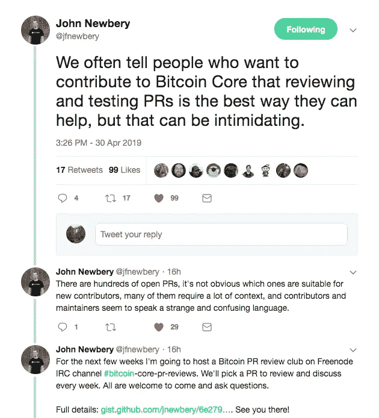

# 约翰·纽伯瑞的比特币核心评论俱乐部是什么？

> 原文：<https://betterprogramming.pub/what-is-john-newberys-review-club-for-bitcoin-core-6870ed0d180>

## 或者如何开始为比特币做贡献

[约翰·纽伯瑞](https://medium.com/u/f172f16c0e36?source=post_page-----6870ed0d180--------------------------------)在推特上宣布成立比特币公关审查俱乐部

上周，比特币核心开发者约翰·纽伯瑞宣布了一项伟大的新计划，以帮助那些希望参与比特币核心开发的人。

来自[约翰的公告](https://gist.github.com/jnewbery/6e2797a6f484de59aefc849a6b184008):

> 审查和测试 PRs 是开始为比特币核心做贡献的最佳方式，但很难知道从哪里开始。有数百个开放的 PRs，许多需要大量的上下文知识，贡献者和审阅者经常使用不熟悉的术语。这个每周一次的 IRC 俱乐部是为那些想帮助审查比特币核心 PRs 但发现这个过程令人生畏的人设立的。欢迎大家发言，鼓励提问！

开始使用加密技术可能会令人生畏，尤其是比特币。比特币已经存在了 10 多年，成千上万的开发者正在积极构建生态系统的不同部分，为协议本身做出贡献可能感觉遥不可及。

约翰在这里告诉你，这不是遥不可及的，他正在努力帮助你参与进来！如果你相信比特币是互联网内外货币的未来，那么它肯定需要你的帮助。

前往 John 的公告栏，了解更多关于您何时可以加入的日程安排详情！