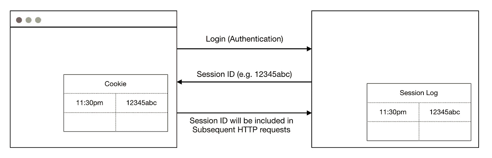
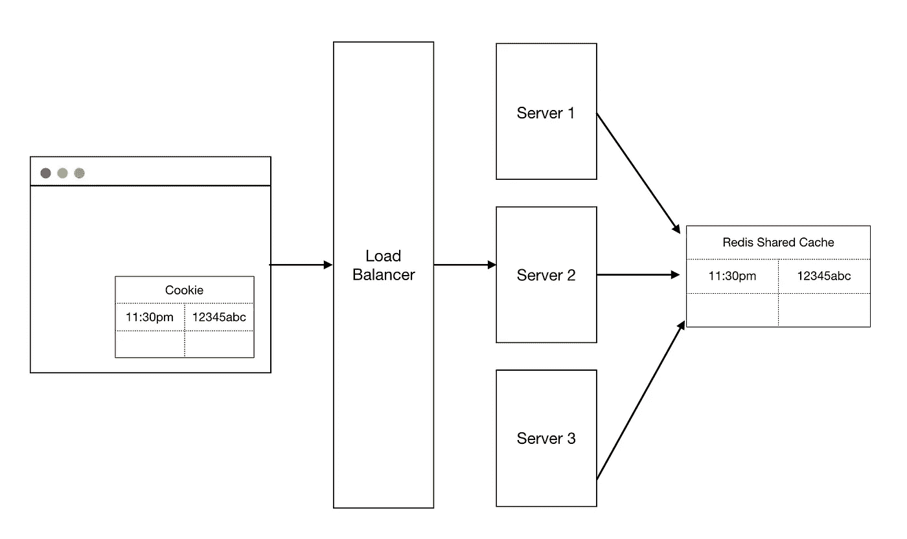

# 什么是 JSON Web 令牌认证？

> 原文：<https://betterprogramming.pub/what-is-json-web-token-authentication-a2962f8c5267>

## 对 JSON Web 令牌(JWT)和会话 id 的高级理解

[孙富](https://unsplash.com/@zisun_word?utm_source=medium&utm_medium=referral)在 [Unsplash](https://unsplash.com?utm_source=medium&utm_medium=referral) 上的照片

最近，我在工作中的代码库中遇到了 JWT 认证的用法。我很想弄清楚 JWT 和标准会话令牌/IDs 之间的机制差异，尤其是因为 JWT 最近越来越受欢迎。

# 为什么我们需要认证？

HTTP 是一种无状态协议，这意味着当前的客户端请求独立于任何以前的请求，服务器不知道任何以前的请求。

例如，如果您只是简单地获取静态数据，比如访问`www.facebook.com`，服务器并不需要知道客户端是谁，因为它们返回的是登录页面，而不是任何形式的敏感信息。另一方面，如果你想更改你在脸书的个人资料，你必须在脸书的服务器将信息返回给你之前证明你拥有这个账户。

简而言之，在服务器允许您访问敏感信息之前，您需要验证自己的身份。为了理解对 JWTs 的需求，让我们后退一步来理解当前仍然广泛使用的会话令牌模型。

# 使用会话令牌进行认证

在会话令牌模型中，用户登录并授权后，服务器会创建一个客户端独有的会话。服务器将会话 ID 返回给客户机，然后客户机将它存储在浏览器的 cookie 中。

在随后的 HTTP 调用中，cookie 将自动包含在 HTTP 请求的头部，服务器将能够知道客户机的身份。尽管 cookie 存储在客户端，但由于验证是在服务器上完成的，因此该模型仍然构成服务器端会话。

使用会话 id 的整体架构

您可能会想——如果 HTTP 协议是无状态的，服务器如何记住客户机的身份？

## 服务器端会话:实际上不是无状态的

从技术上讲，HTTP 无状态协议并不禁止服务器存储信息。大多数 web 应用程序需要存储某种形式状态，以便知道客户端的会话 ID 是否有效。

例如，服务器可能有一个存储会话 ID 的会话日志(可能是一个哈希表或数据库),因此每当以前通过身份验证的客户端发出请求时，服务器只需查找会话 ID 并验证客户端是否通过身份验证。

## 会话令牌的优点

*   会话 id 有过期时间
*   可以撤销会话 id
*   较小的 cookie 大小(本质上是一个加密的会话 ID)

## 会话令牌的缺点

*   可伸缩性是确保跨所有服务器的会话日志的一个挑战

在上图中，我们假设了一个简化的整体架构，其中一个客户端与一个服务器通信。然而，在现实中，我们可能会期望一个类似如下的多石架构:

具有会话 id 的多石架构

在某种程度上，这种多石架构有助于在一定程度上抵消可伸缩性的挑战。确保所有服务器拥有相同会话日志的一种方法是用负载平衡器分发请求，并使用所有服务器共享的 Redis 缓存。虽然这是确保会话日志同步的一个可行的解决方法，但是现在有一个单点故障(Redis 缓存)。

我只讨论了一些我愿意谈论的优点和缺点，但是如果你有兴趣了解更多，你可以阅读这篇讨论[服务器与客户端](http://www.rodsonluo.com/client-session-vs-server-session)会话的文章。

# JSON Web-Token (JWT)认证

在 JWT 模型中，用户登录后，服务器不会返回会话 ID，而是向客户端返回一个签名的令牌。这个已签名的令牌本质上是一个 JSON 对象，包含服务器使用秘密或公钥/私钥签名的认证信息。

在后续的 HTTP 请求中，客户端只需在请求中传递 JWT，每个服务器实例都有能力解密令牌并对用户进行身份验证。

## JWT 的优点

*   消除了存储会话 id 的缓存/数据库需求

## JWT 的缺点

*   无法从服务器撤销令牌，因为它们只能确定令牌是否有效

再说一次，我只是略述了 JWT 的利与弊，但是你可以查看这篇关于 JWT 利与弊的深入文章。

# 最终注释

这篇文章旨在简化我自己对 jwt 的理解，我希望它能帮助你理解一些概念。

如果你想看一些视觉效果，我强烈推荐这个 [YouTube 视频](https://www.youtube.com/watch?v=soGRyl9ztjI)，它帮助我快速掌握了概念。