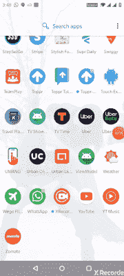
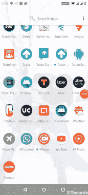

# Android:什么是 LiveEvent LiveData？

> 原文：<https://betterprogramming.pub/what-is-liveevent-livedata-7270a64736b3>

## 如何使用 LiveEvent 解决向单个观察者发射的问题

由[马库斯·斯皮斯克](https://unsplash.com/@markusspiske?utm_source=medium&utm_medium=referral)在 [Unsplash](https://unsplash.com?utm_source=medium&utm_medium=referral) 上拍摄的照片。

LiveData 是一个可观察的数据持有者类。与常规的可观察对象不同，LiveData 具有生命周期意识，这意味着它尊重其他应用程序组件的生命周期，如活动、片段或服务。这种意识确保了 LiveData 只更新处于**活动**生命周期状态的应用组件观察者。

要理解 LiveData，我们首先需要理解观察者模式。它是一种软件设计模式，其中一个对象(称为主体)维护其依赖者(称为观察者)的列表，并自动通知它们任何状态变化，通常通过调用它们的方法之一。

如果您不了解 LiveData 或其工作原理，请在进一步了解之前浏览[这篇文章](https://medium.com/better-programming/everything-to-should-understand-about-livedata-507dd83adea7)。

# 用例

观察 LiveData 的常见用例是显示小吃店或执行一些自定义操作，如显示对话框、导航等。例如，让我们考虑一个简单的应用程序，其中有两个活动，每个活动都有自己的视图模型。观察到动态数据值后，第一个活动导航到第二个活动。但问题是，当用户在第二个活动中按下 back 按钮时，或者当用户从后台状态恢复第一个活动时，动态数据值会被重新提交到第一个活动，第一个活动会再次导航到第二个活动。结果，用户将永远无法回到第一个活动。

这就是问题所在:我们如何创建 LiveData 来发出单个事件并只通知单个观察者，即使有许多观察者订阅它？

# 解决办法

有一个名为`LiveEvent`的包装类可以解决这种情况。它是一个只发送一次更新的 LiveData。它是`MediatorLiveData` 的扩展，在多个观察者同时观察时更新单个观察者很方便。

让我们用一个例子来更好地理解它

# 例子

例如，让我们考虑一个简单的电视节目应用程序，其中有一个包含两个片段的活动。`FragmentShowsList`显示节目列表，点击`FragmentShowsList`中的节目，我们将导航至`FragmentShowDetails`，显示节目详情。但是，如果在两个片段中有一个共同的按钮动作(例如`SUBSCRIBE` ) )会怎么样呢？在点击按钮时，我们点击订阅 API 并使用 LiveData 发布结果。当收到结果时，在两个片段中观察到相同的 LiveData 实例，我们需要在`FragmentShowsList`的情况下显示成功对话框，在`FragmentShowDetails`的情况下显示 toast 消息。

但是当我们观察单个 ViewModel 实例时，问题出现了。如果`FragmentShowsList`在顶部，它接收结果并显示对话框。但是稍后如果我们导航到`FragmentShowDetails`，它将显示 toast 消息，而无需点击按钮，因为它正在观察包含值的 LiveData。

我们的活动将如下所示:

它的 XML 如下所示:

现在让我们创建`fragment_shows_list` 布局文件:

接下来，让我们创建`FragmentShowsList`:

接下来，让我们创建`FragmentShowDetails`:

和`fragment_shows_details`:

现在让我们运行并检查输出:

## 要观察的事物

1.  我点击了`FragmentShowList`上的订阅按钮。在结果中，它显示了预期的成功对话框确认。
2.  当我点击导航按钮时，它导航到了`FragmentShowDetails`，但意外地显示了一条不期望或不需要的 toast 消息。
3.  当我点击`FragmentShowDetails`上的 BackPress 时，它被替换为`FragmentShowList`，但显示了一个不需要的成功对话框或一个重复的例子。

为了在活动内部的两个不同片段之间进行通信，我们通常使用活动的共享视图模型来消除带有接口的样板代码。但是，如果没有正确处理，像上面这样的场景会导致意想不到的行为出现。

现在让我们将`LiveEvent`类添加到我们的代码中，在 ViewModel 中更改两行代码，看看神奇之处:

活动或片段的代码没有任何变化——只是对视图模型中的两行代码进行了简单的修改:

# **了解底层魔法**

上面神奇的原因是`MediatorLiveData` **。** It 可以定义为一个 LiveData 子类，它可以观察其他 LiveData 对象并对来自它们的 OnChanged 事件做出反应。在这个`LiveEvent`类中，我们用一个`ObserverWrapper` 类来包装观察者，在这个类中已经编写了实际的逻辑。有一个布尔值来判断是否至少观察到一次变化。

# 结论

目前就这些。那么，谁在 LiveData 上遇到过类似的问题呢？请评论。我希望你已经找到了一个好的解决方法。

请让我知道你的建议。

感谢阅读。