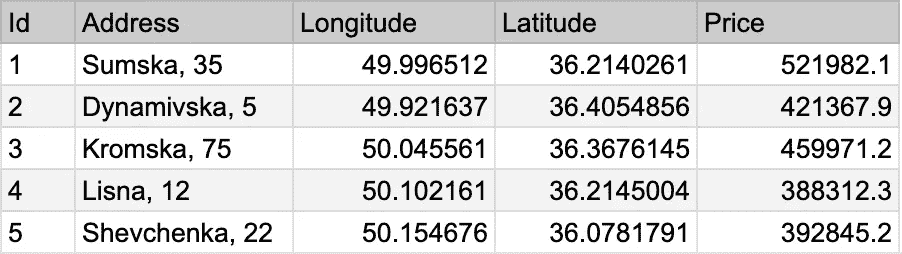

# 到底什么是多列索引？

> 原文：<https://betterprogramming.pub/what-is-multi-column-index-anyway-aeba67b86a02>

## 你不知道的关于数据库索引的一切


照片由 [Unsplash](https://unsplash.com/s/photos/bookmark?utm_source=unsplash&utm_medium=referral&utm_content=creditCopyText) 上的[伊莉莎·卡尔韦·b .](https://unsplash.com/@elisa_cb?utm_source=unsplash&utm_medium=referral&utm_content=creditCopyText)拍摄

数据库索引是一个强大的概念，它通过增加存储空间来提高检索信息的速度。如果某个参数的数据需要频繁访问，那么就应该为该参数添加一个索引。如果你对索引是如何工作的感到好奇，我邀请你看看我的文章，我在那里很好地讨论了这个话题。

[](/how-database-indexing-actually-works-ba6e19e75169) [## 数据库索引的实际工作方式

### 一个强大概念的简要概述

better 编程. pub](/how-database-indexing-actually-works-ba6e19e75169) 

在本文中，我将探索数据库中更高级的索引概念——多列索引。这是什么，什么时候用？

# 这个想法

多列索引的想法很简单。它使用几列的复合键来缓存数据。密钥变成 N 维的。它不一定只包含两列。我们可以根据需要让它变得复杂。

使用多列索引最常见的例子是包含一些位置数据的表。下表显示了待售房屋的地址、坐标和价格。



有房价的桌子

从上面的例子中，如果我们想要查询特定位置半径的条目，我们将需要考虑纬度和经度。查询将如下所示。

```
SELECT * FROM houses WHERE longitude > 49.9 AND longitude < 50.0
                       AND latitude > 36.0 AND latitude < 36.3
```

在很大程度上，这个查询会变慢。为了加速请求，位置坐标必须添加到索引中。但是它们在两个独立的列中。因此，我们必须将纬度和经度一起用作关键字。将多列索引引入该表将显著改善查询。

# 深刻的细节

一般来说，当条件在几个参数的特定范围内时，多列索引对于关系数据库中的查询是理想的。支持该技术的底层数据结构可以保持与简单索引相同(例如 B 树、块范围索引、搜索树)。一些数据库引擎利用一个专用的结构 [R 树](https://en.wikipedia.org/wiki/R-tree)专门用于这个目的。

多列索引还有另一个用例。数据库中表的主要特征是表之间有关系。例如，包含公司部门的表引用包含雇员数据的表。每个部门可以有多名员工。这是一种“一对多”的关系。

```
SELECT * FROM departments WHERE employee_id = 10
```

如果我们运行上面的查询，我们在开发环境中不会遇到任何问题。但是当我们在高负载的生产环境中执行它时，我们将面临性能降级。一个大公司可能有数千个部门和更多的员工，因此数据库中有大量的条目。如何应对这种局限？

解决方案是给源表中的外键添加一个索引。在我们的例子中，我们需要为列`employee_id`添加一个索引，作为外键。这里的索引键是复合的，因为它由`departments.id`和`employee_id`组成。使用这种方法，加载互联数据将会更快。

当存在来自相关表的条件时，对具有关系的表建立多列索引可以提高查询的性能。在级联删除或更新操作的情况下，性能也会提高。这样一个简单的技巧可以极大地改变应用程序的速度。

# 外卖食品

多列索引并不是一项新技术。简单索引已经有一段时间了。然而，它提高了所有现代数据库和应用程序的效率。它作为一个众所周知的电话簿，用名字和姓氏来检索号码。软件工程师能够成功地将这个概念应用到数据存储层。